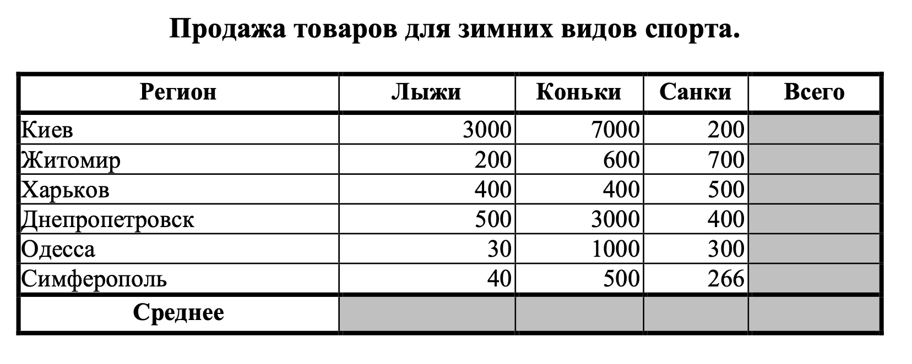
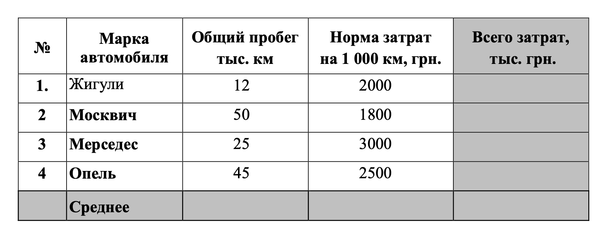
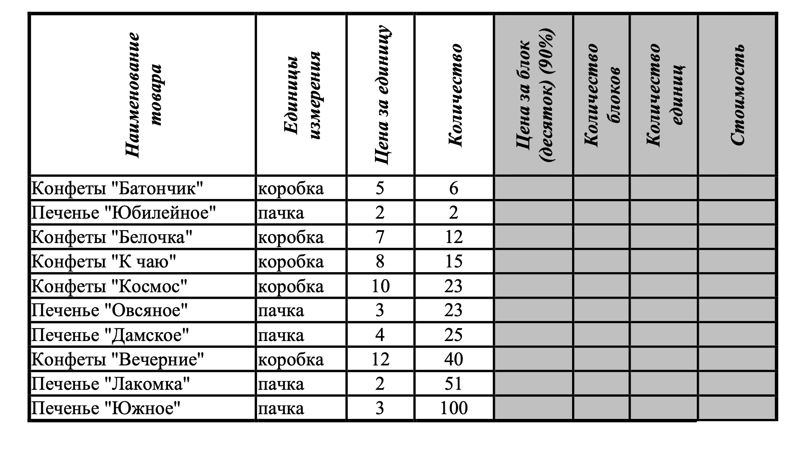

# Контрольная работа (Вариант №1)

## Задание №1

1. Создать таблицу по образцу. Выполнить необходимые вычисления.
2. Отформатировать таблицу.
3. Построить сравнительную диаграмму (гистограмму) по уровням продаж разных товаров в
регионах и круговую диаграмму по среднему количеству товаров.

## Задание №2

1. Создать таблицу по образцу. Выполнить необходимые вычисления.
2. Отформатировать таблицу.
3. Построить круговую диаграмму «Общий пробег автомобилей» с указанием процентных долей каждого и столбиковую диаграмму «Затраты на ремонт автомобилей».
4. С помощью средства `Фильтр` определить марки автомобилей, пробег которых превышает 40000 км и марки автомобилей, у которых затраты на техническое обслуживание превышают среднее.

## Задание №3

1. Создать таблицу и отформатировать ее по образцу.
2. Данные в столбце `Цена` за блок вычисляются как 90% от цены за 10 единиц товара.
3. Данные в столбце `Количество блоков` вычисляются с помощью функции `ЦЕЛОЕ`.
4. Данные в столбце `Количество единиц` вычисляются как разность `Количество - Количество блоков`
5. Стоимость вычисляется: `Цена за блок * Количество блоков + Цена за единицу * Количество единиц`.
6. Отсортировать данные в таблице по стоимости покупки.
7. Построить круговую диаграмму по количеству проданного товара. Подписать доли.
8. С помощью фильтра вывести сведения только о тех товарах, стоимость которых выше средней.

