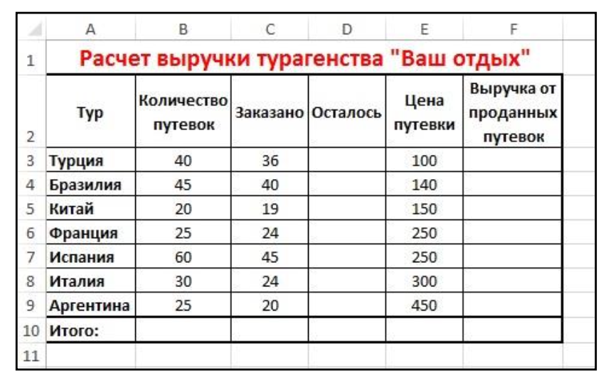
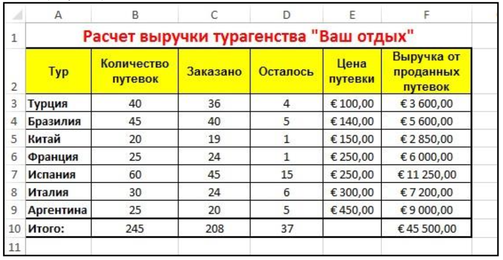
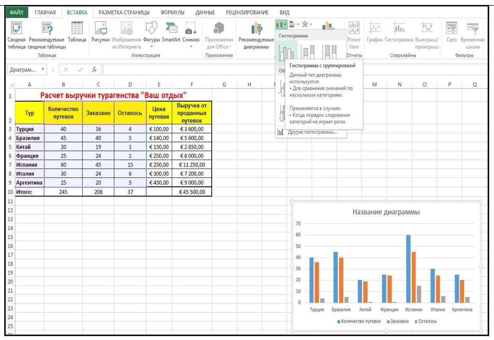
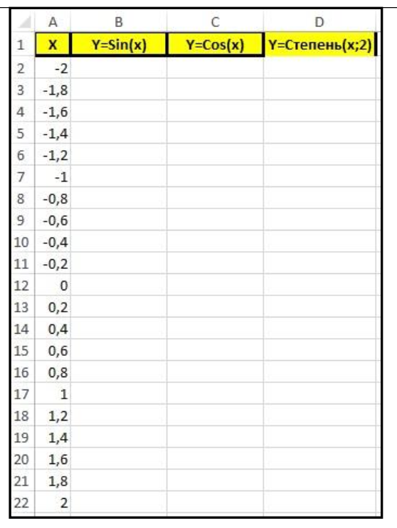
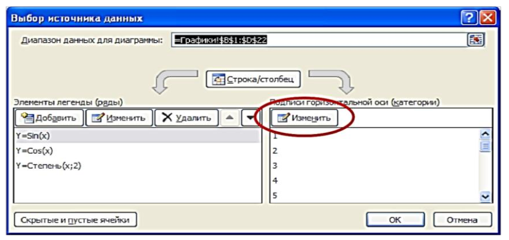
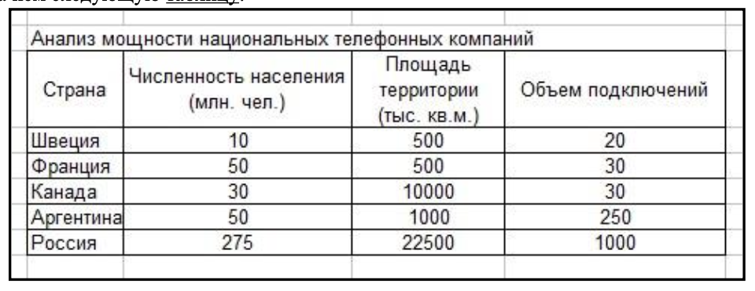

# Лабораторная работа №3

## Задание №1

1. Запустите MS Excel.
2. Переименуйте Лист1 в Турагенство.
3. Создайте таблицу согласно рисунку.

4. Вставьте формулы для расчета в следующие столбцы:

- Осталось = Количество путевок – Заказано
- Выручка от проданных путевок = Заказано * Цена путевки

5. Рассчитайте Итого по всем столбцам, кроме Цена путевки.
6. Задайте заголовкам таблицы следующие параметры шрифта: Arial, 10, полужирный.
7. Задайте столбцам Цена путевки и Выручка от проданных путевок формат: Денежный, Евро, 2 знака
после запятой.

8. Постройте гистограмму, которая будет наглядно отражать продажу путевок в компании. Для этого:

- Выделите диапазон А2:D9
- ВСТАВКА – Диаграммы – Вставить гистограмму

- Измените Название диаграммы на Продажа путевок
- Расположите ее на отдельном листе. Для этого выделите ее, КОНСТРУКТОР – Переместить
диаграмму – На отдельном листе. Лист с диаграммой назовите - Диаграмма продажи путевок

9. Постройте круговую диаграмму, используя данные о полученной выручке (ВСТАКА – Диаграммы –
Объемная круговая).
10. Выделите ее и отформатируйте ее следующим образом:

- КОНСТРУКТОР – Добавить элемент диаграммы – Легенда – Справа
- КОНСТРУКТОР – Добавить элемент диаграммы – Подписи данных – У края, снаружи
- Расположите ее на отдельном листе - Диаграмма выручки

11. Добавьте в книгу еще один лист и назовите его Графики.
12. Создайте на нем таблицу, как показано на рисунке.

13. Рассчитайте все значения для функций sin(x), cos(x), cтепень(x;2).
14. Постройте график функции sin(x). Для этого:

- Выделите столбцы A и B
- Вставка – Рекомендуемые диаграммы – точечная с прямыми отрезками и маркерами

15. Постройте график функции cos(x). Для этого:

- Выделите столбцы A и С (чтобы выделить сразу оба столбца используйте клавишу Ctrl)
- Вставка – Рекомендуемые диаграммы – точечная с прямыми отрезками и маркерами

16. Постройте график функции Степень(x;2). Для этого:

- Выделите столбцы A и D (чтобы выделить сразу оба столбца используйте клавишу Ctrl)
- Вставка – Рекомендуемые диаграммы – Все диаграммы – Точечная

17. Постройте общий график для всех 3-х функций. Для этого:

- Выделите столбцы B, C и D
- Вставка – График – Объемный график

Внимание! Обратите внимание, что ось Х автоматически задалась не от нужного нам диапазона (-2;2). Необходимо исправить это, для этого:

- Щелкнуть на графике правой кнопкой мыши и выберите Выбрать данные
- Появится окно Выбор источника данных. На нем нажмите кнопку Изменить

- Затем выделите диапазон А2:А22, нажмите ОК
- Обратите внимание, что подписи горизонтальных осей изменились. Нажмите ОК

## Задание №2

1. Добавьте еще один лист, назовите его Телефонная компания.
2. Создайте на нем следующую таблицу:
   

3. Выполните обрамление и оформление таблицы по своему вкусу.
4. Используя таблицу, постройте Пузырьковую диаграмму.
5. Выполните произвольное оформление диаграммы.
