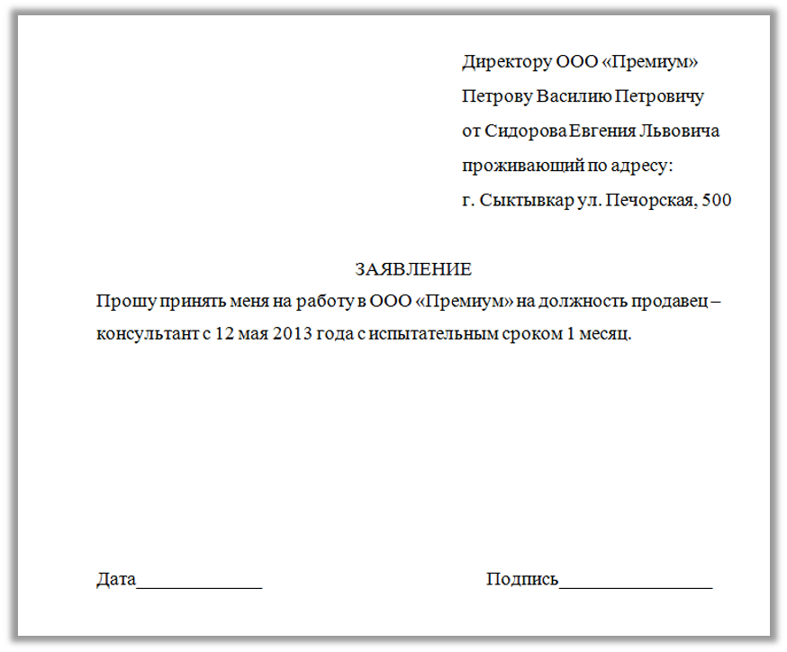

# Экзамен Word

## Задание №1

1. Установить поля документа: верхнее и нижнее **2.5 см**, левое и правое - **2 см**.
2. На всех листах, кроме первого вставить номер страницы внизу, с правого края.
3. Ниже приведен текст, его необходимо переписать и оформить по следующим требованиям:
   1. Заголовок:
      - Выравнивание: по центру
   2. Текст:
      - Шрифт: **Times New Roman**, размер шрифта – **14**
      - Абзац: отступ первой строки - **1.25 см**, межстрочный интервал - **1.5**
      - Выравнивание: **по ширине**

Иван Алексеевич Бунин. В Альпах.

Влажная, теплая, темная ночь поздней осенью. Поздний час. Селенье в Верхних Альпах, мертвое, давно спящее.

Автомобиль набирает скорость с горизонтально устремленными вперед дымчато-белесыми столбами. Освещаемые ими, мелькают вдоль шоссе кучки щебня, металлически-меловая хвоя чахлого ельника, потом какие-то заброшенные каменные хижины, за ними одинокий фонарь на маленькой площади, самоцветные глаза бессонной кошки, соскочившей с дороги, - и черная фигура размашисто шагающего, развевая подол рясы, молодого кюре в больших грубых башмаках...

Шагает, длинный, слегка гнутый, склонив голову, одиноко не спящий во всей этой дикой горной глуши в столь поздний час, обреченный прожить в ней всю свою жизнь, - шагает куда, зачем?

Площадь, фонтан, грустный фонарь, словно единственный во всем мире и неизвестно для чего светящий всю долгую осеннюю ночь. Фасад каменной церковки. Старое обнаженное дерево возле фонтана, ворох опавшей, почерневшей, мокрой листвы под ним... За площадью опять тьма.

Дорога мимо убогого кладбища, кресты которого точно ловят раскинутыми руками бегущие световые полосы автомобиля.

## Задание №2

Составьте многоуровневый нумерованный список новых дисциплин зимней Олимпиады в Сочи на основе текста ниже. **Первый уровень** – название дисциплины, **второй уровень** – пол спортсмена (только для тех дисциплин, где указано).

Новые дисциплины зимней Олимпиады.

Впервые на зимней Олимпиаде 2014 года в Сочи спортсмены соревновались в 8 новых соревнований: прыжки с трамплина (женщины), командные соревнования в фигурном катании, эстафета в санном спорте, хафпайп во фристайле (мужчины, женщины), смешанная эстафета в биатлоне, слоупстайл во фристайле (мужчины, женщины), слоупстайл в сноуборде (мужчины, женщины), командный параллельный слалом в сноуборде (мужчины, женщины).

## Задание №3

Составьте таблицу со следующими названиями столбцов: **№**, **Дата**, **Дисциплина**, **Медаль**. Заполните таблицу, основываясь на фактах из текста ниже. 

Оформление таблицы:
1)	Шрифт: **Times New Roman**, размер шрифта – **12**
2)	Заголовки столбцов: **полужирное начертание**
3)	Выравнивание внутри таблицы: по горизонтали и вертикали – **по центру**

Победа России на Олимпиаде 2014.

Россия получила рекордное количество медалей: 13 золотых, 11 серебряных и 9 бронзовых. Вот как это было.

Первую золотую медаль принесли спортсмены в дисциплине Фигурное катание (командные соревнования) 9 февраля. 

- В новой для России дисциплине Сноуборд (могул, мужчины) серебряная медаль была завоевана 10 февраля. 
- Долгожданная золотая медаль была получена в дисциплине Скелетон (мужчины) 15 февраля. 
- В Биатлоне (эстафета) спортсменки из России завоевали серебро 21 февраля. 
- А в самый последний день Олимпиады, 23 февраля, Россия заняла весь пьедестал в дисциплине Лыжные гонки (мужчины, масс-старт).

## Задание №4

Оформите образец заявления, приведенный ниже на рисунке. Начните задание с новой страницы. Для выравнивания текста не используйте клавиши пробела.

Основные параметры:
1)	Размер шрифта – **14**
2)	Шрифт – **Times New Roman**
3)	Цвет шрифта – **черный**

