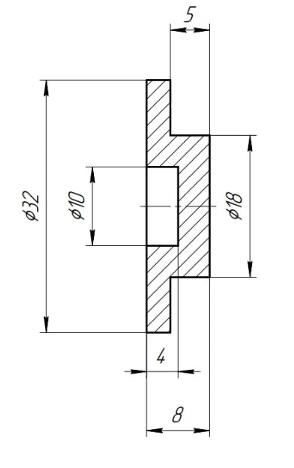
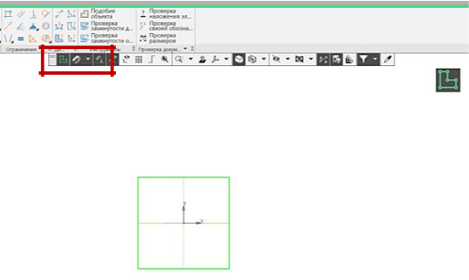
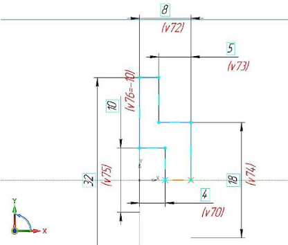
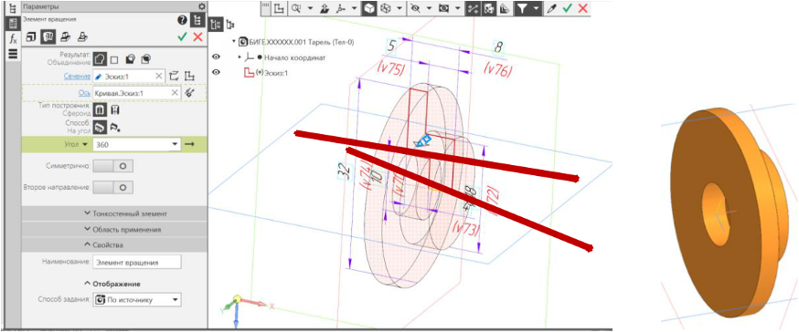
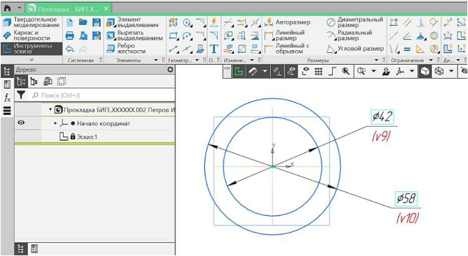
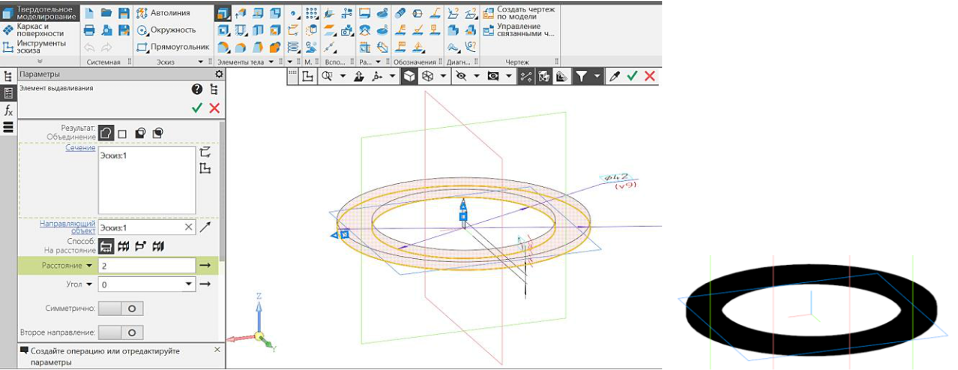

# Задание на создание сборочной единицы №1

## Итоговый результат

## Создание детали "Тарель"

### Чертеж

### Ход работы

#### Файл – Создать – Новый документ – Деталь

#### Плоскость XY - Создать эскиз 

В Панели Быстрого доступа включить Параметрический режим, настройку Привязок, отображение Ограничений, отображение Степеней свободы эскиза.
Параметрическим режимом называется такой режим создания и редактирования геометрических объектов, в котором параметрические связи и ограничения накладываются автоматически. При этом тип накладываемых связей и ограничений определяется в процессе построения благодаря последовательности выполнения команд построения объектов или осуществлению привязки. По умолчанию после вызова команды включается ассоциативность всех объектов, параметризация всех построений и фиксация размеров.

#### Инструменты эскиза – Геометрия – Отрезок

Для определенности эскиза необходимо наложить размерные и геометрические («Объединить точки» – концы всех отрезков и «выравнивание» по горизонтальности и вертикальности соответствущих отрезков контура с началом координат)

#### Твердотельное  моделирование  –  Элементы  тела  –  Элемент вращения

Параметры операции Элемент вращения: результат операции – Объединение; сечение – Эскиз 1; ось – Ось Эскиза 1; угол поворота – 360 градусов.

## Создание детали "Прокладка"

### Ход работы

#### Файл – Создать – Новый документ – Деталь

#### Плоскость XY – Создать эскиз

#### Инструменты эскиза – Геометрия – Окружность

Для определенности эскиза необходимо наложить размерные (диаметры 58 и	42 мм) и геометрические («Объединить точки» – центры окружностей и начало координат (0, 0, 0)) ограничения на окружности.

#### Твердотельное моделирование – Элементы тела – Элемент выдавливания

Параметры выдавливания: результат операции – Объединение; направляющий объект – Эскиз 1; способ – на расстояние 2 мм.

