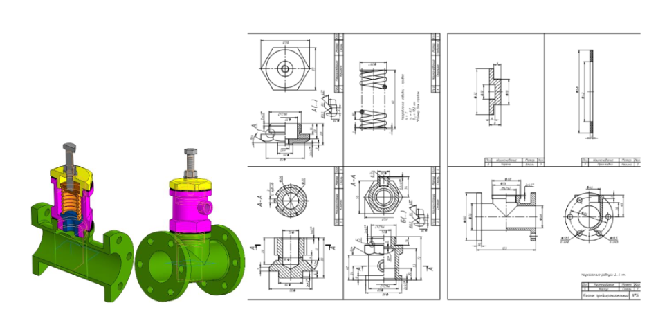

# Задание на создание сборочной единицы №2

## Итоговый результат

## Создание детали "Клапан"

### Чертеж

### Ход работы

#### Файл – Создать – Новый документ – Деталь

#### Плоскость XY - Создать эскиз 

В Панели быстрого доступа включить режим «Ортогональное черчение», позволяющий быстро создавать объекты (в данном случае отрезки), перпендикулярные осям текущей плоскости проекций.

#### Инструменты эскиза – Геометрия – Отрезок

Параметры команды Отрезок: геометрические ограничения – Объединить точки: начало координат (0, 0, 0) и первая точка отрезка, Выравнивание отрезков по горизонтали и вертикали; размерные зависимости. 

Для удобства нанесения размеров диаметров необходимо изменить тип линии для горизонтального отрезка, проходящего через начало координат, со сплошной толстой основной на осевую. Для этого необходимо выделить отрезок и в окне свойства линии выбрать тип линии «Осевая». 

#### Твердотельное  моделирование  –  Элементы  тела  –  Элемент вращения

Параметры команды Элемент вращения: результат – Объединение; сечение – Эскиз 1; ось вращения – Эскиз 1; угол поворота – 360 градусов.  

#### Инструменты эскиза – Геометрия – Проецировать объект – Точка

Параметры команды Точка: начало координат (0; 0). 

#### Твердотельное моделирование – Элементы тела – Отверстие с зенковкой

Параметры команды Отверстие с зенковкой: поверхность – Грань. Элемент выдавливания 1; точка привязки – Эскиз 2; Отверстие –диаметр 12 мм, глубина 20 мм, форма дна – коническая; зенковка – Исполнение – по глубине (1 мм) и углу (90 градусов).  

#### Твердотельное моделирование – Элементы тела – Фаска

Параметры команды Фаска: объекты – Ребро. Элемент вращения 1, Ребро; способ построения – По стороне и углу 1 х 45 градусов. 

#### Твердотельное моделирование – Элементы тела – Элемент выдавливания

Параметры операции Элемент выдавливания: результат операции – Объединение; сечение – Эскиз 3; направляющий объект – Эскиз 3; способ выдавливания – расстояние 13 мм.

#### Твердотельное моделирование – Массив, копирование – Массив по концентрической сетке

Параметры операции: элемент массива – Элемент выдавливания 2 (выступ); Ось массива – ось Х; количество элементов – 12; угол  – 360 градусов.

## Создание детали "Крышка"

### Ход работы

#### Файл – Создать – Новый документ – Деталь

#### Плоскость XY - Создать эскиз

В Панели быстрого доступа можно включить режим «Ортогональное черчение», который позволяет быстро создавать объекты (в данном случае отрезки), перпендикулярные осям текущей плоскости проекций. 

#### Инструменты эскиза – Геометрия – Отрезок

Параметры команды Отрезок: геометрические ограничения – Объединить точки: начало координат (0, 0, 0) и первая точка отрезка, Выравнивание отрезков по горизонтали и вертикали; размерные зависимости. 

Для удобства нанесения размеров диаметров необходимо изменить тип линии для горизонтального отрезка, проходящего через начало координат, со сплошной толстой основной на осевую. Для этого необходимо выделить отрезок и в окне свойства линии выбрать тип линии «Осевая».

#### Твердотельное моделирование – Элементы тела – Элемент вращения

Параметры команды Элемент вращения: результат – Объединение; сечение – Эскиз 1; ось вращения – Эскиз 1; угол поворота – 360 градусов.

#### Плоскость основания цилидра диаметром 42 мм – Создать эскиз

#### Инструменты эскиза – Геометрия – Окружность

Параметры команды окружность: геометрические ограничения – Объединить точки: начало координат (0, 0, 0) и центр окружности; размерные зависимости.

#### Твердотельное моделирование – Элементы тела – Элемент выдавливания

Параметры операции Элемент выдавливания: результат операции – Вычитание; сечение – Эскиз 2; нааправляющий объект – Эскиз 2; способ выдавливания – на расстояние 20 мм.

Для создания проточки для наружной резьбы М42х2 используют Библиотеку стандартных изделий.

#### Приложения – Стандарные изделия - Вставить элемент

#### Вкладка Проточка для наружной метрической резьбы по ГОСТ 10549-80

Указывают местоположение проточки и ограничивающие поверхности 

#### Назначение  параметров проточки

Тип проточки – 1, ширина – нормальная.

#### Твердотельное моделирование – Обозначения – Условное изображение резьбы

Параметры команды Условное изображение резьбы: объект – Элемент вращения 1; начальная граница – Элемент вращения 1; стандарт – Метрическая резьба с мелким шагом ГОСТ24705–2004; диаметр – 42: шаг – 2; конечная граница – Ребро. Проточка наружная М42 х 2; направление – Правая.

#### Твердотельное моделирование – Элементы тела – Фаска

Параметры команды Фаска: объекты – Ребро. Элемент вращения 1, 
Ребро.Способ построения – По стороне и углу 2 х 45 градусов.

#### К торцевой поверхности цилиндра диаметра 20 мм применить режим «Эскиз»

#### Инструменты эскиза – Геометрия – Точка

Параметры команды 
Точка: геометрические ограничения – Объединить точку с началом координат.

#### Твердотельное моделирование – Элементы тела – Отверстие с зенковкой

Параметры команды Отверстие с зенковкой: поверхность – Грань. Элемент выдавливания 1; точка привязки – Начало координат; Отверстие резьбовое – резьба мерическая ГОСТ 24705–2004 М10, правая; длина нарезания резьбы – на всю глубину; зенковка – Исполнение – по глубине (1,6 мм) и углу (90 градусов).  

#### Для построения шестигранника к плоскости основания цилиндра диаметра 60,8 мм применить команду «Создать эскиз»

#### Инструменты эскиза – Геометрия – Многоугольник

Параметры команды Многоугольник: количество вершин – 6, центр многоугольника – Начало координат (0, 0, 0), способ построения – По описанной окружности диаметра 60,8 мм; геометрические ограничения – Выравнивание вершины шестиугольника по вертикали.

Для корректной работы программы КОМПАС, необходимо добавить в данный эскиз элемент – окружность диаметра большего, чем 60,8 мм, например 
66 мм.

#### Твердотельное моделирование – Элементы тела – Элемент выдавливания

Параметры операции Элемент выдавливания: результат операции – Вычитание; сечение – Эскиз 6; направляющий объект – Эскиз 6; способ выдавливания – Через все.

