# Задание на создание сборочной единицы №3

## Итоговый результат

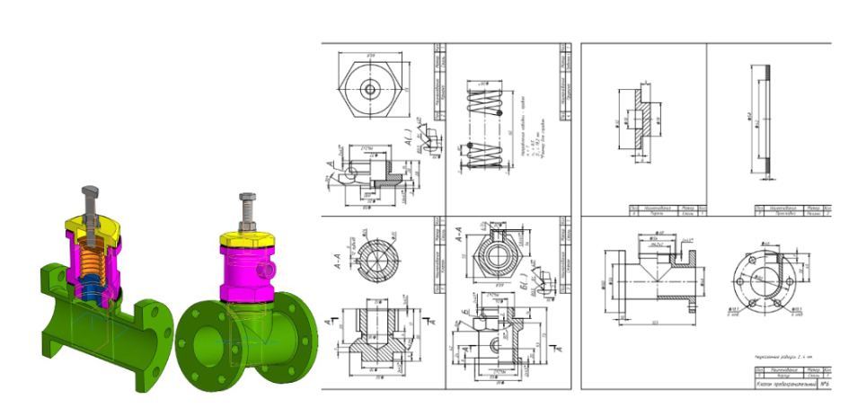

## Создание детали "Пружина"

### Чертеж

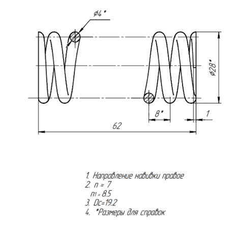

### Ход работы

#### Файл – Создать – Новый документ – Деталь

#### Палитра – Пружины или Главное меню – Приложения – Механика: Пружины

В Инструментальной панели выбрать Пружины – Пружины сжатия.

Для построения модели Пружины выбрать функцию Построение без расчета – Трехмерная модель. Согласно чертежа задают параметры пружины (наружный диаметр – 28 мм, диаметр проволоки – 4 мм, длина пружины в свободном состоянии – 62 мм, число рабочих витков – 7, крайние витки поджаты и зашлифованы на 3⁄4).

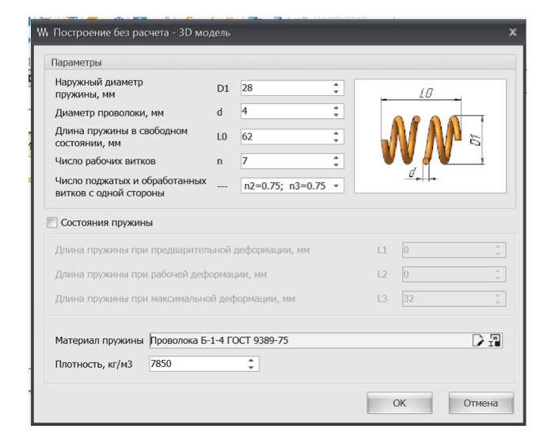

#### Твердотельное моделирование – Диагностика – Расстояние и угол

Необходимо проверить длину пружины в свободном состоянии – 62 мм.

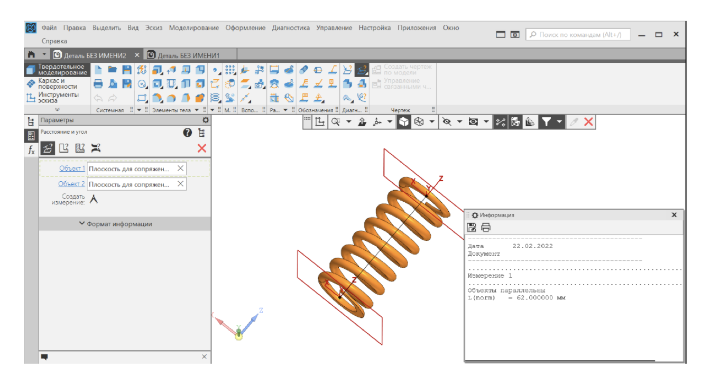

## Создание детали "Стакан"

### Чертеж

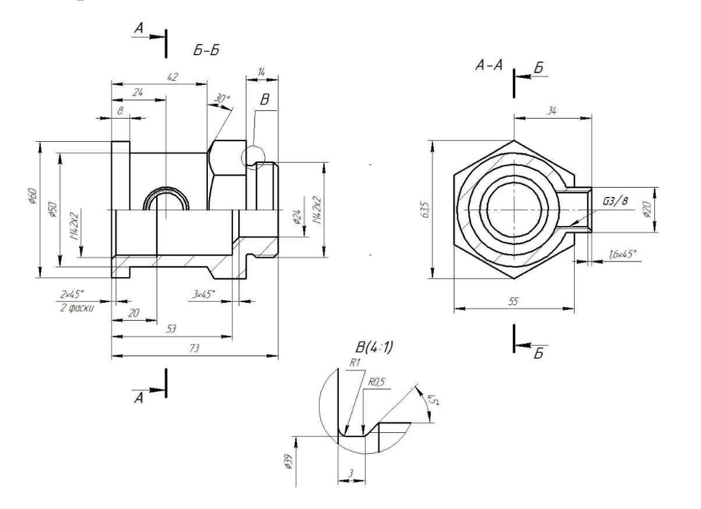

### Ход работы

#### Файл – Создать – Новый документ – Деталь

#### Плоскость XY – Создать эскиз

#### Инструменты эскиза – Геометрия – Отрезок

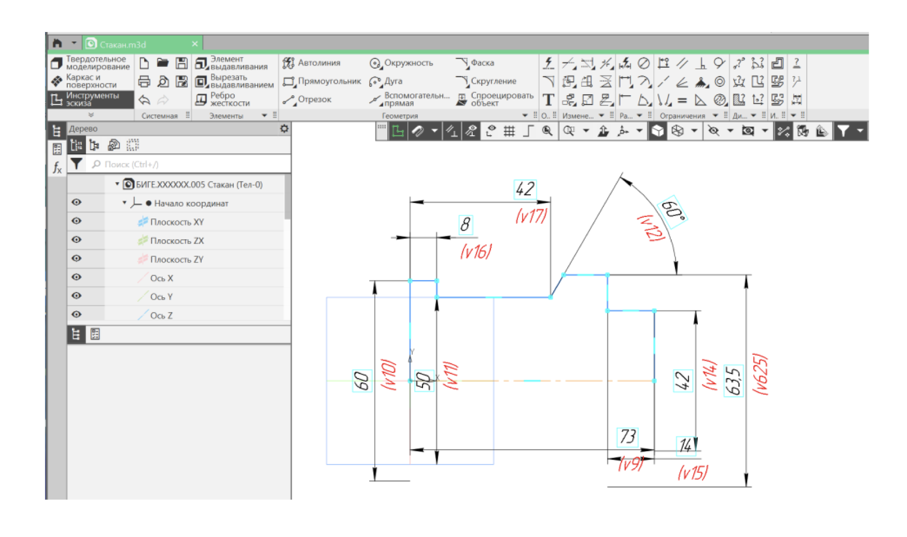

#### Твердотельное моделирование – Элементы тела – Элемент вращения

Параметры команды Элемент вращения: результат – Объединение; сечение – Эскиз 1; ось вращения – Эскиз 1; угол поворота – 360 градусов.

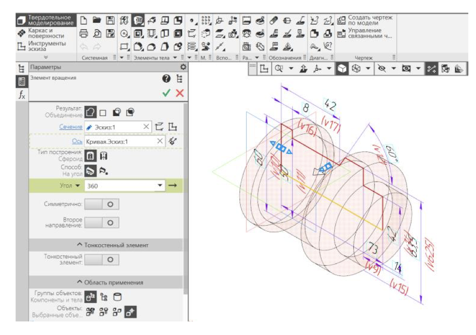

Для построения шестигранника к плоскости основания цилиндра диаметра 63.5 мм применить команду «Создать эскиз».

#### Инструменты эскиза – Геометрия – Прямоугольник – Многоугольник

Параметры команды Многоугольник: количество вершин – 6, центр многоугольника - Начало координат (0, 0, 0), способ построения – По описанной окружности диаметра 63,5 мм; геометрические ограничения – Выравнивание вершины шестиугольника по вертикали. 

Для корректной работы программы Компас, необходимо добавить в данный эскиз элемент – окружность диаметра большего, чем 63.5 мм, например, 70 мм.

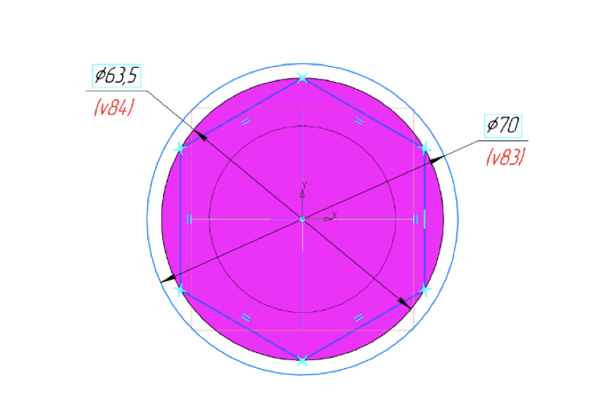

#### Твердотельное моделирование – Элементы тела – Элемент выдавливания

Параметры команды Элемент выдавливания 2: результат – Вычитание, сечение – Эскиз 2, направляющий объект – Эскиз 2, способ выдавливания – До объекта или На расстояние

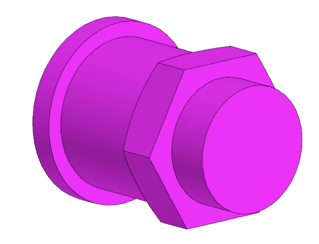

Для построения наружного цилиндра, ось которого перпендикулярна
плоскости XY, необходимо использовать операцию «Смещенная плоскость».

#### Твердотельное моделирование – Вспомогательные элементы – Смещенная плоскость

Параметры операции Смещенная плоскость 1: базовая плоскость – плоскость проекций XY, расстояние – новая плоскость параллельна плоскости XY и отстоит от нее на 34 мм.

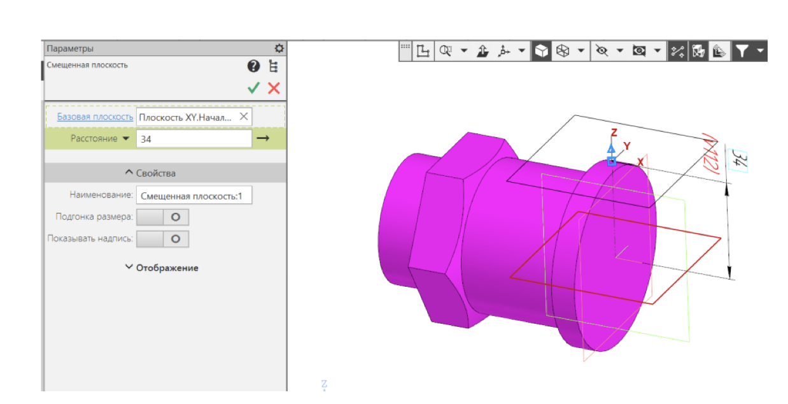

#### Смещенная плоскость 1 – Создать эскиз

#### Инструменты эскиза – Геометрия – Окружность

Параметры команды Окружность: геометрические ограничения – Выравнивание по горизонтали центра окружности и начала координат; размерные зависимости – расстояние от торца Корпуса до центра окружности по координате X – 24 мм; диаметр окружности – 20 мм

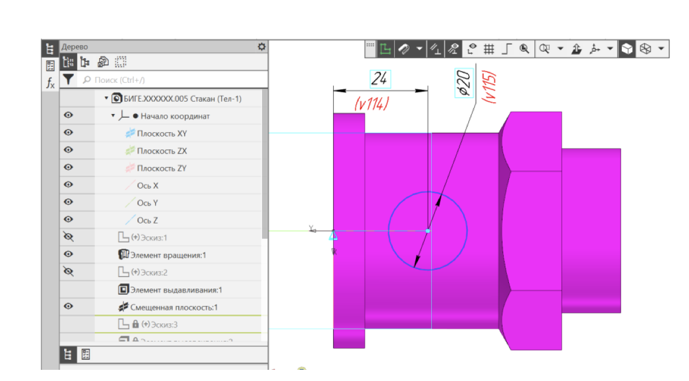

#### Твердотельное моделирование – Элементы тела – Элемент выдавливания

Параметры операции Элемент выдавливания: результат операции – Объединение; сечение – Эскиз 3; нааправляющий объект – Эскиз 3; способ выдавливания – до объекта (Элемент вращения 2)

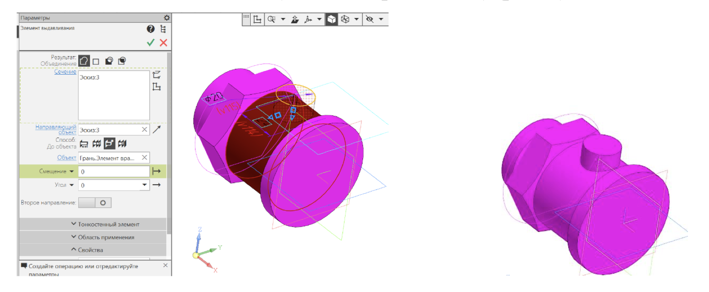

#### Плоскость XZ – Создать эскиз

#### Инструменты эскиза – Геометрия – Отрезок

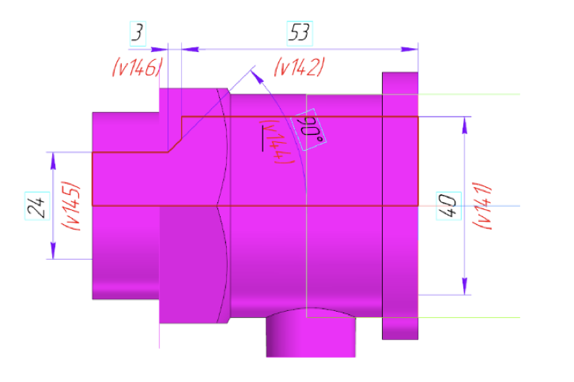

#### Твердотельное моделирование – Элементы тела – Элемент вращение

Параметры команды Элемент вращения 3: результат операции – Вычитание; сечение – Эскиз 4; ось вращения – Эскиз 4; угол поворота – 360 градусов. 

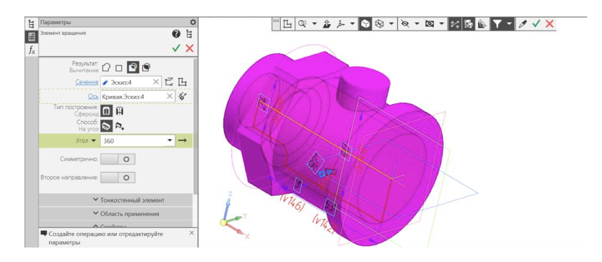

#### Приложения – Стандарные изделия - Вставить элемент или Палитра – Стандартные изделия – Вставить элемент

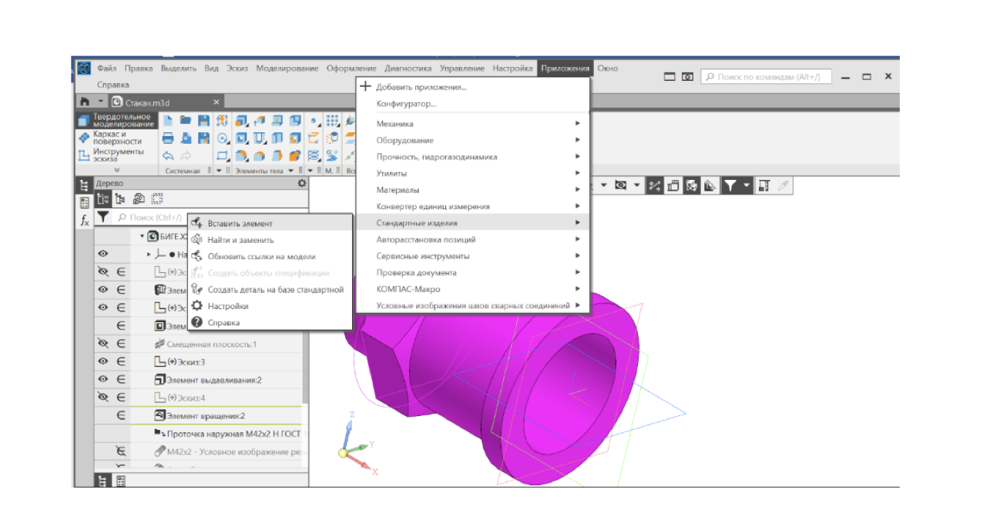

Для создания проточки для наружной резьбы М42х2 используют Библиотеку стандартных изделий.

#### Приложения – Стандарные изделия - Вставить элемент – Конструктивные элементы – Проточки для выхода резьбы

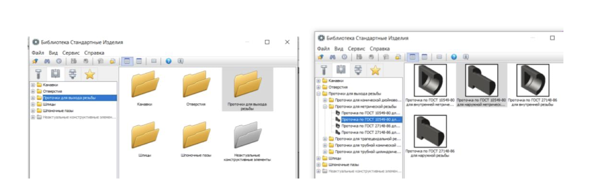

#### Выбирают вкладку Проточка для наружной метрической резьбы по ГОСТ 10549–80. Указывают местоположение проточки и ограничивающие поверхности

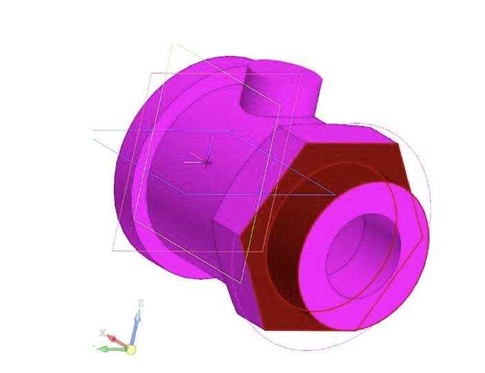

#### Определяют Параметры проточки. Тип проточки – 1, ширина – узкая

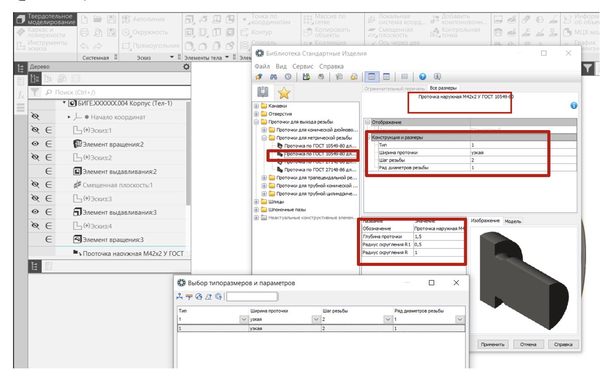

#### Твердотельное моделирование – Обозначения – Условное изображение резьбы

Параметры команды Условное изображение резьбы: объект – Элемент вращения 2; начальная граница – Элемент вращения 2; стандарт – Метрическая резьба с мелким шагом ГОСТ24705-2004; диаметр – 42: шаг – 2; конечная граница – Ребро. Проточка наружная М42 х 2; направление – Правая

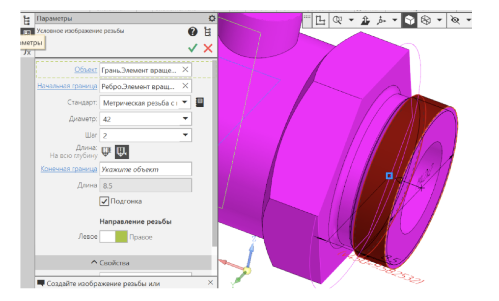

#### Твердотельное моделирование – Обозначения – Условное изображение резьбы

Параметры операции Условное изображение резьбы: объект – Элемент вращения 3; начальная граница – Элемент вращения 3; стандарт – Метрическая резьба с мелким шагом ГОСТ24705–2004; диаметр – 42; шаг – 2; длина – На заданную глубину 20 мм; направление – Правая

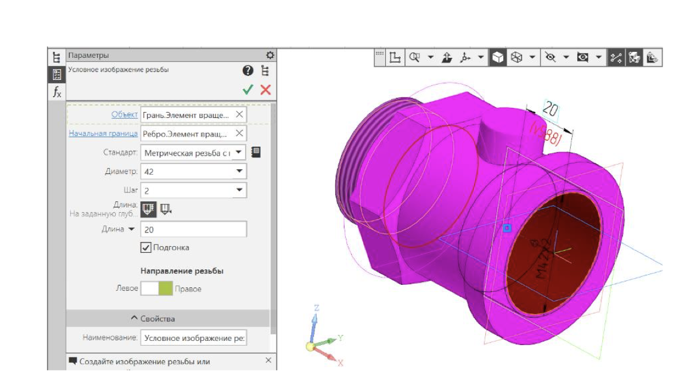

#### Твердотельное моделирование – Элементы тела – Фаска

Параметры команды Фаска: объекты – Ребро. Элемент вращения 2, Ребро. Элемент вращения 3; способ построения – По стороне и углу 2 х 45 градусов.

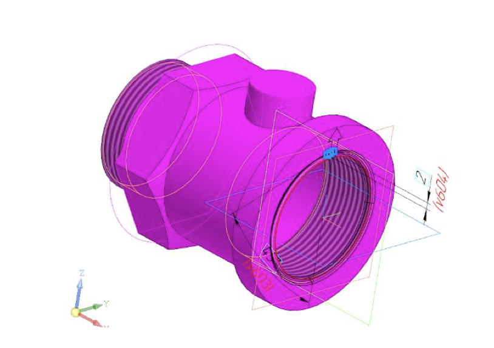

#### К верхнему основанию цилиндра диаметра 20 мм применить режим «Эскиз»

#### Инструменты эскиза – Геометрия – Точка

Параметры команды Точка: геометрические ограничения – Объединить точку с началом координат

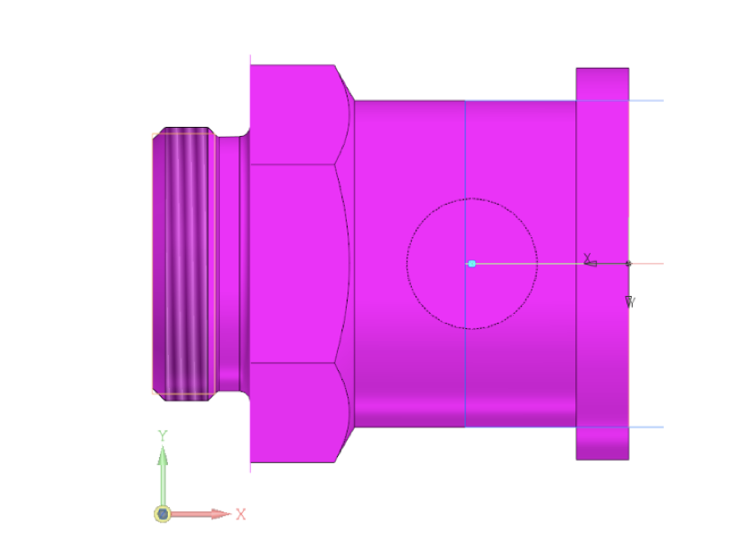

#### Твердотельное моделирование – Элементы тела – Отверстие с зенковкой

Параметры команды Отверстие с зенковкой: поверхность – Грань. Элемент выдавливания 3; точка привязки – Эскиз 13; Отверстие резьбовое – резьба трубная цилиндрическая ГОСТ 6357–81 G3/8, правая; длина нарезания резьбы – на всю глубину; глубина отверстия – до объекта (Грань. Элемент вращения 3); зенковка – Исполнение – по глубине (1,6 мм) и углу (90 градусов) 

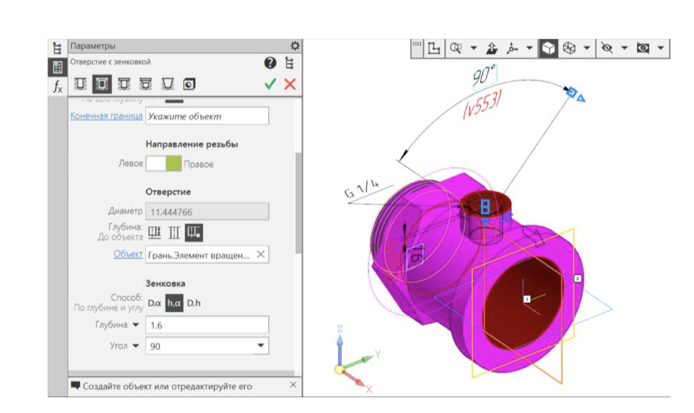
