# Задание на создание сборочной единицы №4

## Итоговый результат

## Создание детали "Корпус"

### Чертеж

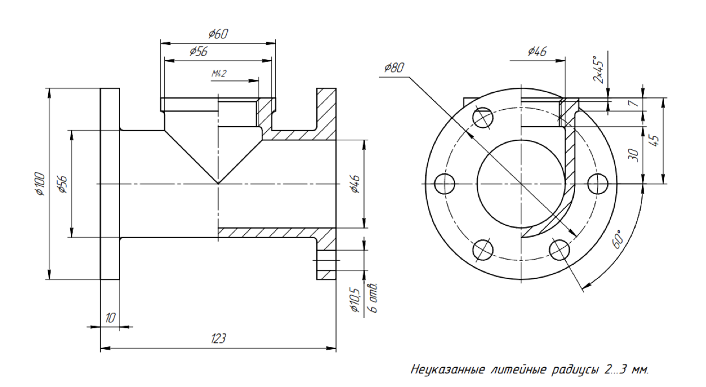

### Ход работы

#### Файл – Создать – Новый документ – Деталь

#### Плоскость XY – Создать эскиз

#### Инструменты эскиза – Геометрия – Отрезок

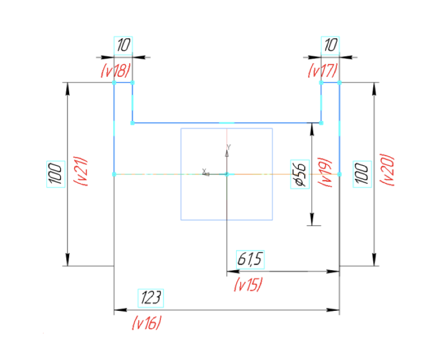

#### Твердотельное моделирование – Элементы тела – Элемент вращения

Параметры команды Элемент вращения: результат – Объединение; сечение – Эскиз 1; ось вращения – Эскиз 1; угол поворота – 360 градусов.

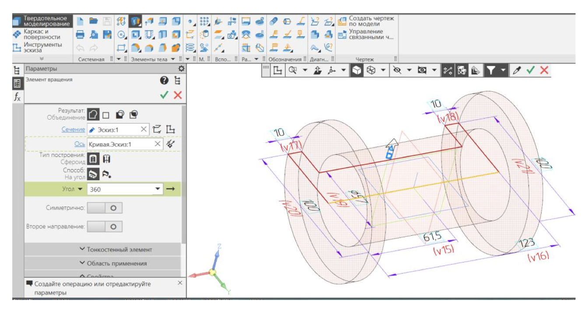

#### Плоскость XY – Создать эскиз

#### Инструменты эскиза – Геометрия – Отрезок

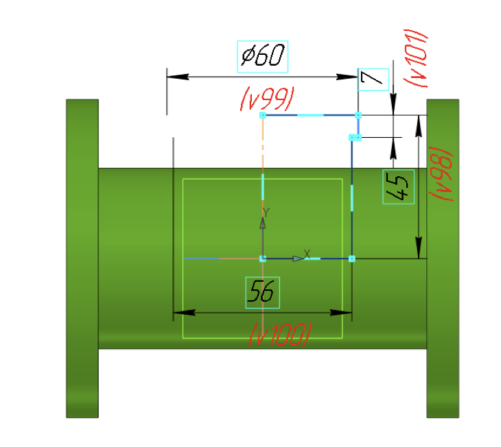

#### Твердотельное моделирование – Элементы тела – Элемент вращения

Параметры команды Элемент вращения: результат – Объединение; сечение – Эскиз 2; ось вращения – Эскиз 2; угол поворота – 360 градусов.

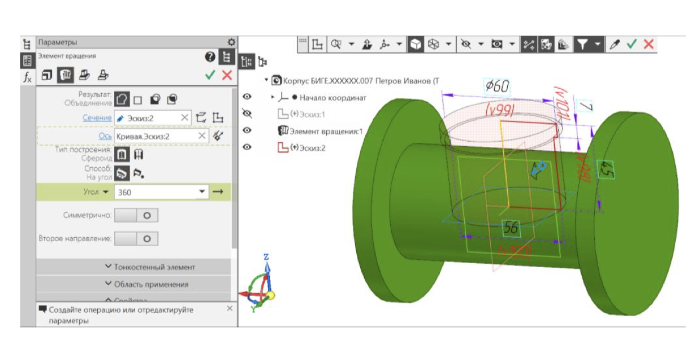

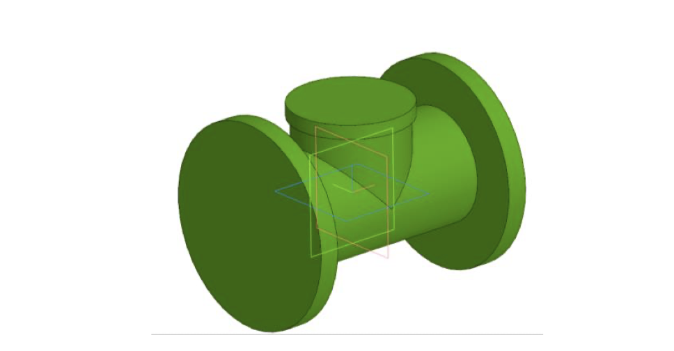

#### Плоскость YZ – Создать эскиз

#### Инструменты эскиза – Геометрия – Окружность

Параметры команды Окружность: геометрические ограничения – Объединить центр окружности с началом координат; размерные зависимости – диаметр 46 мм.

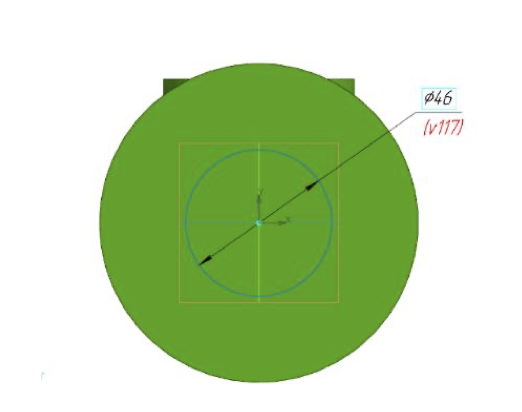

#### Твердотельное моделирование – Элементы тела – Вырезать выдавливанием

Параметры выдавливания: результат операции – вычитание; направляющий объект – Эскиз 3 (окружность); способ – через все.

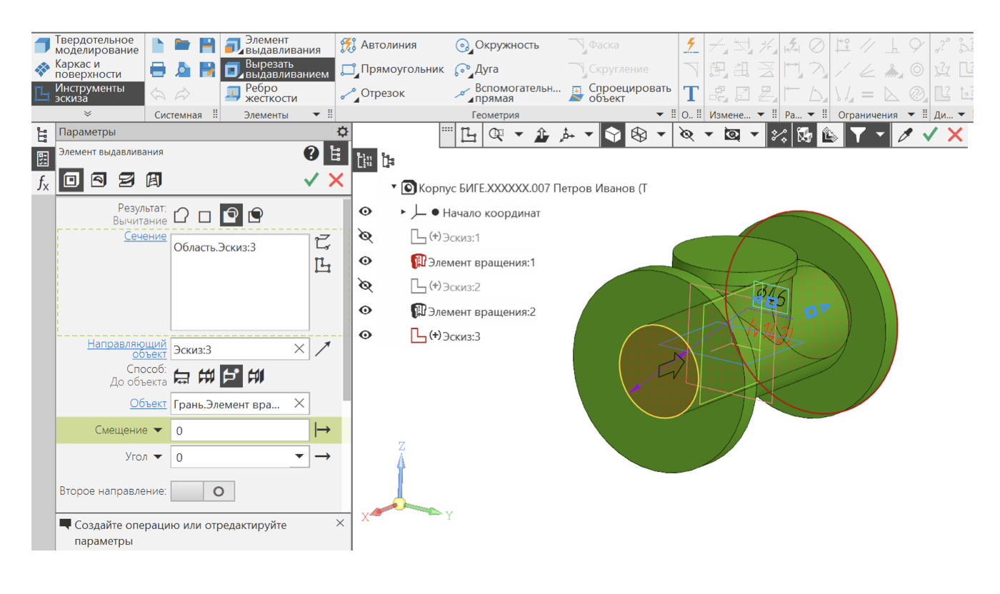

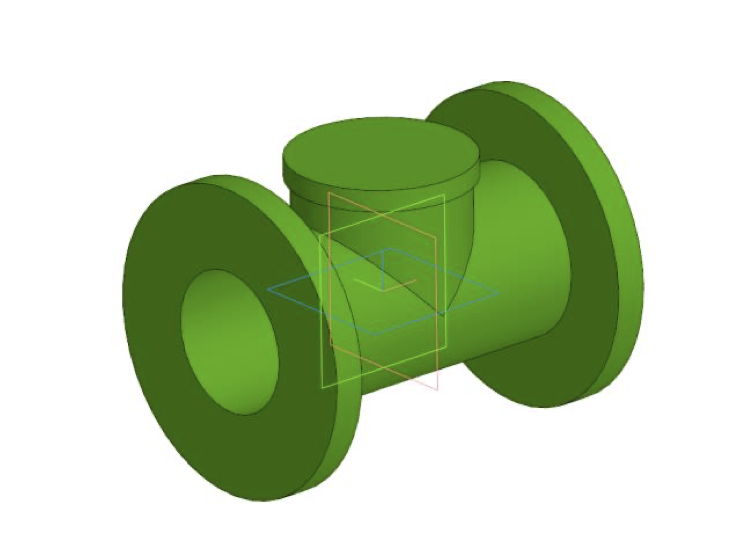

#### Плоскость XY – Создать эскиз

#### Инструменты эскиза – Геометрия – Окружность

Параметры команды Окружность: геометрические ограничения – объединить центр окружности с началоом координат; размерные зависимости – диаметр 46 мм

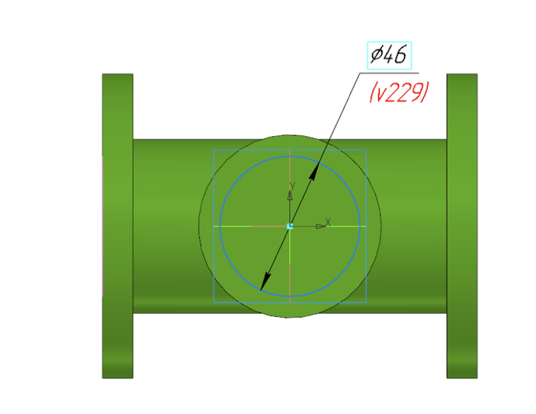

#### Твердотельное моделирование – Элементы тела – Вырезать выдавливанием

Параметры Выдавливания: результат операции – Вычитание; направляющий объект – Эскиз 4 (окружность); способ – расстояние 38 мм

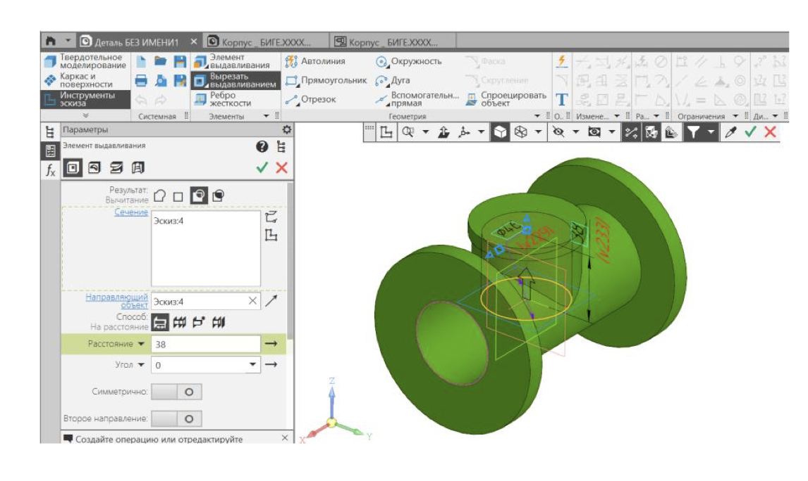

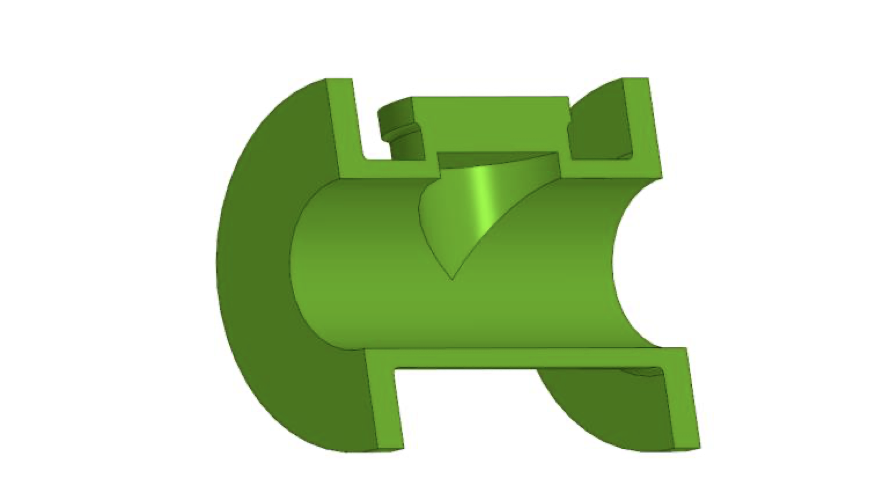

#### К верхнему фланцу крпуса диаметра 60 мм применить режим «Эскиз»

#### Твердотельное моделирование – Элементы тела – Отверстие с зенковкой

Параметры команды Отверстие с зенковкой: поверхность – Грань. Элемент вращениия 2; точка привязки – начало координат; Отверстие резьбовое – резьба Метрическая, диаметр 42, шаг 2 мм, ГОСТ 24705-2004 правая; длина нарезания резьбы – на всю глубину; глубина отверстия – до объекта (Грань. Элемент ввыдавлиивания 4); зенковка – Исполнение – по глубине (2 мм) и углу (90 градусов).

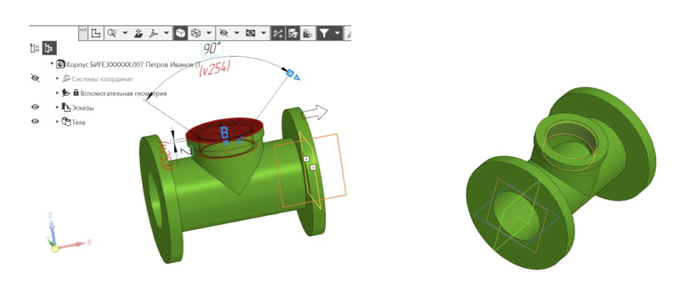

#### Создать эскиз на боковой поверхности фланца

#### Инструменты эскиза – Геометрия – Окружность

Эскиз – окружность диаметра 10,5 мм, центр которой расположен на расстоянии 40 мм от начала координат на одной горизонтальной лиинии с началом координат.

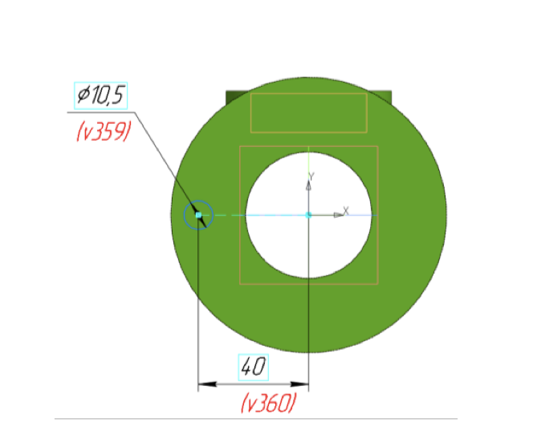

#### Твердотельное моделирование – Элементы тела – Вырезать выдавливанием

Параметры выдавливания: результат операции – Вычитание; направляющий объект – Эскиз 6 (окружность); способ – До объекта (Грань элемента вращения 1).

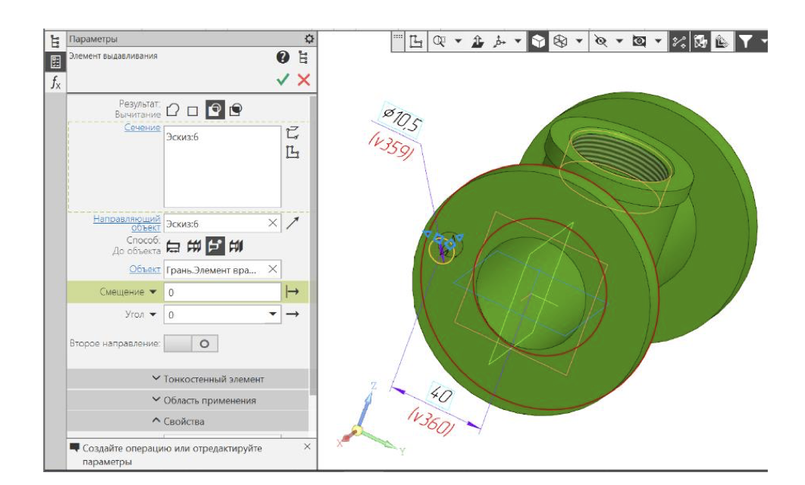

#### Твердотельное моделирование – Массив, копирование – Массив по концентрической сетке

Параметры операции: элемент массива – Элемент выдавливания 5 (отверстие); Ось массива – ось Х; количество элементов – 6; угол – 360 градусов.

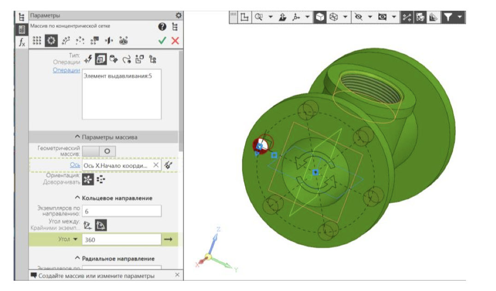

#### Твердотельное моделирование – Массив, копирование – Зеркальный массив

Параметры операции Зеркальный массив 1: тип отображаемого объекта – массив по концентрической сетке 1; Плоскость симметрии – ZY

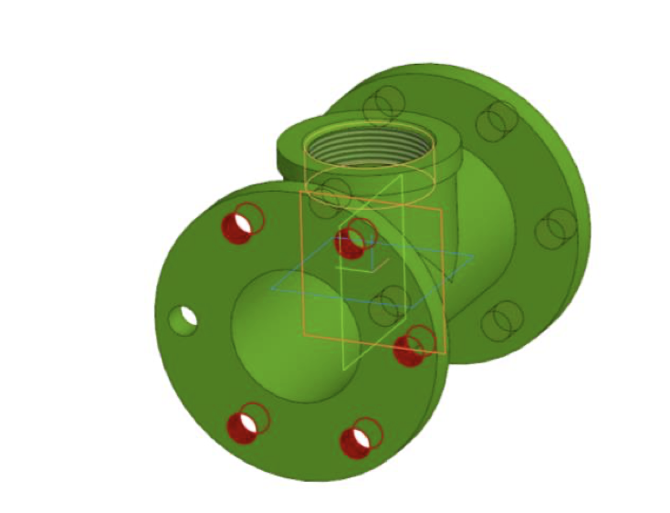

#### Твердотельное моделирование – Элементы тела – Скругление

Параметры операции Скругление: объекты – 2 ребра Элемента вращения 1 и 1 ребро элента вращения 2; способ скругления – дугой окружности; радиус скругления – 3 мм

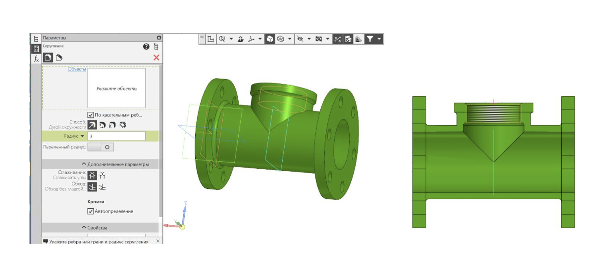
