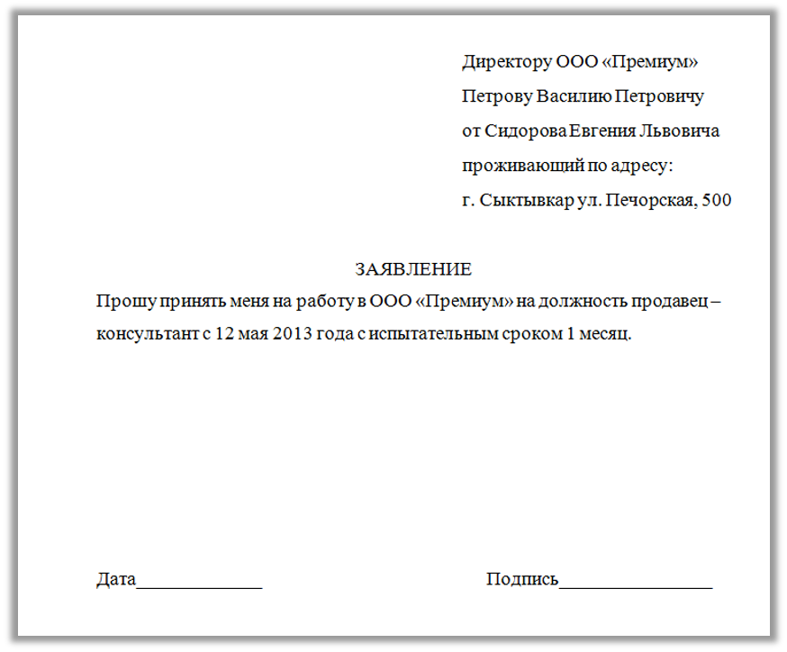

# Экзамен Word

## Задание №1

1. Установить поля документа: верхнее и нижнее **2.5 см**, левое и правое - **2 см**.
2. На всех листах, кроме первого вставить номер страницы внизу, с правого края.
3. Ниже приведен текст, его необходимо переписать и оформить по следующим требованиям:
   1. Заголовок:
      - Выравнивание: по центру
   2. Текст:
      - Шрифт: **Times New Roman**, размер шрифта – **14**
      - Абзац: отступ первой строки - **1.25 см**, межстрочный интервал - **1.5**
      - Выравнивание: **по ширине**

Сергей Петрович Лебедев. В Карпатах.

Сырая, тихая, неподвижная ночь в конце октября. Поздно. Маленькая деревушка на склоне Карпат, притихшая, давно погружённая в сон.

Машина медленно ползёт по извилистой дороге, выхватывая из темноты жёлтыми лучами фар мокрые камни, обломки старого забора, редкие кусты, облепленные последними листьями. Вдоль обочины мелькают покосившиеся сараи, обветшалые деревянные лавки, затем – тусклый свет над крыльцом почты, жёлтые глаза насторожённой собаки, скрывшейся в переулке, – и тёмная фигура идущего, в распахнутом плаще, старого пастора с тростью в руке…

Идёт, высокий, сутулый, опустив голову, единственный бодрствующий в этой глухой горной деревне в столь поздний час, приговорённый прожить здесь все свои дни, – идёт куда, зачем?

Площадь, колодец, печальный фонарь, словно единственный на свете, бессмысленно освещающий мокрые плиты всю долгую осеннюю ночь. Фасад крошечной часовни. Древний голый вяз рядом с колодцем, груда опавших, почерневших, влажных листьев у его корней… За площадью снова тьма.

Дорога мимо заброшенного кладбища, где кресты, будто раскинув руки, ловят на себя скользящие лучи фар.

## Задание №2

Составьте многоуровневый нумерованный список новых дисциплин зимней Олимпиады в Сочи на основе текста ниже. **Первый уровень** – название дисциплины, **второй уровень** – пол спортсмена (только для тех дисциплин, где указано).

Новые дисциплины зимней Олимпиады.

Впервые на зимней Олимпиаде 2014 года в Сочи спортсмены соревновались в 8 новых соревнований: прыжки с трамплина (женщины), командные соревнования в фигурном катании, эстафета в санном спорте, хафпайп во фристайле (мужчины, женщины), смешанная эстафета в биатлоне, слоупстайл во фристайле (мужчины, женщины), слоупстайл в сноуборде (мужчины, женщины), командный параллельный слалом в сноуборде (мужчины, женщины).

## Задание №3

Составьте таблицу со следующими названиями столбцов: **№**, **Дата**, **Дисциплина**, **Медаль**. Заполните таблицу, основываясь на фактах из текста ниже. 

Оформление таблицы:
1)	Шрифт: **Times New Roman**, размер шрифта – **12**
2)	Заголовки столбцов: **полужирное начертание**
3)	Выравнивание внутри таблицы: по горизонтали и вертикали – **по центру**

Победа России на Олимпиаде 2014.

Россия получила рекордное количество медалей: 13 золотых, 11 серебряных и 9 бронзовых. Вот как это было.

Первую золотую медаль принесли спортсмены в дисциплине Фигурное катание (командные соревнования) 9 февраля. 

- В новой для России дисциплине Сноуборд (могул, мужчины) серебряная медаль была завоевана 10 февраля. 
- Долгожданная золотая медаль была получена в дисциплине Скелетон (мужчины) 15 февраля. 
- В Биатлоне (эстафета) спортсменки из России завоевали серебро 21 февраля. 
- А в самый последний день Олимпиады, 23 февраля, Россия заняла весь пьедестал в дисциплине Лыжные гонки (мужчины, масс-старт).

## Задание №4

Оформите образец заявления, приведенный ниже на рисунке. Начните задание с новой страницы. Для выравнивания текста не используйте клавиши пробела.

Основные параметры:
1)	Размер шрифта – **14**
2)	Шрифт – **Times New Roman**
3)	Цвет шрифта – **черный**

