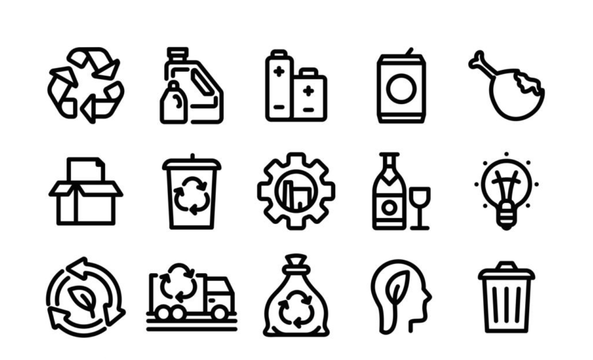
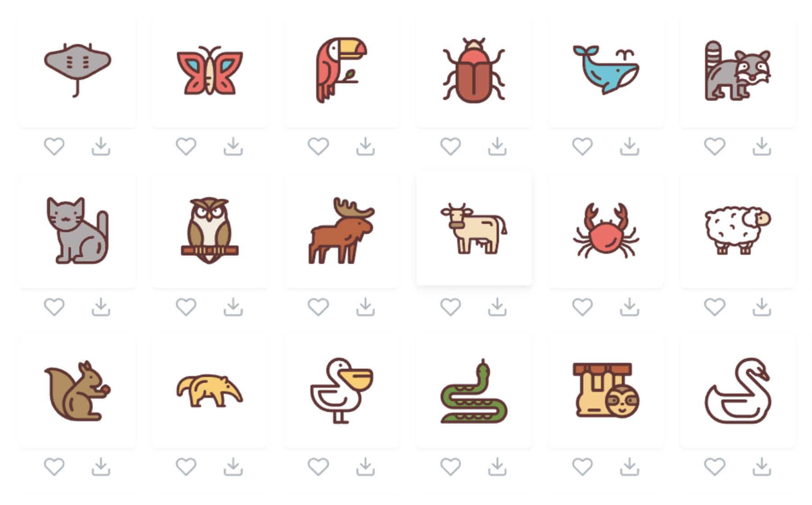
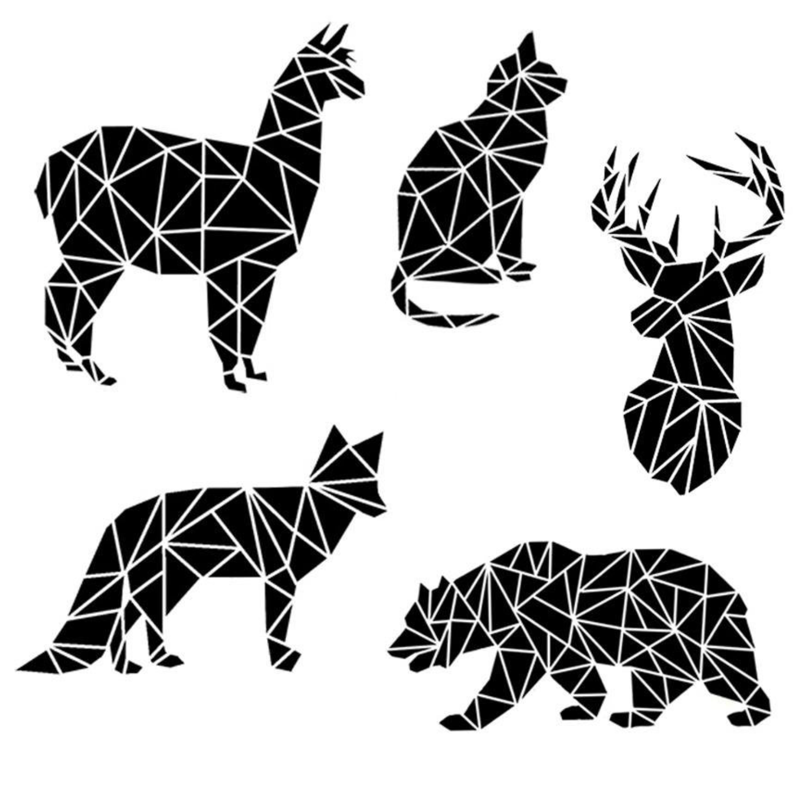

# Лабораторная работа №4

Все работы выполняются в Adobe Illustrator (Ai).

##  Задание №1

Выбрать одно изображение и перерисовать его в Ai.

##  Задание №2

Выбрать одно изображение и перерисовать его в Ai, сохранив исходные цвета (можно использовать похожие оттенки).

##  Задание №3

Выбрать одно изображение трафарета и перерисовать его в Ai.

