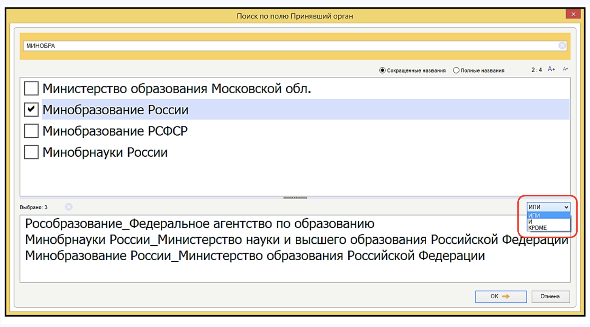
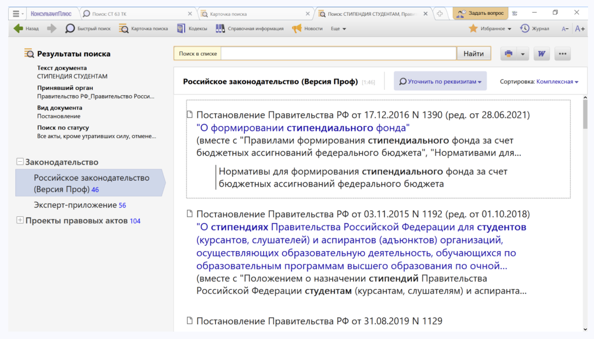
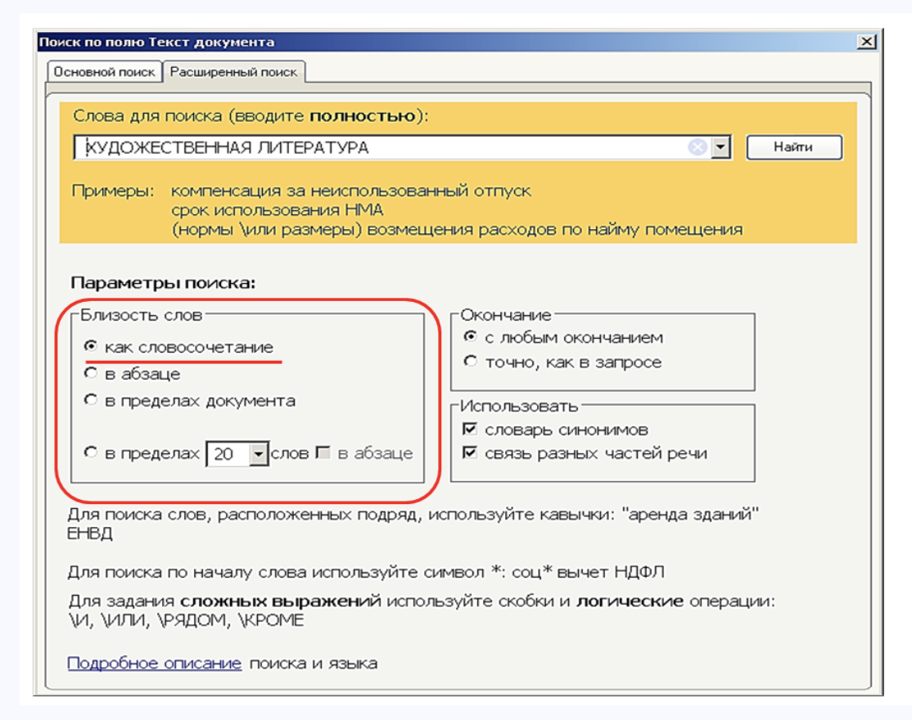

# Практическая работа с КонсультантПлюс №3

## Примеры работы с системой

### Пример поиска конкретного документа

Найдем документ с разъяснением по вопросу получения образовательного кредита с государственной поддержкой. При этом мы точно не знаем, кем принят этот документ: то ли Минобразованием РФ, то ли Рособразованием, то ли Минобрнауки РФ.

Решение:

1. Откроем Карточку поиска (область поиска «Законодательство» установлена по умолчанию).
2. В поле «Принявший орган» выберем значения МИНОБРНАУКИ РОССИИ, РОСОБРАЗОВАНИЕ, МИНОБРАЗОВАНИЕ РОССИИ (см. рис.).
3. Соединим их логическим условием ИЛИ (см. рис.).
4. В поле «Текст документа» введем: ПОЛУЧЕНИЕ ОБРАЗОВАТЕЛЬНОГО КРЕДИТА С ГОСПОДДЕРЖКОЙ.
5. Нажмем кнопку «Показать список документов».
6. Будет найдено Письмо Минобрнауки России от 17.02.2021 N МН-18/226-АО «Об информировании обучающихся о существующей возможности получения образовательного кредита с государственной поддержкой», в котором даны разъяснения по нашему вопросу.

### Пример создания подборки документов по теме

Найдем действующие постановления Правительства РФ, касающиеся стипендий студентам.

Решение:

1. Заполним Карточку поиска:
- в поле «Вид документов» зададим: ПОСТАНОВЛЕНИЕ
- в поле «Принявший орган» зададим: ПРАВИТЕЛЬСТВО РФ
- в поле «Текст документа» введем: СТИПЕНДИЯ СТУДЕНТАМ
- в поле «Поиск по статусу» выберем: ВСЕ АКТЫ, КРОМЕ УТРАТИВШИХ СИЛУ, ОТМЕНЕННЫХ И НЕ ВСТУПИВШИХ В СИЛУ
2. Нажмем кнопку «Показать список документов».
В результате будут найдены документы, которые соответствуют всем условиям (см. рис.).

### Пример создания подборки документов по теме

Найдем все документы, изданные Правительством РФ, в которых есть словосочетание «художественная литература».

Решение:

1. Заполним Карточку поиска:
- в поле «Текст документа» выберем вкладку «Расширенный поиск» и введем: ХУДОЖЕСТВЕННАЯ ЛИТЕРАТУРА. Отметим параметры поиска: близость слов как словосочетание (см. рис.) 
- в поле «Принявший орган» выберем значение ПРАВИТЕЛЬСТВО РФ
2. Нажмем кнопку «Показать список документов».
3. В результате будут найдены документы, которые соответствуют всем условиям.

## Задания

### Задание №1

Найдите документ, принятый в IV квартале 2020 г., регулирующий
вопросы целевого обучения по программам высшего образования и, в
частности, устанавливающий типовую форму договора. Укажите
номер данного документа.

### Задание №2

Найдите постановление Правительства РФ, изданное в 2021 г.,
которым утверждаются правила предоставления субсидий на
выплату стипендий для талантливых молодых авторов литературных,
музыкальных и художественных произведений. Укажите дату начала
действия документа.

### Задание №3

Найдите указы Президента Российской Федерации, изданные с
начала 2021 г., в названии которых упоминается гражданство.
Укажите количество найденных документов из информационного
банка «Правовые акты РФ».

### Задание №4

Подготовьте подборку писем Минфина, а также ФНС, изданных в
2022 г., в которых говорится о льготах по налогам на имущество
организаций и физических лиц. Укажите количество найденных
документов. Опишите пошагово порядок действий.

### Задание №5

Найдите статьи, опубликованные с начала 2021 г., в которых
упоминаются понятия «кража» или «грабеж». Укажите количество
найденных документов из информационного банка «Юридическая
пресса». Также укажите поля Карточки поиска, которые были
использованы при поиске.

### Задание №6

Найдите документы, изданные за последние два года, в которых
говорится о Всероссийском физкультурно-спортивном комплексе
«Готов к труду и обороне» (ГТО). В полученном списке найдите
документ, содержащий нормативы испытаний ГТО. Укажите
количество подтягиваний на перекладине на золотой знак для
юношей возрастной группы от 18 до 19 лет.