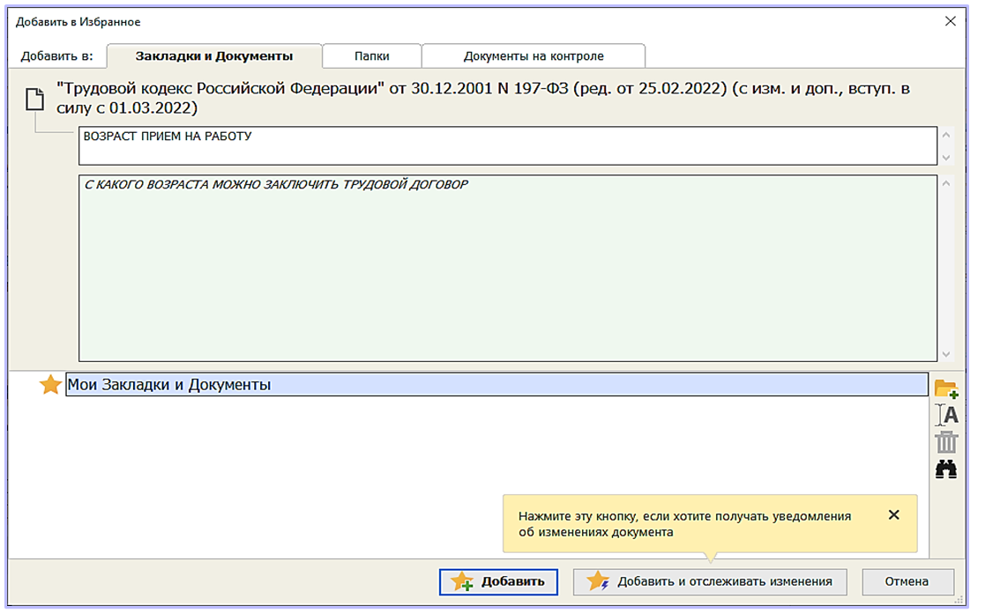
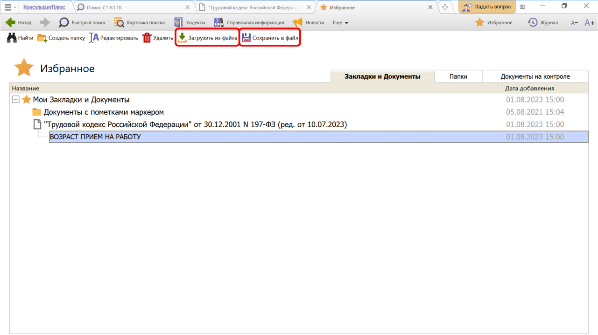

# Практическая работа с КонсультантПлюс №6
  
Закладки позволяют быстро открывать ранее найденные документы или их фрагменты.

## Примеры работы с системой

### Пример установки закладки

Поставим закладку на ст. 63 Трудового кодекса РФ.

Решение:

1. Для поиска нужной статьи в Быстром поиске зададим: СТ 63 ТК.
2. Установим курсор на название статьи и щелкнем по кнопке «Комментарий к фрагменту» на панели инструментов. Появится окно «Добавить в Избранное», вкладка «Закладки и Документы». Здесь можно задать название закладки и написать комментарий к ней. По умолчанию в качестве названия система предлагает текст той строки, на которую ставится закладка.
3. Переименуем закладку, назвав ее ВОЗРАСТ ПРИЕМ НА РАБОТУ.
4. Напишем комментарий к закладке, например: С КАКОГО ВОЗРАСТА МОЖНО ЗАКЛЮЧИТЬ ТРУДОВОЙ ДОГОВОР (см. рис.).

5. Нажмем кнопку «Добавить». Закладка будет установлена в документе, а комментарий к закладке будет отображен в тексте.
6. Чтобы редактировать закладку, нужно щелкнуть правой клавишей мыши по значку установленной закладки и выбрать команду «Редактировать закладку».
7. В дальнейшем к закладке легко перейти через окно «Избранное»: нажмем кнопку «Избранное» на панели инструментов, в выпадающем меню выберем «Открыть Избранное» и перейдем на вкладку «Закладки и Документы». Появится список всех закладок в документах системы.
8. Если дважды щелкнуть по названию закладки, то мы перейдем к нужной статье документа.

### Пример экспорта и импорта закладок

Требуется переслать другому пользователю системы КонсультантПлюс закладку, установленную в примере 1.

Решение:

1. Откроем список всех закладок системы. Нажмем кнопку «Избранное» панели инструментов и в выпадающем меню выберем «Открыть Избранное». Перейдем во вкладку «Закладки и Документы».
2. Установим курсор на нужной закладке и нажмем кнопку «Сохранить в файл» (см. рис.).
3. В появившемся окне зададим имя файла и папку, куда следует сохранить закладку. Получим файл с расширением lblz. Теперь сохраненный файл можно передать коллеге, например, послать по электронной почте.
4. Чтобы посмотреть закладку, коллеге нужно запустить систему КонсультантПлюс и в блоке «Избранное» выбрать вкладку «Закладки и Документы». Затем нажать кнопку «Загрузить из файла» (см. рис.). В появившемся окне указать имя файла и папку, где он находится, и нажать кнопку «Открыть» – закладка появится в списке.

## Задания

### Задание №1

В гражданском кодексе РФ (часть первая) установите закладку на ст. 221 с комментарием "Сбор ягод".

### Задание №2

Отредактируйте закладку, установленную в примере 1, добавьте в ваш комментарий фразу "и вылов рыбы".

### Задание №3

Установите закладку на ст. 58 Семейного кодекса РФ и сохраните ее на рабочий стол, назвав "Имя ребенка". Укажите тип данного файла (часть имени файла после точки).

### Задание №4

Поставьте закладку на ст. 20.4 "Нарушение требований пожарной безопасности" Кодекса РФ об административных правонарушениях.
