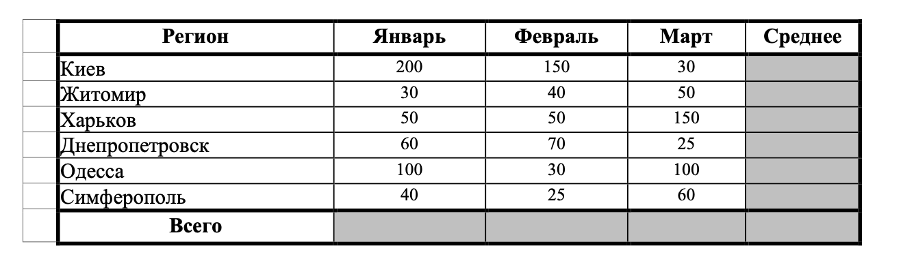
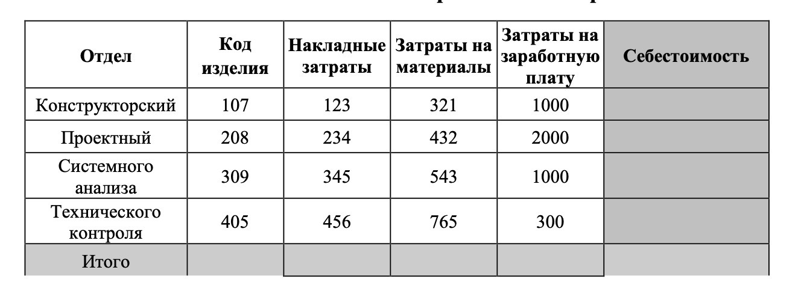
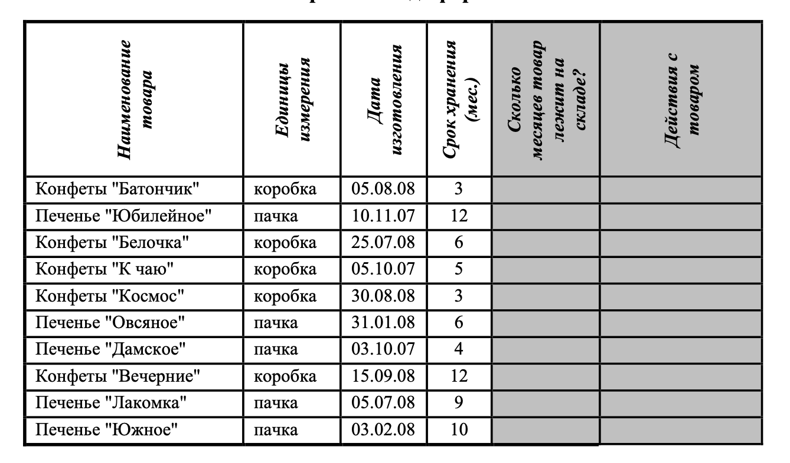

# Экзамен Excel
w
## Задание №1

1. Создать таблицу по образцу. Выполнить необходимые вычисления.
2. Отформатировать таблицу.
3. Построить сравнительную диаграмму (гистограмму) по уровням продаж в разные месяцы в
регионах и круговую диаграмму по среднему количеству продаж в регионах.

## Задание №2

1. Создать таблицу по образцу. Выполнить необходимые вычисления.
2. Отформатировать таблицу.
3. Построить круговую диаграмму по суммам затрат (строка ИТОГО) на заработную плату и
столбиковую диаграмму себестоимости изделий.
4. С помощью средства `Фильтр` определить отдел и код изделия, которое имеет максимальную
сумму всех затрат.

## Задание №3

1. Создать таблицу и отформатировать ее по образцу.
2. Данные в столбце Сколько месяцев… вычисляются с помощью функций `ГОД` и `МЕСЯЦ`, в
столбце Действия с товаром с помощью функции `ЕСЛИ` по такому принципу:
   - Выбросить - если срок хранения истек,
   - Срочно продавать - остался один месяц до конца срока хранения,
   - Можно еще хранить - до конца срока хранения больше месяца.
3. Отсортировать данные в таблице по Сроку хранения.
4. Построить сравнительную гистограмму по дате изготовления.
5. С помощью фильтра вывести сведения только о тех товарах, которые могут храниться от трех
до шести месяцев, но которые приходится выбросить.

