# Лабораторная работа №2

Построить изображение крышки на одном листе формата **А4** в масштабе **1:1** согласно варианту (определяется по последней цифре номера компьютера).

## Пример выполненного задания

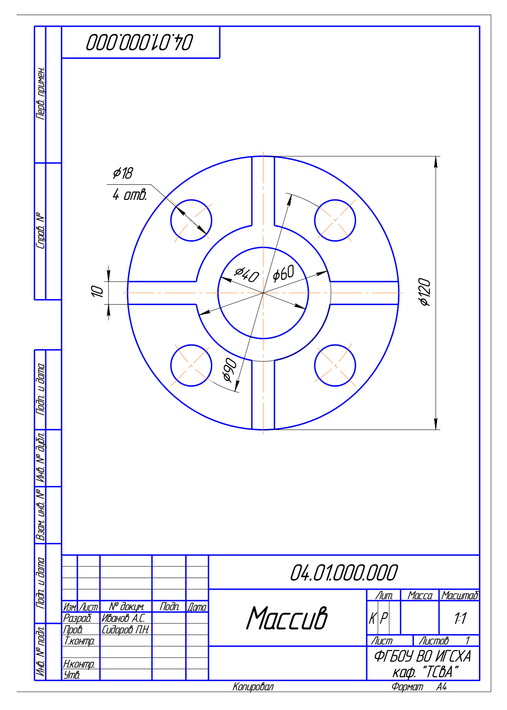

## Варианты

### Вариант №0

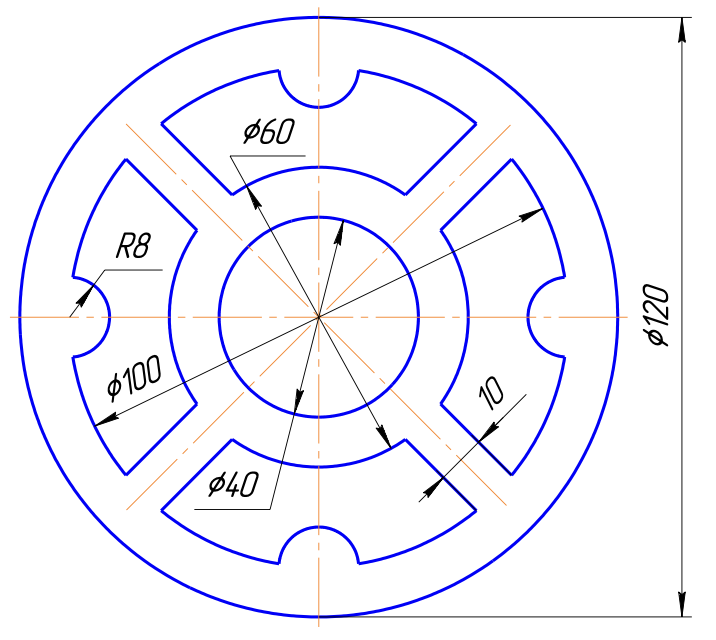

### Вариант №1

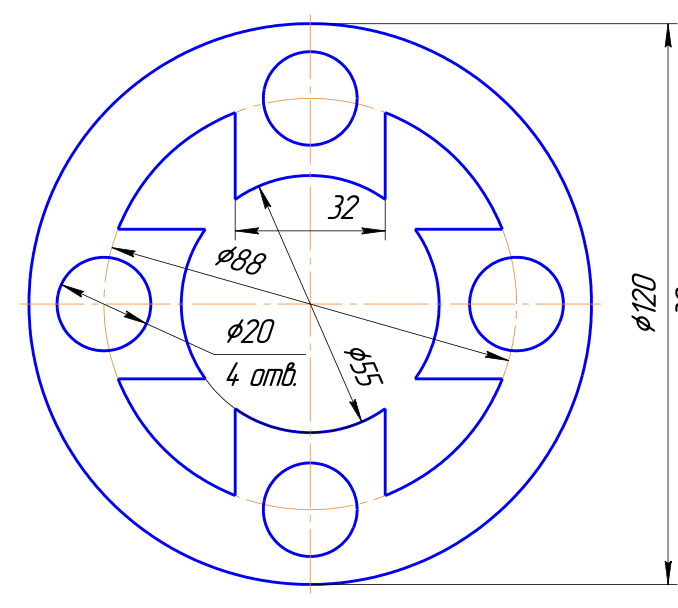

### Вариант №2

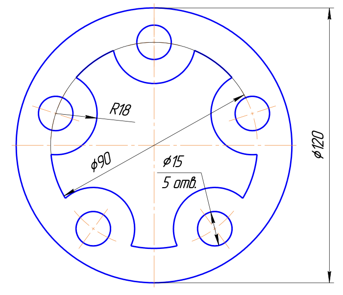

### Вариант №3

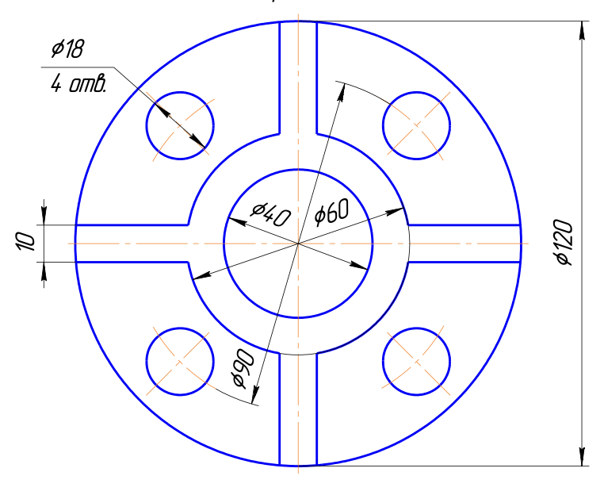

### Вариант №4

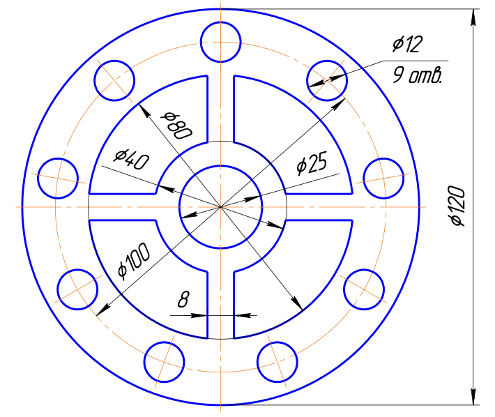

### Вариант №5

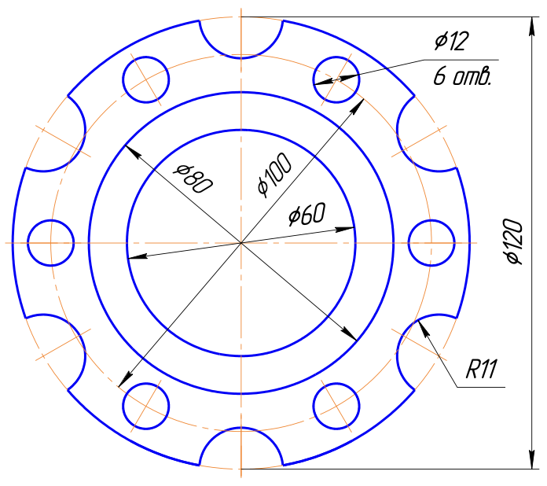

### Вариант №6

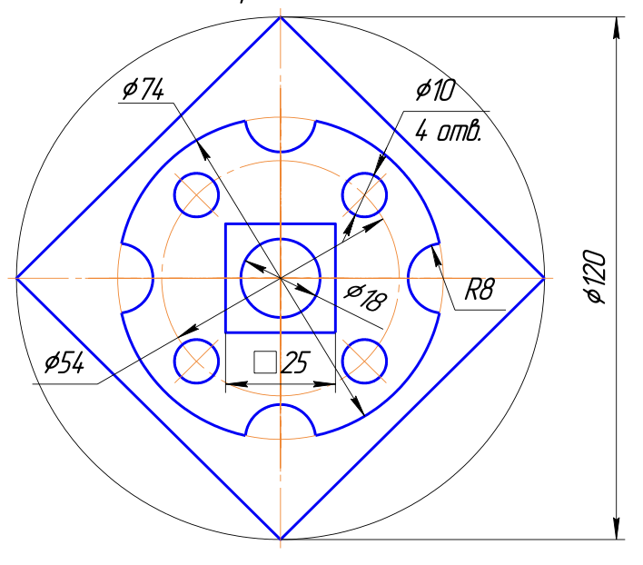

### Вариант №7

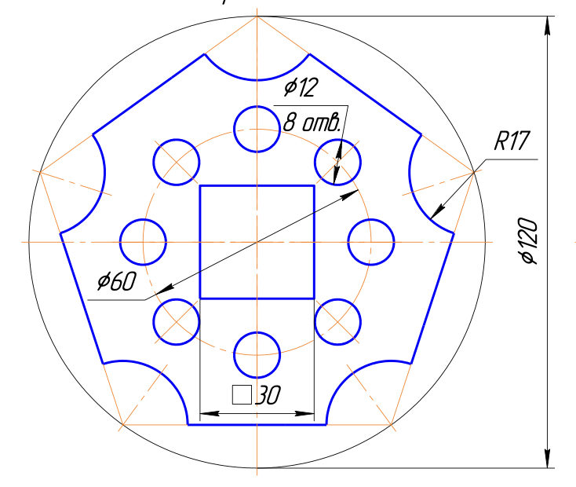

### Вариант №8

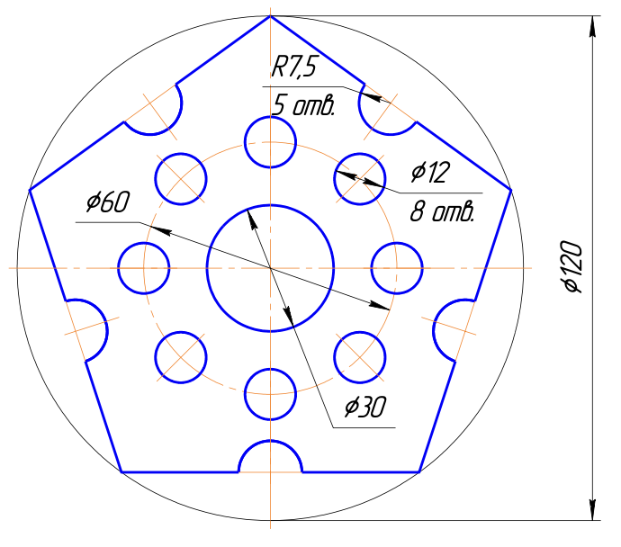

### Вариант №9

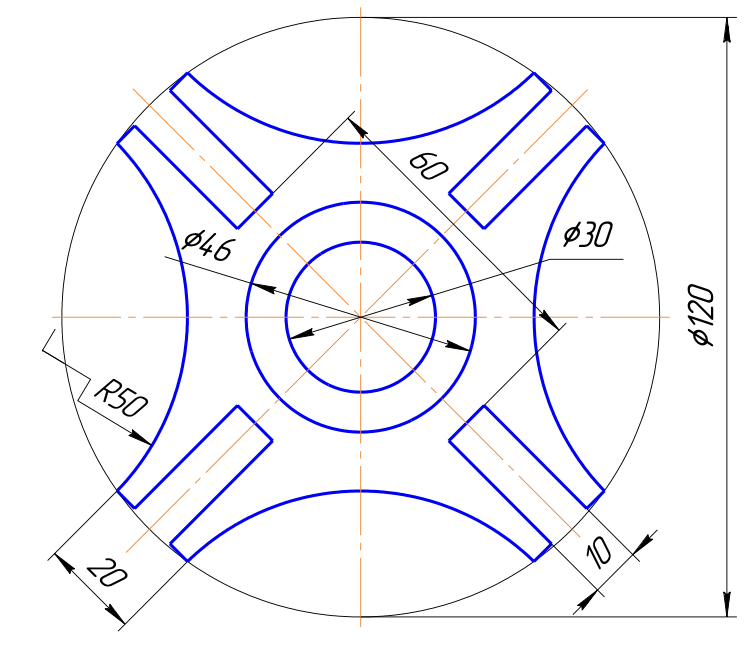
