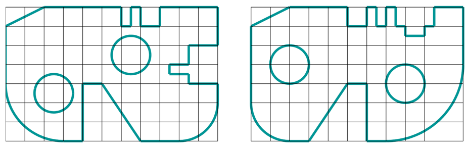

# Лабораторная работа №1

Построить изображение **двух** пластин на одном листе формата **А4** в масштабе **1:1** согласно варианту (определяется по последней цифре номера компьютера). Сетка образует квадрат со стороной **10 мм**.

## Пример выполненного задания

## Варианты

### Вариант №0

### Вариант №1

### Вариант №2

### Вариант №3

### Вариант №4

### Вариант №5

### Вариант №6

### Вариант №7

### Вариант №8

### Вариант №9

