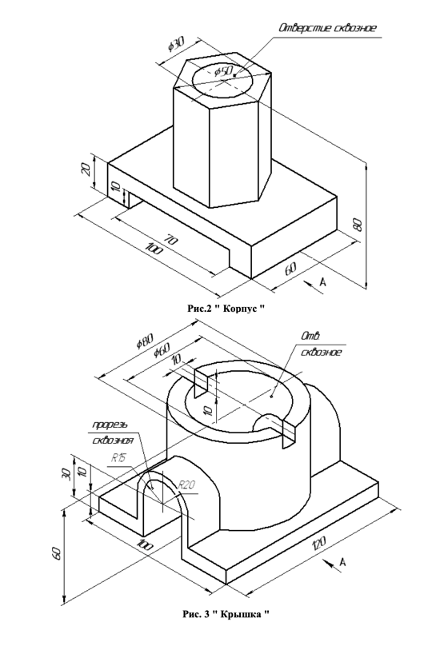
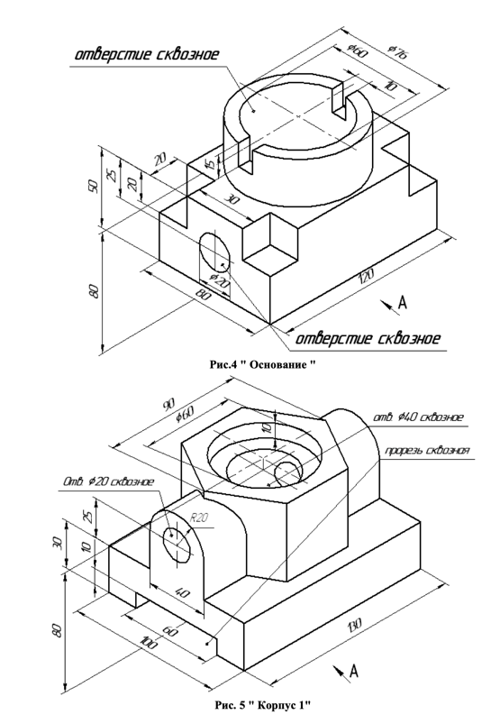
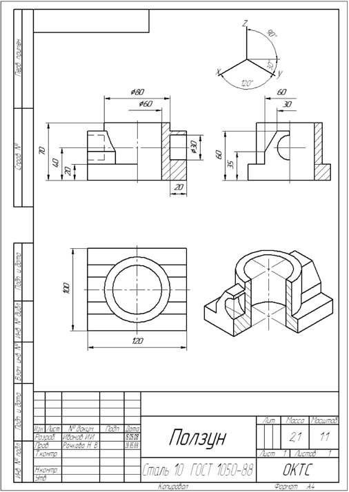

# Лабораторная работа №10

## Задание

Изобразить на выбор одну из следующих деталей на листе **А2 горизонтальном** в исходном 3Д виде и его трех проекциях с указанием всех дополнительных линий и размеров:

## Пример выполнения

