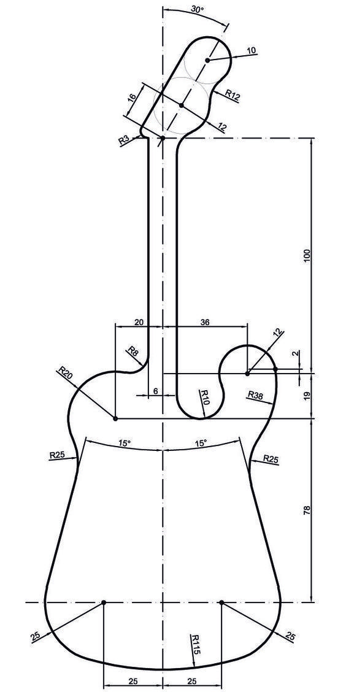

# Лабораторная работа №3

Создать три листа в одном файле: **А4 вертикальный**, **А3 вертикальный**, **А2 горизонтальный**. Заполнить первый лист данными: код, название, организация, разработчик, проверяющий, дата.

## Лист А4

## Лист А3

## Лист А2

Выберите любой предмет со сложным контуром и перенесите его на лист в виде чертежа в выбранной проекции приближенно к реальным размерам.
