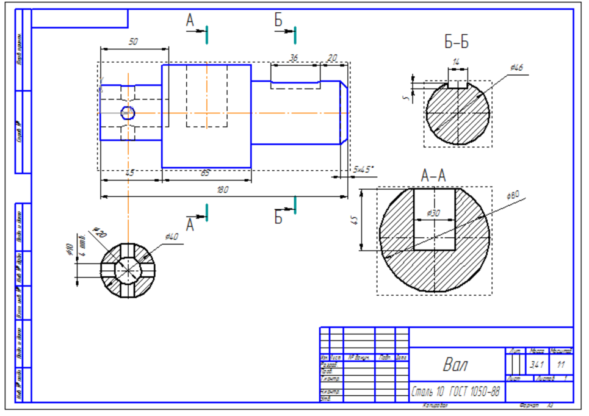
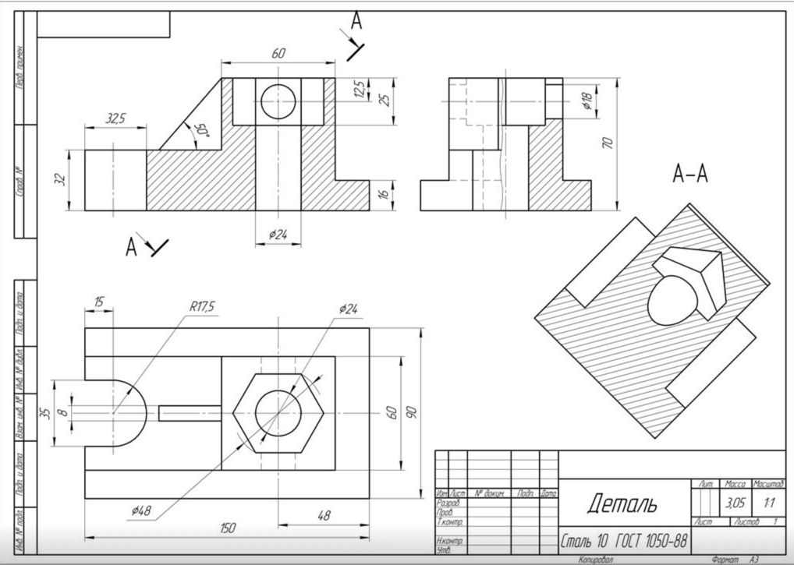

# Лабораторная работ №6

## Задание №1

На листе **А3 горизонтальном** изобразить следующий чертеж в сечении, указав размеры:

## Задание №2

На листе **А3 горизонтальном** изобразить следующий чертеж в сечении, указав размеры:

