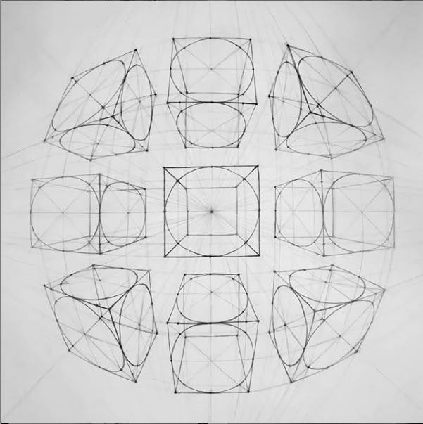
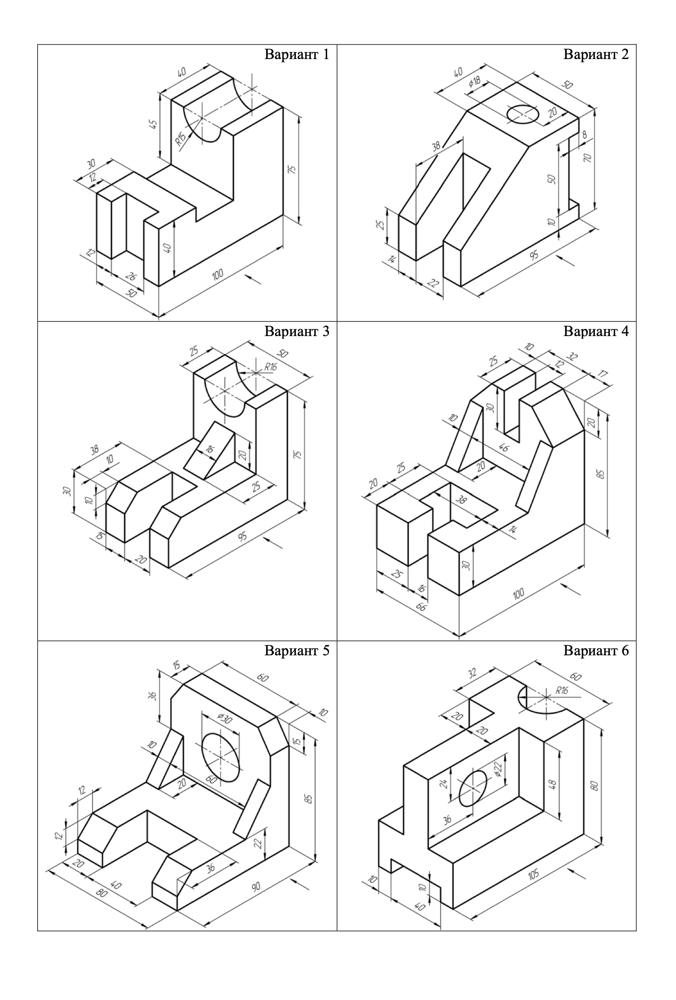

# Лабораторная работ №7

## Задание №1

На листе формата **А2 горизонтальном изобразить** 9 кубов с окружностями на их гранях в различной перспективе с указанием дополнительных линий. 

Размеры кубов произвольны. Угол перспективы произвольный.

Линия окружностей - Тонкая. Скрытые линии - Штриховая. Оси окружностей - Осевая.

## Задание №2

На листе формата **А4 вертикальном** выполнить чертеж с нанесением всех линий и размеров. 

Использование вспомогательных линий обязательно. **Не удалять их!**

Вариант определяться согласно номеру компьютера или второй цифре номера компьютера.

