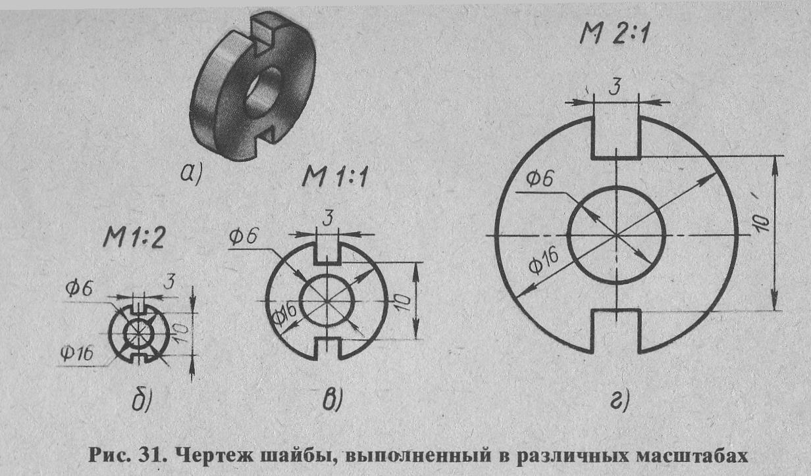
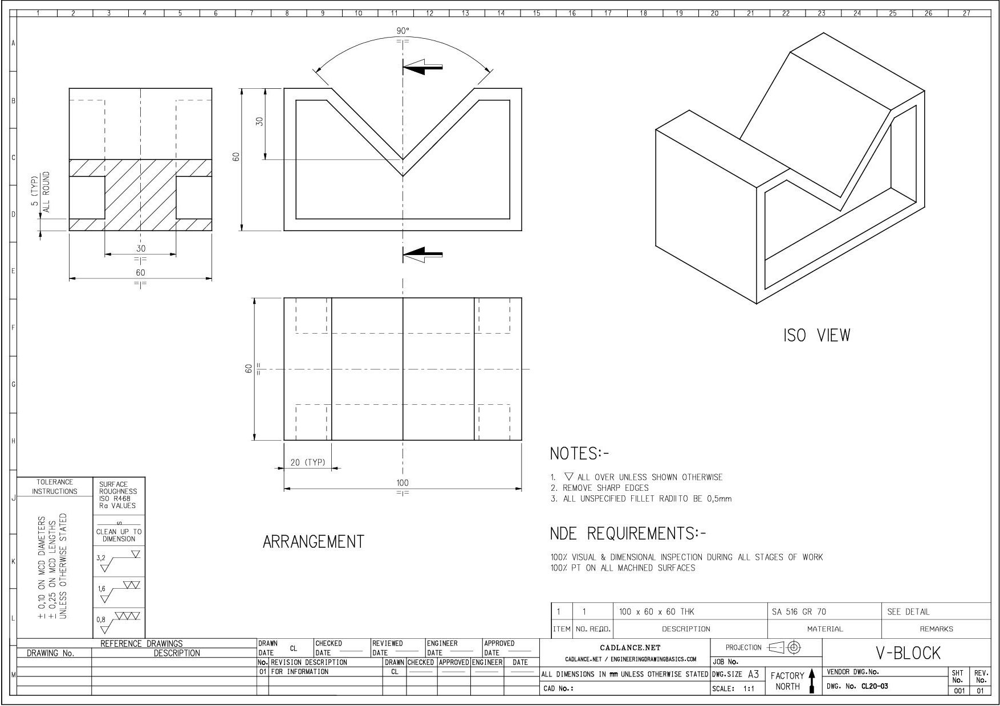
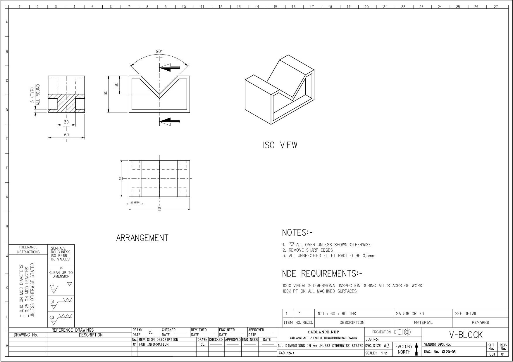
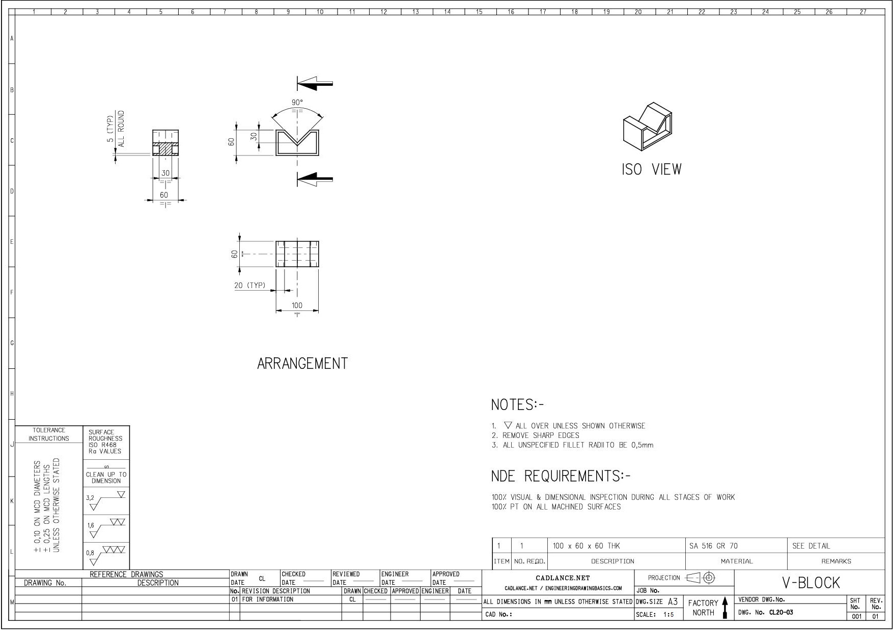

# Лабораторная работа №8

Масштаб – это отношение линейных размеров к действительным.

Стандарт устанавливает следующие масштабы:

- Уменьшения – 1:2; 1:2,5; 1:4; 1:5; 1:10 и др. 
- Натуральная величина – 1:1 
- Увеличения – 2:1; 2,5:1; 4:1; 5:1; 10:1 и др.

Следует помнить, что, в каком бы масштабе ни выполнялось изображение, размеры на чертеже наносят действительные (натуральные).

## Задание №1

На листе **А4 горизонтальном** изобразить следующий чертеж, выполненный в различных масштабах:

Нанести размеры и указать масштаб.

## Задание №2

На листе **А3 горизонтальном** изобразить следующий чертеж:

С помощью инструмента масштабирования в КОМПАС-3D на отдельных листах А3 горизонтальных привести чертеж к двум другим масштабам: 1:2 и 1:5. Примеры представлены на изображениях:

Заполнить все три листа данными с указанием соответствующего масштаба.
