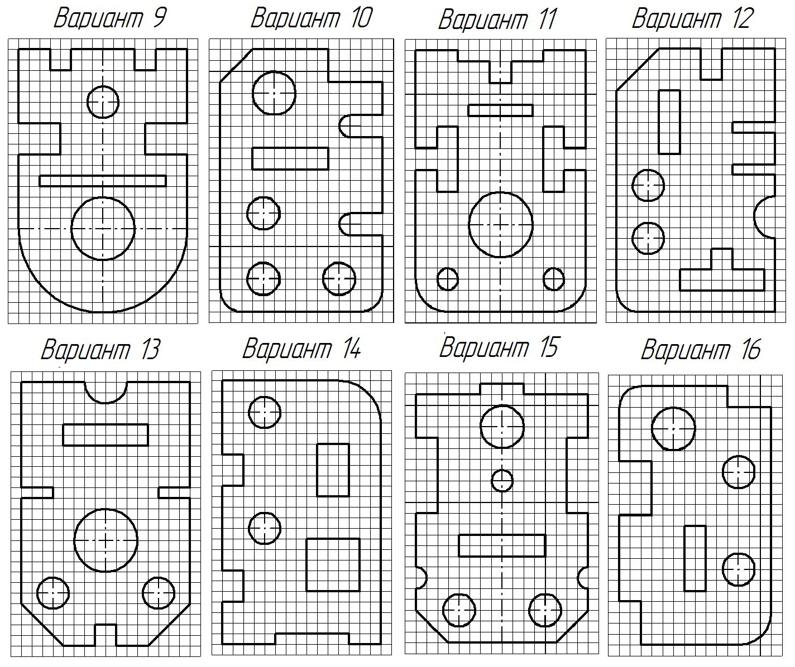

# Лабораторная работа №2

## Задание №1

Создать чертеж на листе формата **А4** согласно рисунку, размеры и надписи не наносить. Заполнить данные чертежа.

## Задание №2

На формате **А3** изобразить чертеж с проставленными размерами согласно своему варианту (номер компьютера). Размер одной клетки **10 мм**.

### Пример

### Варианты

