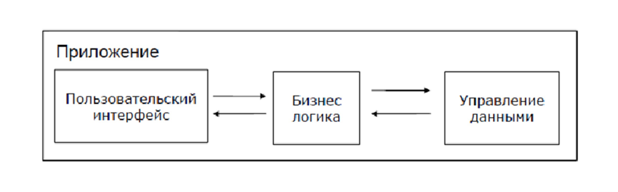

# Архитектура систем

Архитектура системы - концепция, определяющая модель, структуру, выполняемые функции и взаимосвязь компонентов информационной системы.

Компоненты информационной системы по выполняемым функциям можно разделить на три слоя: **слой представления**, **слой бизнес-логики** и **слой доступа к данным**.

- **Слой представления** – всё, что связано с взаимодействием с пользователем: нажатие кнопок, движение мыши, отрисовка изображения, вывод результатов поиска и т.д. 
- **Бизнес логика** – правила, алгоритмы реакции приложения на действия пользователя или на внутренние события, правила обработки данных. 
- **Слой доступа к данным** – хранение, выборка, модификация и удаление данных, связанных с решаемой приложением прикладной задачей.



## Компоненты web-приложения

**Клиент** – это браузер. В классической ситуации (когда роль клиента выполняет браузер) для того, чтобы пользователь увидел графический интерфейс приложения в окне браузера, последний должен обработать полученный ответ веб-сервера, в котором будет содержаться информация, реализованная с применением HTML, CSS, JS. Именно эти технологии «дают понять» браузеру, как именно необходимо «отрисовать» все, что он получил в ответе.

**Веб-сервер** – это сервер, принимающий HTTP-запросы от клиентов и выдающий им HTTP-ответы. Веб-сервером называют как программное обеспечение, выполняющее функции веб-сервера, так и непосредственно компьютер, на котором это программное обеспечение работает. Наиболее распространенными видами ПО веб-серверов являются Apache, IIS и NGINX. На веб-сервере функционирует тестируемое приложение, которое может быть реализовано с применением самых разнообразных языков программирования: PHP, Python, Ruby, Java, Perl и пр.

**База данных** - это информационная модель, позволяющая упорядоченно хранить данные об объекте или группе объектов, обладающих набором свойств, которые можно категоризировать. Базы данных функционируют под управлением так называемых систем управления базами данных. Самыми популярными являются MySQL, MS SQL Server, PostgreSQL, Oracle (все – клиент-серверные).

## Типы клиентов

Для доступа к тем или иным сетевым сервисам используются клиенты, возможности которых характеризуются понятием толщины. Оно определяет конфигурацию оборудования и программное обеспечение, имеющиеся у клиента. Рассмотрим возможные граничные значения:

### Тонкий клиент

Этот термин определяет клиента, вычислительных ресурсов которого достаточно лишь для запуска необходимого сетевого приложения через web-интерфейс. Пользовательский интерфейс такого приложения формируется средствами статического HTML (выполнение JavaScript не предусматривается), вся прикладная логика выполняется на сервере. Для работы тонкого клиента достаточно лишь обеспечить возможность запуска web-браузера, в окне которого и осуществляются все действия. По этой причине web-браузер часто называют "универсальным клиентом".

### Толстый клиент

Таковым является рабочая станция или персональный компьютер, работающие под управлением собственной дисковой операционной системы и имеющие необходимый набор программного обеспечения. К сетевым серверам толстые клиенты обращаются, в основном, за дополнительными услугами (например, доступ к web-серверу или корпоративной базе данных).

Так же под толстым клиентом подразумевается и клиентское сетевое приложение, запущенное под управлением локальной ОС. Такое приложение совмещает компонент представления данных (графический пользовательский интерфейс ОС) и прикладной компонент (вычислительные мощности клиентского компьютера).

## Сетевые протоколы

**TCP/IP** — набор протоколов передачи данных, получивший название от двух принадлежащих ему протоколов: TCP (англ. Transmission Control Protocol) и IP (англ. Internet Protocol).

Наиболее известные протоколы, используемые в сети Интернет:

+ **HTTP (Hyper Text Transfer Protocol)** — это протокол передачи гипертекста.

+ **HTTPS (HyperText Transfer Protocol Secure)** - расширение протокола HTTP для поддержки шифрования, в целях повышения безопасности. Данные в протоколе HTTPS передаются поверх криптографических протоколов SSL или TLS.

+ **SSL ( Secure Sockets Layer — уровень защищённых cокетов)** — криптографический протокол, который подразумевает более безопасную связь.

+ **FTP (File Transfer Protocol)** — это протокол передачи файлов со специального файлового сервера на компьютер пользователя.

+ **POP3 (Post Office Protocol)** — это стандартный протокол почтового соединения.

+ **SMTP (Simple Mail Transfer Protocol)** — протокол, который задает набор правил для передачи почты.

+ **TELNET** — это протокол удаленного доступа.

+ **DTN** — протокол, предназначенный для сетей дальней космической связи IPN, которые используются NASA.

## API

### Определение

API (англ. Application Programming Interface — программный интерфейс приложения) — это набор способов и правил, по которым различные программы общаются между собой и обмениваются данными.

Все эти взаимодействия происходят с помощью функций, классов, методов, структур, а иногда констант одной программы, к которой обращаются другие. Это основной принцип работы API.

Допустим, вы покупаете билет в кино с помощью банковской карты. Во время покупки терминал обращается к API банка, который выпустил вашу карту, и отправляет запрос на оплату. А если вы заказываете такси через приложение, оно обращается к платёжной системе тоже через API.

Соответственно, API включает в себя:

+ Саму операцию, которую мы можем выполнить
+ Данные, которые поступают на вход
+ Данные, которые оказываются на выходе (контент данных или сообщение об ошибке)

### REST

REST (Representational state transfer) – это стиль архитектуры программного обеспечения для распределенных систем, таких как World Wide Web, который, как правило, используется для построения веб-служб.

Каждая единица информации однозначно определяется URL – это значит, что URL по сути является первичным ключом для единицы данных. Т.е. например третья книга с книжной полки будет иметь вид /book/3, а 35 страница в этой книге — /book/3/page/35. Отсюда и получается строго заданный формат. Причем совершенно не имеет значения, в каком формате находятся данные по адресу /book/3/page/35 – это может быть и HTML, и отсканированная копия в виде jpeg-файла, и документ Microsoft Word.

Как происходит управление информацией сервиса – это целиком и полностью основывается на протоколе передачи данных. Наиболее распространенный протокол конечно же HTTP. Так вот, для HTTP действие над данными задается с помощью методов: GET (получить), PUT (добавить, заменить), POST (добавить, изменить, удалить), DELETE (удалить). Таким образом, действия CRUD (Create-Read-Updtae-Delete) могут выполняться как со всеми 4-мя методами, так и только с помощью GET и POST.

Вот как это будет выглядеть на примере:

```
GET /book/ — получить список всех книг
GET /book/3/ — получить книгу номер 3
PUT /book/ — добавить книгу (данные в теле запроса)
POST /book/3 – изменить книгу (данные в теле запроса)
DELETE /book/3 – удалить книгу
```

#### JSON

Пример ввода:

```json
{
    "name":"Шортики",
    "section":"Платья",
    "description":"Модное платье из новой коллекции!"
}
```

Пример вывода:

```json
{
    "method": "/items/create",
    "status": "ok",
    "result": {
        "id": "60",
        "name": "Платье красное",
        "section": "Платья",
        "description": "Модное платье из новой коллекции!",
        "params": ""
    }
}
```
