# Блок-схемы алгоритмов. ГОСТ. Примеры

Схема – это абстракция какого-либо процесса или системы, наглядно отображающая наиболее значимые части. Схемы широко
применяются с древних времен до настоящего времени – чертежи древних пирамид, карты земель, принципиальные электрические
схемы.

На территории Российской Федерации действует единая система программной документации (ЕСПД), частью которой является
Государственный стандарт – ГОСТ 19.701-90 «Схемы алгоритмов программ, данных и систем». Рассматриваемый ГОСТ практически
полностью соответствует международному стандарту ISO 5807:1985.

## Элементы блок-схем алгоритмов

<table>

<tr>
<td align="center" width="180">
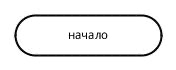
</td>
<td>

**Терминатор начала и конца работы функции.**  
Терминатором начинается и заканчивается любая функция. Тип возвращаемого значения и аргументов функции обычно указывается в комментариях к блоку терминатора.

</td>
</tr>

<tr>
<td align="center">
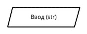
</td>
<td>

**Операции ввода и вывода данных.**  
В ГОСТ определено множество символов ввода/вывода, например вывод на магнитные ленты, дисплеи и т.п. Если источник данных не принципиален, обычно используется символ параллелограмма. Подробности ввода/вывода могут быть указаны в комментариях.

</td>
</tr>

<tr>
<td align="center">
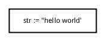
</td>
<td>

**Выполнение операций над данными.**  
В блоке операций обычно размещают одно или несколько (ГОСТ не запрещает) операций присваивания, не требующих вызова внешних функций.

</td>
</tr>

<tr>
<td align="center">
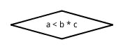
</td>
<td>

**Блок, иллюстрирующий ветвление алгоритма.**  
Блок в виде ромба имеет один вход и несколько подписанных выходов. В случае, если блок имеет 2 выхода (соответствует оператору ветвления), на них подписывается результат сравнения – «да/нет». Если из блока выходит большее число линий (оператор выбора), внутри него записывается имя переменной, а на выходящих дугах – значения этой переменной.

</td>
</tr>

<tr>
<td align="center">
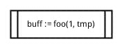
</td>
<td>

**Вызов внешней процедуры.**  
Вызов внешних процедур и функций помещается в прямоугольник с дополнительными вертикальными линиями.

</td>
</tr>

<tr>
<td align="center">
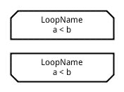
</td>
<td>

**Начало и конец цикла.**  
Символы начала и конца цикла содержат имя и условие. Условие может отсутствовать в одном из символов пары. Расположение условия определяет тип оператора, соответствующего символам на языке высокого уровня – оператор с предусловием (while) или постусловием (do ... while).

</td>
</tr>

<tr>
<td align="center">

</td>
<td>

**Подготовка данных.**  
Символ «подготовка данных» задает входные значения. Используется обычно для задания циклов со счетчиком.

</td>
</tr>

<tr>
<td align="center">
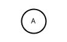
</td>
<td>

**Соединитель.**  
Используется, если блок-схема не умещается на листе или линию соединения неудобно проводить.

</td>
</tr>

<tr>
<td align="center">
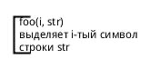
</td>
<td>

**Комментарий.**  
Комментарий может быть соединен как с одним блоком, так и группой блоков.

</td>
</tr>

</table>

---

## Примеры блок-схем

### Вычисление гипотенузы по теореме Пифагора

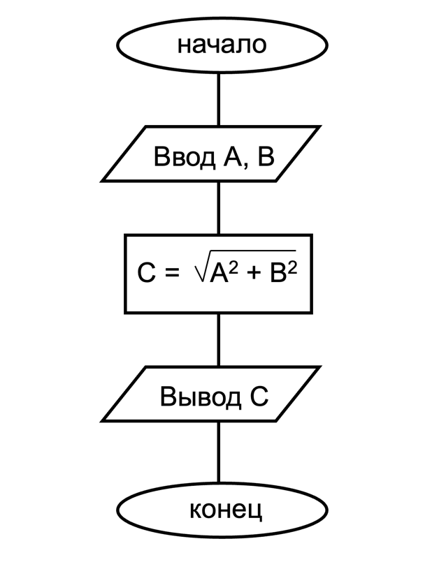

### Вычисление функции

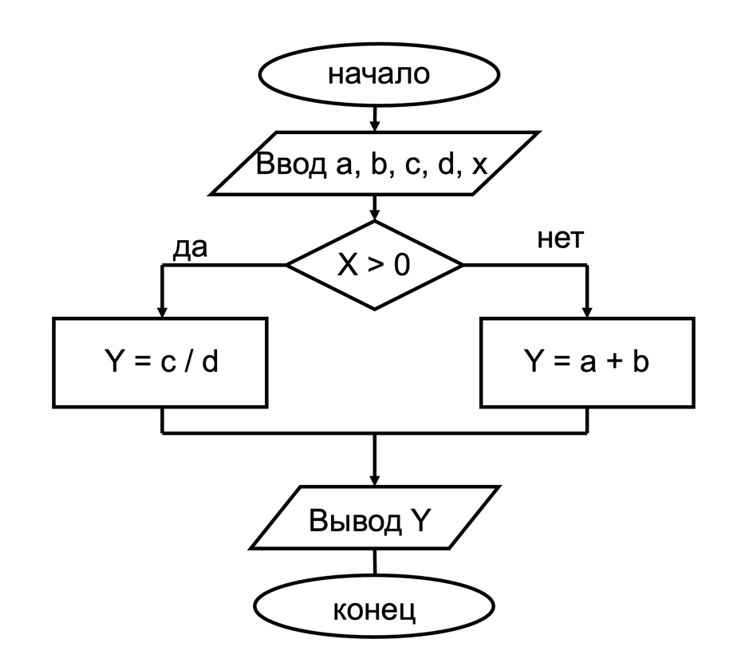

### Поиск наименьшего из трех чисел

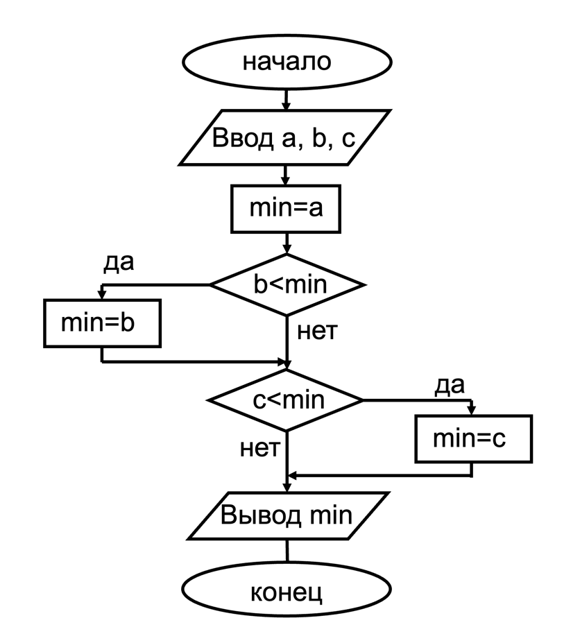

### Алгоритм Евклида

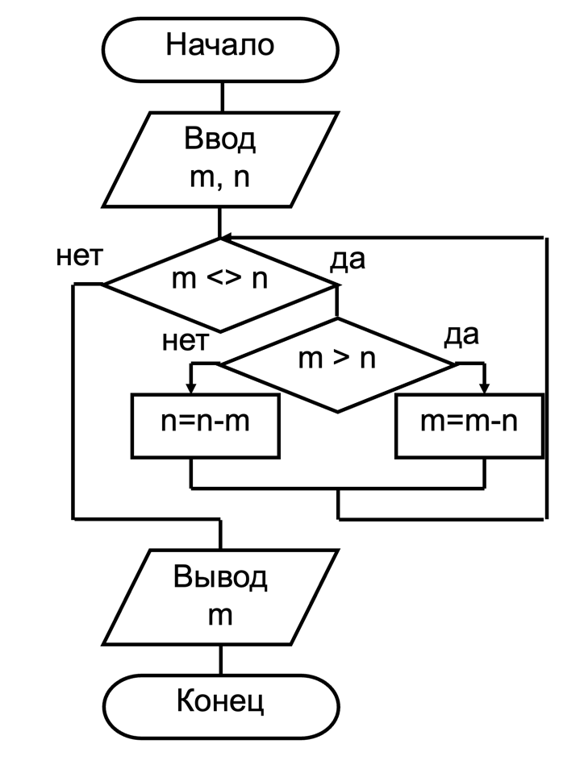

### Факториал

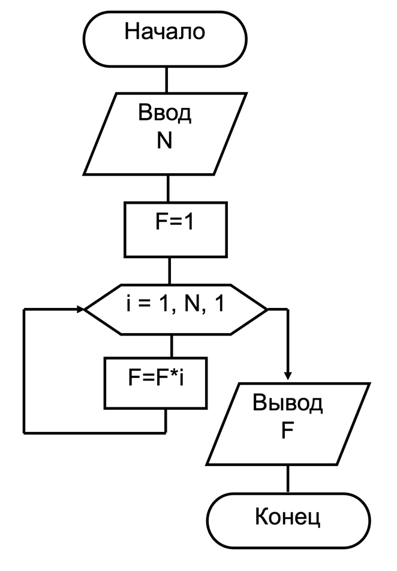

