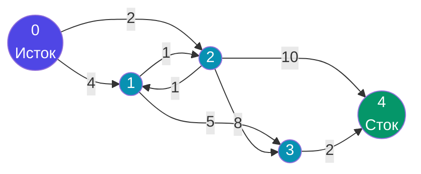
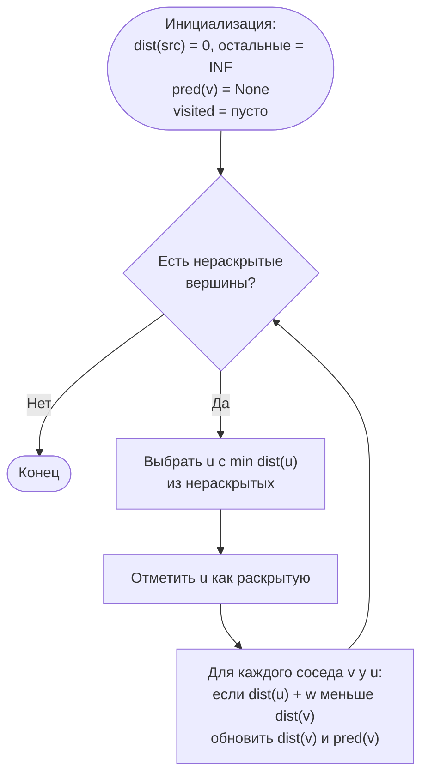
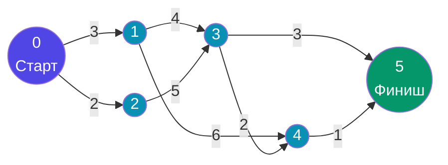
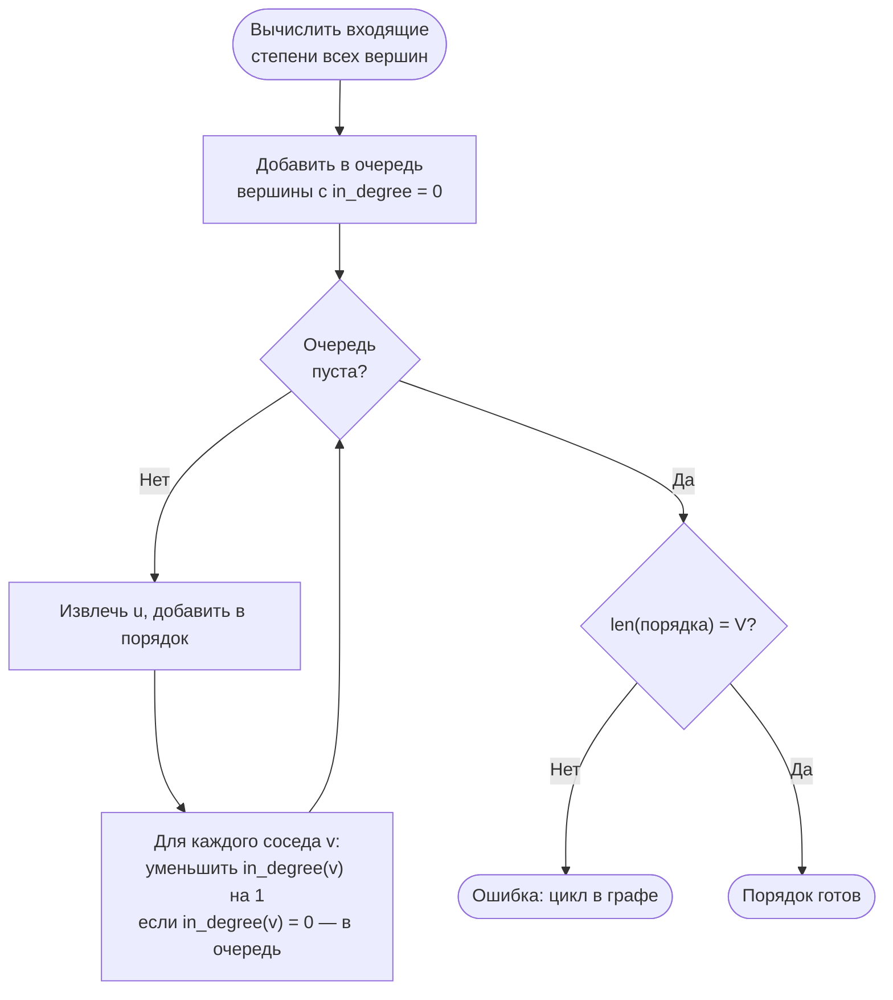

# Лабораторная работа №10

---

## Кейс: интеллектуальная логистика и управление проектами

Вы — разработчик платформы управления городской логистикой. Платформа решает две задачи:

- **Оптимальная маршрутизация** — найти кратчайший (по суммарному весу) путь между точками сети с учётом стоимости или времени проезда по каждому участку;
- **Планирование проекта** — определить минимальное время выполнения всего проекта и выявить операции, задержка любой из которых сдвинет срок сдачи.

> **Почему это важно на практике?**  
> Алгоритм Дейкстры лежит в основе GPS-навигаторов, OSPF-маршрутизации, движков рекомендаций и систем ценообразования в такси.  
> Метод критического пути (CPM) используется в системах управления проектами (Jira, MS Project, Primavera), CI/CD-пайплайнах и компиляторах для параллельного планирования задач.

---

## Справочный материал

### Взвешенный ориентированный граф

**Взвешенный граф** — граф, в котором каждому ребру (дуге) сопоставлено числовое значение — **вес** (стоимость, расстояние, время).

**Ориентированный граф (орграф)** — граф, в котором каждая дуга имеет направление: `u → v` не означает `v → u`.

Представление в виде **списка смежности с весами** — словарь, где для каждой вершины хранится список пар `(сосед, вес)`:

```python
graph = {
    0: [(1, 4), (2, 2)],
    1: [(2, 1), (3, 5)],
    2: [(1, 1), (3, 8), (4, 10)],
    3: [(4, 2)],
    4: []
}
```

| Характеристика        | Список смежности | Матрица смежности |
|-----------------------|------------------|-------------------|
| Память                | O(V + E)         | O(V²)             |
| Проверка дуги (u, v)  | O(degree(u))     | O(1)              |
| Перебор соседей u     | O(degree(u))     | O(V)              |
| Подходит для          | разреженных графов | плотных графов  |

---

### Граф Задания 1

Взвешенный ориентированный граф из 5 вершин и 8 дуг:

```
0→1 (4),  0→2 (2),  1→2 (1),  1→3 (5)
2→1 (1),  2→3 (8),  2→4 (10), 3→4 (2)
```



---

### Алгоритм Дейкстры

Дейкстра находит кратчайшие расстояния от одной вершины-источника до всех остальных в графе с **неотрицательными** весами.

**Ключевая идея:** жадно выбирать нераскрытую вершину с минимальным известным расстоянием и «расслаблять» её исходящие дуги.



**Пример расслабления дуги:**

```
dist[u] = 2,  дуга u→v с весом 3
dist[v] = 7  →  2 + 3 = 5 < 7  →  обновляем: dist[v] = 5, pred[v] = u
```

**Восстановление пути** — идём от целевой вершины по `pred[]` назад до источника, затем разворачиваем список.

```
pred = {0: None, 2: 0, 1: 2, 3: 1, 4: 3}
Путь 0 → 4:  4 ← 3 ← 1 ← 2 ← 0  →  [0, 2, 1, 3, 4]
```

---

### Ориентированный ациклический граф (DAG) и критический путь

**DAG (Directed Acyclic Graph)** — ориентированный граф без циклов.  
Используется для моделирования зависимостей задач: `u → v` означает «задача `u` должна быть выполнена до `v`».

**Критический путь** — самый длинный путь от начального узла до конечного. Его длина — **минимальное время** завершения всего проекта. Задержка любой операции на критическом пути увеличивает срок выполнения проекта.

---

### Граф Задания 2

Проект из 6 операционных узлов и 8 зависимостей с длительностями:

| Дуга  | Длительность |
|-------|:------------:|
| 0 → 1 | 3            |
| 0 → 2 | 2            |
| 1 → 3 | 4            |
| 2 → 3 | 5            |
| 1 → 4 | 6            |
| 3 → 4 | 2            |
| 3 → 5 | 3            |
| 4 → 5 | 1            |



---

### Топологическая сортировка (алгоритм Кана)

Линейное упорядочивание вершин DAG, при котором для каждой дуги `u → v` вершина `u` стоит **раньше** `v`.

**Алгоритм Кана (на основе BFS):**



---

### Критический путь методом динамического программирования

После топологической сортировки вычисляем наиболее ранние сроки завершения (`dist`) в порядке топологии:

```
dist[0] = 0
dist[v] = max(dist[u] + weight(u, v))  для всех u → v
```

**Критическое время** = `dist[sink]` = значение для конечного узла.

**Критические узлы** — вершины, лежащие хотя бы на одном пути, длина которого равна критическому времени.

**Пример вычисления для Задания 2:**

```
dist[0] = 0
dist[1] = dist[0] + 3 = 3
dist[2] = dist[0] + 2 = 2
dist[3] = max(dist[1]+4, dist[2]+5) = max(7, 7) = 7
dist[4] = max(dist[1]+6, dist[3]+2) = max(9, 9) = 9
dist[5] = max(dist[3]+3, dist[4]+1) = max(10, 10) = 10
```

Критическое время = **10**.

---

## Задание 1 – Взвешенный граф и алгоритм Дейкстры

### Контекст

Логистическая платформа получает запрос: «Найди маршрут из узла `0` до узла `4` с минимальной суммарной стоимостью». Вы реализуете движок поиска оптимального маршрута.

---

### Задачи

**1.1. Представление графа**

Реализуйте взвешенный ориентированный граф (5 вершин, 8 дуг из условия) в виде **списка смежности с весами**.

Выведите список смежности в читаемом формате:

```
0: [(1, 4), (2, 2)]
1: [(2, 1), (3, 5)]
...
```

---

**1.2. Алгоритм Дейкстры**

Реализуйте функцию:

```python
def dijkstra(graph: dict, start: int) -> tuple[dict, dict]:
    ...
```

Возвращает два словаря: `dist` (кратчайшие расстояния от `start`) и `pred` (предшественники на кратчайшем пути).

**Требования:**
- реализовать собственную приоритетную очередь (min-heap) **или** поиск минимума перебором (оба варианта засчитываются);
- не использовать `heapq` как готовый «чёрный ящик» — если применяете, явно опишите логику работы в комментариях.

Выведите расстояния от вершины `0`:

```
Distances from 0: {0: 0, 1: 3, 2: 2, 3: 8, 4: 10}
```

---

**1.3. Восстановление кратчайшего пути**

Реализуйте функцию:

```python
def restore_path(pred: dict, start: int, end: int) -> list | None:
    ...
```

Восстанавливает путь по словарю предшественников. Если пути нет — возвращает `None`.

Выведите кратчайший путь от `0` до `4`:

```
Shortest path 0 → 4: [0, 2, 1, 3, 4], length: 10
```

---

**1.4. Оценка сложности**

Заполните таблицу и **обоснуйте** каждую ячейку (от каких параметров зависит, почему именно такая сложность):

| Реализация / операция               | Лучший | Средний | Худший | Обоснование |
|-------------------------------------|--------|---------|--------|-------------|
| Дейкстра с поиском min перебором    |        |         |        |             |
| Дейкстра с приоритетной очередью    |        |         |        |             |
| Восстановление пути (`restore_path`)|        |         |        |             |

> **Подсказка:** В реализации с перебором на каждой из V итераций ищем min за O(V) и обходим рёбра. В реализации с кучей каждая операция `push`/`pop` стоит O(log V). Запишите итоговую сложность через V и E.

---

## Задание 2 – Критический путь на DAG

### Контекст

Проектный менеджер хочет знать: «Через сколько единиц времени проект будет завершён? Какие операции нельзя задержать ни на шаг?» Вы реализуете модуль планирования.

---

### Задачи

**2.1. Топологическая сортировка**

Реализуйте функцию:

```python
def topological_sort(graph: dict) -> list:
    ...
```

Использует алгоритм Кана (на основе BFS с подсчётом входящих степеней).

Выведите топологический порядок для графа из условия:

```
Topological order: [0, 1, 2, 3, 4, 5]
```

---

**2.2. Нахождение критического пути**

Реализуйте функцию:

```python
def critical_path(graph: dict) -> tuple[int, list, list]:
    ...
```

Возвращает:
- `critical_time` — критическое время (длина критического пути);
- `critical_nodes` — список вершин, лежащих хотя бы на одном критическом пути;
- `path` — один критический путь от источника до стока.

**Требования:**
- использовать топологическую сортировку из п. 2.1;
- применить метод динамического программирования (`dist[v] = max(dist[u] + w)`);
- восстановить путь по словарю предшественников.

Выведите результат:

```
Critical time: 10
Critical nodes: [0, 1, 2, 3, 4, 5]
Critical path: [0, 1, 3, 5]
```

> **Примечание:** в данном графе существует **несколько** критических путей длиной 10. Реализация обязана вернуть хотя бы один из них. Все критические узлы должны быть найдены корректно.

---

**2.3. Полный отчёт**

После вычисления выведите детальную таблицу наиболее ранних сроков завершения:

```
Earliest finish times:
  Node 0: 0
  Node 1: 3
  Node 2: 2
  Node 3: 7
  Node 4: 9
  Node 5: 10
```

---

**2.4. Оценка сложности**

Заполните таблицу и **обоснуйте** каждую ячейку:

| Функция                  | Лучший | Средний | Худший | Обоснование |
|--------------------------|--------|---------|--------|-------------|
| `topological_sort`       |        |         |        |             |
| `critical_path` (DP)     |        |         |        |             |
| Восстановление пути      |        |         |        |             |

> **Подсказка:** При обходе DAG в топологическом порядке каждая вершина и каждое ребро обрабатываются ровно один раз. Запишите сложность через V и E.
