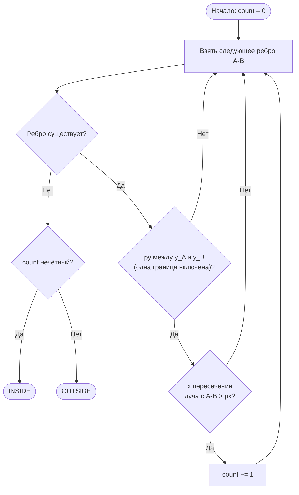
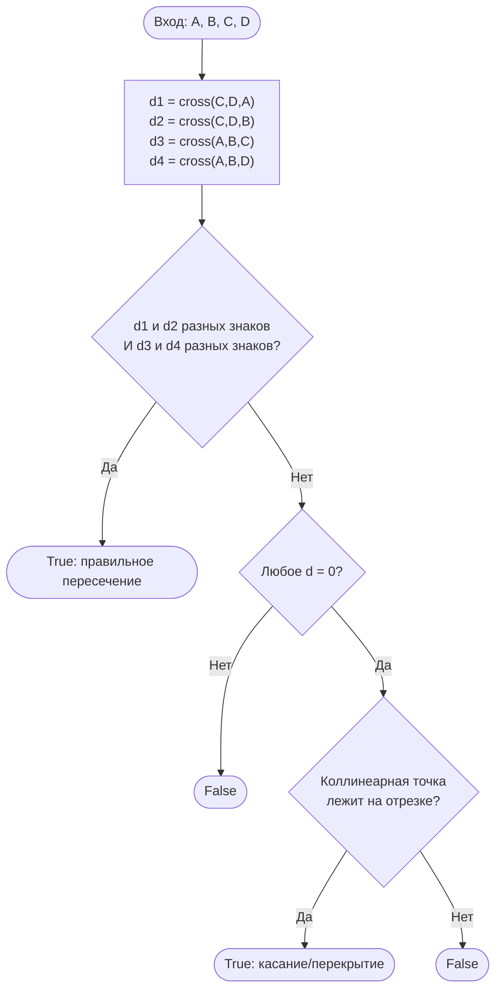

# Лабораторная работа №11

---

## Кейс: геоинформационная система анализа территорий

Вы — разработчик бэкенда геоинформационной платформы (аналог Google Maps для городского планирования). Платформа решает три задачи:

- **Метрика зон** — вычислить периметр и площадь земельного участка, заданного координатами вершин;
- **Локализация объекта** — проверить, находится ли точка (здание, камера, событие) внутри заданного района;
- **Конфликт зон** — определить, пересекаются ли два земельных участка.

> **Почему это важно на практике?**  
> Вычислительная геометрия лежит в основе систем кадастрового учёта, игровых движков (коллизии), компьютерного зрения (контуры объектов), робототехники (обход препятствий) и картографических сервисов.

---

## Справочный материал

### Представление многоугольника

**Простой многоугольник** — замкнутая ломаная без самопересечений. Задаётся упорядоченным списком вершин:

```python
polygon = [(x0, y0), (x1, y1), ..., (x_{n-1}, y_{n-1})]
```

Рёбра: `(polygon[i], polygon[(i+1) % n])` для `i = 0..n-1`.

---

### Формула расстояния между точками

```
d(A, B) = sqrt((xB - xA)^2 + (yB - yA)^2)
```

```python
import math
def dist(a, b):
    return math.sqrt((b[0]-a[0])**2 + (b[1]-a[1])**2)
```

**Периметр** = сумма длин всех рёбер, включая замыкающее ребро `(polygon[-1], polygon[0])`.

---

### Формула Гаусса (Shoelace) для площади

Для простого многоугольника с вершинами `(x_0, y_0), ..., (x_{n-1}, y_{n-1})`:

```
S = 0.5 * |Σ (xi * y(i+1) - x(i+1) * yi)|,  i = 0..n-1  (индексы по модулю n)
```

где индексы берутся по модулю n.

**Пример для прямоугольника `[(0,0), (5,0), (5,3), (0,3)]`:**

```
i=0: 0*0  - 5*0  =   0
i=1: 5*3  - 5*0  =  15
i=2: 5*3  - 0*3  =  15
i=3: 0*0  - 0*3  =   0
Сумма = 30  →  S = 30/2 = 15.0
```

> **Важно:** формула даёт **знаковую** площадь — знак определяет ориентацию обхода (CCW = +, CW = −). После взятия модуля — всегда правильная площадь.

---

### Векторное произведение и ориентация

**Ориентация тройки точек O, A, B** определяется знаком псевдоскалярного (z-компонента) произведения:

```
cross(O, A, B) = (Ax - Ox) * (By - Oy) - (Ay - Oy) * (Bx - Ox)
```

| cross > 0 | O → A → B поворот против часовой стрелки (CCW) |
|-----------|-----------------------------------------------|
| cross < 0 | O → A → B поворот по часовой стрелке (CW)      |
| cross = 0 | O, A, B коллинеарны                           |

Эта функция — основа алгоритмов пересечения отрезков.

---

### Алгоритм Ray Casting (лучевой тест)

Для проверки принадлежности точки `P(px, py)` многоугольнику:

1. Бросаем горизонтальный луч из `P` вправо (до `+∞`).
2. Считаем, сколько рёбер многоугольника этот луч пересекает.
3. Нечётное число пересечений → точка **внутри**.

**Обработка вершин:** ребро `A-B` считается пересекающим луч только если `y_A <= py < y_B` или `y_B <= py < y_A` (одна граница включена, другая — нет). Это устраняет двойной счёт при прохождении луча через вершину.



**Визуализация для невыпуклого многоугольника (Г-образный):**

```
y
4 +--+
  |  |
3 |  |         (3,3) — OUTSIDE
  |  |
2 |  +-----+
  |         |
1 |  (1,1) →→→→ 1 пересечение → INSIDE
  |         |
0 +---------+
  0    2    4    x
```

Вершины: `[(0,0), (4,0), (4,2), (2,2), (2,4), (0,4)]`

---

### Пересечение отрезков

Отрезки `AB` и `CD` пересекаются, если:

1. `d1 = cross(C, D, A)` и `d2 = cross(C, D, B)` имеют разные знаки (A и B по разные стороны от CD), **и**
2. `d3 = cross(A, B, C)` и `d4 = cross(A, B, D)` имеют разные знаки (C и D по разные стороны от AB).

**Граничные случаи (коллинеарность):** если `cross = 0`, точка лежит на прямой — нужно проверить попадание в диапазон отрезка через min/max координат.



---

## Задание 1 – Периметр и площадь многоугольника

### Контекст

Платформа получает координаты земельного участка и должна вычислить его периметр (длину ограждения) и площадь (для налогового расчёта).

---

### Задачи

**1.1. Реализация функций**

Реализуйте две функции:

```python
def perimeter(polygon: list[tuple]) -> float:
    ...

def area(polygon: list[tuple]) -> float:
    ...
```

- `perimeter` — сумма длин рёбер по формуле расстояния;
- `area` — формула Гаусса (Shoelace); результат всегда неотрицательный.

**Запрещено** использовать готовые геометрические библиотеки (`shapely`, `sympy.geometry` и т.п.).

---

**1.2. Тестирование**

Протестируйте на двух многоугольниках и выведите результат в формате:

```
Rectangle [(0,0), (5,0), (5,3), (0,3)]:
  Perimeter: 16.0
  Area: 15.0

Triangle [(0,0), (6,0), (3,4)]:
  Perimeter: 16.0
  Area: 12.0
```

---

## Задание 2 – Лучевой тест: точка в многоугольнике

### Контекст

Система получает координату события (аварии, доставки) и должна определить, в каком районе оно произошло — лежит ли точка внутри заданного полигона.

---

### Задачи

**2.1. Реализация**

Реализуйте функцию:

```python
def point_in_polygon(px: float, py: float, polygon: list[tuple]) -> bool:
    ...
```

Алгоритм Ray Casting. Корректно обработайте граничный случай прохождения луча через вершину многоугольника.

---

**2.2. Тестирование**

Используйте невыпуклый Г-образный многоугольник:

```python
polygon = [(0,0), (4,0), (4,2), (2,2), (2,4), (0,4)]
```

Выведите результат для четырёх точек:

```
(1, 1): INSIDE
(3, 3): OUTSIDE
(5, 1): OUTSIDE
(1, 3): INSIDE
```

---

## Задание 3 – Пересечение отрезков и многоугольников

### Контекст

Платформа проверяет, не конфликтуют ли два земельных участка: пересекаются ли их границы или один полностью поглощён другим.

---

### Задачи

**3.1. Пересечение отрезков**

Реализуйте функцию:

```python
def segments_intersect(a, b, c, d) -> bool:
    ...
```

Проверяет пересечение отрезков `AB` и `CD`. Должна корректно обрабатывать:

- правильное пересечение (X-образное);
- касание в одной точке (T-образное и endpoint);
- коллинеарные отрезки с перекрытием;
- коллинеарные отрезки без перекрытия.

Выведите результаты для тестовых случаев:

```
AB=(0,0)-(4,4), CD=(0,4)-(4,0) → True   # правильное пересечение
AB=(0,0)-(2,0), CD=(3,0)-(5,0) → False  # коллинеарные, без перекрытия
AB=(0,0)-(3,0), CD=(1,0)-(4,0) → True   # коллинеарные, перекрытие
AB=(0,0)-(2,2), CD=(2,2)-(4,0) → True   # касание в вершине
AB=(0,0)-(1,1), CD=(2,0)-(3,1) → False  # параллельные, не пересекаются
```

---

**3.2. Пересечение многоугольников**

Реализуйте функцию:

```python
def polygons_intersect(poly1: list[tuple], poly2: list[tuple]) -> bool:
    ...
```

Два многоугольника пересекаются, если:

- хотя бы одно ребро `poly1` пересекает хотя бы одно ребро `poly2`, **или**
- одна вершина `poly1` находится внутри `poly2` (один полностью внутри другого).

Для проверки включения используйте `point_in_polygon` из задания 2.

Протестируйте на трёх сценариях и выведите результат:

```python
# Сценарий 1: пересекающиеся (перекрывающиеся рамки)
poly1 = [(0,0), (4,0), (4,4), (0,4)]
poly2 = [(2,2), (6,2), (6,6), (2,6)]

# Сценарий 2: раздельные многоугольники
poly1 = [(0,0), (2,0), (2,2), (0,2)]
poly2 = [(3,3), (5,3), (5,5), (3,5)]

# Сценарий 3: один внутри другого (без пересечения рёбер)
poly1 = [(0,0), (6,0), (6,6), (0,6)]
poly2 = [(1,1), (2,1), (2,2), (1,2)]
```

```
Сценарий 1 (перекрытие рёбер): True
Сценарий 2 (раздельные):       False
Сценарий 3 (вложенный):        True
```
