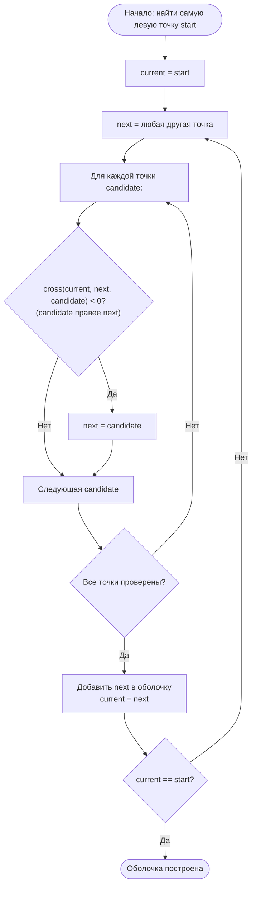
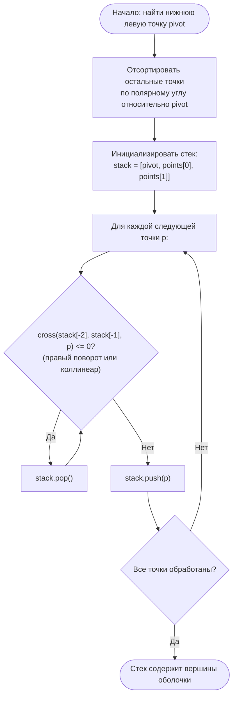

# Лабораторная работа №12

---

## Кейс: движок 2D-геометрии для игровой платформы

Вы — разработчик бэкенда 2D-игрового движка. Платформа решает три задачи:

- **Преобразование объектов** — перемещать, вращать и масштабировать игровые спрайты через аффинные матрицы;
- **Определение зоны видимости** — строить выпуклую оболочку набора точек, чтобы определить, какая область «покрыта» объектами сцены;
- **Оптимизация коллизий** — быстро проверять столкновения, используя выпуклые оболочки как упрощённые хитбоксы.

> **Почему это важно на практике?**  
> Аффинные преобразования используются в каждом игровом движке (Unity, Godot, Unreal), в векторной графике (SVG, PDF) и компьютерном зрении (augmented reality).  
> Выпуклые оболочки — основа систем обнаружения коллизий (GJK-алгоритм), навигационных мешей, кластеризации точечных облаков и вычислительной геометрии в целом.

---

## Справочный материал

### Однородные координаты и матрица 3×3

В 2D-пространстве точка `(x, y)` записывается в **однородных координатах** как вектор-строка `[x, y, 1]`. Это позволяет выразить любое аффинное преобразование (сдвиг, поворот, масштаб) одной матрицей 3×3 и комбинировать их перемножением.

**Матрица сдвига** на `(tx, ty)`:
```
T = [[1,  0,  0],
     [0,  1,  0],
     [tx, ty, 1]]
```

**Матрица масштабирования** на `(sx, sy)`:
```
S = [[sx, 0,  0],
     [0,  sy, 0],
     [0,  0,  1]]
```

**Матрица поворота** на угол `θ` (против часовой стрелки):
```
R = [[cos θ,  sin θ, 0],
     [-sin θ, cos θ, 0],
     [0,      0,     1]]
```

**Применение к точке:**
```
[x', y', 1] = [x, y, 1] · M
```

Результат: `x' = x·M[0][0] + y·M[1][0] + M[2][0]`, аналогично `y'`.

**Пример:** сдвиг точки `(2, 3)` на `(5, 1)`:
```
[2, 3, 1] · [[1, 0, 0],   =  [7, 4, 1]  →  (7, 4)
              [0, 1, 0],
              [5, 1, 1]]
```

---

### Последовательность аффинных преобразований

Для применения нескольких преобразований достаточно перемножить их матрицы в нужном порядке. Порядок важен: `S·R·T ≠ T·R·S`.

**Поворот вокруг произвольной точки `(cx, cy)`:**
1. Сдвиг так, чтобы `(cx, cy)` оказалась в начале координат: `T(-cx, -cy)`
2. Поворот: `R(θ)`
3. Сдвиг обратно: `T(cx, cy)`

Результирующая матрица: `M = T(-cx,-cy) · R(θ) · T(cx,cy)`

---

### Векторное произведение (ориентация тройки точек)

```
cross(O, A, B) = (A.x - O.x) * (B.y - O.y) - (A.y - O.y) * (B.x - O.x)
```

| Знак cross | Ориентация O → A → B |
|------------|----------------------|
| > 0        | Против часовой (CCW) |
| < 0        | По часовой (CW)      |
| = 0        | Коллинеарные точки   |

Эта операция — основа обоих алгоритмов выпуклой оболочки.

---

### Алгоритм Джарвиса (Gift Wrapping)

**Идея:** начинаем с самой левой точки (гарантированно принадлежит оболочке) и на каждом шаге ищем точку, которая является «самой правой» относительно текущего направления — то есть дающую минимальный левый поворот (или CW-ориентацию) со всеми остальными точками.



**Сложность:** O(n·h), где `n` — число точек, `h` — число вершин оболочки. В худшем случае (все точки на оболочке) — O(n²).

---

### Алгоритм Грэхема (Graham Scan)

**Идея:** выбрать опорную точку (нижнюю левую), отсортировать остальные по полярному углу относительно неё, затем обойти их, поддерживая стек и откатываясь при правых поворотах.



**Сортировка по полярному углу:** используем `atan2(dy, dx)` или сравнение через `cross` (без тригонометрии, точнее при целочисленных координатах).

**Сложность:** O(n log n) из-за сортировки; сам проход по стеку — O(n).

---

## Задание 1 – Аффинные преобразования

### Контекст

Движок получает координаты спрайта и должен применить цепочку преобразований: сначала изменить размер, затем повернуть, затем разместить в нужном месте сцены.

---

### Задачи

**1.1. Реализация функций**

Реализуйте три функции преобразования, работающие со списком точек:

```python
def translate(points: list[tuple], tx: float, ty: float) -> list[tuple]:
    ...

def rotate(points: list[tuple], angle_deg: float) -> list[tuple]:
    ...

def scale(points: list[tuple], sx: float, sy: float) -> list[tuple]:
    ...
```

Каждая функция принимает список точек `[(x0,y0), (x1,y1), ...]` и возвращает преобразованный список.  
**Запрещено** использовать `numpy`, `shapely` и другие геометрические/матричные библиотеки.

---

**1.2. Применение цепочки преобразований**

Возьмите квадрат `[(0,0), (2,0), (2,2), (0,2)]` и последовательно примените:

1. Масштабирование в 1.5 раза (`sx=1.5, sy=1.5`);
2. Поворот на 45°;
3. Сдвиг на `(5, 3)`.

Выведите координаты на каждом шаге (округлите до 4 знаков):

```
Original:  [(0, 0), (2, 0), (2, 2), (0, 2)]

After scale(1.5, 1.5):
  [(0.0, 0.0), (3.0, 0.0), (3.0, 3.0), (0.0, 3.0)]

After rotate(45°):
  [(0.0, 0.0), (2.1213, 2.1213), (0.0, 4.2426), (-2.1213, 2.1213)]

After translate(5, 3):
  [(5.0, 3.0), (7.1213, 5.1213), (5.0, 7.2426), (2.8787, 5.1213)]
```

---

## Задание 2 – Выпуклая оболочка: алгоритм Джарвиса

### Контекст

Движок строит выпуклую оболочку набора игровых объектов на сцене, чтобы использовать её как упрощённый хитбокс для быстрой проверки коллизий.

---

### Задачи

**2.1. Реализация алгоритма Джарвиса**

Реализуйте функцию:

```python
def jarvis_hull(points: list[tuple]) -> list[tuple]:
    ...
```

Возвращает вершины выпуклой оболочки в порядке обхода против часовой стрелки (CCW).

**Требования:**
- начальная точка — самая левая (при равенстве x — самая нижняя);
- корректно обрабатывать коллинеарные точки (несколько точек на одном ребре оболочки);
- **запрещено** использовать `scipy.spatial.ConvexHull` и аналоги.

---

**2.2. Тестирование**

Проверьте алгоритм на наборе из 10 точек, включая коллинеарные случаи:

```python
points = [(0,0), (2,0), (4,0), (4,4), (2,4), (0,4), (0,2), (1,2), (2,1), (3,3)]
```

Выведите результат в формате:

```
Input points (10): [(0, 0), (2, 0), (4, 0), (4, 4), (2, 4), (0, 4), (0, 2), (1, 2), (2, 1), (3, 3)]

Jarvis hull (4 vertices): [(0, 0), (4, 0), (4, 4), (0, 4)]
```

---

## Задание 3 – Graham Scan и визуализация

### Контекст

Для сравнения производительности движок тестирует два алгоритма построения оболочки на одном наборе данных и визуализирует результат для отладки.

---

### Задачи

**3.1. Реализация алгоритма Грэхема**

Реализуйте функцию:

```python
def graham_hull(points: list[tuple]) -> list[tuple]:
    ...
```

Возвращает вершины выпуклой оболочки в порядке обхода CCW.

**Требования:**
- опорная точка — нижняя левая (min y, при равенстве — min x);
- сортировка по полярному углу через `atan2` или через `cross`-сравнение;
- при одинаковом угле — упорядочить по расстоянию (ближние перед дальними, либо оставлять только дальнюю — выберите стратегию и поясните);
- **запрещено** использовать `scipy.spatial.ConvexHull` и аналоги.

---

**3.2. Сравнение с алгоритмом Джарвиса**

Запустите оба алгоритма на одном наборе точек из Задания 2.2. Выведите результаты рядом и проверьте совпадение набора вершин:

```
Points: [(0, 0), (2, 0), (4, 0), (4, 4), (2, 4), (0, 4), (0, 2), (1, 2), (2, 1), (3, 3)]

Jarvis hull  (4 vertices): [(0, 0), (4, 0), (4, 4), (0, 4)]
Graham hull  (4 vertices): [(0, 0), (4, 0), (4, 4), (0, 4)]

Vertex sets match: True
```

---

**3.3. Визуализация (при желании)**

С помощью `matplotlib` постройте график:

- все исходные точки — синими точками (`scatter`);
- вершины оболочки — красными маркерами (поверх синих);
- рёбра оболочки — замкнутой красной линией (последняя вершина соединяется с первой);
- подписи осей, заголовок «Convex Hull», легенда.

Сохраните изображение в файл `convex_hull.png` (или отобразите через `plt.show()`).
