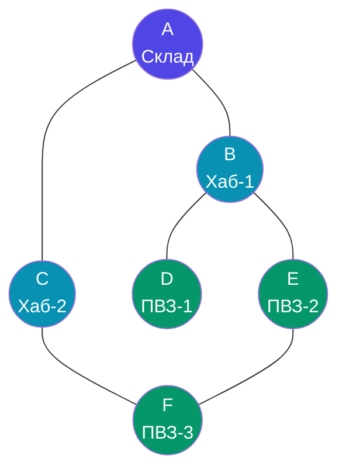
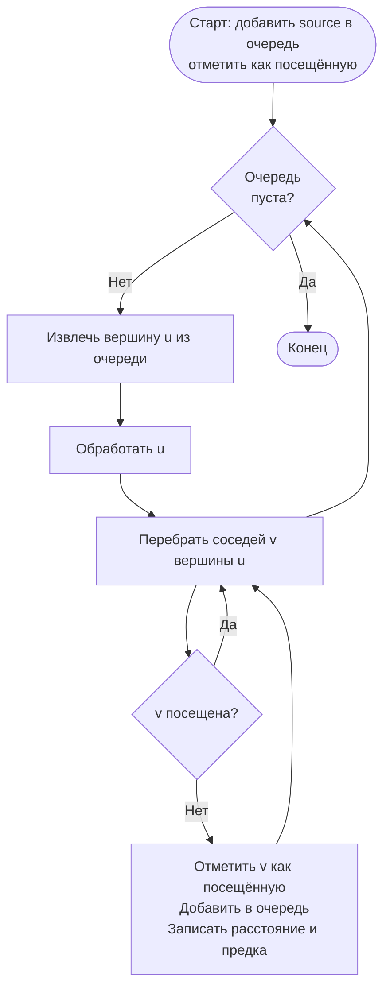
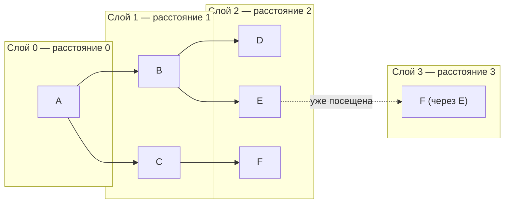
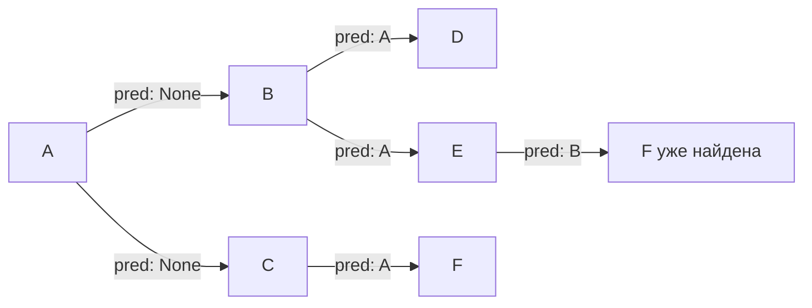

# Лабораторная работа №9

## Кейс: система маршрутизации курьерской службы

Вы — бэкенд-разработчик в логистической компании. Компания запускает сервис курьерской доставки по городу. Ваша задача —
разработать модуль, который:

- хранит карту городских узлов (складов, точек выдачи, хабов) и маршрутов между ними;
- позволяет находить кратчайший путь между двумя точками по числу пересадок;
- отвечает на вопрос: «Насколько связана наша сеть?»

> **Почему это важно на практике?**  
> Алгоритм BFS лежит в основе систем навигации, рекомендаций «друзей друзей» в соцсетях, обходчиков веб-страниц, сетевой
> диагностики (traceroute), анализа зависимостей пакетов и многого другого.

---

## Справочный материал

### Графы

**Граф** — это математическая модель, описывающая объекты (**вершины**) и связи между ними (**рёбра**).

```
Вершина (node/vertex) — объект: город, пользователь, веб-страница, склад.
Ребро (edge) — связь: дорога, дружба, ссылка, маршрут.
```

В нашем кейсе:

- **Вершины** — узлы сети (склад `A`, хабы `B`–`F`)
- **Рёбра** — прямые маршруты между ними

---

### Граф задания

Сеть состоит из 6 узлов и 6 маршрутов:

```
Узлы:    A, B, C, D, E, F
Маршруты: A–B, A–C, B–D, B–E, C–F, E–F
```



---

### Способы хранения графа

Существует два основных способа представить граф в памяти:

#### 1. Матрица смежности

Двумерный массив `n×n`, где `matrix[i][j] = 1`, если между вершинами `i` и `j` есть ребро.

```
     A  B  C  D  E  F
A  [ 0, 1, 1, 0, 0, 0 ]
B  [ 1, 0, 0, 1, 1, 0 ]
C  [ 1, 0, 0, 0, 0, 1 ]
D  [ 0, 1, 0, 0, 0, 0 ]
E  [ 0, 1, 0, 0, 0, 1 ]
F  [ 0, 0, 1, 0, 1, 0 ]
```

| Характеристика          | Значение       |
|-------------------------|----------------|
| Память                  | O(V²)          |
| Проверка ребра (u, v)   | O(1)           |
| Перебор соседей вершины | O(V)           |
| Подходит для            | плотных графов |

#### 2. Список смежности

Словарь (или массив списков), где для каждой вершины хранится список её соседей.

```python
{
    'A': ['B', 'C'],
    'B': ['A', 'D', 'E'],
    'C': ['A', 'F'],
    'D': ['B'],
    'E': ['B', 'F'],
    'F': ['C', 'E']
}
```

| Характеристика          | Значение                                  |
|-------------------------|-------------------------------------------|
| Память                  | O(V + E)                                  |
| Проверка ребра (u, v)   | O(degree(u))                              |
| Перебор соседей вершины | O(degree(u))                              |
| Подходит для            | разреженных графов (большинство реальных) |

> В реальных системах (например, граф дорог города с тысячами вершин) список смежности выигрывает по памяти в разы — у
> каждой вершины мало соседей относительно общего числа вершин.

---

### Теорема Эйлера (Handshaking Lemma)

$$\sum_{v \in V} \deg(v) = 2|E|$$

Каждое ребро вносит вклад в степень двух вершин — поэтому сумма всех степеней всегда чётна и равна удвоенному числу
рёбер.

**Практическое применение:** используется для валидации корректности построенного графа.

---

### Алгоритм BFS (поиск в ширину)

BFS обходит граф **слоями** — сначала все соседи стартовой вершины, затем их соседи, и так далее. Для этого используется
очередь (FIFO).



**Ключевое свойство:** BFS гарантирует нахождение кратчайшего пути по числу рёбер в **невзвешенном** графе.

**Почему именно очередь, а не стек?**  
Стек даёт DFS (глубину), очередь — BFS (ширину). Порядок извлечения определяет характер обхода.

---

### Визуализация BFS из вершины A



> Стрелки показывают, через какую вершину впервые достигается каждый узел. F достигается через C на расстоянии 2 — это и
> есть кратчайший путь.

---

### Восстановление пути

Чтобы восстановить путь, при обходе сохраняем для каждой вершины её **предка** (откуда пришли):

```
predecessors = { A: None, B: A, C: A, D: B, E: B, F: C }

Путь A → F: идём от F назад по предкам:
F → C → A, разворачиваем: [A, C, F]
```



---

## Задание 1 – Построение и отображение графа

### Контекст

Перед тем как искать маршруты, нужно **загрузить карту сети** в память. Вы реализуете два формата хранения и убедитесь в
корректности данных через теорему Эйлера.

---

### Задачи

**1.1. Матрица смежности**

Реализуйте функцию `build_adjacency_matrix(edges, vertices)`, возвращающую матрицу смежности в виде вложенного списка
`6×6`.

```python
vertices = ['A', 'B', 'C', 'D', 'E', 'F']
edges = [('A','B'), ('A','C'), ('B','D'), ('B','E'), ('C','F'), ('E','F')]
```

Выведите матрицу в читаемом виде (с метками вершин по строкам и столбцам).

---

**1.2. Список смежности**

Реализуйте функцию `build_adjacency_list(edges, vertices)`, возвращающую словарь вида `{vertex: [neighbors]}`.

---

**1.3. Степень вершины**

Реализуйте функцию:

```python
def degree(graph: dict, vertex: str) -> int:
    ...
```

Функция принимает список смежности и имя вершины, возвращает её степень (количество соседей).

Выведите степень каждой вершины.

---

**1.4. Проверка теоремы Эйлера**

Напишите код, который:

1. Подсчитывает сумму степеней всех вершин.
2. Подсчитывает `2 × число рёбер`.
3. Сравнивает результаты и выводит сообщение о корректности графа.

Пример вывода:

```
Сумма степеней: 12
2 × рёбер: 12

Граф корректен
```

---

### Оценка сложности

После реализации **обоснуйте** временную сложность каждой операции:

| Операция                     | Лучший | Средний | Худший | Обоснование |
|------------------------------|--------|---------|--------|-------------|
| Построение матрицы смежности |        |         |        |             |
| Построение списка смежности  |        |         |        |             |
| `degree(graph, vertex)`      |        |         |        |             |
| Проверка теоремы Эйлера      |        |         |        |             |

> **Подсказка:** учитывайте, от каких параметров зависит сложность — от числа вершин V, рёбер E или обоих.

---

## Задание 2 – BFS: кратчайший путь и расстояния

### Контекст

Курьерская система получает запрос: «Какой кратчайший маршрут из склада `A` до точки выдачи `F`?» Ваш модуль должен
ответить за миллисекунды. Реализуйте BFS-движок для этой задачи.

---

### Задачи

**2.1. Обход графа (BFS)**

Реализуйте функцию:

```python
def bfs(graph: dict, start: str) -> list:
    ...
```

Возвращает список вершин в порядке обхода в ширину, начиная с `start`.

---

**2.2. Расстояния от стартовой вершины**

Реализуйте функцию:

```python
def bfs_distances(graph: dict, start: str) -> dict:
    ...
```

Возвращает словарь `{vertex: distance}` — расстояния (в рёбрах) от `start` до каждой достижимой вершины.

Пример для `start='A'`:

```python
{'A': 0, 'B': 1, 'C': 1, 'D': 2, 'E': 2, 'F': 2}
```

---

**2.3. Кратчайший путь**

Реализуйте функцию:

```python
def bfs_shortest_path(graph: dict, start: str, end: str) -> list | None:
    ...
```

Возвращает список вершин, составляющих кратчайший путь от `start` до `end`. Если пути нет — возвращает `None`.

> **Требование:** восстанавливайте путь через словарь предков, а не перебором.

---

**2.4. Применение**

Используя реализованные функции, найдите и выведите:

1. Кратчайший путь из `A` в `F` (с расстоянием).
2. Кратчайший путь из `D` в `F` (с расстоянием).

Пример вывода:

```
A → F: ['A', 'C', 'F'], длина: 2
D → F: ['D', 'B', 'E', 'F'], длина: 3
```

---

### Оценка сложности

| Функция             | Лучший | Средний | Худший | Обоснование |
|---------------------|--------|---------|--------|-------------|
| `bfs`               |        |         |        |             |
| `bfs_distances`     |        |         |        |             |
| `bfs_shortest_path` |        |         |        |             |

> **Подсказка:** BFS посещает каждую вершину и каждое ребро не более одного раза. Запишите сложность через V (вершины) и
> E (рёбра). Подумайте: чем отличается лучший случай от худшего для `bfs_shortest_path`?

## Дополнительное задание (5 баллов)

Система доставки растёт: теперь нужно обрабатывать несвязные районы города (граф может иметь несколько компонент
связности).

Реализуйте функцию:

```python
def find_connected_components(graph: dict) -> list[list]:
    ...
```

Возвращает список компонент связности — каждая компонента представлена списком вершин.

Протестируйте на расширенном графе, добавив изолированный узел `G` и отдельное ребро `H–I`.

> **Практический контекст:** эта функция используется, например, для определения зон доставки, которые не имеют связи с
> основным складом и требуют отдельной логистики.
