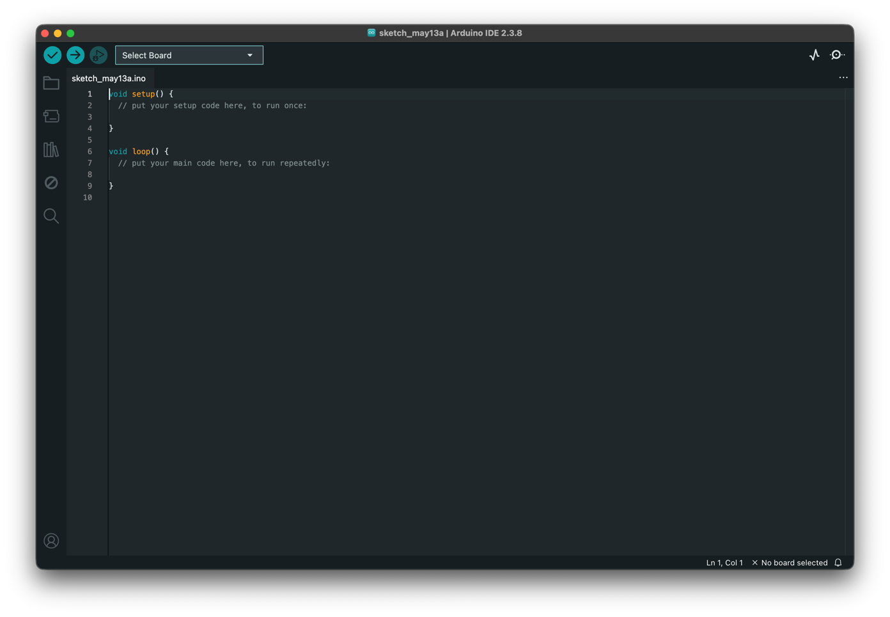
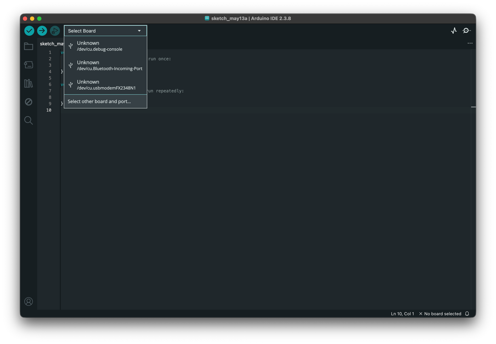
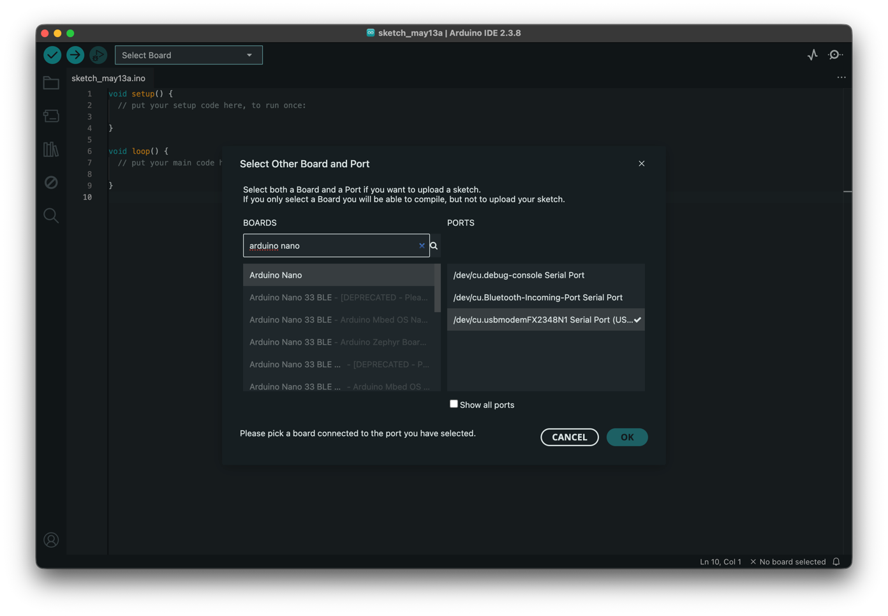
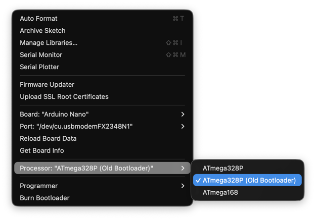
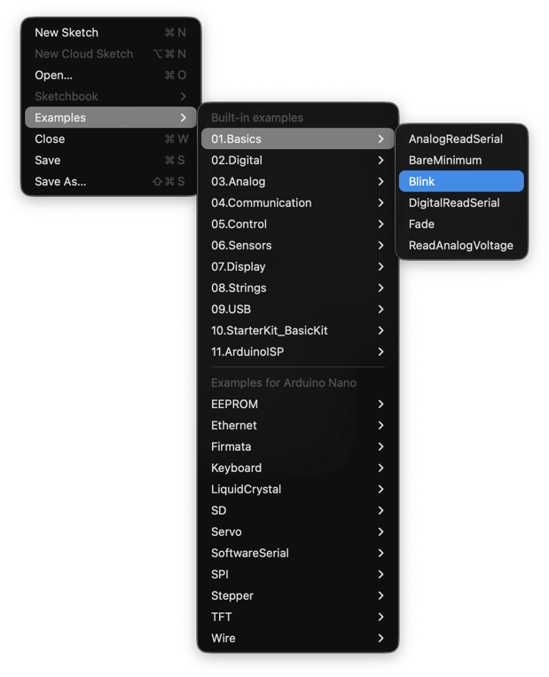
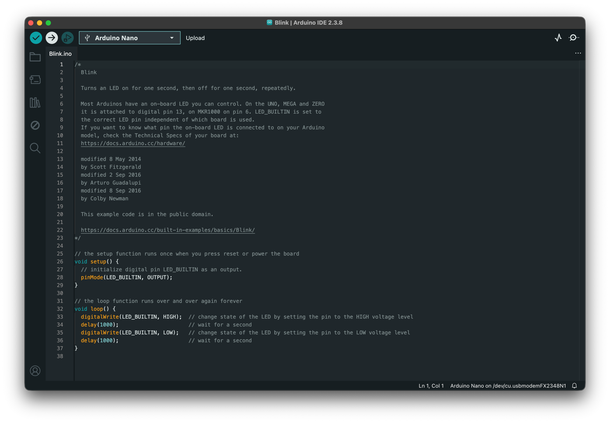
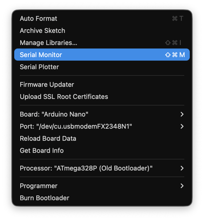
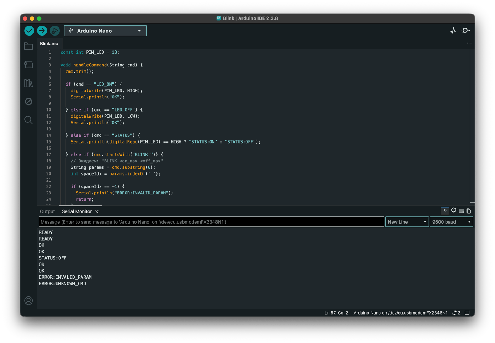

# Лабораторная работа №8

---

Форма сдачи лабораторной работы:

- исходный код доработанной прошивки;
- исходный код драйвера;
- демонстрация работы (либо показать очно, либо снять на видео. Важно увидеть работу драйвера + реакцию контроллера).

## Справка

---

### Как Arduino Nano общается с компьютером

Arduino Nano подключается к компьютеру через USB, однако внутри происходит следующее:

1. На плате установлен чип-преобразователь (CH340 на большинстве клонов, или FT232 на оригинальных платах). Его задача —
   преобразовать интерфейс **UART** (которым пользуется микроконтроллер ATmega328P) в **USB**.
2. Когда вы подключаете Arduino к компьютеру, ОС видит это устройство и создаёт **виртуальный последовательный порт**:
    - На Windows: `COM3`, `COM4`, ... (номер назначается системой)
    - На Linux: `/dev/ttyUSB0`, `/dev/ttyACM0`, ...
    - На macOS: `/dev/cu.usbserial-...`

3. Ваша программа открывает этот порт как обычный файл и читает/пишет байты. С точки зрения ОС — это файловая операция.
   С точки зрения Arduino — это `Serial.read()` и `Serial.print()`.

---

### Протокол взаимодействия

Сам по себе последовательный порт просто передаёт байты — он ничего не знает о командах и ответах. Чтобы программа и
Arduino понимали друг друга, нужно договориться о **протоколе**: формате команд, разделителях, формате ответов.

В этой работе используется простой **текстовый протокол**:

- Команды передаются как строки в кодировке ASCII
- Каждая команда заканчивается символом перевода строки `\n`
- Arduino читает строку, выполняет действие и отвечает строкой
- Возможные ответы: `OK`, `ERROR`, или информационные данные (например, `STATUS:ON`)

Пример диалога:

```
ПК → Arduino:   "LED_ON\n"
Arduino → ПК:   "OK\n"

ПК → Arduino:   "STATUS\n"
Arduino → ПК:   "STATUS:ON\n"

ПК → Arduino:   "BLINK 500\n"
Arduino → ПК:   "OK\n"
```

Протокол вы будете проектировать и расширять самостоятельно в ходе выполнения работы.

---

## Подготовка среды

Для более удобного подключения и прошивки платы лучше использовать Arduino IDE, но можно обойтись без него. _Я предлагаю
упростить себе жизнь и использовать данный инструмент._

---

### Установка Arduino IDE

Перейдите на официальный сайт `arduino.cc/en/software` и скачайте Arduino IDE версии 2.x.

#### Windows

Запустите скачанный `.exe`-установщик и следуйте инструкциям.

#### Linux

Скачайте `.AppImage`-файл, дайте ему права на запуск и запустите:

```bash
chmod +x arduino-ide_*.AppImage
./arduino-ide_*.AppImage
```

Либо через snap:

```bash
sudo snap install arduino
```

#### macOS

Откройте скачанный `.dmg`-файл и перетащите Arduino IDE в папку Applications.

---

### Драйвер CH340

Большинство Arduino Nano, которые продаются сегодня — это клоны на чипе **CH340**. Чтобы ОС увидела плату, нужен
соответствующий драйвер.

#### Windows

CH340 на Windows 10/11 часто не устанавливается автоматически. Скачайте драйвер с сайта
производителя: [wch-ic.com](https://www.wch-ic.com/downloads/ch341ser_exe.html). Запустите, нажмите
Install.

Проверка: подключите Arduino, откройте **Диспетчер устройств** → раздел **Порты (COM и LPT)**.
Должна появиться строка вида `USB-SERIAL CH340 (COM3)`.

#### Linux

Драйвер CH340 встроен в ядро Linux начиная с версии 2.6.24 — скорее всего, ничего устанавливать не нужно. Проверьте,
появилось ли устройство после подключения Arduino:

```bash
ls /dev/ttyUSB*
```

Должно появиться `/dev/ttyUSB0` (или с другим номером).

Если порт есть, но доступ запрещён — добавьте себя в группу `dialout` и перезайдите в систему:

```bash
sudo usermod -aG dialout $USER
```

#### macOS

На macOS Ventura и новее CH340 также работает без дополнительных драйверов (_мне ставить не пришлось_). Проверьте:

```bash
ls /dev/cu.*
```

Должно появиться что-то вроде `/dev/cu.usbserial-1410`.

---

### Настройка Arduino IDE

После того как устройство появилось в системе, настройте IDE. При запуске вас встретит окно вида (_показываю на macOS,
интерфейс может отличаться, извините_):



#### Выбор платы

Нажмите на список Select Board → Select other board and port → в строке поиска введите `Arduino Nano` → выберите *
*Arduino Nano** из списка. Здесь же, выберите порт подключенного устройства (см. пункт про драйвер CH340).





#### Выбор процессора

Перейдите в меню **Tools → Processor** и выберите **ATmega328P (Old Bootloader)**.



> ⚠️ Это важный шаг. Большинство клонов Arduino Nano используют старый загрузчик. Если выбрать не тот вариант — прошивка
> не загрузится, и IDE выдаст ошибку `avrdude: stk500_recv(): programmer is not responding`.

---

### Проверка подключения

Убедитесь, что всё настроено правильно, загрузив тестовый скетч.

В Arduino IDE откройте: **File → Examples → 01.Basics → Blink**



Нажмите кнопку **Upload** (стрелка вправо в верхней панели). IDE скомпилирует скетч и загрузит его на плату. Во время
загрузки на Arduino мигают светодиоды TX и RX.



Если загрузка прошла успешно — встроенный светодиод на плате (рядом с надписью `L`) начнёт мигать раз в секунду. Это
означает, что среда настроена верно и можно переходить к следующей части.

**Частые проблемы:**

| Ошибка                          | Причина                 | Решение                                         |
|---------------------------------|-------------------------|-------------------------------------------------|
| `programmer is not responding`  | Неверный процессор      | Выбрать Old Bootloader                          |
| `Port not found`                | Нет драйвера CH340      | Установить драйвер, см. пункт про драйвер CH340 |
| Порт есть, но загрузка зависает | Занят другой программой | Закрыть Serial Monitor                          |
| Linux: Permission denied        | Нет доступа к порту     | `sudo usermod -aG dialout $USER`                |

---

## Прошивка Arduino

### Схема подключения

В этой работе используется только **встроенный светодиод** Arduino Nano, подключённый к пину **13**. Никаких
дополнительных компонентов не требуется.

---

### Архитектурное решение

Прежде чем писать код, важно понять, *почему* прошивка устроена именно так.

Казалось бы, логичнее зашить всё в Arduino: пусть сама считает морзянку, сама играет паттерны. Но тогда драйвер на ПК
превращается в простую кнопку «запустить», и никакой учебной ценности в нём нет.

Есть и техническая причина. Если управлять таймингами со стороны ПК — посылать `LED_ON`, потом `sleep(100)`, потом
`LED_OFF` — между командами вмешивается планировщик операционной системы. На Windows `sleep(100)` реально может спать
115–120 мс. На Linux точнее, но гарантий нет. Морзянка поедет, паттерны будут неровными — и это не ошибка в коде, а
фундаментальное свойство многозадачной ОС.

Правильное решение — разделить ответственность:

- **Arduino** отвечает за точное исполнение тайминга. Она получает команду с параметрами и сама держит задержки через
  `delay()` — без вмешательства ОС.
- **Драйвер на ПК** отвечает за логику. Он знает, что такое морзянка, как выглядит паттерн вальса, сколько вспышек нужно
  для буквы «A». Он переводит высокоуровневые команды пользователя в последовательность примитивов и отправляет их на
  Arduino.

Это и есть правильная граница между драйвером и устройством.

---

### Команды прошивки

Прошивка реализует четыре примитивные команды:

| Команда                  | Параметры      | Ответ                      | Описание                                                   |
|--------------------------|----------------|----------------------------|------------------------------------------------------------|
| `LED_ON`                 | —              | `OK`                       | Включить LED                                               |
| `LED_OFF`                | —              | `OK`                       | Выключить LED                                              |
| `BLINK <on_ms> <off_ms>` | два числа в мс | `OK`                       | Мигнуть один раз: светить `on_ms` мс, погасить `off_ms` мс |
| `STATUS`                 | —              | `STATUS:ON` / `STATUS:OFF` | Вернуть текущее состояние                                  |

Всё остальное — морзянка, мелодии, паттерны — реализуется в драйвере на ПК поверх этих четырёх команд.

---

### Скетч

```cpp
const int PIN_LED = 13;

void handleCommand(String cmd) {
  cmd.trim();

  if (cmd == "LED_ON") {
    digitalWrite(PIN_LED, HIGH);
    Serial.println("OK");

  } else if (cmd == "LED_OFF") {
    digitalWrite(PIN_LED, LOW);
    Serial.println("OK");

  } else if (cmd == "STATUS") {
    Serial.println(digitalRead(PIN_LED) == HIGH ? "STATUS:ON" : "STATUS:OFF");

  } else if (cmd.startsWith("BLINK ")) {
    String params = cmd.substring(6);
    int spaceIdx = params.indexOf(' ');

    if (spaceIdx == -1) {
      Serial.println("ERROR:INVALID_PARAM");
      return;
    }

    int on_ms  = params.substring(0, spaceIdx).toInt();
    int off_ms = params.substring(spaceIdx + 1).toInt();

    if (on_ms <= 0 || off_ms < 0) {
      Serial.println("ERROR:INVALID_PARAM");
      return;
    }

    digitalWrite(PIN_LED, HIGH);
    delay(on_ms);
    digitalWrite(PIN_LED, LOW);
    if (off_ms > 0) delay(off_ms);
    Serial.println("OK");

  } else {
    Serial.println("ERROR:UNKNOWN_CMD");
  }
}

void setup() {
  pinMode(PIN_LED, OUTPUT);
  Serial.begin(9600);
  Serial.println("READY");
}

void loop() {
  if (Serial.available()) {
    String cmd = Serial.readStringUntil('\n');
    handleCommand(cmd);
  }
}
```

---

### Проверка через Serial Monitor

Откройте **Tools → Serial Monitor**, выберите **9600 baud** и **Newline**.





Проверьте все команды вручную:

| Команда         | Ожидаемый ответ            | Что происходит                          |
|-----------------|----------------------------|-----------------------------------------|
| `LED_ON`        | `OK`                       | LED включается                          |
| `LED_OFF`       | `OK`                       | LED выключается                         |
| `STATUS`        | `STATUS:ON` / `STATUS:OFF` | Текущее состояние                       |
| `BLINK 500 500` | `OK`                       | Одна вспышка: 500 мс свет, 500 мс темно |
| `BLINK 100 900` | `OK`                       | Короткая вспышка, длинная пауза         |
| `BLINK 300`     | `ERROR:INVALID_PARAM`      | Не хватает второго параметра            |
| `HELLO`         | `ERROR:UNKNOWN_CMD`        | Неизвестная команда                     |

> 💡 Обратите внимание: после отправки `BLINK` Arduino не отвечает `OK` мгновенно — она сначала выполняет задержку. Это
> нормально и именно то, чего мы хотим: тайминг держит микроконтроллер.

---

## Драйвер на ПК

### Выбор языка и библиотеки

Драйвер можно написать на любом языке. Для работы с последовательным портом понадобится соответствующая библиотека.

---

### Консольный интерфейс

Драйвер запускается из командной строки и принимает команды в интерактивном режиме. При запуске без аргументов программа
выводит приветствие, список доступных портов и предлагает выбрать порт. После подключения открывается командная строка.

Пример сессии:

```
$ python driver.py

Arduino Nano Driver v1.0
Доступные порты:
  [1] COM3
  [2] COM5
Выберите порт: 1

Подключение к COM3... OK
Устройство готово (получен сигнал READY)

> help

Команды:
  help                     — показать эту справку
  port list                — список доступных портов
  port set <имя>           — переключиться на другой порт
  status                   — состояние светодиода
  led on                   — включить светодиод
  led off                  — выключить светодиод
  led blink <n> <ms>       — мигнуть N раз с интервалом ms миллисекунд
  led pulse <ms>           — одна плавная вспышка длительностью ms мс
  melody <название>        — световая мелодия (march, waltz, sos)
  melody list              — список доступных мелодий
  morse <текст>            — передать текст азбукой Морзе
  exit                     — завершить работу

> led blink 3 200
Выполняю: 3 вспышки по 200 мс...
OK

> morse HI
Передаю: HI
.... ..
OK

> melody march
Воспроизвожу: march
OK

> status
Состояние: OFF

> exit
Отключение от порта. До свидания.
```

---

### Как это устроено внутри

Каждая высокоуровневая команда драйвера транслируется в последовательность примитивных команд `BLINK`, `LED_ON`,
`LED_OFF`, которые по очереди отправляются на Arduino. После каждой команды драйвер ждёт ответа `OK` перед отправкой
следующей — это гарантирует правильный тайминг.

**Пример: `led blink 3 200`**

```
→ BLINK 200 200
← OK
→ BLINK 200 200
← OK
→ BLINK 200 200
← OK
```

**Пример: `morse A`**

Буква A — точка (·) и тире (—). Единица времени — 150 мс.

```
→ BLINK 150 150       # точка + пауза между элементами
← OK
→ BLINK 450 450       # тире + пауза между буквами
← OK
```

**Пример: `melody march`**

Марш — чёткий ритмичный паттерн, три коротких и одно длинное:

```
→ BLINK 100 100
← OK
→ BLINK 100 100
← OK
→ BLINK 100 100
← OK
→ BLINK 300 300
← OK
... (повторить)
```

> 💡 Обратите внимание: драйвер не знает ничего о светодиоде напрямую. Он знает только протокол. Это и есть суть
> драйвера — абстракция над устройством.

---

### Таблица Морзе

Для реализации команды `morse` вам понадобится таблица кодов. Реализуйте её в коде в виде словаря или массива:

```
A · —        N — ·
B — · · ·    O — — —
C — · — ·    P · — — ·
D — · ·      Q — — · —
E ·          R · — ·
F · · — ·    S · · ·
G — — ·      T —
H · · · ·    U · · —
I · ·        V · · · —
J · — — —    W · — —
K — · —      X — · · —
L · — · ·    Y — · — —
M — —        Z — — · ·
```

Пробел между словами = пауза 7 единиц (без вспышки, просто `sleep` на стороне ПК после последней команды предыдущего
слова).

---

### Световые мелодии

Мелодии хранятся в драйвере как массивы пар `[on_ms, off_ms]`. Драйвер последовательно отправляет команды `BLINK` для
каждой пары.

**march** — чёткий маршевый ритм:

```
[100,100], [100,100], [100,100], [300,300],
[100,100], [100,100], [100,100], [300,300]
```

**waltz** — раз-два-три:

```
[300,150], [100,150], [100,300],
[300,150], [100,150], [100,300]
```

**sos** — световой сигнал SOS:

```
[150,150], [150,150], [150,450],   # S
[450,150], [450,150], [450,450],   # O
[150,150], [150,150], [150,450]    # S
```

---

### Задание

1. Реализуйте драйвер на выбранном языке. Программа должна:
    - при запуске показывать список доступных портов и предлагать выбрать;
    - реализовывать все команды из примера драйвера;
    - корректно обрабатывать ошибки: неверный порт, неверные параметры команды, потеря соединения;
    - при вводе неизвестной команды выводить соответствующую подсказку.
2. Добавьте команду `led fade <duration_ms>` — плавное нарастание и угасание через быстрое чередование коротких `BLINK`
   с нарастающей и убывающей длительностью `on_ms`. Визуально должно выглядеть как плавный пульс.
3. Добавьте команду `morse speed <1-5>` — установить скорость передачи Морзе, где 1 — очень медленно (300 мс/единица),
   5 — быстро (60 мс/единица).
4. Придумайте и реализуйте собственную команду — что-то, чего нет в списке выше (_что-нибудь интересное и прикольное_). Требования:
    - команда должна появиться в `help` с описанием;
    - если нужны изменения в прошивке — внесите их;
    - в README опишите идею: что делает команда, почему это интересно, как это работает под капотом.
