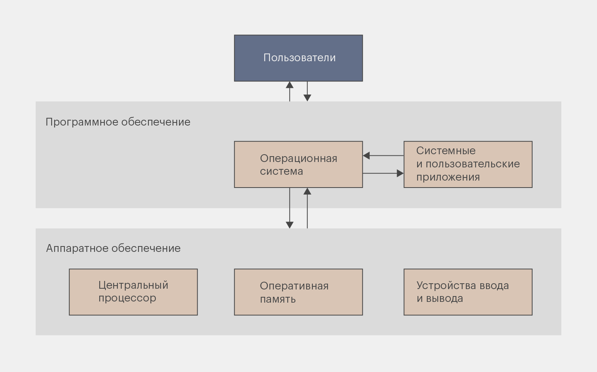

# Введение в операционные системы

## Понятие операционной системы

**Операционная система (ОС)** — это совокупность программ, управляющих ресурсами компьютера и обеспечивающих интерфейс для взаимодействия пользователей с ним.

## Основные задачи операционной системы

### Управление процессором

Процессор является одним из наиболее ограниченных и ценных ресурсов вычислительной системы. В каждый момент времени процессор может выполнять инструкции **только одного потока на одном ядре**, в то время как в системе одновременно может быть запущено множество программ.

Операционная система решает задачу **рационального распределения процессорного времени**, создавая для пользователя иллюзию одновременного выполнения нескольких задач.

Для этого операционная система:
- определяет, **какой процесс или поток** будет выполняться в данный момент времени;
- ограничивает время выполнения одной задачи, предотвращая монопольный захват процессора;
- обеспечивает справедливое и эффективное использование процессорных ресурсов.

Основные функции управления процессором:
- **планирование выполнения процессов** — выбор следующего процесса или потока для выполнения на процессоре;
- **переключение контекста** — сохранение состояния текущего процесса и восстановление состояния другого;
- **управление приоритетами** — учёт важности задач и перераспределение процессорного времени в их пользу.

- Эти механизмы позволяют операционной системе обеспечивать отзывчивость интерфейса, стабильную работу фоновых задач и эффективное использование многоядерных процессоров.

### Управление памятью

Оперативная память используется всеми выполняемыми программами и является общим ресурсом системы. Без централизованного управления памятью программы могли бы перезаписывать данные друг друга, что делало бы работу системы нестабильной и небезопасной.

Операционная система отвечает за **распределение, учёт и защиту памяти**, предоставляя каждому процессу собственное логическое адресное пространство.

Основные функции управления памятью:
- **выделение и освобождение памяти** — динамическое управление объёмом памяти, доступным процессам;
- **организация виртуальной памяти** — создание иллюзии большого и непрерывного адресного пространства для каждой программы;
- **предотвращение несанкционированного доступа** — защита памяти одного процесса от вмешательства других.

- Благодаря этим механизмам операционная система обеспечивает стабильность, безопасность и возможность одновременной работы множества программ.

### Управление устройствами ввода-вывода

Устройства ввода-вывода отличаются по принципам работы, скорости и способам взаимодействия с процессором. Прямое управление каждым устройством из прикладных программ сделало бы разработку программ крайне сложной и зависимой от конкретного оборудования.

Операционная система предоставляет **унифицированный интерфейс** для работы с устройствами, скрывая их аппаратные особенности.

Основные функции управления устройствами ввода-вывода:
- **работа с драйверами** — использование специализированных программных модулей для взаимодействия с конкретными устройствами;
- **буферизация данных** — временное хранение данных для согласования скоростей работы устройств и процессора;
- **синхронизация операций ввода-вывода** — координация одновременных запросов от нескольких программ.

Таким образом, программы могут работать с устройствами на абстрактном уровне, не зная их внутреннего устройства.

### Хранение данных

Для долговременного хранения информации операционная система использует внешние носители данных и реализует файловые системы. Пользователю и программам данные представляются в виде файлов и каталогов, независимо от физического расположения информации на носителе.

Операционная система отвечает за **организацию, хранение и доступ к данным**, а также за сохранность информации при сбоях.

Основные функции хранения данных:
- **организация файлов и каталогов** — создание иерархической структуры хранения;
- **управление доступом** — ограничение операций чтения, записи и удаления;
- **обеспечение целостности данных** — предотвращение повреждения файлов и согласование операций записи.

- Файловая система является одной из ключевых абстракций операционной системы, обеспечивающей удобную и безопасную работу с данными.

### Обеспечение безопасности

Современные операционные системы предназначены для работы в многопользовательской и многозадачной среде, что требует строгого контроля доступа к ресурсам системы.

Операционная система обеспечивает безопасность за счёт **изоляции процессов и разграничения прав доступа**, предотвращая несанкционированные действия программ и пользователей.

Основные функции обеспечения безопасности:
- **разграничение прав доступа** — определение допустимых операций для пользователей и программ;
- **изоляция процессов** — предотвращение доступа одного процесса к данным другого;
- **защита критических компонентов системы** — ограничение доступа к ядру и системным ресурсам.

Эти механизмы позволяют обеспечить устойчивую, предсказуемую и безопасную работу операционной системы.

## Абстракции операционной системы

Абстракции — это **договор между операционной системой и программой**: программа работает с понятными объектами, а операционная система сама решает, как именно эти объекты реализованы.

### Процесс

**Процесс** — это выполняющаяся программа вместе с её текущим состоянием и выделенными ей ресурсами.

Процесс является **базовой единицей управления выполнением программ** в операционной системе.

Каждый процесс включает в себя:
- исполняемый код программы; 
- данные программы (глобальные и статические переменные); 
- стек выполнения; 
- контекст процессора (регистры, счётчик команд); 
- информацию об открытых файлах и других ресурсах.

Характерные особенности процессов:
- каждый процесс имеет собственное адресное пространство; 
- процессы изолированы друг от друга; 
- сбой одного процесса, как правило, не приводит к сбою всей системы.

С точки зрения операционной системы процесс представляет собой **контейнер ресурсов**, внутри которого происходит выполнение программы.

### Поток

**Поток** — это минимальная единица выполнения внутри процесса.

В отличие от процесса, поток:
- не обладает собственным адресным пространством; 
- использует ресурсы процесса, в котором он создан; 
- выполняется независимо от других потоков.

Один процесс может содержать **один или несколько потоков**, которые:
- разделяют память и ресурсы процесса;
- могут выполняться параллельно на разных ядрах процессора;
- позволяют эффективнее использовать вычислительные ресурсы.

Основные причины использования потоков:
- повышение производительности;
- упрощение структуры программ;
- возможность одновременного выполнения нескольких задач внутри одного процесса.

Таким образом, процесс определяет **границы ресурсов**, а поток — **путь выполнения**.

### Память

**Память** в операционной системе представляется программам в виде **абстрактного линейного адресного пространства**.

Для прикладной программы память выглядит как:
- непрерывная область адресов;
- доступная только данному процессу;
- изолированная от памяти других процессов.

Реальная физическая организация памяти при этом может быть:
- фрагментированной;
- распределённой между различными устройствами;
- частично размещённой на внешних носителях.

Операционная система берёт на себя:
- преобразование виртуальных адресов в физические;
- управление распределением памяти;
- защиту памяти процессов.

Абстракция памяти позволяет программам работать с данными, **не зная о физическом расположении памяти и особенностях аппаратной реализации**.

### Файлы

**Файл** — это абстракция долговременного хранения данных, предоставляемая операционной системой.

Файл представляет собой:
- именованную последовательность байтов;
- логическую единицу хранения информации;
- объект с определёнными атрибутами (размер, права доступа и др.).

Операционная система скрывает от пользователя и программ:
- тип физического носителя;
- структуру размещения данных;
- способы организации блоков хранения.

Файлы объединяются в каталоги, формируя иерархическую структуру, удобную для хранения и поиска информации.

Абстракция файлов позволяет программам работать с данными **одинаковым образом**, независимо от того, где и как эти данные физически хранятся.

### Устройства

**Устройства** ввода-вывода в операционной системе представлены в виде абстрактных объектов, с которыми программы взаимодействуют через стандартные интерфейсы.

Для прикладной программы устройство может выглядеть как:
- файл;
- поток данных;
- источник или приёмник информации.

Операционная система:
- принимает запросы на работу с устройствами;
- передаёт их драйверам;
- обеспечивает корректность и синхронизацию операций.

Абстракция устройств позволяет:
- использовать одно и то же программное обеспечение на разных аппаратных платформах;
- изолировать программы от особенностей конкретных устройств;
- упростить разработку и сопровождение программ.

## Архитектура операционной системы

### Ядро операционной системы

### Пользовательское пространство

## User mode и Kernel mode

## Взаимодействие пользователя с операционной системой

### Графический интерфейс (GUI)

### Командный интерфейс (CLI)

### Shell

## Классификация операционных систем