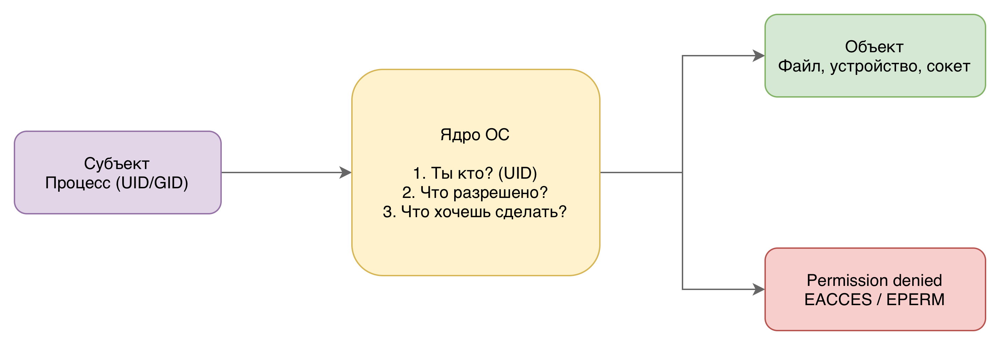

# Управление файлами, правами, пользователями, группами

### Зачем операционная система управляет доступом

В системе без разграничения доступа любой процесс вправе читать и записывать произвольные файлы, а любой пользователь —
воздействовать на данные другого. Это порождает четыре категории проблем:

- **Ошибки с необратимыми последствиями** – опечатка в пути или баг в программе уничтожает системные файлы, и ничто не
  мешает этому произойти.
- **Компрометация через одно приложение** – если браузер или редактор имеет доступ ко всей файловой системе,
  единственная уязвимость в нём даёт атакующему полный контроль над машиной.
- **Невозможность многопользовательской работы** – без изоляции любой пользователь читает файлы и пароли остальных.
- **Взаимное влияние процессов** – один процесс может непреднамеренно повредить данные, которые читает другой.

#### Субъекты и объекты

При каждом обращении к ресурсу ядро оперирует двумя понятиями.

**Субъект** — процесс, инициирующий запрос. Не пользователь напрямую, а именно процесс, выполняющийся от его имени.
Когда пользователь открывает файл в текстовом редакторе — запрос к файловой системе исходит от процесса редактора с
унаследованным идентификатором пользователя.

**Объект** — ресурс, к которому запрашивается доступ. В UNIX-подобных системах действует принцип «всё есть файл»:

| Тип объекта              | Примеры                             |
|--------------------------|-------------------------------------|
| Обычные файлы и каталоги | `/home/user/doc.txt`, `/etc/passwd` |
| Устройства               | `/dev/sda`, `/dev/null`             |
| Сокеты и каналы          | именованные FIFO, Unix-сокеты       |
| Псевдофайлы ядра         | `/proc/1/status`, `/sys/class/net`  |

Единая модель доступа распространяется на все перечисленные типы — не только на обычные файлы.

1. **Ты кто?** – под каким UID/GID выполняется процесс.
2. **Что тебе разрешено?** – сопоставление идентификаторов с метаданными объекта.
3. **Что ты хочешь сделать?** – конкретная операция: чтение, запись, выполнение.

Если ответы согласованы – доступ предоставляется. Иначе ядро возвращает `EACCES` или `EPERM`, что на уровне оболочки
отображается как `Permission denied`.



#### Модели управления доступом

В UNIX-подобных системах исторически применяется **DAC (Discretionary Access Control)** – владелец ресурса
самостоятельно решает, кому и что разрешить. Операционная система исполняет это решение, но не навязывает политику.

| Модель   | Кто устанавливает права                  | Пример                    |
|----------|------------------------------------------|---------------------------|
| **DAC**  | Владелец ресурса                         | POSIX-права в Linux/macOS |
| **MAC**  | Администратор, централизованная политика | SELinux, AppArmor         |
| **RBAC** | Роли, назначаемые администратором        | Корпоративные LDAP, СУБД  |

**Особенности macOS.** DAC является основой, однако Apple добавила два дополнительных слоя поверх него:

- **TCC (Transparency, Consent, and Control)** – запрос разрешения при каждом обращении приложения к камере, микрофону,
  папке «Загрузки» и т.д. По механизму ближе к MAC, чем к DAC.
- **SIP (System Integrity Protection)** – защита системных каталогов (`/System`, `/usr`, `/bin`, `/sbin`) даже от
  суперпользователя. Отключается только через Recovery Mode.

**Windows** строит управление доступом на ACL (списках контроля доступа) как основном механизме – без POSIX-битов.

---

## Пользователи

Пользователь в операционной системе — это не человек за клавиатурой, а **идентификатор**, от имени которого выполняются
процессы. Один человек может работать под несколькими учётными записями, а большинство пользователей в системе вообще не
являются людьми — это сервисы и демоны.

#### Идентификатор пользователя (UID)

Ядро оперирует не именами, а числовыми идентификаторами. Имя пользователя (`bandik`, `www-data`, `root`) — это удобный
псевдоним для человека, который разрешается в UID при входе в систему. Все проверки прав внутри ядра выполняются
исключительно по UID.

Диапазоны UID (Linux, типичные значения):

| Диапазон | Тип                    | Примеры                         |
|----------|------------------------|---------------------------------|
| 0        | Суперпользователь root | `root`                          |
| 1–999    | Системные пользователи | `www-data`, `nginx`, `postgres` |
| 1000+    | Обычные пользователи   | `bandik`, `student`             |

На macOS обычные пользователи начинаются с UID 501, системные — с 200. Конкретные границы диапазонов определяются
дистрибутивом, но принцип деления универсален.

#### Системные пользователи

Системные пользователи создаются не для интерактивной работы, а для изоляции сервисов. Веб-сервер `nginx` выполняется от
имени пользователя `www-data` — это значит, что даже при компрометации сервиса атакующий получает лишь права `www-data`,
а не права администратора.

```bash
# Посмотреть, от какого пользователя запущен процесс
ps aux | grep nginx
```

#### Файл /etc/passwd

Соответствие имён пользователей и UID хранится в файле `/etc/passwd`. Несмотря на название, пароли там давно не
хранятся — они вынесены в `/etc/shadow`.

```bash
cat /etc/passwd
```

Каждая строка содержит семь полей, разделённых двоеточием:

```
bandik:x:1000:1000:Bandik:/home/bandik:/bin/bash
  │    │  │    │     │          │           └─ Оболочка по умолчанию
  │    │  │    │     │          └─ Домашний каталог
  │    │  │    │     └─ Полное имя (GECOS)
  │    │  │    └─ GID основной группы
  │    │  └─ UID
  │    └─ Пароль (x = хранится в /etc/shadow)
  └─ Имя пользователя
```

Посмотреть информацию о конкретном пользователе:

```bash
id bandik

# Только UID текущего пользователя
id -u

# Получить запись из /etc/passwd
getent passwd bandik
```

#### Управление пользователями

```bash
# Linux — создать пользователя
sudo useradd -m -s /bin/bash bandik

# Linux — задать пароль
sudo passwd bandik

# Linux — удалить пользователя вместе с домашним каталогом
sudo userdel -r bandik

# macOS — пользователи управляются через System Settings
# или через dscl в терминале
sudo dscl . -create /Users/bandik
sudo dscl . -passwd /Users/bandik password123
```

---

## Группы пользователей

Группы решают задачу совместного доступа к ресурсам без дублирования прав. Вместо того чтобы давать каждому пользователю
индивидуальные права на каждый файл, администратор создаёт группу, назначает ей доступ и просто добавляет нужных
пользователей.

#### Идентификатор группы (GID)

Так же как пользователь идентифицируется по UID, группа идентифицируется по числовому **GID**. Ядро оперирует GID при
проверке прав — имя группы используется только для удобства.

Каждый пользователь состоит в двух типах групп:

| Тип           | Количество     | Назначение                         |
|---------------|----------------|------------------------------------|
| **Первичная** | Ровно одна     | GID по умолчанию для новых файлов  |
| **Вторичные** | Ноль или более | Расширение прав доступа к ресурсам |

При создании файла он автоматически получает GID первичной группы владельца. Вторичные группы влияют только на проверку
прав — не на владение создаваемыми файлами.

#### Файл /etc/group

Информация о группах хранится в `/etc/group`. Структура строки:

```
docker:x:998:bandik,mvodya
  │    │  │    └─ Список пользователей группы (вторичных членов)
  │    │  └─ GID
  │    └─ Пароль группы (практически не используется)
  └─ Имя группы
```

```bash
# Посмотреть все группы пользователя
groups bandik

# То же самое с GID
id bandik

# Посмотреть конкретную группу
getent group docker
```

На macOS команды `groups` и `id` работают идентично. Вместо `/etc/group` система использует DirectoryService, но
`getent` и прямое чтение файла также доступны.

#### Типичные системные группы

| Группа           | Назначение                           |
|------------------|--------------------------------------|
| `sudo` / `wheel` | Право выполнять команды через `sudo` |
| `docker`         | Управление Docker без `sudo`         |
| `audio`          | Доступ к звуковым устройствам        |
| `www-data`       | Файлы веб-сервера                    |
| `staff`          | macOS: доступ к `/usr/local`         |

#### Управление группами

```bash
# Linux — создать группу
sudo groupadd developers

# Добавить пользователя в группу (вторичную)
sudo usermod -aG developers arkady
# Флаг -a (append) обязателен — без него список вторичных групп перезапишется

# Удалить пользователя из группы
sudo gpasswd -d arkady developers

# Изменить первичную группу (на время сессии)
newgrp developers

# macOS — добавить пользователя в группу
sudo dseditgroup -o edit -a arkady -t user developers
```

> **Важно:** изменения членства в группах вступают в силу только при следующем входе в систему. Если добавить
> пользователя в группу в текущей сессии — команда `id` ещё не покажет новую группу. Чтобы применить изменения без
> выхода,
> можно выполнить `newgrp <группа>` или открыть новую сессию через `su - bandik`.

---

## Владение файлами и каталогами

Каждый файл и каталог в UNIX-подобных системах имеет двух «владельцев»: конкретного пользователя и группу. Эта пара
вместе с битами прав определяет, кто и что может делать с объектом.

#### Три категории доступа

Система разделяет всех, кто обращается к файлу, на три категории:

| Категория | Кто входит                                   |
|-----------|----------------------------------------------|
| **user**  | Владелец файла (один конкретный UID)         |
| **group** | Любой пользователь, состоящий в группе файла |
| **other** | Все остальные — не владелец и не в группе    |

Проверка идёт строго по порядку: сначала ядро сравнивает UID процесса с владельцем файла, затем — GID процесса с группой
файла, и только если оба не совпали — применяет права `other`. **Первое совпадение применяется целиком** — дальнейшие
категории не проверяются.

Из этого следует нетривиальный момент: если владелец файла дал группе больше прав, чем себе — он сам получит меньше
прав, чем члены группы, потому что для него сработает категория `user`.

#### Как устанавливается владелец при создании файла

При создании файла ядро автоматически назначает:

- **UID** — эффективный UID процесса, создавшего файл
- **GID** — эффективный GID процесса (первичная группа пользователя)

```bash
touch report.txt

ls -l report.txt
# -rw-r--r-- 1 bandik dev 0 Apr 23 10:00 report.txt
#              └────┘ └─┘
#              user  group
```

#### Просмотр владельца

```bash
# Подробный вывод с владельцем и группой
ls -l /home/bandik/

# Рекурсивно по каталогу
ls -lR /home/bandik/

# Только владелец и группа (через stat)
# Linux:
stat -c "%U %G" report.txt

# macOS:
stat -f "%Su %Sg" report.txt
```

#### Смена владельца: chown и chgrp

```bash
# Сменить владельца файла (только root)
sudo chown ivan report.txt

# Сменить владельца и группу одновременно
sudo chown bandik:developers report.txt

# Сменить только группу
sudo chgrp developers report.txt
# Или через chown:
sudo chown :developers report.txt

# Рекурсивно для каталога
sudo chown -R bandik:developers /srv/project/
```

> Обычный пользователь может сменить группу файла только на одну из своих вторичных групп. Сменить владельца на другого
> пользователя — только root.

---

## Права доступа POSIX

Права доступа POSIX — это стандартный механизм, унаследованный всеми UNIX-подобными системами: Linux, macOS, BSD. Он
определяет, какие операции разрешены над файлом или каталогом для каждой из трёх категорий: владелец, группа, остальные.

#### Биты прав

Каждая категория получает три бита: `r` (read), `w` (write), `x` (execute). Присутствие бита означает разрешение,
отсутствие — запрет (`-`).

| Бит     | Значение   | На файл                      | На каталог                         |
|---------|------------|------------------------------|------------------------------------|
| `r` (4) | чтение     | читать содержимое файла      | просматривать список файлов (`ls`) |
| `w` (2) | запись     | изменять содержимое файла    | создавать и удалять файлы внутри   |
| `x` (1) | выполнение | запускать файл как программу | входить в каталог (`cd`)           |

> Права на каталог работают иначе, чем на файл. Бит `x` на каталоге — это не запуск, а право войти в него. Без `x` на
> каталог нельзя ни перейти в него, ни обратиться к файлам внутри, даже если на сами файлы права есть.

#### Числовое и символьное представление

Каждый из трёх битов имеет числовой вес: `r=4`, `w=2`, `x=1`. Права для одной категории — это сумма весов активных
битов. Три категории дают трёхзначное число.

| Символьный вид | Числовой вид | Расшифровка                     |
|----------------|--------------|---------------------------------|
| `rwxrwxrwx`    | 777          | все права всем                  |
| `rwxr-xr-x`    | 755          | стандарт для исполняемых файлов |
| `rw-r--r--`    | 644          | стандарт для обычных файлов     |
| `rwx------`    | 700          | только владелец имеет все права |
| `r--------`    | 400          | только чтение для владельца     |

#### Просмотр прав

```bash
# Просмотр прав файлов в каталоге
ls -l /home/bandik/

# Подробная информация о конкретном файле
# Linux:
stat script.sh

# macOS:
stat -x script.sh
```

#### Изменение прав: chmod

```bash
# Числовой способ — задать права явно
chmod 755 script.sh      # rwxr-xr-x
chmod 644 report.txt     # rw-r--r--
chmod 700 secret.txt     # rwx------

# Символьный способ — добавить или убрать конкретный бит
chmod u+x script.sh      # добавить x владельцу
chmod g-w report.txt     # убрать w у группы
chmod o-r secret.txt     # убрать r у остальных
chmod a+r public.txt     # добавить r всем (a = all)

# Рекурсивно для каталога
chmod -R 755 /srv/project/

# Linux и macOS: синтаксис chmod идентичен
```

#### Типичные права и их практический смысл

| Ситуация                      | Права       | Команда                |
|-------------------------------|-------------|------------------------|
| Скрипт для запуска владельцем | `rwx------` | `chmod 700 deploy.sh`  |
| Конфиг с паролями             | `rw-------` | `chmod 600 .env`       |
| Публичный веб-контент         | `rw-r--r--` | `chmod 644 index.html` |
| Общий каталог команды         | `rwxrwx---` | `chmod 770 /srv/team/` |
| Исполняемый файл              | `rwxr-xr-x` | `chmod 755 app`        |

---

## Расширенные механизмы доступа

Классических битов `rwx` достаточно для большинства задач, но в ряде ситуаций они не справляются. POSIX определяет три
специальных бита, а для более гибкого управления существуют ACL. Для систем с высокими требованиями безопасности
применяется MAC.

#### SUID, SGID, Sticky bit

**SUID (Set User ID)** — при запуске файла процесс получает не UID запустившего пользователя, а UID владельца файла.
Классический пример — `/usr/bin/passwd`: обычный пользователь не имеет прав на запись в `/etc/shadow`, но `passwd`
выполняется с правами `root` именно благодаря SUID.

```bash
# Проверить SUID на passwd
ls -l /usr/bin/passwd

# Установить SUID
sudo chmod u+s /usr/bin/myapp
# или числом (4 в старшей позиции):
sudo chmod 4755 /usr/bin/myapp

# Найти все SUID-файлы в системе
find / -perm -4000 -type f 2>/dev/null
```

**SGID (Set Group ID)** — на файле работает аналогично SUID, но для группы. На каталоге имеет другой смысл: все новые
файлы, созданные внутри, наследуют группу каталога, а не первичную группу создателя. Удобно для общих рабочих каталогов
команды.

```bash
# Установить SGID на каталог
sudo chmod g+s /srv/team/
# или числом:
sudo chmod 2775 /srv/team/

ls -l /srv/

# Теперь все файлы в /srv/team/ получат группу dev
touch /srv/team/report.txt
ls -l /srv/team/report.txt
```

**Sticky bit** — на каталоге с правами записи для всех (например, `/tmp`) любой пользователь может создавать файлы, но
удалить или переименовать файл может только его владелец или `root`. Без sticky bit любой пользователь с правом `w` на
каталог мог бы удалить чужие файлы.

```bash
ls -ld /tmp

# Установить sticky bit
sudo chmod +t /shared/uploads/
# или числом:
sudo chmod 1777 /shared/uploads/
```

#### ACL — списки контроля доступа

Классическая модель `user/group/other` ограничена: нельзя дать права конкретному второму пользователю, не меняя группу.
ACL решают эту задачу — они позволяют задать права для произвольного количества пользователей и групп.

```bash
# Просмотр ACL файла
# Linux:
getfacl report.txt

# macOS:
ls -le report.txt

# Добавить право чтения для пользователя ivan
# Linux:
setfacl -m u:ivan:r report.txt

# Добавить право чтения для группы interns
setfacl -m g:interns:r report.txt

# Удалить ACL-запись для ivan
setfacl -x u:ivan report.txt

# Удалить все ACL
setfacl -b report.txt

# macOS — добавить ACL-запись
chmod +a "ivan allow read" report.txt
```

Наличие ACL на файле обозначается знаком `+` в выводе `ls -l`:

```bash
ls -l report.txt
```

#### MAC: SELinux и AppArmor

В отличие от DAC, где владелец сам управляет правами, **MAC (Mandatory Access Control)** применяет централизованную
политику, которую не может обойти ни один пользователь, включая `root`. Используется в системах с высокими требованиями
к безопасности.

|                     | SELinux                | AppArmor             |
|---------------------|------------------------|----------------------|
| Подход              | метки на всех объектах | профили для программ |
| Дистрибутивы        | RHEL, Fedora, CentOS   | Ubuntu, Debian       |
| Сложность настройки | высокая                | средняя              |
| macOS аналог        | TCC + SIP              | –                    |

```bash
# SELinux — проверить статус
sestatus
getenforce        # Enforcing / Permissive / Disabled

# Просмотр метки SELinux на файле
ls -Z /etc/passwd
# system_u:object_r:passwd_file_t:s0 /etc/passwd

# AppArmor — статус профилей
sudo aa-status

# macOS — SIP (System Integrity Protection)
csrutil status
# System Integrity Protection status: enabled
```

#### Windows: ACL как основа

В Windows нет POSIX-битов — вместо них с самого начала используются **DACL (Discretionary ACL)**. Каждый файл имеет
список записей ACE (Access Control Entry), каждая из которых явно разрешает или запрещает конкретную операцию
конкретному субъекту. Это мощнее классической POSIX-модели, но значительно сложнее в администрировании.

---

## Права и процессы

Когда пользователь запускает программу, операционная система не передаёт процессу «личность» пользователя напрямую — она
присваивает процессу набор идентификаторов, по которым ядро впоследствии принимает все решения о доступе.

#### Идентификаторы процесса

Каждый процесс в системе имеет два ключевых идентификатора пользователя и два — группы:

| Идентификатор            | Назначение                                                 |
|--------------------------|------------------------------------------------------------|
| `rUID` (реальный UID)    | Кто запустил процесс. Используется для аудита и сигналов.  |
| `eUID` (эффективный UID) | От чьего имени проверяются права. Именно его смотрит ядро. |
| `rGID` (реальный GID)    | Первичная группа пользователя, запустившего процесс.       |
| `eGID` (эффективный GID) | Группа, используемая при проверке прав.                    |

При обычном запуске `rUID == eUID`. При запуске SUID-файла `eUID` меняется на UID владельца файла, а `rUID` остаётся
исходным — именно так `passwd` получает права `root`, оставаясь запущенным от имени `bandik`.

```bash
# Посмотреть идентификаторы текущего процесса
id

# Посмотреть идентификаторы конкретного процесса
cat /proc/$$/status | grep -E "^(Uid|Gid)"

# macOS — аналогично через ps
ps -o user,uid,ruid -p $$
```

#### Наследование прав

Процесс наследует идентификаторы от родителя через `fork()`. Когда оболочка запускает команду, дочерний процесс получает
те же UID/GID, что и оболочка — то есть права пользователя, работающего в сессии.

```
bandik (UID=1000)
    └── bash (rUID=1000, eUID=1000)
            ├── ls (rUID=1000, eUID=1000)     <- обычный запуск
            ├── cat (rUID=1000, eUID=1000)    <- обычный запуск
            └── passwd (rUID=1000, eUID=0)   <- SUID, eUID меняется на root
```

#### Ограничения процесса правами пользователя

Процесс не может выйти за пределы прав своего eUID. Это означает:

- Процесс не может читать файл, если у его eUID нет права `r` на этот файл.
- Процесс не может записать в файл без права `w`.
- Процесс не может открыть порт ниже 1024 без прав `root` или специальной capability.
- Процесс не может послать сигнал другому процессу, если eUID не совпадает с rUID/eUID цели (или не является `root`).

```bash
# Пример: попытка читать файл без прав
ls -l /etc/shadow

cat /etc/shadow
# cat: /etc/shadow: Permission denied

# Процесс passwd (eUID=0) может читать /etc/shadow
# именно потому что eUID=0 (root)

# Посмотреть права конкретного процесса по PID
# Linux:
cat /proc/1234/status | grep -E "^(Uid|Gid|Groups)"

# macOS:
ps -o uid,gid,user -p 1234
```

#### Смена eUID внутри программы

Программа, запущенная с SUID, может сбросить привилегии после выполнения привилегированной операции — это называется
principle of least privilege в действии.

```c
// Пример на C: сброс привилегий после открытия сокета
int sock = socket(...);       // требует eUID=0
bind(sock, ...);              // порт < 1024, нужен root

// Сбрасываем привилегии — дальше работаем как bandik
setuid(1000);
// Теперь eUID=1000, даже если процесс был запущен как root
```

Именно так работают веб-серверы: запускаются от `root` для привязки к порту 80, затем немедленно сбрасывают привилегии
до `www-data`.

---

## Привилегии и повышение прав

`root` — это не просто «администратор». Это пользователь с UID=0, для которого большинство проверок прав в ядре попросту
не выполняются. Именно поэтому постоянная работа под `root` опасна: одна ошибка или вредоносная программа получает
неограниченный контроль над системой.

#### root и суперпользователь

Особый статус `root` в системе:

- Может читать и записывать любой файл вне зависимости от прав.
- Может отправлять сигналы любому процессу.
- Может монтировать файловые системы, загружать модули ядра, менять сетевые настройки.
- Может менять UID/GID любого процесса.
- Привязывать сервисы к портам ниже 1024.

```bash
# Убедиться, что работаешь не под root
whoami

# Никогда не делать так для повседневной работы:
sudo su -    # открывает полную root-сессию
```

#### su и sudo: в чём разница

`su` (switch user) открывает новую оболочку от имени другого пользователя. Для входа в `root` требует знания пароля
`root`.

`sudo` (superuser do) выполняет одну команду с повышенными привилегиями, при этом сессия остаётся под исходным
пользователем. Требует пароль самого пользователя, а не `root`.

|                  | `su`                          | `sudo`                          |
|------------------|-------------------------------|---------------------------------|
| Аутентификация   | пароль целевого пользователя  | пароль текущего пользователя    |
| Область действия | вся сессия                    | одна команда                    |
| Логирование      | не логирует действия в сессии | логирует каждую команду         |
| Настройка прав   | нет (всё или ничего)          | гранулярно через `/etc/sudoers` |
| Рекомендуется    | редко                         | да                              |

```bash
# sudo — запустить одну команду от root
sudo apt update
sudo systemctl restart nginx

# sudo — открыть оболочку от root (нежелательно, но возможно)
sudo -i      # login shell
sudo -s      # non-login shell

# sudo — выполнить команду от имени другого пользователя
sudo -u www-data ls /var/www/

# su — переключиться на root (требует пароль root)
su -

# su — переключиться на другого пользователя
su - ivan

# macOS: sudo работает идентично Linux
# su также доступен, но используется реже
```

#### Настройка sudo: файл sudoers

Кто и что может выполнять через `sudo` — определяется в `/etc/sudoers`. Редактировать его следует только через `visudo`,
которая проверяет синтаксис перед сохранением.

```bash
sudo visudo
```

Синтаксис записей:

```
# Формат: кто  откуда=(от_чьего_имени)  команды
bandik  ALL=(ALL:ALL) ALL          # полный sudo (не рекомендуется)
bandik  ALL=(ALL) /usr/bin/apt     # только apt
bandik  ALL=(ALL) NOPASSWD: /usr/bin/systemctl restart nginx  # без пароля
%sudo   ALL=(ALL:ALL) ALL          # вся группа sudo
```

```bash
# Проверить, какие команды разрешены текущему пользователю
sudo -l
```

#### Linux Capabilities: гранулярные привилегии

До появления capabilities существовал только бинарный выбор: обычный пользователь или `root`. Capabilities разбивают
привилегии `root` на отдельные независимые полномочия, которые можно выдавать процессам точечно.

| Capability             | Что разрешает                     |
|------------------------|-----------------------------------|
| `CAP_NET_BIND_SERVICE` | привязка к портам < 1024          |
| `CAP_NET_ADMIN`        | настройка сетевых интерфейсов     |
| `CAP_SYS_TIME`         | изменение системного времени      |
| `CAP_KILL`             | отправка сигналов чужим процессам |
| `CAP_DAC_OVERRIDE`     | обход проверки прав на файлы      |

```bash
# Посмотреть capabilities исполняемого файла
getcap /usr/bin/ping

# Выдать capability файлу (вместо SUID)
sudo setcap cap_net_bind_service=ep /usr/local/bin/myserver

# Посмотреть capabilities процесса
cat /proc/$$/status | grep Cap

# Инструмент для декодирования capabilities
capsh --decode=0000000000003000

# macOS: capabilities в Linux-смысле отсутствуют,
# роль аналогичного механизма выполняет TCC и entitlements
```

#### Принцип минимальных привилегий

Ключевой принцип безопасности: процесс, пользователь или сервис должны иметь ровно те права, которые необходимы для
выполнения их задачи, — не больше.

На практике это означает:

- Сервисы запускаются от выделенных системных пользователей (`nginx`, `postgres`), а не от `root`.
- Вместо SUID по возможности используются capabilities.
- Вместо полного `sudo ALL` — точечные разрешения на конкретные команды.
- Приложениям выдаётся доступ только к тем каталогам, которые им нужны.

```bash
# Плохо: сервис запущен от root
ps aux | grep myapp

# Хорошо: создать выделенного пользователя и запустить от него
sudo useradd -r -s /usr/sbin/nologin myapp
sudo -u myapp ./myapp
```

---

## Типичные проблемы и диагностика

`Permission denied` — одна из самых частых ошибок при работе с файловой системой. Причины бывают неочевидными: иногда права на сам файл выставлены корректно, но проблема скрыта в родительском каталоге, группе или ACL. Разберём диагностику по шагам.

#### Шаг 1: выяснить, кто выполняет команду

```bash
# Текущий пользователь и все его группы
id

whoami

# Если только что добавили в группу — группа ещё не активна
# Нужно либо перелогиниться, либо:
newgrp docker
```

#### Шаг 2: проверить права и владельца файла

```bash
# Права, владелец, группа
ls -la /srv/project/config.yml
# bandik не root и не в группе dev -> попадает в other -> нет прав

# Подробно через stat
# Linux:
stat /srv/project/config.yml

# macOS:
stat -x /srv/project/config.yml
```

#### Шаг 3: проверить права на родительские каталоги

Частая ловушка: права на файл выставлены верно, но на один из родительских каталогов нет бита `x` — войти в него
невозможно.

```bash
# Проверить всю цепочку каталогов
ls -la /srv/
ls -la /srv/project/

# Или одной командой — пройти по цепочке
namei -l /srv/project/config.yml
```

#### Шаг 4: проверить ACL

Если права выглядят корректно, но отказ всё равно происходит — возможно, ACL переопределяет разрешения.

```bash
# Linux:
getfacl /srv/project/config.yml

# Наличие + в конце строки ls -l означает ACL:
ls -la config.yml

# macOS:
ls -le config.yml
```

#### Шаг 5: проверить SELinux или AppArmor

Если всё вышеперечисленное в порядке, а отказ сохраняется — причина может быть в MAC.

```bash
# SELinux — проверить, не блокирует ли он доступ
# Linux (RHEL/Fedora):
getenforce

# Посмотреть последние отказы SELinux
sudo ausearch -m avc -ts recent
sudo journalctl | grep "avc: denied"

# Временно перевести в мягкий режим для диагностики
sudo setenforce 0   # Permissive (только логирует, не блокирует)
# После диагностики вернуть:
sudo setenforce 1

# AppArmor (Ubuntu/Debian):
sudo aa-status
sudo journalctl | grep apparmor
```

#### Типичные ошибки при настройке прав

| Ошибка                                     | Последствие                                         | Исправление                                 |
|--------------------------------------------|-----------------------------------------------------|---------------------------------------------|
| `chmod 777` на всё подряд                  | любой пользователь может изменить или удалить файлы | использовать минимально необходимые права   |
| Нет бита `x` на каталог                    | нельзя войти в каталог даже с `r`                   | `chmod u+x dir/`                            |
| Сервис запущен от `root`                   | компрометация сервиса = компрометация системы       | создать отдельного пользователя для сервиса |
| Забыли флаг `-a` в `usermod -aG`           | старые группы пользователя перезаписаны             | `sudo usermod -aG group bandik`             |
| Права выставлены, но группа не применилась | пользователь не перелогинился                       | `newgrp group` или новая сессия             |
| SUID на скрипт                             | в Linux SUID на скрипты игнорируется ядром          | использовать wrapper-бинарник               |

#### Уязвимости из-за неправильных прав: реальные примеры

**World-writable файлы конфигурации.** Если конфиг сервиса доступен на запись всем (`chmod 666`), любой пользователь
системы может изменить поведение сервиса — вплоть до выполнения произвольного кода.

```bash
# Найти world-writable файлы (потенциально опасные)
find /etc -perm -o+w -type f 2>/dev/null

# Найти SUID-файлы (стоит знать, что есть в системе)
find / -perm -4000 -type f 2>/dev/null
```

**CVE-2021-4034 (PwnKit)** — уязвимость в `pkexec` (SUID-бинарник из пакета PolicyKit). Из-за некорректной обработки
аргументов командной строки любой локальный пользователь мог повысить привилегии до `root`. Затрагивала все дистрибутивы
Linux с 2009 года.

**CVE-2019-14287 (sudo)** — при определённой конфигурации `sudoers` (`bandik ALL=(ALL) !/bin/bash`) пользователь мог
обойти запрет, передав UID `-1` (`sudo -u#-1 /bin/bash`). Ядро интерпретировало `-1` как `0` (root).

Оба примера показывают: даже при правильно выставленных правах на файлы уязвимость в SUID-программе или в логике `sudo`
может обнулить всю модель безопасности. Именно поэтому принцип минимальных привилегий применяется не только к правам на
файлы, но и к тому, каким программам вообще выдаётся SUID или доступ через `sudo`.
