# Сетевые возможности операционной системы

## Зачем разработчику знать сети

Практически любое приложение работает в сети:

- веб-сервис отвечает на HTTP-запросы
- мобильное приложение ходит за данными на API
- микросервисы общаются между собой
- база данных живёт на отдельном хосте
- CI/CD тянет артефакты из интернета

Сеть – это не «отдельная дисциплина», это среда, в которой живёт код.

---

## Ключевые понятия

**Компьютерная сеть** – инфраструктура, позволяющая устройствам обмениваться данными.

| Термин          | Что это                                                |
|-----------------|--------------------------------------------------------|
| **Узел (node)** | Любое устройство в сети (ПК, телефон, принтер, роутер) |
| **Хост (host)** | Узел с уникальным сетевым адресом                      |
| **Клиент**      | Хост, который запрашивает ресурс                       |
| **Сервер**      | Хост, который предоставляет ресурс                     |
| **Протокол**    | Набор правил обмена данными между устройствами         |
| **Пакет**       | Небольшой блок данных – единица передачи в сети        |

---

## Как данные попадают из точки А в точку Б

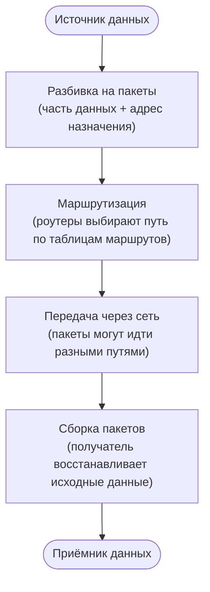

---

## Типы сетей

| Тип          | Расшифровка        | Масштаб        | Пример                         |
|--------------|--------------------|----------------|--------------------------------|
| **LAN**      | Local Area Network | Здание, офис   | Сеть в аудитории               |
| **WAN**      | Wide Area Network  | Города, страны | Корпоративная сеть филиалов    |
| **Internet** | —                  | Весь мир       | То, чем пользуемся каждый день |

---

## Топологии сетей

Топология – физическая или логическая схема соединения узлов.

| Топология  | Суть                              | Плюсы                            | Минусы                               |
|------------|-----------------------------------|----------------------------------|--------------------------------------|
| **Звезда** | Все узлы → центральный коммутатор | Надёжность, простота диагностики | Если упал центр – упала вся сеть     |
| **Шина**   | Все узлы на одном кабеле          | Просто, дёшево                   | Низкая надёжность, один разрыв – всё |
| **Кольцо** | Узлы в цепочке по кругу           | Резервирование                   | Сложнее в настройке                  |
| **Дерево** | Иерархия звёзд                    | Масштабируемость                 | Зависит от ключевых узлов            |

### Звезда

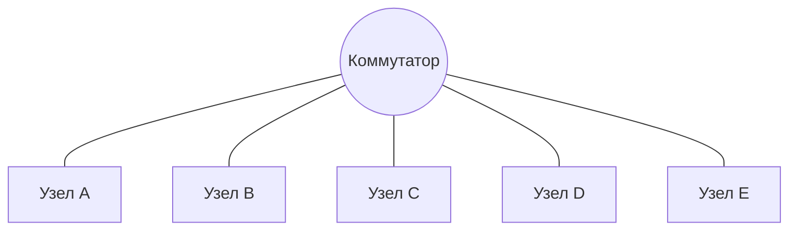

### Шина

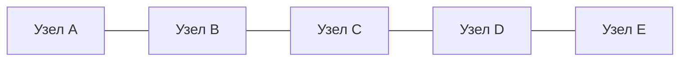

### Кольцо

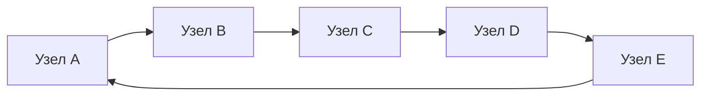

### Дерево

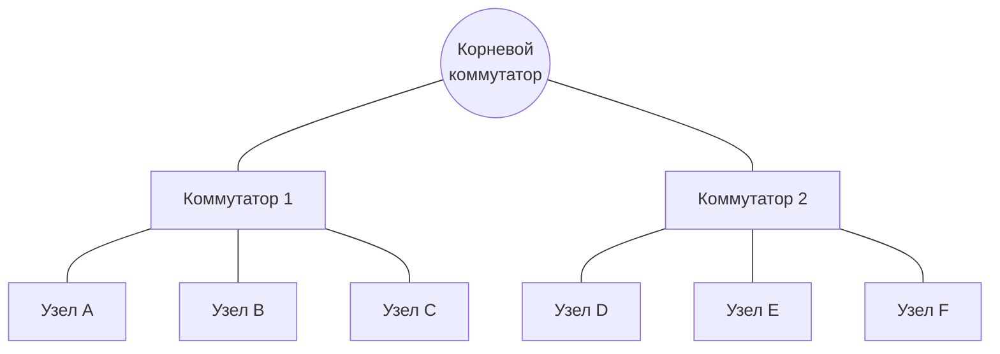

> Современные сети – почти всегда **дерево** (иерархическая звезда).

---

## MAC-адрес и IP-адрес

Это два разных уровня адресации, и оба нужны одновременно.

### MAC-адрес

- **Физический** адрес сетевой карты
- Присваивается производителем, зашит в «железо»
- Формат: `00:1A:2B:3C:4D:5E` (6 байт, hex)
- Уникален в рамках **локальной** сети
- Используется для доставки внутри одного сегмента LAN

### IP-адрес

- **Логический** адрес, настраивается программно
- Используется для маршрутизации **между** сетями
- IPv4: `192.168.1.42` (4 байта, 0–255 каждый)
- IPv6: `2001:0db8:85a3::8a2e:0370:7334` (16 байт)

---

## Структура IPv4-адреса

IP-адрес состоит из двух частей:

```
192 . 168 . 1 . 42
└────────────┘  └──┘
  Сетевая часть    Хостовая часть
  (network)        (host)
```

**Маска подсети** определяет, где граница:

| Маска           | Нотация | Хостов в сети |
|-----------------|---------|---------------|
| `255.255.255.0` | `/24`   | 254           |
| `255.255.0.0`   | `/16`   | 65534         |
| `255.0.0.0`     | `/8`    | ~16 млн       |

**Зарезервированные диапазоны** (приватные сети, не маршрутизируются в интернете):

- `10.0.0.0/8`
- `172.16.0.0/12`
- `192.168.0.0/16`

---

## Модель OSI

Сетевое взаимодействие разбито на **7 уровней**. Каждый уровень решает свою задачу и не знает о деталях соседних.

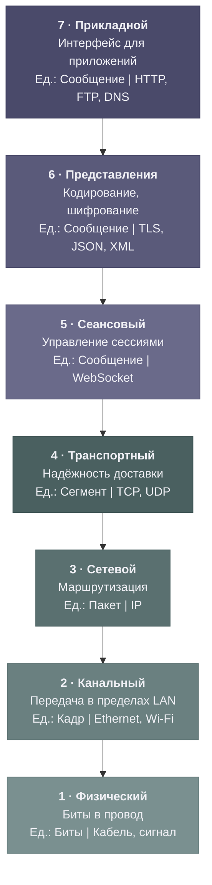

---

## 9. Модель TCP/IP

На практике используют упрощённую модель TCP/IP (4 уровня):

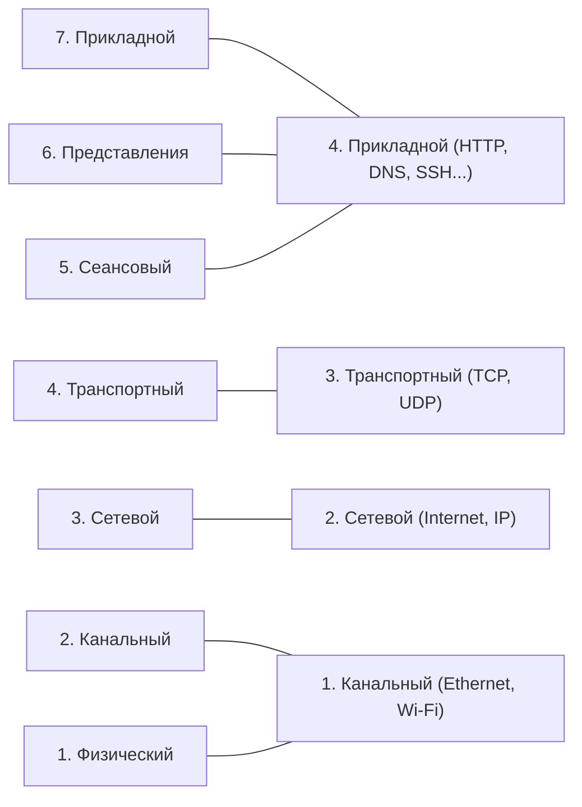

> 💡 **С чем работает разработчик?**
> - Уровень 4 (прикладной TCP/IP) – напрямую: пишет HTTP-запрос, DNS-запрос, WebSocket
> - Уровень 3 (транспортный) – косвенно: выбирает TCP или UDP при работе с сокетами
> - Уровни 1–2 – ОС и «железо» делают сами

---

## Роутер vs Коммутатор

| Устройство                 | Работает на уровне | Решает задачу                     | Использует |
|----------------------------|--------------------|-----------------------------------|------------|
| **Коммутатор (Switch)**    | L2 (канальный)     | Доставка внутри одной сети        | MAC-адрес  |
| **Маршрутизатор (Router)** | L3 (сетевой)       | Передача **между** разными сетями | IP-адрес   |

---

## Порты

IP-адрес доставляет пакет до **устройства**. Порт доставляет его до конкретного **процесса** на этом устройстве.

```
192.168.1.42 : 8080
└────────────┘   └──┘
   IP-адрес      Порт
  «устройство»  «процесс»
```

**Диапазоны портов:**

| Диапазон      | Название   | Кто использует                         |
|---------------|------------|----------------------------------------|
| 0 – 1023      | Well-known | Системные протоколы (требуют root)     |
| 1024 – 49151  | Registered | Приложения (зарегистрированные в IANA) |
| 49152 – 65535 | Dynamic    | Клиентские (временные) соединения      |

**Порты, которые надо знать:**

| Порт  | Протокол              |
|-------|-----------------------|
| 22    | SSH                   |
| 25    | SMTP                  |
| 53    | DNS                   |
| 67/68 | DHCP                  |
| 80    | HTTP                  |
| 443   | HTTPS                 |
| 3306  | MySQL                 |
| 5432  | PostgreSQL            |
| 6379  | Redis                 |
| 8080  | HTTP (альтернативный) |

---

## TCP vs UDP

Оба работают на транспортном уровне (L4). Решают одну задачу по-разному.

### TCP – Transmission Control Protocol

**Надёжный, с установкой соединения.**

Перед передачей данных – трёхстороннее рукопожатие (3-way handshake):

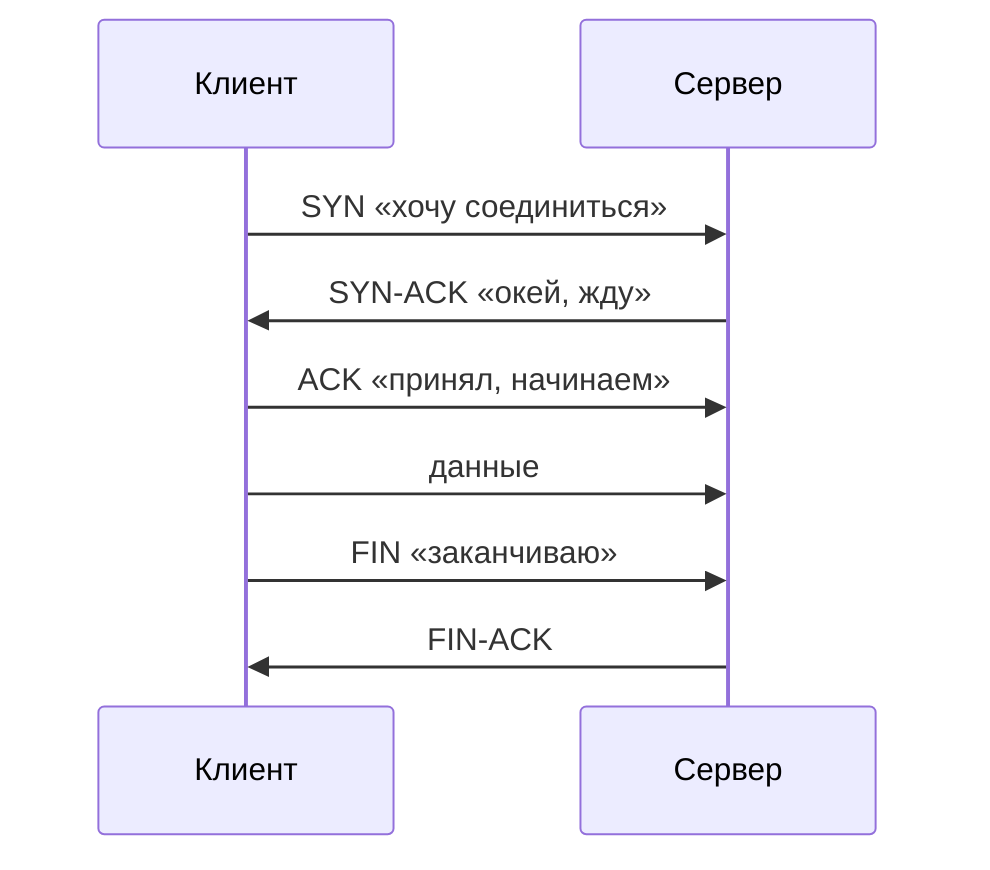

**Что гарантирует TCP:**

- Доставка всех пакетов
- Правильный порядок
- Контроль перегрузки
- Повторная отправка при потере

### UDP – User Datagram Protocol

**Быстрый, без гарантий, без соединения.**

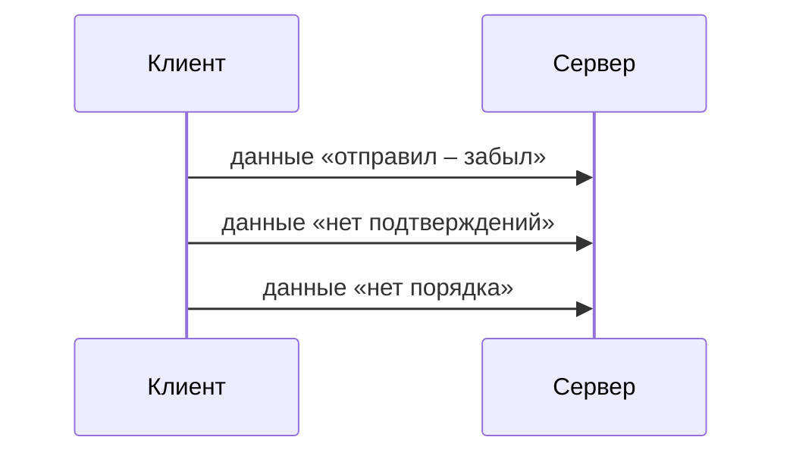

**Что даёт UDP:**

- Минимальная задержка
- Меньше overhead
- Можно broadcast/multicast

### Когда что использовать

| Ситуация                          | Выбор   | Почему                               |
|-----------------------------------|---------|--------------------------------------|
| Веб, API, БД, файлы               | **TCP** | Нужна целостность данных             |
| Видеозвонки, стриминг             | **UDP** | Лучше пропустить кадр, чем тормозить |
| Онлайн-игры (движение)            | **UDP** | Актуальность важнее точности         |
| DNS-запрос                        | **UDP** | Один маленький запрос, быстро        |
| Онлайн-игры (критические события) | **TCP** | Покупка предмета должна дойти        |

> Современные протоколы умеют комбинировать. **QUIC** (основа HTTP/3) построен поверх UDP, но реализует надёжность
> сам – без overhead TCP.

---

## Сокет – абстракция ОС

Сокет – это endpoint соединения. Пара: `IP + порт`.

```
Клиент                              Сервер
192.168.1.10:54231   ══════════   93.184.216.34:443
     └──────────────────────────────────────┘
               Сокет-пара (сессия)
```

В коде сокет – это просто файловый дескриптор. ОС прячет за ним всю сетевую логику.

### Пример на Java

```java
import java.io.*;
import java.net.*;

public class SimpleHttpClient {
    static void main(String[] args) {
        try (Socket socket = new Socket("example.com", 80)) {
            // Отправляем HTTP-запрос
            OutputStream out = socket.getOutputStream();
            out.write("GET / HTTP/1.1\r\nHost: example.com\r\nConnection: close\r\n\r\n".getBytes());
            out.flush();

            // Читаем ответ
            BufferedReader reader = new BufferedReader(new InputStreamReader(socket.getInputStream()));
            String line;
            while ((line = reader.readLine()) != null) {
                System.out.println(line);
            }

        } catch (IOException e) {
            System.err.println("Ошибка при работе с сокетом: " + e.getMessage());
            e.printStackTrace(System.err);
        }
    }
}
```

### Пример на Python

```python
import socket

host = "example.com"
port = 80

# Создаём TCP-сокет
with socket.socket(socket.AF_INET, socket.SOCK_STREAM) as s:
    s.connect((host, port))
    
    # Отправляем HTTP-запрос
    request = "GET / HTTP/1.1\r\nHost: example.com\r\nConnection: close\r\n\r\n"
    s.sendall(request.encode())
    
    # Читаем и выводим ответ
    response = b""
    while True:
        data = s.recv(4096)
        if not data:
            break
        response += data

print(response.decode(errors="replace"))
```

---

## HTTP

**HyperText Transfer Protocol** – текстовый протокол запрос/ответ поверх TCP.

### Запрос

```
GET /api/users/42 HTTP/1.1
Host: example.com
Authorization: Bearer eyJhbGci...
Content-Type: application/json
```

Структура:

```
[МЕТОД] [PATH] [ВЕРСИЯ]
[Заголовки]

[Тело (опционально)]
```

**Методы:**

| Метод  | Семантика                  | Идемпотентный |
|--------|----------------------------|---------------|
| GET    | Получить ресурс            | ✅             |
| POST   | Создать / отправить данные | ❌             |
| PUT    | Заменить ресурс целиком    | ✅             |
| PATCH  | Частично изменить          | ❌             |
| DELETE | Удалить                    | ✅             |

### Ответ

```
HTTP/1.1 200 OK
Content-Type: application/json
Content-Length: 89

{"id": 42, "name": "Bandik", "role": "admin"}
```

**Коды ответов:**

| Диапазон | Смысл          | Примеры                                          |
|----------|----------------|--------------------------------------------------|
| 2xx      | Успех          | 200 OK, 201 Created, 204 No Content              |
| 3xx      | Редирект       | 301 Moved, 302 Found                             |
| 4xx      | Ошибка клиента | 400 Bad Request, 401 Unauthorized, 404 Not Found |
| 5xx      | Ошибка сервера | 500 Internal Server Error, 503 Unavailable       |

### HTTP/1.1 vs HTTP/2 vs HTTP/3

| Версия   | Особенность                                                 |
|----------|-------------------------------------------------------------|
| HTTP/1.1 | Одно соединение – один запрос (keep-alive немного улучшает) |
| HTTP/2   | Мультиплексирование: много запросов в одном TCP-соединении  |
| HTTP/3   | Поверх QUIC/UDP, устойчивее к потерям пакетов               |

---

## HTTPS – HTTP + TLS

**TLS (Transport Layer Security)** – протокол шифрования поверх TCP.

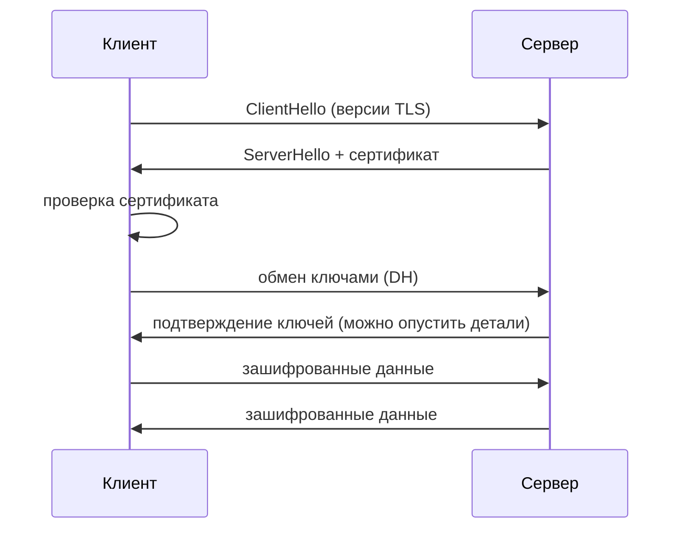

Что даёт TLS:

- **Шифрование** – данные не читаемы посредниками
- **Аутентификация** – сертификат подтверждает, что сервер – это действительно тот сервер
- **Целостность** – данные не изменены в пути

---

## DNS

**Domain Name System** – распределённая система перевода доменных имён в IP-адреса.

### Зачем

Пишем `google.com`, а компьютеру нужен IP. DNS переводит одно в другое.

### Как работает DNS-запрос

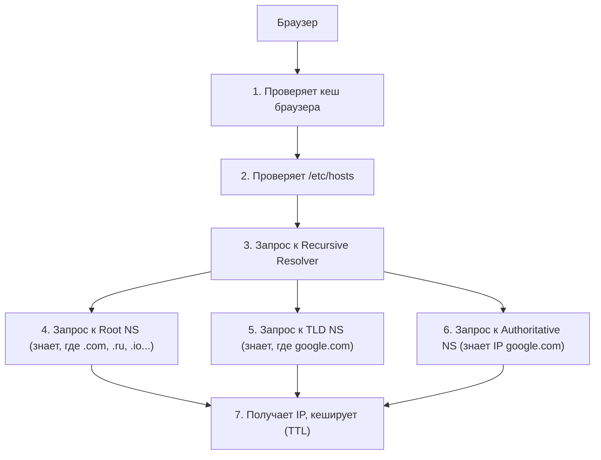

### DNS-записи

| Тип       | Что хранит           | Пример                            |
|-----------|----------------------|-----------------------------------|
| **A**     | Домен → IPv4         | `example.com → 93.184.216.34`     |
| **AAAA**  | Домен → IPv6         | `example.com → 2606:2800:...`     |
| **CNAME** | Алиас → другой домен | `www.example.com → example.com`   |
| **MX**    | Почтовый сервер      | `example.com → mail.example.com`  |
| **TXT**   | Произвольный текст   | SPF, DKIM, подтверждение владения |

### Для разработчика

- `/etc/hosts` имеет **приоритет** над DNS – используй для локальной разработки
- DNS-кеш может мешать при смене IP – `TTL` определяет время жизни записи
- `dig`, `nslookup` – утилиты для диагностики DNS

```bash
dig google.com          # полный ответ
dig +short google.com   # только IP
nslookup google.com     # интерактивно
```

---

## DHCP

**Dynamic Host Configuration Protocol** – протокол автоматической настройки сетевых параметров.

### Что выдаёт DHCP серверу

- IP-адрес
- Маску подсети
- Шлюз по умолчанию (Default Gateway)
- DNS-серверы

### Как работает (DORA)

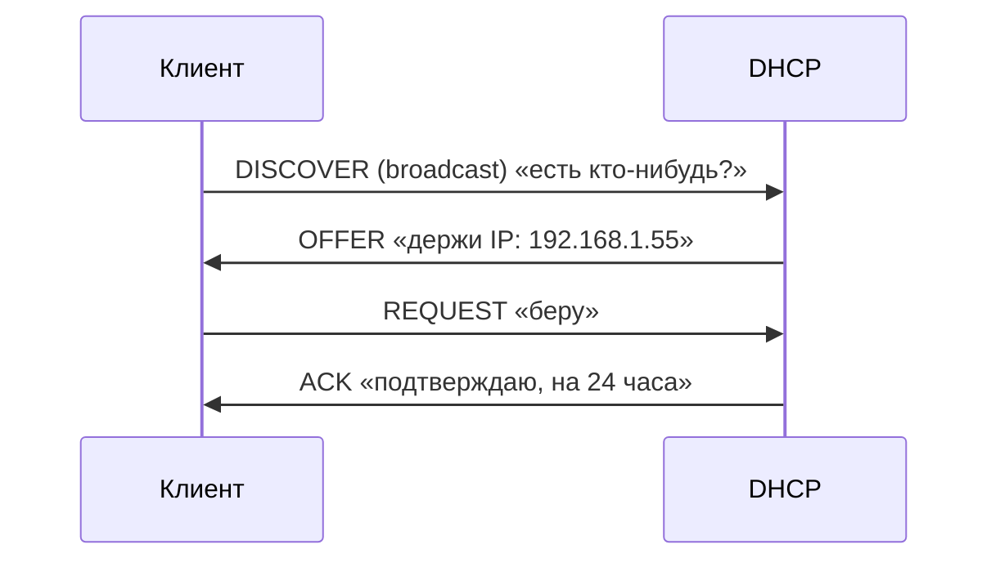

> Если DHCP недоступен – устройство назначает себе адрес из диапазона `169.254.x.x` (APIPA).

---

## WebSocket

HTTP – запрос/ответ, соединение закрывается. WebSocket – **двунаправленный канал** поверх TCP, соединение остаётся
открытым.

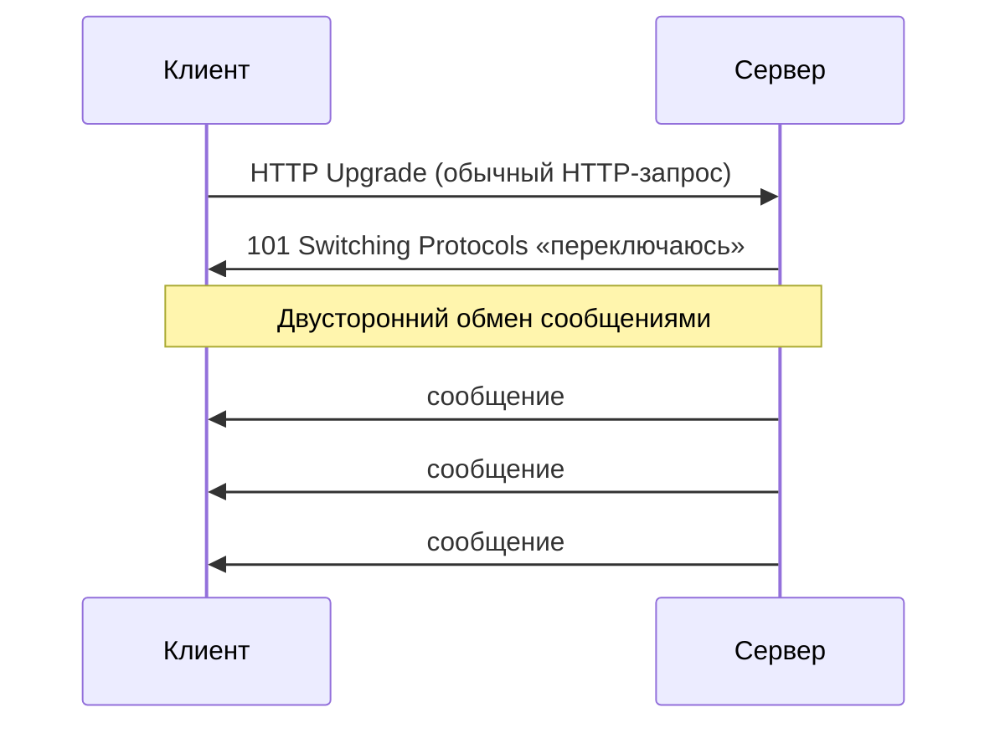

**Когда использовать:**

- Чат, уведомления в реальном времени
- Live-дашборды
- Многопользовательские игры
- Совместное редактирование (Google Docs-подобное)

---

## Сетевые интерфейсы

Сетевой интерфейс – точка подключения устройства к сети. Может быть физическим или виртуальным.

| Интерфейс                | Тип         | Что это                                |
|--------------------------|-------------|----------------------------------------|
| `eth0`, `ens3`, `enp2s0` | Физический  | Проводная сетевая карта                |
| `wlan0`, `wlp3s0`        | Физический  | Wi-Fi адаптер                          |
| `lo`                     | Виртуальный | Loopback – петля на себя (`127.0.0.1`) |
| `docker0`, `br-xxx`      | Виртуальный | Мост Docker                            |
| `tun0`, `tap0`           | Виртуальный | VPN-туннель                            |
| `veth0`                  | Виртуальный | Виртуальный Ethernet (контейнеры)      |

### Loopback

`127.0.0.1` (или `localhost`) – адрес самого устройства. Пакет никуда не уходит, ОС возвращает его обратно.

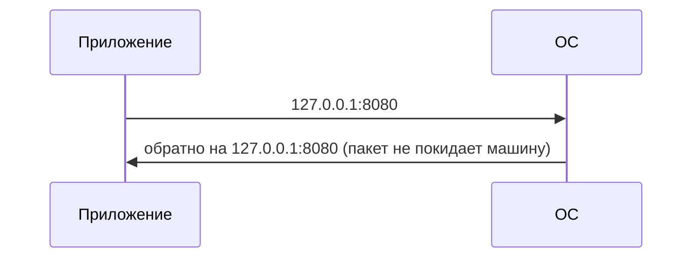

**Использование:**

- Запуск сервера локально – обращение через `localhost`
- Тестирование без сети
- Межпроцессное взаимодействие на одной машине

---

## Просмотр и настройка интерфейсов

### ip (современный инструмент)

```bash
# Показать все интерфейсы и адреса
ip addr show
ip a

# Показать конкретный интерфейс
ip addr show eth0

# Показать таблицу маршрутов
ip route show
ip r

# Включить / выключить интерфейс
ip link set eth0 up
ip link set eth0 down

# Добавить IP-адрес
ip addr add 192.168.1.100/24 dev eth0

# Добавить маршрут
ip route add 10.0.0.0/8 via 192.168.1.1
```

### ifconfig (устаревший, но встречается)

```bash
ifconfig                 # все интерфейсы
ifconfig eth0            # конкретный интерфейс
ifconfig eth0 up/down    # включить/выключить
```

> `ifconfig` входит в пакет `net-tools`, который по умолчанию не установлен в современных дистрибутивах.

### Вывод ip addr

```
2: eth0: <BROADCAST,MULTICAST,UP,LOWER_UP>
    link/ether 00:1a:2b:3c:4d:5e brd ff:ff:ff:ff:ff:ff
    inet 192.168.1.42/24 brd 192.168.1.255 scope global eth0
    inet6 fe80::21a:2bff:fe3c:4d5e/64 scope link
```

| Поле         | Значение           |
|--------------|--------------------|
| `UP`         | Интерфейс включён  |
| `link/ether` | MAC-адрес          |
| `inet`       | IPv4-адрес и маска |
| `inet6`      | IPv6-адрес         |
| `brd`        | Broadcast-адрес    |

---

## Таблица маршрутов

Таблица маршрутов – список правил: «куда идти, чтобы достичь такой-то сети».

```bash
ip route show

# Пример вывода:
default via 192.168.1.1 dev eth0
192.168.1.0/24 dev eth0 proto kernel scope link src 192.168.1.42
```

| Запись                    | Смысл                                  |
|---------------------------|----------------------------------------|
| `default via 192.168.1.1` | Всё остальное – через шлюз 192.168.1.1 |
| `192.168.1.0/24 dev eth0` | Эта сеть – напрямую через eth0         |

---

## Диагностические утилиты

### ping – проверка доступности

Отправляет ICMP Echo Request, ждёт Echo Reply.

```bash
ping google.com          # бесконечно
ping -c 4 google.com     # 4 пакета
ping -i 0.5 google.com   # интервал 0.5с

# Вывод:
# 64 bytes from 142.250.185.46: icmp_seq=1 ttl=118 time=12.4 ms
```

| Поле          | Смысл                                        |
|---------------|----------------------------------------------|
| `time`        | RTT – время туда-обратно                     |
| `ttl`         | Time To Live – сколько роутеров прошёл пакет |
| `packet loss` | % потерь – признак проблем с сетью           |

### traceroute / tracepath – путь пакета

Показывает каждый роутер (хоп) на пути к назначению.

```bash
traceroute google.com
tracepath google.com           # не требует root

# Вывод:
# 1  192.168.1.1      1.2 ms   # твой роутер
# 2  10.0.0.1         5.4 ms   # роутер провайдера
# 3  ...
# 8  142.250.185.46   12.4 ms  # google
```

> Звёздочки `* * *` – роутер не отвечает на ICMP. Это норма для некоторых узлов, не обязательно обрыв.

### netstat / ss – активные соединения и порты

```bash
# ss – современная замена netstat
ss -tuln          # все слушающие порты (TCP+UDP, без резолва имён)
ss -tulnp         # + показать процесс
ss -s             # статистика
ss -tn            # активные TCP-соединения

# netstat (устаревший)
netstat -tuln
netstat -tulnp

# Найти, кто занял порт 8080
ss -tulnp | grep 8080
lsof -i :8080
```

**Флаги ss:**

| Флаг | Смысл                     |
|------|---------------------------|
| `-t` | TCP                       |
| `-u` | UDP                       |
| `-l` | Только слушающие (LISTEN) |
| `-n` | Не резолвить имена        |
| `-p` | Показать процесс          |

### curl – HTTP-запросы из консоли

```bash
# GET-запрос
curl https://example.com

# С заголовками ответа
curl -I https://example.com

# POST с JSON
curl -X POST https://api.example.com/users \
     -H "Content-Type: application/json" \
     -d '{"name": "bandik"}'

# Посмотреть весь обмен (verbose)
curl -v https://example.com

# Сохранить в файл
curl -o index.html https://example.com
```

### dig / nslookup – DNS-диагностика

```bash
# Получить A-запись
dig example.com
dig +short example.com # только IP

# Конкретный тип записи
dig MX gmail.com
dig AAAA google.com

# Использовать конкретный DNS-сервер
dig @8.8.8.8 example.com

# nslookup – интерактивно
nslookup example.com
nslookup example.com 8.8.8.8
```

---

## Важные конфигурационные файлы

### /etc/hosts

Локальная таблица имён. Имеет **приоритет** над DNS.

```
# Формат: IP    
# имя    [псевдонимы]


127.0.0.1       localhost
::1             localhost
192.168.1.10    dev-server devbox
```

**Применение для разработчика:**

```
# Перенаправить домен на локальный сервер
127.0.0.1    myapp.local
127.0.0.1    api.myapp.local
```

После редактирования изменения применяются сразу, сброс DNS-кеша не нужен.

### /etc/resolv.conf

Настройки DNS-резолвера.

```
nameserver 8.8.8.8
nameserver 8.8.4.4
search local.example.com
```

| Директива           | Смысл                      |
|---------------------|----------------------------|
| `nameserver`        | Адрес DNS-сервера (до 3)   |
| `search`            | Суффиксы для коротких имён |
| `options timeout:2` | Таймаут запроса в секундах |

> В системах с `systemd-resolved` файл может быть симлинком. Редактировать напрямую не нужно – используем
`resolvectl`.

### /etc/network/interfaces (Debian/Ubuntu)

Статическая настройка интерфейсов.

```
# Динамический (DHCP)
auto eth0
iface eth0 inet dhcp

# Статический
auto eth0
iface eth0 inet static
    address 192.168.1.42
    netmask 255.255.255.0
    gateway 192.168.1.1
    dns-nameservers 8.8.8.8
```

---

## Сокеты в ОС

Сокет – это файловый дескриптор, через который процесс общается с сетью. ОС предоставляет сокеты как часть своего API.

### Типы сокетов

| Тип                | Протокол | Использование                                |
|--------------------|----------|----------------------------------------------|
| `SOCK_STREAM`      | TCP      | Надёжная потоковая передача                  |
| `SOCK_DGRAM`       | UDP      | Датаграммы без соединения                    |
| `SOCK_RAW`         | IP       | Сырые пакеты (нужен root)                    |
| Unix Domain Socket | –        | Межпроцессное взаимодействие на одной машине |

### Жизненный цикл TCP-сокета

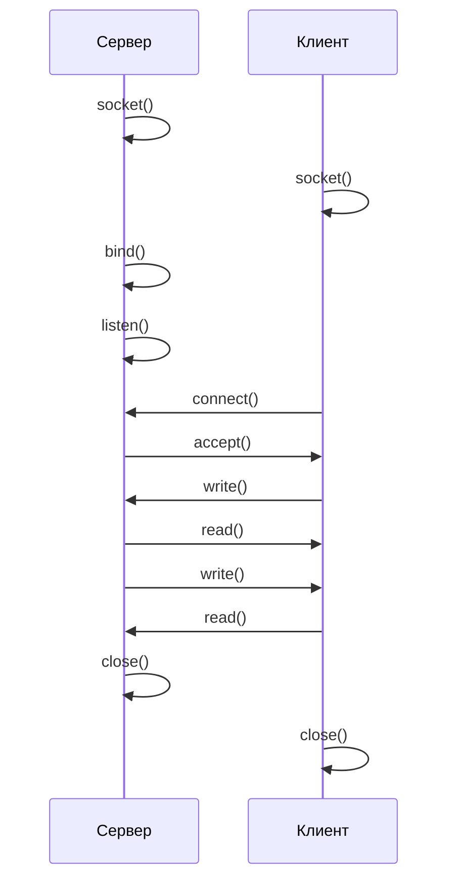

### Unix Domain Sockets

Специальный тип сокета для взаимодействия **внутри одной машины**. Работает через файловую систему, без сетевого стека –
быстрее TCP.

```bash
# Пример: Docker использует Unix socket
ls -la /var/run/docker.sock
# srw-rw---- 1 root docker /var/run/docker.sock

# curl через Unix socket
curl --unix-socket /var/run/docker.sock http://localhost/info
```

**Применение:** PostgreSQL, MySQL, Redis, Nginx, Docker – все умеют слушать Unix socket вместо TCP-порта.

---

## Firewall – основы

ОС фильтрует сетевой трафик через файрвол. Если соединение не проходит – возможно, порт закрыт файрволом.

### ufw (Ubuntu/Debian – удобная обёртка)

```bash
# Статус
ufw status

# Разрешить порт
ufw allow 8080
ufw allow 8080/tcp

# Запретить
ufw deny 8080

# Разрешить SSH (важно сделать до включения!)
ufw allow ssh

# Включить/выключить
ufw enable
ufw disable
```

### iptables (низкоуровневый)

```bash
# Посмотреть правила
iptables -L -n -v

# Разрешить входящий трафик на порт 8080
iptables -A INPUT -p tcp --dport 8080 -j ACCEPT
```
