# Виртуализация и контейнеризация. Введение в Docker

---

## Виртуализация

### Что такое виртуализация

> **Виртуализация** – технология, позволяющая на одном физическом ресурсе (компьютере, сервере) запускать несколько изолированных сред так, как будто каждая из них работает на собственном железе.

В обычной жизни на одной физической машине стоит одна ОС, и все процессы делят между собой её ресурсы. Виртуализация ломает это правило: мы можем на одном сервере одновременно запустить, например, Windows и две независимых копии Linux – каждая из них будет «думать», что владеет железом.

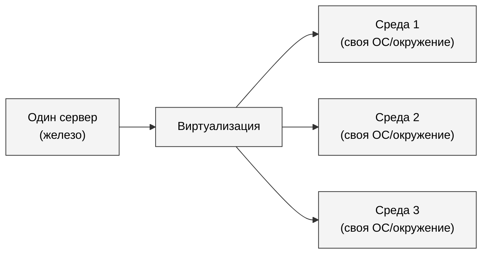

### Зачем нужна виртуализация

| Задача                | Что даёт виртуализация                                                                                                                            |
| --------------------- | ------------------------------------------------------------------------------------------------------------------------------------------------- |
| **Утилизация железа** | Современный сервер избыточно мощный для одного приложения. Виртуализация уплотняет нагрузку: десятки сред на одной машине, железо не простаивает. |
| **Изоляция**          | Сломанное приложение (зальёт диск, выест память, упадёт) не задевает соседей.                                                                     |
| **Переносимость**     | Виртуальную среду можно упаковать, перенести на другой сервер и запустить – окружение поедет вместе с приложением.                                |
| **Безопасность**      | Уязвимость в одном окружении не даёт прямого доступа к соседям и к хосту.                                                                         |
| **Воспроизводимость** | Разработчик локально получает ровно то же окружение, что и в проде.                                                                               |

### Уровни виртуализации

Виртуализировать можно на разных уровнях стека:

- **Аппаратная виртуализация** – эмулируется само железо. Гостевая ОС не знает, что работает на эмуляторе. _Это виртуальные машины._
- **Виртуализация на уровне ОС** – ядро у всех общее, но каждому процессу (или группе процессов) ОС показывает свой «срез» системы: свою файловую систему, свои процессы, свою сеть. _Это контейнеры._
- **Виртуализация уровня приложения** – JVM, .NET CLR, интерпретаторы. Программа исполняется в виртуальной машине более высокого уровня абстракции.

---

## Виртуальные машины

> **Виртуальная машина (ВМ)** – программная имитация полноценного компьютера. У неё свой виртуальный CPU, виртуальная память, диск и сетевая карта. Поверх этого «железа» запускается полноценная **гостевая ОС** со своим ядром.

**Ключевая особенность:** гостевая ОС _не знает_, что она виртуальная. Она работает так, как будто запущена на обычном компьютере.

### Как это выглядит

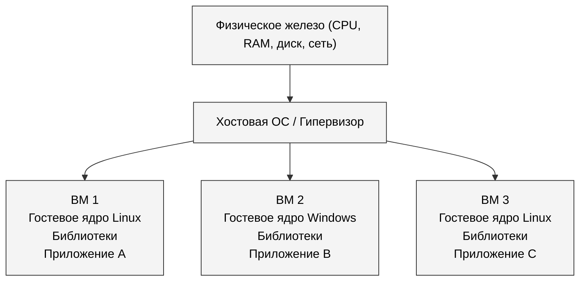

### Плюсы и минусы

| Плюсы ВМ                                                           | Минусы ВМ                                                                         |
| ------------------------------------------------------------------ | --------------------------------------------------------------------------------- |
| Полная изоляция: у каждой ВМ своё ядро                             | **Тяжеловесность:** гигабайты диска, сотни МБ RAM «на пустом месте»               |
| Можно запускать любые ОС (Windows-гость на Linux-хосте и наоборот) | **Долгий старт:** загрузка ОС – десятки секунд или минуты                         |
| Снимки, клонирование, миграция между хостами без остановки         | **Накладные расходы:** эмуляция железа стоит производительности, особенно для I/O |

---

## Гипервизоры

> **Гипервизор** – программный слой, реализующий виртуализацию: создаёт ВМ, распределяет между ними ресурсы железа, изолирует их друг от друга.

Гипервизоры делятся на два типа.

### Type 1 – bare-metal («голый металл»)

Гипервизор устанавливается **прямо на железо**, без хостовой ОС. Сам гипервизор и есть «операционная система» этого сервера; его единственная задача – управлять виртуальными машинами.

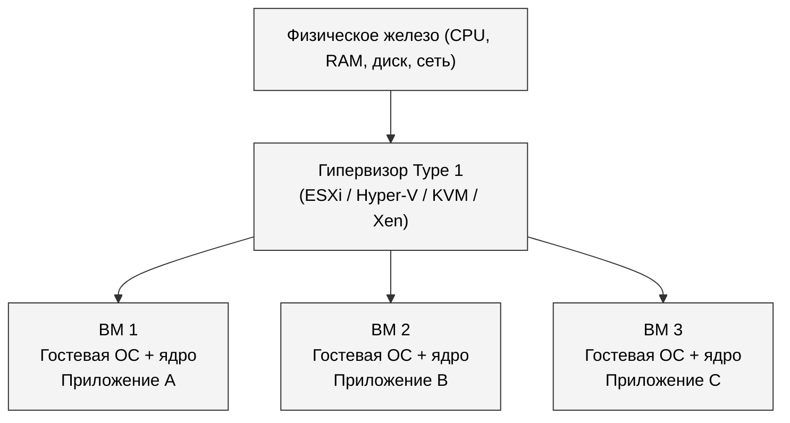

**Примеры:** VMware ESXi, Microsoft Hyper-V (серверная редакция), KVM (часть ядра Linux, граничный случай), Xen.

**Где применяется:** дата-центры, облачные провайдеры (AWS, GCP, Azure под капотом используют гипервизоры Type 1), корпоративные серверы.

### Type 2 – hosted («гостевой»)

Гипервизор – это **обычная программа** поверх хостовой ОС (Windows, macOS, Linux). Чтобы запустить ВМ, сначала загружается хостовая ОС, потом запускается гипервизор, потом – гостевая ОС внутри него.

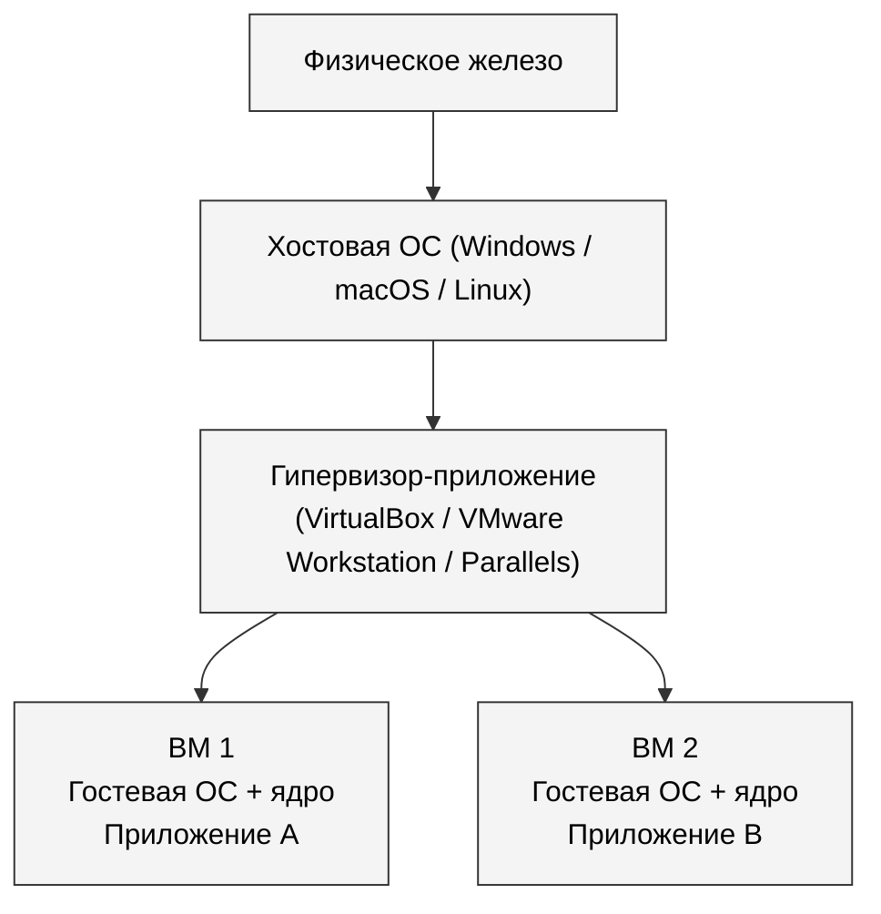

**Примеры:** Oracle VirtualBox, VMware Workstation/Fusion, Parallels Desktop, QEMU.

**Где применяется:** рабочие станции разработчиков, тестовые стенды, обучение.

> Type 1 быстрее (нет лишнего слоя ОС) и применяется в продакшене. Type 2 удобнее (ставится как приложение) и применяется на десктопах разработчиков.

---

## Контейнеризация

Виртуальные машины решают задачу изоляции, но платят за это дорого: дублирование ядра, гигабайты на диске, медленный старт. А что, если задача стоит проще – изолировать **не целую ОС, а только приложение со своими зависимостями**?

> **Контейнеризация** – виртуализация на уровне операционной системы. Ядро у всех контейнеров **общее** (ядро хоста), но каждому контейнеру ОС показывает «свой мир»: свою файловую систему, свои процессы, свою сеть.

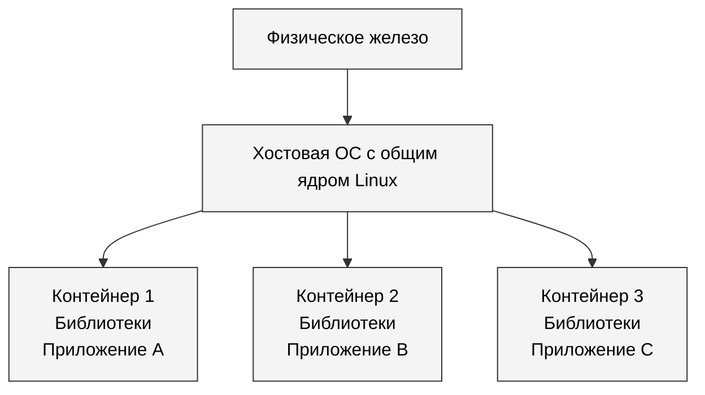

### Две точки зрения

**Изнутри контейнера** процесс видит:

- только свои файлы (а не диск всего сервера);
- только свои процессы (`ps` покажет ему его же дерево, и больше ничего);
- свою сетевую карту и свой IP;
- свой hostname.

Он _не знает_, что находится внутри контейнера, и работает «как обычно».

**Снаружи, с точки зрения хоста** все контейнеры – это просто **обычные процессы**. Их видно в `ps`, они работают на том же ядре, их можно остановить штатными средствами ОС.

> **Идея в одной фразе:** ВМ виртуализирует железо, контейнер виртуализирует ОС.

---

## Контейнеры как механизм операционной системы

Контейнер – это не магия и не отдельный продукт. Это **набор возможностей ядра Linux**, которые позволяют запустить процесс в изолированной среде. Docker не «создаёт» контейнеры – он удобно дёргает уже существующие в Linux механизмы.

Главных механизмов три:

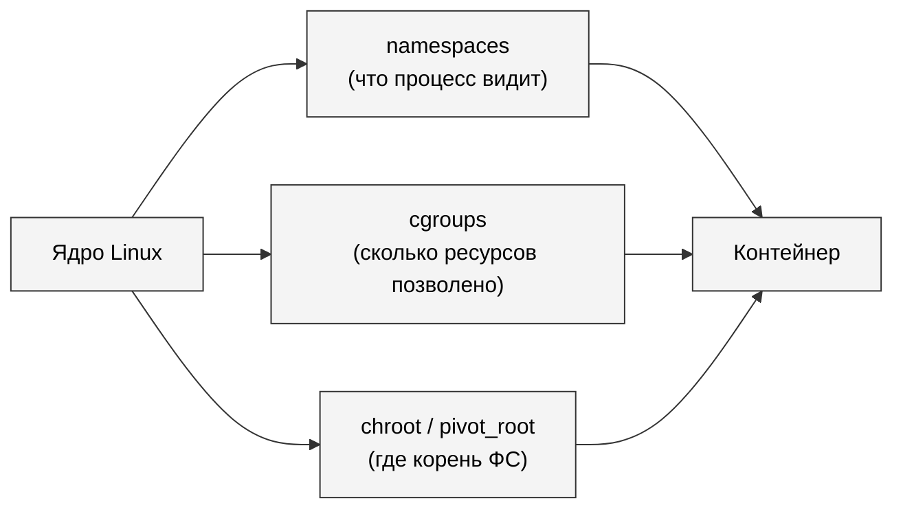

### Namespaces – пространства имён

> **Namespace** – способ ядра показать процессу «свой срез» какой-то системной сущности. Если процесс находится в своём PID-namespace, он видит только процессы этого namespace, а не все процессы системы.

Наглядно: один и тот же процесс выглядит по-разному изнутри и снаружи контейнера.

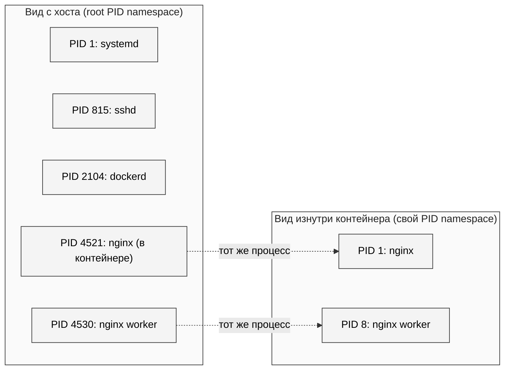

#### Какие бывают namespaces

| Namespace  | Что изолирует                         | Что даёт                                                                    |
| ---------- | ------------------------------------- | --------------------------------------------------------------------------- |
| **PID**    | Идентификаторы процессов              | Внутри контейнера свой `init` с PID=1, остальных процессов системы не видно |
| **NET**    | Сетевые интерфейсы, маршруты, порты   | У контейнера свой `eth0`, свой IP, свои порты, свои iptables                |
| **MNT**    | Точки монтирования                    | У контейнера своё дерево файловой системы                                   |
| **UTS**    | Hostname и domainname                 | Контейнер может иметь имя, отличное от хоста                                |
| **IPC**    | Очереди сообщений, разделяемая память | Процессы одного контейнера не общаются через IPC с другим                   |
| **USER**   | Идентификаторы пользователей и групп  | `root` внутри контейнера – _не_ `root` на хосте                             |
| **CGROUP** | Видимость cgroups                     | Контейнер видит только свою иерархию ограничений                            |

> **Главное:** namespace – это не отдельная виртуальная машина. Это **фильтр над общим ядром**, ограничивающий, что процесс видит.

### Cgroups – control groups

Если **namespaces** отвечают на вопрос _«что процесс видит»_, то **cgroups** отвечают на вопрос _«сколько ресурсов процессу позволено»._

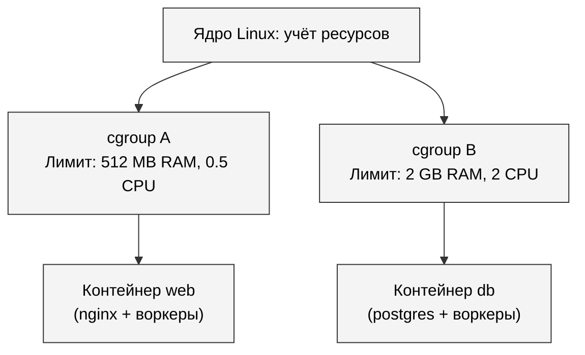

Cgroups позволяют сказать ядру: «эта группа процессов суммарно может использовать не более 512 MB памяти и не более 1.5 ядер CPU». Если процессы превысят лимит, ядро их прижмёт (либо притормозит, либо убьёт – зависит от настроек).

На cgroups в Docker опираются опции вроде:

```sh
docker run --memory=512m --cpus=1.5 nginx
```

### Chroot и pivot_root

`chroot` – старейший механизм, появился ещё в **1979 году** в Unix V7. Он говорит процессу: «твой корень файловой системы теперь не `/`, а вот эта папка». Процесс не сможет «выйти» за пределы этой папки штатными средствами.

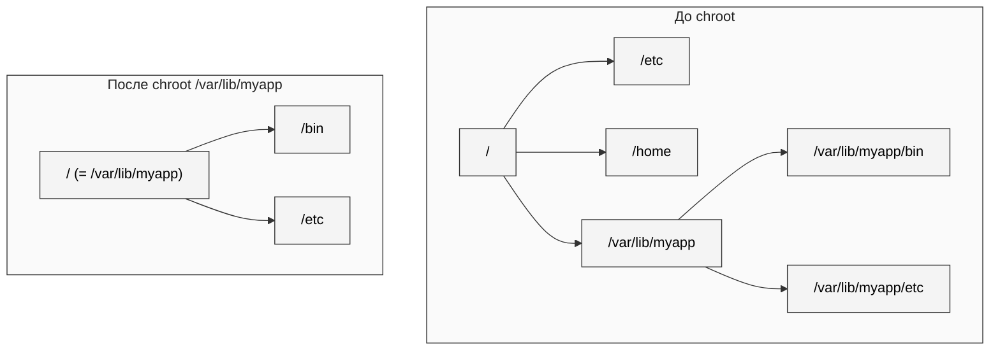

> `chroot` сам по себе **не контейнер** (он изолирует только файловую систему), но это базовый кирпичик. В современных контейнерах вместо `chroot` используется его более защищённая версия `pivot_root`.

---

## Виртуальные машины vs контейнеры

| Критерий                     | Виртуальная машина          | Контейнер            |
| ---------------------------- | --------------------------- | -------------------- |
| Что виртуализируется         | Железо                      | Операционная система |
| Гостевое ядро                | Своё (в каждой ВМ)          | Нет, общее с хостом  |
| Размер                       | Гигабайты                   | Мегабайты            |
| Время старта                 | Десятки секунд – минуты     | Доли секунды         |
| Изоляция                     | Очень сильная (разные ядра) | Слабее (общее ядро)  |
| Накладные расходы            | Заметные                    | Почти нулевые        |
| Windows-гость на Linux-хосте | Да                          | Нет (общее ядро!)    |
| Плотность на одном сервере   | Десятки                     | Сотни и тысячи       |

> **Важно:** контейнеры не «лучше» ВМ. Они решают **разные задачи**. ВМ дают сильную изоляцию и кросс-платформенность, контейнеры – плотность и скорость. В реальных дата-центрах их часто комбинируют: на гипервизоре крутятся ВМ, а внутри ВМ – контейнеры.

---

## Docker

### Что такое Docker

> **Docker** – платформа для запуска приложений в контейнерах. Технически – удобная обёртка над механизмами ядра Linux (namespaces, cgroups, overlayfs) плюс:
>
> - стандартный формат **образа** (что запускать);
> - стандартный способ **сборки** образа;
> - инфраструктура для **обмена** образами (Docker Hub и другие registry).

Docker – не единственный движок контейнеров (есть podman, containerd, CRI-O), но именно он первым стал «обиходным» и до сих пор остаётся самым популярным.

### Архитектура Docker

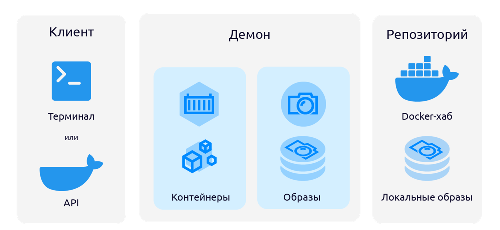

Компоненты делятся на две группы.

**Системные компоненты:**

- **Docker host** – компьютер или сервер с установленным Docker. На macOS и Windows Docker фактически работает внутри маленькой Linux-ВМ (контейнерам нужно Linux-ядро).
- **Docker daemon (`dockerd`)** – фоновый процесс, который реально всем занимается: создаёт образы, запускает контейнеры, скачивает с registry. Слушает сокет, принимает команды через REST API.
- **Docker client (`docker`)** – утилита командной строки. Сама ничего не делает: переводит команды в HTTP-запросы и отправляет демону.
- **Docker Compose** – менеджер для запуска кластера контейнеров одной командой.

**Переменные компоненты:**

- **Образ (image)** – шаблон для контейнера.
- **Контейнер (container)** – запущенный экземпляр образа.
- **Registry** – хранилище образов (по умолчанию Docker Hub).
- **Dockerfile** – рецепт сборки образа.
- **docker-compose.yaml** – конфигурация для кластера контейнеров.

### Что происходит при `docker run nginx`

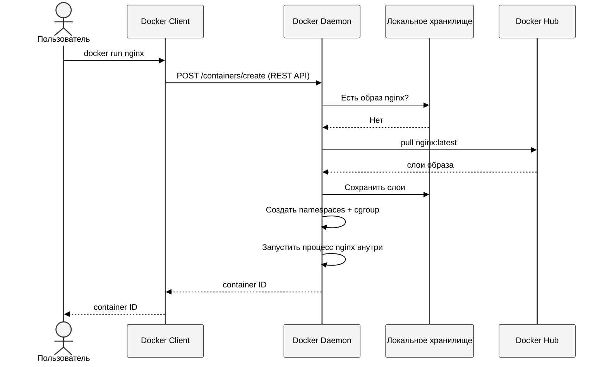

### Контейнер

> Основной компонент Docker. Каждое приложение запускается в отдельном контейнере – изолированной среде исполнения со всем необходимым: системные инструменты, библиотеки, код приложения, переменные окружения.

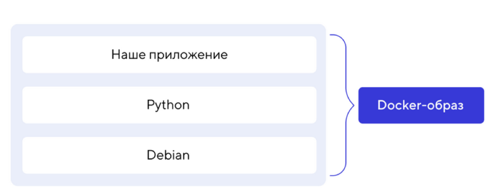

> **Важно:** контейнеры используют ядро Linux. На Windows и macOS Docker Desktop сначала поднимает маленькую виртуальную машину с Linux, и уже внутри неё запускает контейнеры. _Docker под Windows = Docker под Linux + тонкая ВМ-прослойка._

### Образ

> **Образ (image)** – шаблон, из которого создаются контейнеры. Упакованный набор всего, что нужно для запуска приложения: код, среда выполнения, библиотеки, переменные окружения, конфиги.

**Ключевая идея:** образ состоит из **слоёв**. Каждая инструкция в рецепте сборки (Dockerfile) добавляет один слой. Слои переиспользуются между образами: если два образа собраны из одного и того же базового, общий слой скачивается и хранится один раз.

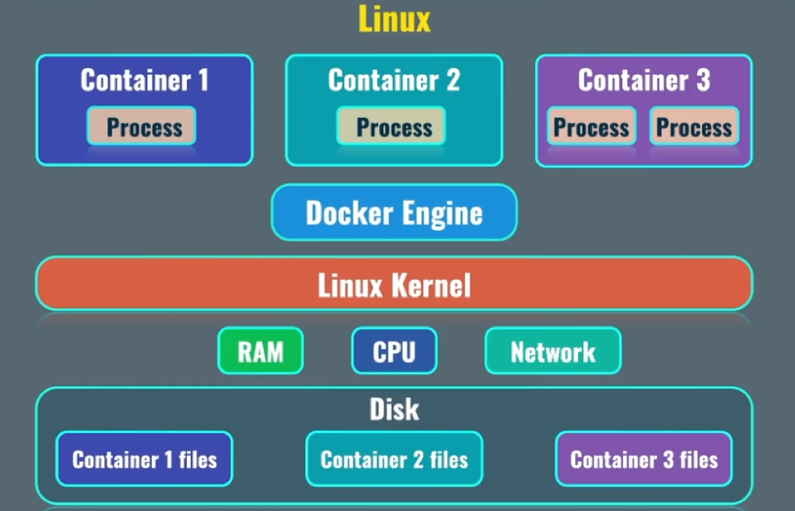

Что нужно запомнить про образы:

- Образ – это **только шаблон**. Сам по себе не работает.
- В основе любого образа лежит **родительский образ** (обычно – базовый образ ОС: `alpine`, `ubuntu`, `debian`).
- Образ состоит из **слоёв**.
- Каждая команда в Dockerfile создаёт **новый слой**.
- Образы переиспользуются и могут загружаться в registry.

### Registry – хранилище образов

> **Registry** – хранилище образов и их версий. Самый известный публичный – **Docker Hub** (`hub.docker.com`).

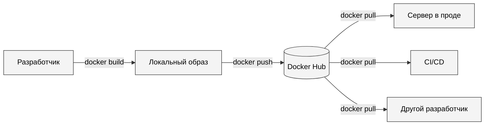

Существуют и другие registry: GitHub Container Registry, GitLab Container Registry, Amazon ECR, корпоративные приватные registry.

---

## Базовые команды Docker

### Информация о системе

```sh
docker version       # версия Docker
docker info          # детальная информация (драйверы, сети, ресурсы)
```

### Работа с контейнерами

```sh
docker ps            # запущенные контейнеры
docker ps -a         # все, включая остановленные

docker run hello-world           # создать и запустить
docker stop <id|name>            # остановить
docker start <id|name>           # снова запустить остановленный
docker restart <id|name>         # перезапустить
docker rm <id|name>              # удалить (контейнер должен быть остановлен)
```

### Работа с образами

```sh
docker images                    # локальные образы
docker pull nginx                # скачать, не запуская
docker rmi <id|name>             # удалить образ
```

### Интроспекция

```sh
docker exec -it <id|name> bash   # зайти внутрь работающего контейнера
docker logs <id|name>            # посмотреть логи (stdout/stderr)
docker container inspect <id>    # полная конфигурация (JSON)
docker stats                     # потребление ресурсов в реальном времени
```

### Полезные ключи `docker run`

| Ключ             | Что делает                                         |
| ---------------- | -------------------------------------------------- |
| `-d`             | Запустить в фоне (detached)                        |
| `--name X`       | Дать контейнеру имя `X` вместо автогенерированного |
| `-p 8080:80`     | Пробросить порт хоста 8080 в порт контейнера 80    |
| `-e KEY=value`   | Установить переменную окружения внутри контейнера  |
| `-v /host:/cont` | Подмонтировать папку хоста в контейнер             |
| `--rm`           | Удалить контейнер сразу после остановки            |
| `-it`            | Интерактивный режим с TTY (для шеллов)             |
| `--memory=512m`  | Лимит памяти (опирается на cgroups)                |
| `--cpus=1.5`     | Лимит CPU (опирается на cgroups)                   |

---

## Практический пример: nginx

### Запуск и проверка

Запускаем веб-сервер nginx в фоне:

```sh
docker run -d --name web nginx
```

**Что произошло:**

1. Docker проверил, есть ли локально образ `nginx`. Не нашёл – скачал с Docker Hub.
2. Создал контейнер на основе этого образа (новые namespaces, cgroup, файловая система).
3. Запустил процесс `nginx` внутри.
4. Вернул ID нового контейнера.

Проверяем, что контейнер работает:

```sh
docker ps
```

### Заглянуть внутрь

Заходим внутрь контейнера:

```sh
docker exec -it web bash
```

Внутри контейнера выполняем:

```sh
ps aux       # увидим только nginx и его воркеры
hostname     # увидим случайное имя хоста
ls /         # увидим файловую систему контейнера, а не хоста
exit
```

> **Обратите внимание:** `ps aux` внутри контейнера показывает несколько процессов nginx и больше **ничего**. На самом хосте процессов сотни. Это и есть **PID namespace** в действии – контейнер видит только свой срез.

<details>
<summary><b>Сравнить с хостом</b></summary>

На хосте выполните:

```sh
ps aux | grep nginx
```

Вы увидите те же процессы nginx – с другими PID. Это один и тот же `nginx`, видимый из двух разных namespaces.

</details>

### Параметры контейнера

Узнаём IP-адрес контейнера и другие детали:

```sh
docker container inspect web
```

Останавливаем и удаляем:

```sh
docker stop web
docker rm web
```

### Проброс портов

В предыдущем примере nginx был доступен только изнутри docker-сети. Чтобы открыть его наружу, нужно пробросить порт:

```sh
docker run -d --name web -p 8080:80 nginx
```

Теперь nginx слушает на `localhost:8080` хоста. Открываем в браузере `http://localhost:8080` – видим стандартную страницу nginx.

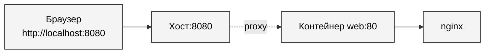

Запустим **второй** контейнер на другом порту:

```sh
docker run -d --name web2 -p 8081:80 nginx
```

Получаем **два независимых nginx** на одной машине, не конфликтующих друг с другом – каждый в своём network namespace.

---

## Связь с курсом ОС

| Тема из курса ОС                                  | Что это в Docker                        |
| ------------------------------------------------- | --------------------------------------- |
| Процессы и их изоляция                            | PID namespace                           |
| Файловые системы и точки монтирования             | MNT namespace, overlayfs (слои образов) |
| Сетевой стек                                      | NET namespace                           |
| Управление ресурсами (планировщик, лимиты памяти) | cgroups                                 |
| Системные вызовы (`clone`, `unshare`)             | как контейнер физически создаётся       |

> Docker – удобная упаковка функционала, который ядро Linux **уже умело**. Понимать Docker без понимания ОС невозможно – и наоборот: контейнеры дают отличный способ увидеть механизмы ОС в действии.
