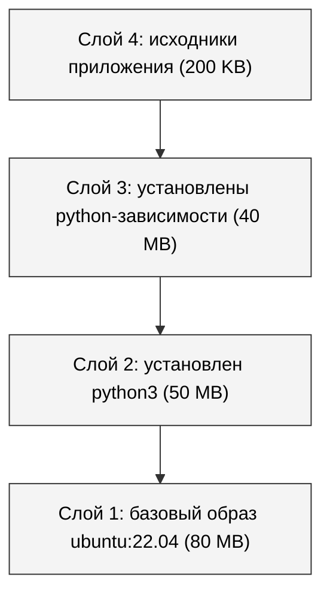
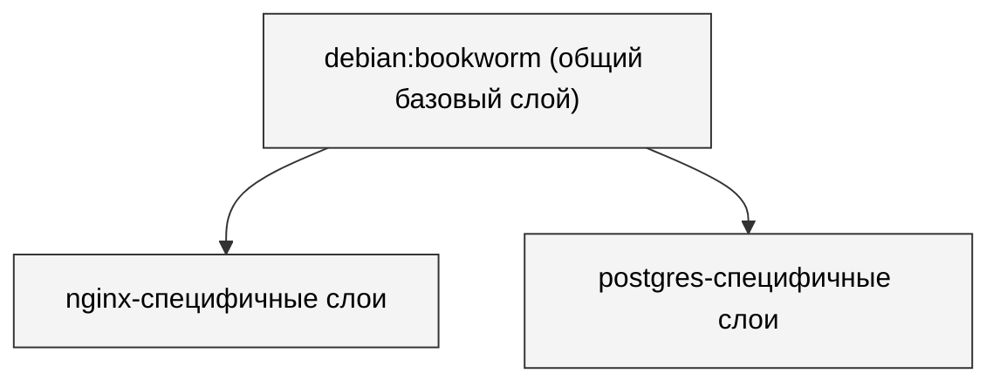
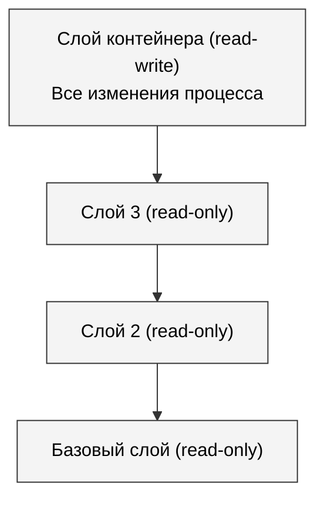
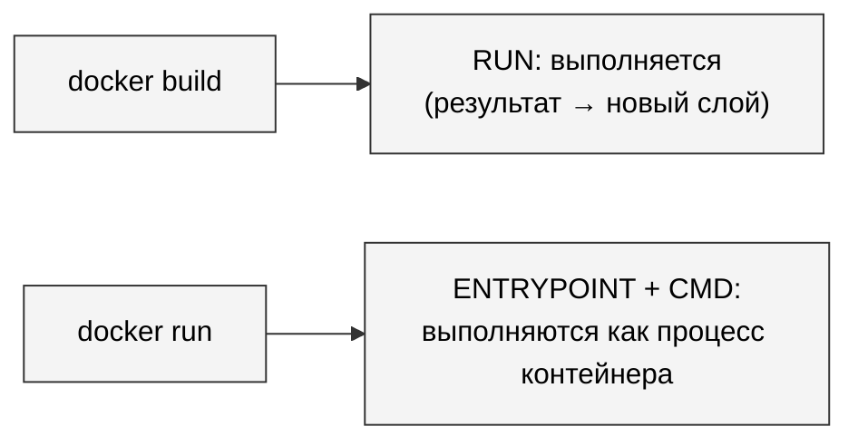
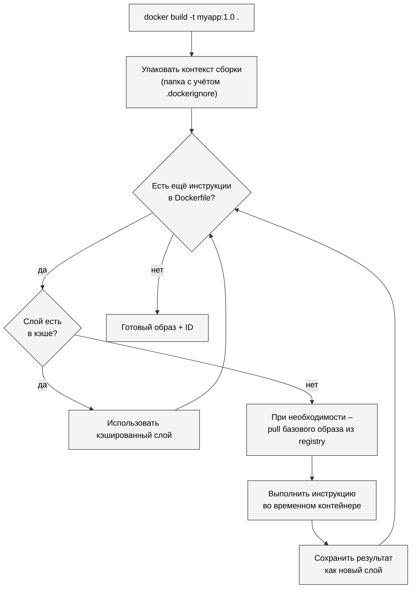
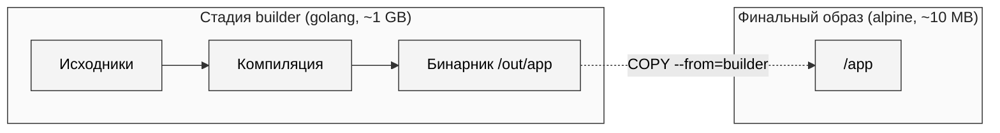
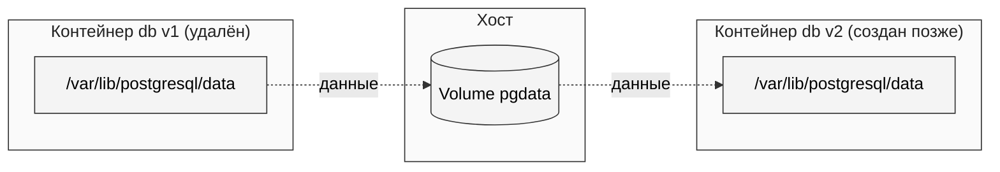
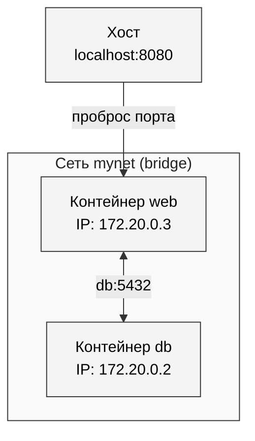
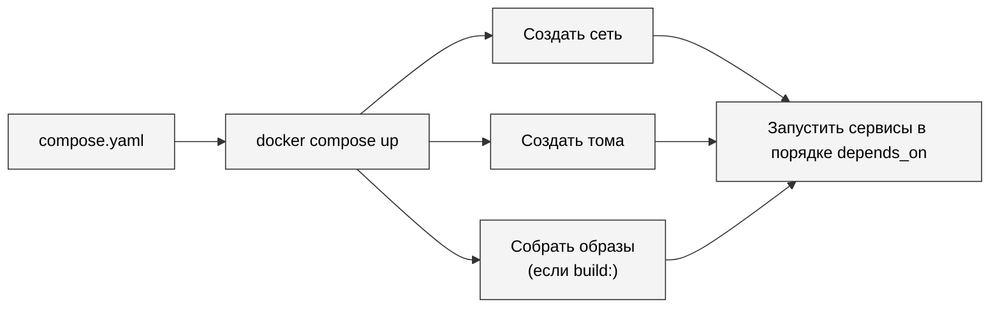
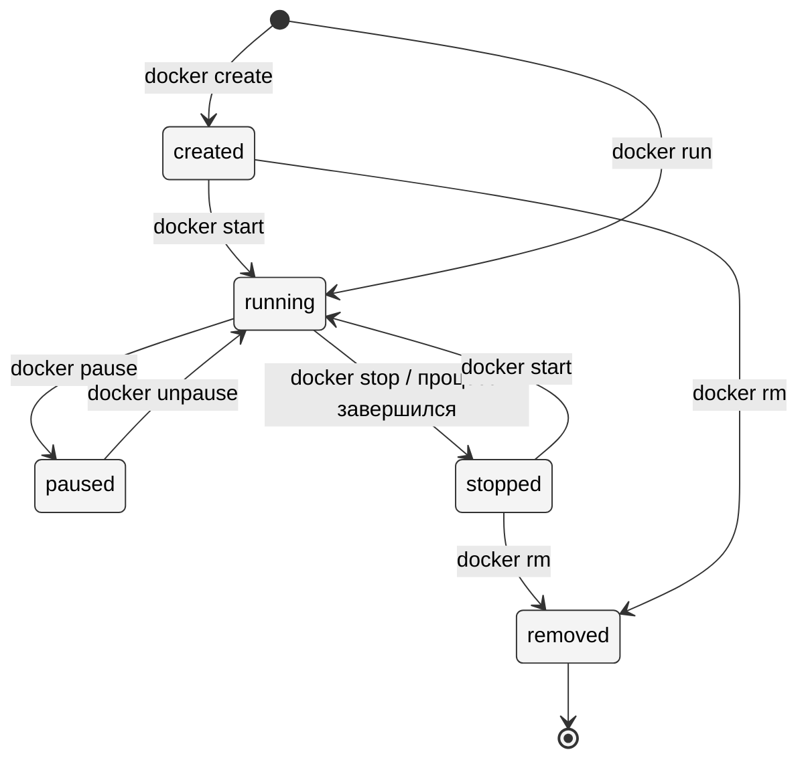

# Углублённая работа с Docker

---

## Образы и слои

### Что такое слой

В прошлой лекции мы говорили: образ – это «упакованный набор всего, что нужно приложению». Теперь уточним: **образ – это не один большой файл, а набор слоёв**.

> **Слой (layer)** – набор изменений в файловой системе: добавленные, изменённые или удалённые файлы по сравнению с предыдущим слоем.

Каждый шаг сборки образа (`FROM`, `RUN`, `COPY`, ...) создаёт **новый слой**. Финальный образ – это все слои, сложенные друг на друга.



### Зачем такая сложность

**Слои переиспользуются между образами**. Если у вас есть два образа, оба на базе `ubuntu:22.04` – слой с ubuntu хранится на диске **один раз**. Docker просто ссылается на него из обоих образов.

То же при скачивании: если вы уже скачивали nginx и теперь скачиваете postgres, оба на базе `debian:bookworm` – базовый слой не качается заново.



### Как это устроено внутри: overlayfs

> **Overlayfs** – файловая система Linux, которая «накладывает» несколько каталогов друг на друга и показывает их процессу как единый каталог.

Docker использует overlayfs, чтобы превратить набор слоёв в одну видимую файловую систему контейнера. Каждый слой – это просто папка на диске хоста. Когда контейнер запускается:

- все слои образа подключаются в **read-only** режиме (нижние слои);
- сверху докладывается **read-write слой** – все изменения, которые делает контейнер, пишутся туда;
- процессу контейнера это видится как обычная файловая система.



### Следствия

- Когда контейнер удаляется – удаляется только его read-write слой. Базовые слои (из образа) остаются на диске и переиспользуются.
- Изменения внутри контейнера **не попадают в образ**. Если вы вошли в контейнер, отредактировали файл, а потом контейнер удалили – правки пропадут.
- Чтобы данные пережили контейнер – нужны **тома** (про них дальше).

---

## Dockerfile

### Что это

> **Dockerfile** – текстовый файл-рецепт, по которому собирается образ. Каждая строка – одна инструкция, каждая инструкция (как правило) создаёт один слой.

Минимальный пример:

```dockerfile
FROM python:3.12-alpine
WORKDIR /app
COPY . .
RUN pip install -r requirements.txt
CMD ["python", "main.py"]
```

Прочитать сверху вниз можно как:

1. **Возьми** базовый образ Python 3.12 на Alpine.
2. **Назначь** рабочую директорию `/app` внутри образа.
3. **Скопируй** всё из текущей папки на хосте в `/app`.
4. **Запусти** установку зависимостей.
5. **Когда контейнер стартует** – выполни `python main.py`.

### Основные инструкции

| Инструкция | Что делает |
|---|---|
| `FROM <image>` | Базовый образ, с которого начинается сборка |
| `WORKDIR <path>` | Рабочая директория для последующих команд (как `cd`) |
| `COPY <src> <dst>` | Копирует файлы с хоста в образ |
| `ADD <src> <dst>` | То же + умеет распаковывать архивы и качать URL (использовать редко) |
| `RUN <команда>` | Выполнить команду **при сборке**. Результат становится слоем |
| `ENV KEY=value` | Установить переменную окружения внутри образа |
| `EXPOSE <port>` | Объявить, что контейнер слушает порт (документация, не настройка) |
| `CMD ["cmd", "arg"]` | Команда **по умолчанию** при запуске контейнера |
| `ENTRYPOINT ["cmd"]` | «Точка входа» – команда, которую нельзя переопределить просто так |
| `USER <name>` | Сменить пользователя, под которым запускается процесс |
| `VOLUME ["/data"]` | Объявить точку монтирования тома |

### RUN vs CMD vs ENTRYPOINT – ключевое различие

Это место, где путаются почти все.

- **`RUN`** – выполняется **при сборке образа**. Результат сохраняется в слой. Пример: `RUN apt-get install nginx`.
- **`CMD`** – выполняется **при запуске контейнера**. Это команда «по умолчанию». Её можно переопределить, передав свою в `docker run`.
- **`ENTRYPOINT`** – тоже выполняется при запуске, но это «жёсткая» точка входа. `CMD` к ней просто добавляется как аргументы.



### Каждая инструкция – слой. Это важно

Возьмём «плохой» Dockerfile:

```dockerfile
FROM python:3.12-alpine
COPY . /app
WORKDIR /app
RUN pip install -r requirements.txt
CMD ["python", "main.py"]
```

И «хороший»:

```dockerfile
FROM python:3.12-alpine
WORKDIR /app
COPY requirements.txt .
RUN pip install -r requirements.txt
COPY . .
CMD ["python", "main.py"]
```

В чём разница? В **порядке** инструкций.

Docker умеет **кэшировать слои**. Если входные данные инструкции не изменились с прошлой сборки – он не пересобирает её, а берёт готовый слой из кэша.

В «плохом» варианте `COPY . /app` копирует весь код вместе с `requirements.txt`. Меняешь одну строчку в коде → следующая строка `RUN pip install ...` пересобирается заново (потому что предыдущий слой изменился), и Docker заново скачивает все зависимости. **Долго.**

В «хорошем» варианте `requirements.txt` копируется отдельно. Пока он не изменился, слой с установленными зависимостями берётся из кэша – даже если код приложения поменялся 100 раз.

> **Правило:** размещайте инструкции в Dockerfile в порядке **от редко меняющихся к часто меняющимся**.

### .dockerignore

По умолчанию `COPY . .` копирует **всё** из текущей папки. Это плохо: попадёт `.git`, виртуальное окружение, `node_modules`, временные файлы, секреты.

Решение – файл `.dockerignore` рядом с Dockerfile:

```
.git
node_modules
__pycache__
*.pyc
.venv
.env
.idea
*.log
```

Работает по принципу `.gitignore`: что в списке – Docker не передаёт в контекст сборки.

---

## Сборка образа

### Команда `docker build`

```bash
docker build -t myapp:1.0 .
```

Разбор:

- `-t myapp:1.0` – тег образа: имя `myapp`, версия `1.0`;
- `.` – контекст сборки (текущая папка). Именно отсюда Docker берёт файлы для `COPY`/`ADD`. Dockerfile ищется в этой же папке.

Можно явно указать путь к Dockerfile:

```bash
docker build -t myapp:1.0 -f docker/Dockerfile .
```

### Теги и версионирование

Тег – это `<имя>:<версия>`. Если версию не указали – подставляется `latest`. Один и тот же образ может иметь несколько тегов одновременно:

```bash
docker tag myapp:1.0 myapp:latest
docker tag myapp:1.0 registry.example.com/team/myapp:1.0
```

Это не копии – это разные «имена» для одного образа.

### Что происходит при `docker build`



### Публикация в registry

Чтобы поделиться образом – загрузить его в registry:

```bash
# Войти (только первый раз)
docker login

# Переименовать с префиксом своего аккаунта
docker tag myapp:1.0 mynickname/myapp:1.0

# Отправить
docker push mynickname/myapp:1.0
```

Теперь любой может скачать командой `docker pull mynickname/myapp:1.0`.

### Пример: Python-приложение

Файл `main.py`:

```python
import os
from flask import Flask

app = Flask(__name__)

@app.route("/")
def hello():
    return f"Hello from {os.uname().nodename}!\n"

if __name__ == "__main__":
    app.run(host="0.0.0.0", port=5000)
```

Файл `requirements.txt`:

```
flask==3.0.0
```

Файл `Dockerfile`:

```dockerfile
FROM python:3.12-alpine
WORKDIR /app
COPY requirements.txt .
RUN pip install --no-cache-dir -r requirements.txt
COPY . .
EXPOSE 5000
CMD ["python", "main.py"]
```

Сборка и запуск:

```bash
docker build -t hello-flask:1.0 .
docker run -d --name hello -p 5000:5000 hello-flask:1.0
curl http://localhost:5000
# Hello from <id-контейнера>!
```

---

## Multi-stage builds

### Проблема

Допустим, мы собираем приложение на Go или TypeScript. Для сборки нужны компилятор и куча инструментов (`golang`, `node_modules`), но в финальном образе они не нужны – нужен только бинарник.

Если положить всё в один образ – он будет огромным.

### Решение

В Dockerfile можно использовать **несколько `FROM`**. Каждый `FROM` начинает новую «стадию». В финальный образ попадает только **последняя** стадия; из предыдущих можно скопировать нужные файлы через `COPY --from=`.

```dockerfile
# Стадия 1: сборка
FROM golang:1.22 AS builder
WORKDIR /src
COPY . .
RUN go build -o /out/app

# Стадия 2: финальный образ
FROM alpine:3.20
COPY --from=builder /out/app /app
CMD ["/app"]
```

Финальный образ содержит **только бинарник и alpine** (~10 MB вместо ~1 GB).



---

## Тома и данные

### Проблема

Допустим, мы запустили `postgres` в контейнере, создали базу, добавили данные. Потом контейнер удалили. **Где данные?**

Ответ: **их нет**. Все изменения внутри контейнера лежат в его read-write слое. Удаление контейнера – удаление слоя.

Для долговечного хранения данные нужно **выносить за пределы контейнера** – на хост или в специальное хранилище Docker.

### Bind mount vs Volume

В Docker есть два основных механизма:

| Механизм | Что монтируется | Где хранится | Когда использовать |
|---|---|---|---|
| **Bind mount** | Папка на хосте | Где скажете | Разработка: чтобы видеть свои файлы внутри контейнера |
| **Volume** | Управляемое Docker хранилище | `/var/lib/docker/volumes/...` | Продакшен: данные приложения, БД |

### Bind mount

Монтирует папку с хоста в контейнер. Изменения видны с обеих сторон.

```bash
docker run -d -p 8080:80 -v $(pwd)/site:/usr/share/nginx/html nginx
```

Папка `./site` на хосте появляется внутри контейнера как `/usr/share/nginx/html`. Меняешь файл на хосте – он мгновенно меняется и в контейнере.

**Применение:** разработка, локальная конфигурация.

### Volume

Управляемое Docker хранилище. Создаётся командой или автоматически.

```bash
# Явное создание
docker volume create pgdata

# Использование
docker run -d --name db -e POSTGRES_PASSWORD=secret \
    -v pgdata:/var/lib/postgresql/data postgres
```

Теперь данные БД лежат в томе `pgdata`. Удалили контейнер – том на месте. Создали новый контейнер с тем же томом – данные на месте.



### Команды

```bash
docker volume ls                  # список томов
docker volume inspect pgdata      # информация о томе
docker volume rm pgdata           # удалить (только если не используется)
docker volume prune               # удалить все неиспользуемые
```

### `tmpfs` – временный том в памяти

Иногда нужно «как том», но без записи на диск – например, для секретов или кэша:

```bash
docker run --tmpfs /tmp myapp
```

Содержимое `/tmp` живёт в RAM, пропадает при остановке контейнера.

---

## Сети контейнеров

### Что хочется

Сценарий: у нас есть два контейнера – веб-приложение и база данных. Веб должен подключаться к БД по адресу `db:5432`. Как сделать так, чтобы имя `db` резолвилось в IP-адрес контейнера БД?

### Сетевые драйверы Docker

| Драйвер | Что делает | Когда использовать |
|---|---|---|
| **bridge** | Своя приватная подсеть, контейнеры в ней общаются друг с другом | По умолчанию. Большинство случаев |
| **host** | Контейнер использует сеть хоста напрямую, без изоляции | Когда важна производительность сети |
| **none** | У контейнера нет сети вообще | Изоляция, batch-задачи без сети |
| **overlay** | Сеть, охватывающая несколько хостов | Кластеры (Docker Swarm, Kubernetes) |

### Default bridge vs пользовательская сеть

Docker по умолчанию создаёт сеть `bridge`, в которую попадают все контейнеры, запущенные без явного указания сети. Но у этой стандартной сети есть проблема – **в ней не работает DNS по имени контейнера**.

Решение – создать **свою** bridge-сеть:

```bash
docker network create mynet

docker run -d --name db --network mynet -e POSTGRES_PASSWORD=secret postgres
docker run -d --name web --network mynet -p 8080:80 myapp
```

Теперь внутри `web` доступен адрес `db:5432` – Docker сам резолвит его в IP контейнера БД.



### Проброс портов: ещё раз

`-p 8080:80` – «то, что приходит на порт 8080 хоста, пробрось в порт 80 контейнера».

- `-p 8080:80` – доступно отовсюду;
- `-p 127.0.0.1:8080:80` – доступно только с самого хоста;
- `-p 80` – случайный порт хоста (узнать через `docker port`).

---

## docker-compose

### Зачем

Запустить связку из 3 контейнеров вручную – это 3 длинных `docker run` с правильным порядком, общей сетью, томами, переменными окружения. Любая ошибка – переписывать заново. Передать коллеге – никак.

> **docker-compose** – инструмент, который описывает кластер контейнеров **декларативно**, в YAML-файле. Одна команда поднимает всё, другая – останавливает.

### compose.yaml

Пример для нашей связки «веб-приложение + postgres»:

```yaml
services:
  db:
    image: postgres:16
    environment:
      POSTGRES_USER: app
      POSTGRES_PASSWORD: secret
      POSTGRES_DB: mydb
    volumes:
      - pgdata:/var/lib/postgresql/data
    restart: unless-stopped

  web:
    build: .
    ports:
      - "8080:5000"
    environment:
      DATABASE_URL: postgresql://app:secret@db:5432/mydb
    depends_on:
      - db
    restart: unless-stopped

volumes:
  pgdata:
```

Разбор:

- `services` – список контейнеров;
- `db.image` – готовый образ из registry;
- `web.build: .` – собрать из Dockerfile в текущей папке;
- `environment` – переменные окружения;
- `volumes` – тома (на уровне сервиса и общий список внизу);
- `depends_on` – порядок запуска (`db` стартует раньше `web`);
- `restart: unless-stopped` – перезапускать контейнер, если упал.

**Внутри сети compose автоматически:** все сервисы видят друг друга по имени (`db`, `web`).

### Команды

```bash
docker compose up               # запустить (с выводом логов)
docker compose up -d            # запустить в фоне
docker compose ps               # статус сервисов
docker compose logs             # логи всех сервисов
docker compose logs -f web      # логи одного сервиса в реальном времени
docker compose exec web sh      # зайти внутрь сервиса
docker compose down             # остановить и удалить контейнеры
docker compose down -v          # + удалить тома (потеря данных!)
```

### Поток работы



---

## Жизненный цикл контейнера

### Состояния



| Состояние | Что значит |
|---|---|
| **created** | Контейнер описан, файловая система готова, но процесс не запущен |
| **running** | Процесс работает |
| **paused** | Процесс заморожен (через cgroups freezer), занимает память, но не получает CPU |
| **stopped** (exited) | Процесс завершился, контейнер существует на диске |
| **removed** | Контейнер удалён, read-write слой стёрт |

### Restart policies

Что делать, если процесс упал?

```bash
docker run --restart=<policy> ...
```

| Политика | Поведение |
|---|---|
| `no` | Не перезапускать (по умолчанию) |
| `on-failure[:N]` | Перезапускать только при коде выхода ≠ 0, максимум N раз |
| `always` | Всегда перезапускать, даже если контейнер был остановлен вручную |
| `unless-stopped` | Как `always`, но если остановили руками – не поднимать обратно |

`unless-stopped` – обычно то, что нужно для сервисов: упал → поднимется, остановили намеренно → не воскреснет.

### Healthcheck

Контейнер может «работать» (процесс жив), но при этом не отвечать на запросы – зависший сервис, БД не отвечает, и т.п. Чтобы такие случаи отлавливать, в Dockerfile или compose можно описать **healthcheck** – команду, которую Docker регулярно выполняет внутри контейнера.

```yaml
services:
  web:
    image: myapp
    healthcheck:
      test: ["CMD", "curl", "-f", "http://localhost:5000/health"]
      interval: 30s
      timeout: 5s
      retries: 3
```

Состояние `healthy` / `unhealthy` видно в `docker ps`. Compose может использовать его в `depends_on: condition: service_healthy`, чтобы дождаться готовности БД перед запуском приложения.

---

## Диагностика контейнеров

Когда что-то пошло не так – вот набор инструментов.

### `docker logs` – что напечатал контейнер

```bash
docker logs <name>            # всё, что было
docker logs -f <name>         # в реальном времени
docker logs --tail 100 <name> # последние 100 строк
docker logs --since 5m <name> # за последние 5 минут
```

> **Главное правило:** контейнер не работает / упал / странно себя ведёт → **первым делом** `docker logs`.

### `docker inspect` – полная картина

```bash
docker inspect <name>
```

Возвращает огромный JSON: IP, сети, тома, переменные окружения, точки монтирования, состояние, healthcheck, путь к логам, ID образа.

Полезно вытаскивать конкретные поля:

```bash
docker inspect -f '{{.State.Status}}' web
docker inspect -f '{{.NetworkSettings.IPAddress}}' web
docker inspect -f '{{range .Mounts}}{{.Source}} -> {{.Destination}}{{"\n"}}{{end}}' web
```

### `docker stats` – ресурсы

```bash
docker stats                 # CPU/RAM/IO всех контейнеров в реальном времени
docker stats --no-stream     # один снимок и выйти
```

### `docker top` – процессы внутри

```bash
docker top <name>
```

Показывает процессы контейнера – с точки зрения **хоста** (с реальными PID). Связь с PID namespace: те же процессы, что и `ps` внутри контейнера, но с другими номерами.

### `docker events` – события Docker

```bash
docker events
```

Поток событий в реальном времени: контейнер создан, запущен, остановлен, упал, образ скачан. Полезно для отладки, особенно когда контейнер падает сразу.

### `docker exec` – зайти внутрь

```bash
docker exec -it <name> sh
docker exec -it <name> bash    # если в образе есть bash
docker exec <name> ls /app     # выполнить одну команду без захода
```

### Типичные проблемы

| Симптом | Скорее всего |
|---|---|
| Контейнер сразу `Exited (0)` | Процесс выполнился и завершился. Это норма для CLI-команд. Для сервиса – проверь `CMD`/`ENTRYPOINT` |
| Контейнер сразу `Exited (1)` или другой ненулевой код | Процесс упал. **`docker logs` обязательно** |
| Контейнер `running`, но не отвечает | Сервис висит. Заглянуть через `exec`, посмотреть процессы, healthcheck |
| `port is already allocated` | Порт занят другим процессом / контейнером. `docker ps`, `lsof -i :8080` |
| `no such host: db` | Контейнеры не в одной пользовательской сети, либо имя не совпадает с `--name` |
| Данные пропали после рестарта | Том не подключён. Без `-v` данные живут только до удаления контейнера |
| Образ собирается долго каждый раз | Неудачный порядок инструкций в Dockerfile, ломается кэш |

