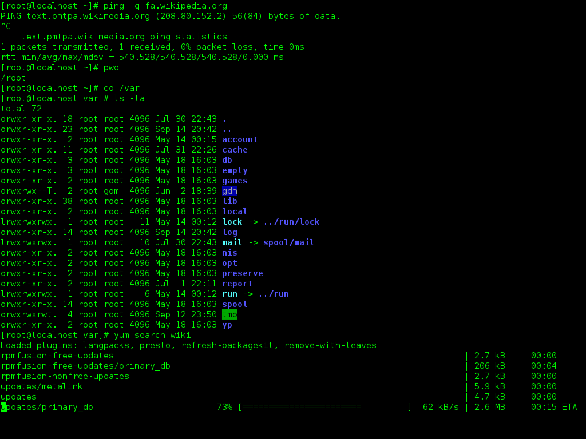
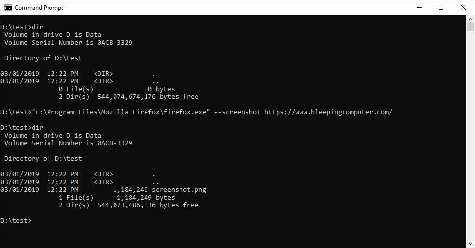
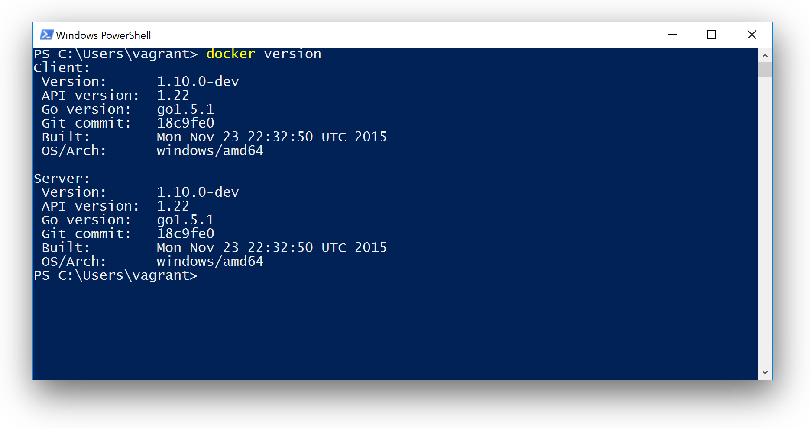

# Оболочки операционных систем, скрипты оболочек

## Оболочка как интерфейс операционной системы

**Оболочка (shell)** – это программа, обеспечивающая интерфейс взаимодействия пользователя с операционной системой через ввод текстовых команд. Она работает поверх ядра ОС и взаимодействует с ним через системные вызовы.



Ключевые характеристики:
- интерпретирует текстовые команды; 
- запускает программы; 
- управляет процессами; 
- работает с переменными окружения; 
- связывает программы через потоки ввода/вывода.

**Shell** позволяет:
- запускать программы;
- передавать им параметры;
- связывать их через потоки;
- управлять их жизненным циклом;
- автоматизировать повторяющиеся действия.

Оболочка является процессом. Когда открывается терминал, система:
1. создаёт процесс оболочки;
2. оболочка ждёт ввода команды;
3. пользователь вводит команду;
4. оболочка:
   - анализирует строку,
   - находит исполняемый файл,
   - создаёт новый процесс,
   - передаёт управление программе.

Каждый процесс в операционной системе имеет собственное окружение. Оболочка хранит переменные окружения, которые передаются к дочерним процессам. Пример переменных: `PATH`, `HOME`, `USER`.

С оболочкой можно работать в интерактивном режиме через терминал или в режиме исполнения скрипта.

## Виды оболочек

### Unix-подобные

#### Bourne shell (sh)

Исторически первая массовая Unix-оболочка (1977).

Особенности:
- минималистичная;
- предназначена для скриптов;
- заложила базовый синтаксис `if`, `for`, `while`;
- высокая переносимость.

Современные системы редко используют «чистый» sh — чаще это совместимая реализация (например, `dash`).

#### Bash

Самая распространённая оболочка в Linux.

Особенности:
- расширение sh; 
- интерактивные возможности (history, автодополнение); 
- встроенные команды; 
- массивы; 
- развитый синтаксис скриптов.

#### Zsh

Особенности:
- продвинутое автодополнение;
- мощная кастомизация;
- плагины (например, Oh My Zsh);
- удобна для повседневной работы.

Zsh ориентирована на удобство пользователя, а не на строгую переносимость скриптов.

### Windows

#### Command Prompt

Классическая оболочка Windows.

Особенности:
- простой синтаксис; 
- ограниченные возможности автоматизации; 
- наследие MS-DOS; 
- текстовый вывод.

Ограничения:
- слабая поддержка сложных структур; 
- неудобная работа с потоками; 
- низкая выразительность по сравнению с Unix-shell.



#### PowerShell

Современная оболочка Microsoft.

PowerShell работает с объектами, а не с текстом.

Особенности:
- .NET-объекты в конвейере; 
- мощная автоматизация; 
- полноценный язык сценариев; 
- кроссплатформенность (PowerShell Core).



## Основные понятия работы в shell

### Процесс

Процесс — это запущенная программа.

Когда пользователь вводит `ls`, оболочка:
- создаёт новый процесс;
- передаёт управление исполняемому файлу;
- ждёт завершения.

Процесс может выполняться на переднем плане (Foreground):
```
sleep 100
```

Процесс может выполняться в фоне (Background):
```
sleep 100 &
```

Просмотр фоновых задач:
```
jobs
```

Для управления процессами посылаются сигналы:
- SIGINT (Ctrl+C)
- SIGTERM
- SIGKILL

### Переменные окружения

Каждый процесс имеет окружение – набор переменных.

Посмотреть переменные окружения:
```
env
```

### Потоки

| Дескриптор | Название | Назначение |
| ---------- | -------- | ---------- |
| 0          | stdin    | ввод       |
| 1          | stdout   | вывод      |
| 2          | stderr   | ошибки     |

## Понятие shell-скрипта

Shell-скрипт – это текстовый файл, содержащий команды оболочки, которые выполняются последовательно.

Пример простейшего скрипта:
```
echo "Hello"
pwd
date
```

Это те же команды, которые можно ввести вручную в терминале.
Разница только в том, что они записаны в файл.

В отличие от компилируемых программ:

| Бинарная программа   | Shell-скрипт               |
| -------------------- | -------------------------- |
| Компилируется        | Интерпретируется           |
| Машинный код         | Текст                      |
| Запускается напрямую | Запускается через оболочку |

Запуск скрипта:
```
bash script.sh
```

### Shebang

Первая строка скрипта может выглядеть так:
```
#!/bin/bash
```

- `#!` – специальная сигнатура;
- `/bin/bash` – путь к интерпретатору.

Если shebang отсутствует – запуск через `./script.sh` может не сработать.

## Синтаксис bash

### Переменные

#### Объявление

```bash
name="var"
```

Без пробелов вокруг `=`.

#### Использование

```bash
echo $name
echo "${name}"
```

Рекомендуется использовать фигурные скобки при сложных выражениях.

### Аргументы скрипта

```bash
$0   # имя скрипта
$1   # первый аргумент
$2   # второй аргумент
$@   # все аргументы
$#   # количество аргументов
$?   # код возврата последней команды
$$   # PID текущего процесса
```

Пример:

```bash
echo "Первый аргумент: $1"
```

### Условные конструкции

#### if

```bash
if [ "$a" = "test" ]; then
    echo "OK"
elif [ "$a" = "other" ]; then
    echo "Other"
else
    echo "No match"
fi
```

Пробелы внутри `[ ]` обязательны.

#### Расширенная форма (рекомендуется)

```bash
if [[ $a == test ]]; then
    echo "OK"
fi
```

### Проверки файлов

```bash
-f file.txt   # обычный файл
-d dir        # каталог
-e file       # существует
-r file       # доступен для чтения
-w file       # доступен для записи
-x file       # исполняемый
```

Пример:

```bash
if [[ -f "$1" ]]; then
    echo "Файл существует"
fi
```

### Циклы

#### for

```bash
for i in 1 2 3; do
    echo $i
done
```

По файлам:

```bash
for file in *.txt; do
    echo $file
done
```


#### while

```bash
i=1
while [ $i -le 5 ]; do
    echo $i
    ((i++))
done
```

### Арифметика

```bash
a=5
b=3
echo $((a + b))
```

Инкремент:

```bash
((a++))
```

### Функции

```bash
greet() {
    echo "Hello, $1"
}

greet "World"
```

### Ввод пользователя

```bash
read name
echo "Hello $name"
```

С приглашением:

```bash
read -p "Введите имя: " name
```

### Перенаправление

```bash
command > file.txt      # перезапись
command >> file.txt     # добавление
command 2> error.txt    # ошибки
command > all.txt 2>&1  # всё в один файл
```

### Конвейеры

```bash
ls | grep ".txt" | wc -l
```

stdout одной команды → stdin другой.

### Подстановки

#### Подстановка команды

```bash
date_now=$(date)
```

Или старая форма:

```bash
date_now=`date`
```

### Работа со строками

Длина строки:

```bash
echo ${#str}
```

Подстрока:

```bash
echo ${str:1:3}
```

### Завершение скрипта

```bash
exit 0   # успех
exit 1   # ошибка
```

### Минимальный шаблон правильного скрипта

```bash
#!/bin/bash

set -e  # остановка при ошибке

if [[ $# -eq 0 ]]; then
    echo "Нет аргументов"
    exit 1
fi

echo "Первый аргумент: $1"
```
