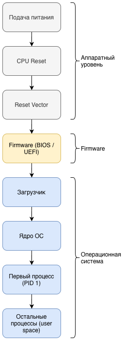
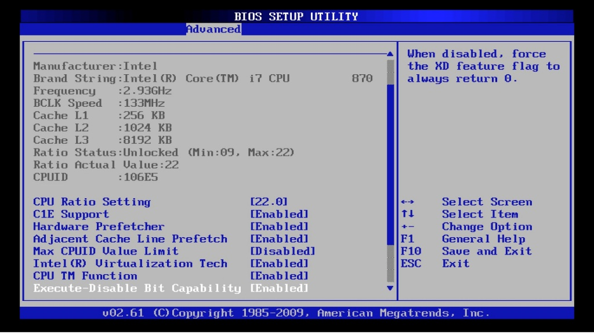
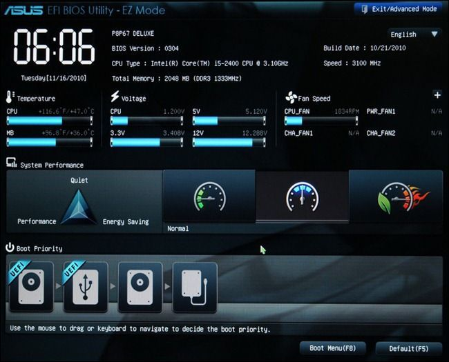

# Загрузчик операционной системы и модель процессов

## Запуск операционной системы

### Процесс запуска компьютера

#### 1. Подача питания

При подаче питания:
- на материнскую плату поступает электрический сигнал;
- процессор получает сигнал аппаратного сброса (reset);
- оперативная память ещё не инициализирована;
- в RAM отсутствует какой-либо код операционной системы.

#### 2. CPU Reset

После подачи питания процессор переходит в состояние сброса.

Это означает:
- регистры устанавливаются в предопределённые значения;
- процессор готов начать выполнение кода;
- включается механизм reset vector.

#### Reset Vector

Reset Vector – это фиксированный адрес памяти, с которого процессор начинает выполнение кода после сброса.

Этот адрес:
- задан архитектурой процессора;
- указывает на постоянную память (ROM/Flash);
- содержит прошивку системы.

#### Firmware (BIOS / UEFI)

На этом этапе начинает работать прошивка (firmware):
- BIOS;
- UEFI.

Firmware выполняет:
- инициализацию оперативной памяти;
- настройку контроллеров;
- обнаружение устройств хранения;
- базовую проверку оборудования (POST).

##### BIOS

- исторически старая модель;
- 16-битная среда;
- загрузка через MBR;
- ограничения по объёму дисков.

##### UEFI

- современный стандарт;
- 32/64-битная среда;
- поддержка GPT;
- поддержка больших дисков;
- механизм Secure Boot.

#### 5. Загрузчик

После завершения firmware управление передаётся загрузчику.

Примеры загрузчиков:
- GRUB;
- Windows Boot Manager;
- U-Boot.

Функции загрузчика:
- найти ядро операционной системы;
- загрузить его в оперативную память;
- передать ядру параметры запуска;
- передать управление ядру.

#### 6. Ядро операционной системы

После передачи управления начинает работать ядро ОС.

Ядро выполняет:
- инициализацию системы управления памятью (MMU);
- настройку таблиц страниц;
- настройку прерываний;
- инициализацию драйверов устройств;
- монтирование корневой файловой системы.

На этом этапе появляется полноценная операционная система как программная среда.

#### 7. Первый процесс (PID 1)

После инициализации ядро запускает первый пользовательский процесс.

В Linux это обычно:
- systemd;
- исторически – init.

Этот процесс:
- получает PID 1;
- является корнем дерева процессов;
- запускает системные службы;
- формирует пользовательское пространство.

#### 8. Остальные процессы (user space)

После запуска PID 1 начинается:
- запуск служб;
- запуск демонов;
- запуск оболочек;
- запуск пользовательских программ.

Формируется дерево процессов.

С этого момента система функционирует в полноценном режиме многозадачности.

## Модель процесса

После запуска первого процесса (PID 1) система переходит к выполнению множества процессов.

### Программа и процесс

#### Программа

Программа – это:
- файл на диске;
- набор инструкций и данных;
- пассивная сущность.

Программа не выполняется сама по себе.

Она существует как:
- бинарный файл (например, /bin/bash);
- исполняемый модуль;
- библиотека.

#### Процесс

Процесс – это:
- выполняющаяся программа;
- активный объект в памяти;
- единица управления со стороны операционной системы.

Одна программа может породить множество процессов.

Пример:
- Открытие нескольких терминалов.
- Запуск одной и той же команды несколько раз.
- Создание дочерних процессов.

Каждый из них имеет:
- собственный PID;
- собственное состояние;
- собственный контекст выполнения.

#### Состав процесса

Процесс – это не только исполняемый код.

Операционная система хранит для каждого процесса структуру данных (часто называемую PCB – Process Control Block).

Процесс включает:
- **Код (text segment)** – это машинные инструкции программы, которые выполняет процессор. Код загружается из исполняемого файла и обычно размещается в памяти как область только для чтения; при запуске нескольких экземпляров одной программы этот сегмент может быть физически общим, но процессы остаются логически независимыми.
- **Данные (data segment)** – это область памяти, где хранятся глобальные и статические переменные программы. Эти данные существуют на протяжении всей жизни процесса и инициализируются при его запуске; сюда входят как явно инициализированные переменные, так и область BSS для неинициализированных.
- **Стек (stack)** – это область памяти, используемая для хранения локальных переменных функций, параметров вызова и адресов возврата. Стек работает по принципу LIFO и автоматически управляется во время вызовов функций; при каждом входе в функцию создаётся новый стековый кадр, а при выходе он уничтожается.
- **Куча (heap)** – это область динамической памяти, из которой процесс может запрашивать память во время выполнения (например, через malloc или new). В отличие от стека, время жизни объектов в куче определяется логикой программы, и неправильное управление ею может приводить к утечкам или повреждению памяти.
- **Значения регистров процессора** – это текущие значения всех аппаратных регистров CPU, относящихся к процессу (регистры общего назначения, указатели и флаги). При переключении контекста операционная система сохраняет и восстанавливает эти значения, чтобы процесс мог продолжить выполнение с того же состояния.
- **Счётчик команд (Program Counter)** – это специальный регистр, содержащий адрес следующей инструкции для выполнения. Он определяет, где именно в коде находится процесс; при переключении между процессами ОС сохраняет и восстанавливает этот адрес, обеспечивая корректное продолжение работы.
- **Таблица открытых файлов** – это структура, в которой хранятся дескрипторы файлов, сокетов, каналов и других ресурсов ввода-вывода, открытых процессом. Через эту таблицу процесс взаимодействует с внешним миром, а операционная система отслеживает доступ к ресурсам и их состояние.
- **Идентификатор процесса (PID)** – это уникальный номер, который операционная система присваивает каждому процессу для его идентификации. PID используется для управления процессами, отправки сигналов, отслеживания состояния и построения иерархии процессов.
- **Информация о родителе (PPID)** – это идентификатор процесса, который создал текущий процесс. Благодаря PPID процессы образуют дерево, где каждый процесс (кроме первого) имеет родителя; эта связь используется для управления жизненным циклом и наследования ресурсов.

### Жизненный цикл процесса

Процесс не существует в одном состоянии.

Он проходит несколько состояний:
- new – создан;
- ready – готов к выполнению;
- running – выполняется;
- waiting – ожидает событие (например, ввод-вывод);
- terminated – завершён.

В большинстве UNIX-подобных систем процессы образуют дерево.

Каждый процесс:
- имеет родителя (PPID);
- может создавать дочерние процессы;
- наследует часть ресурсов.

Корнем дерева является процесс с PID 1.

### Пространства исполнения

В архитектуре ОС различаются два режима выполнения:

Kernel space
- привилегированный режим;
- доступ к аппаратуре;
- управление памятью;
- обработка прерываний.

User space
- выполнение пользовательских программ;
- ограниченные привилегии;
- отсутствие прямого доступа к железу.

Процесс в user space не может напрямую управлять устройствами.

Для взаимодействия с ядром используются системные вызовы.
