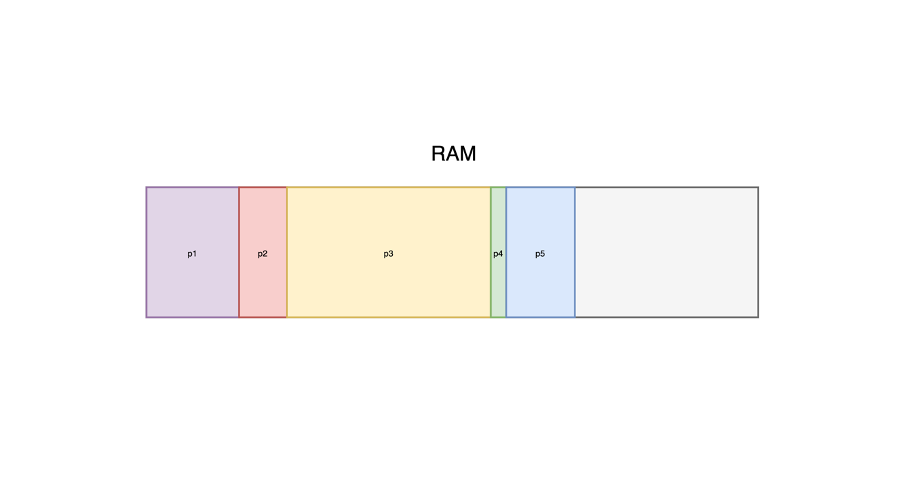
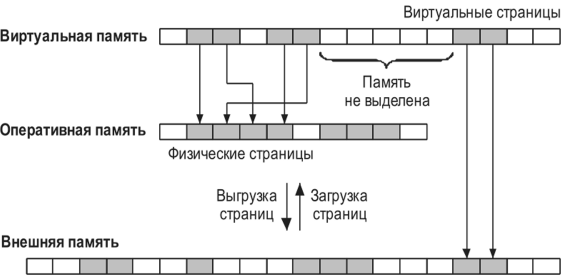
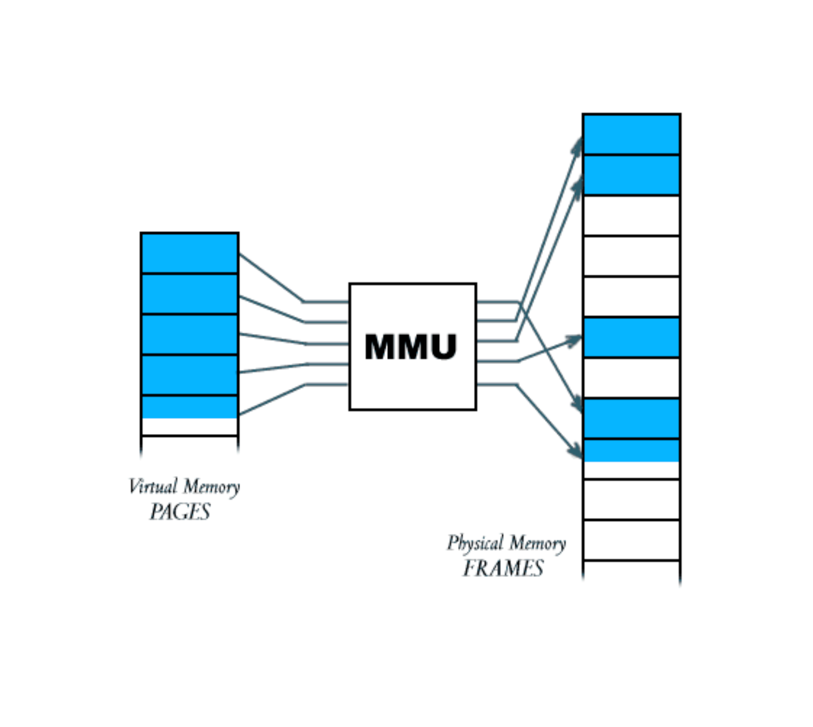
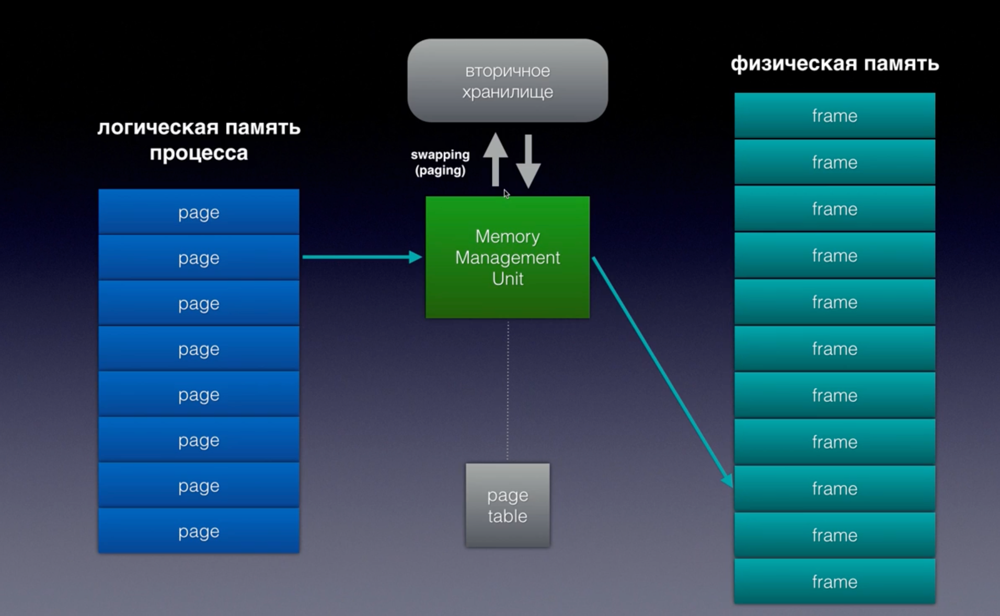

# Управление памятью

## Зачем операционная система управляет памятью

### Проблема №1: Конфликт процессов

Если бы не было управления памятью: все процессы работали бы в одном общем адресном пространстве любой процесс мог бы:

- прочитать чужие данные
- перезаписать чужую память
- сломать другую программу



### Проблема №2: Отсутствие изоляции (безопасность)

Представьте, что вредоносная программа может:

- читать память браузера
- получить пароли
- украсть токены

ОС должна гарантировать: один процесс не может получить доступ к памяти другого.

### Проблема №3: Ограниченность памяти

Оперативная память – ресурс ограниченный.

Пример:

- 16 ГБ RAM
- Chrome может съесть 4–8 ГБ
- IDE – ещё 1–2 ГБ
- система – ещё

И всё равно запускаются новые процессы.

### Проблема №4: Неэффективное использование памяти

Если бы всё было напрямую:

- память бы выделялась кусками
- оставались бы "дыры"
- нельзя было бы гибко перераспределять

Классическая проблема фрагментации.

### Основные задачи управления памятью

- Изоляция процессов – каждый процесс работает так, как будто он один в системе.
- абстракция памяти – у процесса есть "своя непрерывная память".
- Эффективное использование RAM – память переиспользуется, освобождается, перераспределяется.
- Поддержка многозадачности – без управления памятью нельзя запустить несколько программ одновременно.

## Понятие адресного пространства

**Адресное пространство процесса** – это диапазон адресов, доступных программе для работы с памятью.

Процесс работает не с физической памятью напрямую, а с набором адресов, которые ему предоставляет операционная система.

### Ключевые особенности

* каждый процесс имеет **собственное адресное пространство**
* адресное пространство **изолировано** от других процессов
* процесс воспринимает память как **непрерывную**

Один и тот же адрес в разных процессах:

* может существовать одновременно
* но соответствует **разным данным**

```
Процесс A: адрес 0x1000 → данные A
Процесс B: адрес 0x1000 → данные B
```

### Иллюзия непрерывной памяти

С точки зрения процесса память выглядит как:

* единое непрерывное пространство
* от минимального адреса до максимального

При этом:

* процесс не знает, где физически находятся данные
* размещением управляет ОС

**Адресное пространство – это абстракция, а не реальная память.**

### Структура адресного пространства

Адресное пространство процесса обычно разделено на несколько областей.

#### Основные области

* **Code (Text)** – машинные инструкции программы
* **Data** – глобальные и статические переменные
* **Heap** – динамическая память
* **Stack** – стек вызовов функций

### Особенности областей

**Heap (куча):**

* используется для динамического выделения памяти
* растёт вверх (в сторону увеличения адресов)

**Stack (стек):**

* хранит локальные переменные и вызовы функций
* растёт вниз (в сторону уменьшения адресов)

### Схема адресного пространства

#### Изоляция процессов

Каждый процесс:

* имеет собственное адресное пространство
* не может напрямую обращаться к памяти других процессов

Это обеспечивает:

* безопасность
* стабильность системы

Ошибка в одном процессе не должна влиять на другие процессы.

#### Виртуальные адреса

Адреса, с которыми работает программа, называются **виртуальными адресами**.

Они:
* генерируются программой
* не совпадают с физическими адресами в памяти

Далее эти адреса будут преобразовываться операционной системой.

## Понятие виртуальной памяти

**Виртуальная память** – это механизм, при котором процесс работает не с физической памятью напрямую, а с абстрактным (виртуальным) адресным пространством.

Операционная система:

* предоставляет процессу виртуальные адреса
* сама определяет, где реально находятся данные



### 1. Изоляция процессов

* каждый процесс работает в своём адресном пространстве
* процессы не могут напрямую обращаться к памяти друг друга

### 2. Удобная модель для программирования

* программа работает с непрерывной памятью
* не нужно учитывать реальное расположение данных

### 3. Возможность использовать больше памяти, чем есть в RAM

* часть данных может храниться на диске
* создаётся эффект "большой памяти"

### Роль операционной системы

ОС:

* управляет отображением виртуальной памяти в физическую
* отслеживает, какие данные находятся в RAM
* при необходимости загружает данные с диска

### Роль аппаратуры (MMU)

Преобразование адресов выполняется с помощью:

**MMU (Memory Management Unit)** – аппаратного блока процессора

Он:

* принимает виртуальный адрес
* преобразует его в физический
* делает это очень быстро (на уровне процессора)



## Понятие пейджинга

**Пейджинг** – это механизм организации памяти, при котором:

* виртуальная память разбивается на **страницы (pages)**
* физическая память разбивается на **кадры (frames)**

### Размер страницы

* обычно: **4 КБ**
* задаётся архитектурой и ОС

### Таблица страниц

Для сопоставления используется:

**таблица страниц (page table)**

Она хранит соответствие:

* виртуальная страница → физический кадр

| Виртуальная страница | Физический кадр |
|----------------------|-----------------|
| 0                    | 5               |
| 1                    | 2               |
| 2                    | 9               |
| 3                    | 1               |

### Как происходит доступ к памяти

1. процесс обращается к виртуальному адресу
2. адрес разбивается на:
    * номер страницы
    * смещение внутри страницы
3. по номеру страницы находится физический кадр
4. формируется физический адрес



### Преимущества пейджинга

### 1. Отсутствие внешней фрагментации

* память делится на фиксированные блоки
* нет "дыр" между выделенными областями

### 2. Гибкость размещения

* страницы можно размещать в любом свободном месте
* не требуется непрерывный участок памяти

### 3. Простота управления

* одинаковый размер страниц упрощает работу ОС

## Недостатки

### 1. Внутренняя фрагментация

* последняя страница может быть заполнена не полностью

### 2. Дополнительные накладные расходы

* требуется хранить таблицы страниц
* требуется преобразование адресов

## Понятие Page Fault

**Page Fault (ошибка страницы)** – это ситуация, при которой процесс обращается к странице памяти, которая отсутствует в
оперативной памяти (RAM).

### Когда возникает Page Fault

Page fault происходит, если:

* страница ещё не была загружена в память
* страница была выгружена ранее
* доступ к памяти осуществляется впервые

### Алгоритм обработки Page Fault

При обращении к отсутствующей странице ОС выполняет следующие шаги:

1. процесс обращается к виртуальному адресу
2. MMU обнаруживает, что страницы нет в RAM
3. генерируется прерывание (page fault)
4. управление передаётся операционной системе
5. ОС находит нужную страницу на диске
6. загружает её в RAM
7. обновляет таблицу страниц
8. процесс продолжает выполнение

### Понятие подкачки (Swap)

**Swap (подкачка)** – это механизм использования диска в качестве расширения оперативной памяти.

### Как работает swap

Если оперативная память заполнена:

* ОС выбирает страницу, которую можно временно убрать
* записывает её на диск
* освобождает место в RAM
* загружает новую страницу

### Зачем нужны алгоритмы замещения

При нехватке оперативной памяти возникает ситуация:

* нужно загрузить новую страницу в RAM
* свободного места нет

Ключевая задача ОС – определить, какую страницу удалить из памяти с минимальными потерями производительности

### Основные алгоритмы

#### FIFO (First In, First Out)

Удаляется страница, которая была загружена раньше всех.

##### Пример

Последовательность страниц в памяти:

```
[1][2][3]
```

При загрузке страницы 4:

```
удаляется 1 → [2][3][4]
```

##### Преимущества

* простота реализации
* низкие накладные расходы

##### Недостатки

* не учитывает частоту использования
* может удалять активно используемые страницы

#### LRU (Least Recently Used)

Удаляется страница, которая не использовалась дольше всего.

##### Пример

```
[1][2][3]
```

Если страница 1 использовалась недавно, а 2 — давно:

```
удаляется 2
```

##### Преимущества

* учитывает реальное использование памяти
* обычно даёт лучшую производительность

##### Недостатки

* сложнее реализовать
* требует отслеживания обращений
