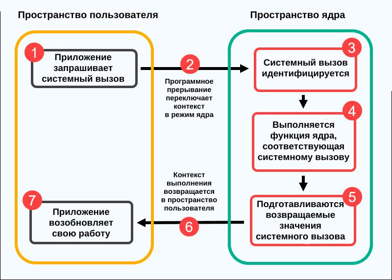

# Системные вызовы и взаимодействие с ядром

Системные вызовы – это механизм, через который пользовательские программы взаимодействуют с ядром операционной системы.

Они выполняют роль **посредника**, обеспечивая:

* безопасность
* контроль доступа
* изоляцию ресурсов

## Определение

**Системный вызов** – это интерфейс между:

* пользовательским пространством (программы)
* ядром операционной системы

Программы используют системные вызовы для выполнения операций:

* чтение и запись файлов
* работа с памятью
* управление процессами
* сетевое взаимодействие

При вызове происходит:

* переход из user mode → kernel mode
* выполнение операции ядром
* возврат результата

## Зачем нужны системные вызовы

### Основные задачи:

**1. Разграничение доступа**

* программы не могут напрямую обращаться к ресурсам
* ядро контролирует все операции

**2. Управление ресурсами**

* CPU
* память
* устройства
* файловая система

**3. Абстракция**

* разработчику не нужно знать детали железа

**4. Безопасность**

* проверка прав доступа
* защита от ошибок и атак

## Принцип работы

Общий алгоритм:

1. Программа вызывает функцию (например `read()`)
2. Выполняется переход в режим ядра
3. Ядро определяет тип вызова
4. Выполняется нужная операция
5. Формируется результат
6. Возврат в пользовательский режим
7. Программа продолжает выполнение

## Свойства системных вызовов

* **Безопасность** – защита системы
* **Абстракция** – скрытие деталей оборудования
* **Контроль доступа** – проверка прав
* **Согласованность** – единый интерфейс на разных устройствах
* **Синхронность** – часто блокируют процесс до завершения

## Основные функции

Системные вызовы обеспечивают:

* управление процессами
* работу с файлами
* доступ к устройствам
* выделение ресурсов
* получение системной информации
* межпроцессное взаимодействие (IPC)
* сетевое взаимодействие
* обработку ошибок

## Классификация системных вызовов

Отличный момент, который обычно все упускают:
если не показать **конкретные системные вызовы**, у студентов остаётся абстракция.

Сделаю тебе аккуратный, лекционный вариант – с реальными вызовами (в стиле Linux / POSIX).

### Управление процессами

Основные системные вызовы:

* `fork()` – создание нового процесса
* `execve()` – запуск программы в процессе
* `exit()` – завершение процесса
* `wait()` / `waitpid()` – ожидание завершения дочернего процесса
* `getpid()` – получить ID процесса
* `getppid()` – получить ID родительского процесса
* `kill()` – отправка сигнала процессу

### Работа с файлами

* `open()` – открыть файл
* `read()` – чтение из файла
* `write()` – запись в файл
* `close()` – закрыть файл
* `lseek()` – перемещение указателя в файле
* `stat()` / `fstat()` – получение информации о файле
* `unlink()` – удаление файла
* `rename()` – переименование файла

### Управление памятью

* `brk()` / `sbrk()` – изменение размера кучи
* `mmap()` – отображение файла или области в память
* `munmap()` – освобождение отображённой памяти
* `mprotect()` – изменение прав доступа к памяти

### Работа с устройствами

(в Unix устройства = файлы)

* `open()` – открыть устройство
* `read()` – чтение с устройства
* `write()` – запись на устройство
* `ioctl()` – управление устройством (ключевой вызов)

### Взаимодействие и сеть

#### IPC

* `pipe()` – создание канала
* `shmget()` / `shmat()` – работа с shared memory
* `msgget()` / `msgsnd()` – очереди сообщений

#### Сокеты

* `socket()` – создание сокета
* `bind()` – привязка к адресу
* `listen()` – перевод в режим ожидания
* `accept()` – принятие соединения
* `connect()` – подключение
* `send()` / `recv()` – передача данных

### Безопасность и доступ

* `chmod()` – изменение прав доступа
* `chown()` – изменение владельца
* `umask()` – установка маски прав
* `setuid()` / `setgid()` – смена пользователя/группы
* `access()` – проверка прав доступа

## Обработка ошибок

Системный вызов возвращает:

* успешный результат
* или код ошибки

Дополнительно используется:

* `errno` – хранит причину ошибки

## Передача параметров

Особенности:

* используется ограниченное число параметров
* часто применяются **регистры CPU**
* сложные данные передаются через **указатели**
* ядро проверяет корректность данных
* данные копируются между user space и kernel space

Важно:

> ядро не доверяет пользовательскому пространству
