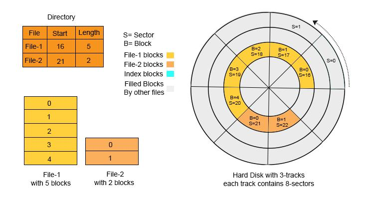
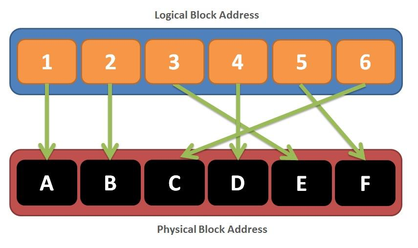

# Устройства хранения, разметка дисков, файловые системы операционной системы

## Постановка проблемы хранения данных

Одной из базовых задач любой операционной системы является организация долговременного хранения данных. В отличие от
оперативной памяти, содержимое которой теряется при выключении питания, устройства хранения обеспечивают сохранность
информации между сеансами работы.

На физическом уровне устройство хранения (жёсткий диск, твердотельный накопитель и др.) представляет собой **линейную
последовательность байтов**, не обладающую встроенной логической структурой. В этой последовательности отсутствуют:

* файлы
* каталоги
* имена
* логическая группировка данных

Таким образом, исходная модель хранения данных является **неструктурированной**.

---

### Противоречие между физическим уровнем и пользовательской моделью

Пользователь и прикладные программы оперируют следующими сущностями:

* файл (document.txt, image.png)
* каталог (/home/user)
* путь к файлу
* операции чтения и записи

Данная модель существенно отличается от физической реальности устройства хранения. Возникает фундаментальное
противоречие:

> Физический носитель представляет собой неструктурированный массив данных, в то время как пользователь ожидает
> структурированную и удобную систему хранения.

---

### Роль операционной системы

Операционная система решает указанное противоречие путём введения **абстракций**, которые скрывают сложность
низкоуровневого представления данных.

Ключевые абстракции:

* файл
* каталог
* файловая система
* путь
* права доступа

Следует подчеркнуть, что:

> Файл не является физическим объектом, существующим на устройстве хранения. Это логическая сущность, формируемая
> операционной системой на основе структуры данных.

---

### Демонстрационные примеры

#### Создание файла

```bash
echo "hello" > file.txt
```

Анализ свойств файла:

```bash
ls -l file.txt
stat file.txt
```

Цель демонстрации:

* показать, что файл описывается набором метаданных
* обратить внимание на отсутствие прямой связи между именем и содержимым

---

#### Просмотр устройств хранения

Linux:

```bash
lsblk
```

macOS:

```bash
diskutil list
```

Анализ вывода:

* физические устройства
* разделы
* точки монтирования

Контрольный вопрос:

> Где в данной структуре представлен созданный ранее файл?

Ожидаемый вывод: файл не отображается на уровне устройств, так как относится к более высокому уровню абстракции.

---

#### Использование дискового пространства

```bash
df -h
```

Анализ:

* общий объём файловой системы
* занятое и свободное пространство

---

## Роль устройств хранения в операционной системе

### Общая характеристика

Устройства хранения данных являются неотъемлемым компонентом вычислительной системы и выполняют функцию *
*долговременного хранения информации**. В отличие от оперативной памяти, они обеспечивают сохранение данных независимо
от состояния питания.

В операционной системе устройства хранения рассматриваются как **ресурс**, управление которым осуществляется через
подсистему ввода-вывода.

---

### Основные функции устройств хранения

В контексте операционной системы устройства хранения выполняют следующие функции:

#### Хранение пользовательских данных

* документы
* мультимедиа
* базы данных

#### Хранение программного обеспечения

* исполняемые файлы
* библиотеки
* конфигурационные файлы

#### Обеспечение загрузки системы

* хранение загрузчика
* хранение ядра операционной системы

#### Организация виртуальной памяти

* использование подкачки (swap)
* расширение доступного адресного пространства

---

### Устройства хранения как часть подсистемы ввода-вывода

Операционная система взаимодействует с устройствами хранения через слой абстракций:

* драйверы устройств
* системные вызовы
* буферизацию и кэширование

Важно подчеркнуть:

> Доступ к устройствам хранения осуществляется не напрямую приложениями, а через операционную систему.

Это обеспечивает:

* безопасность
* изоляцию процессов
* контроль доступа

---

### Особенности работы устройств хранения

#### Существенно большая задержка доступа

По сравнению с оперативной памятью:

* доступ к RAM: наносекунды
* доступ к диску: микросекунды и миллисекунды

Следствие:

> Операции ввода-вывода являются узким местом системы

---

#### Блочная организация доступа

Устройства хранения работают не с отдельными байтами, а с блоками фиксированного размера.

Следствие:

* чтение даже одного байта приводит к загрузке целого блока
* эффективность зависит от характера доступа (последовательный/случайный)

---

#### Ограничения и особенности физических носителей

* наличие механических задержек (для HDD)
* ограничение числа циклов записи (для SSD)
* необходимость выравнивания данных

---

### Буферизация и кэширование

Для повышения производительности операционная система использует:

#### Буферизацию

* временное хранение данных перед записью

#### Кэширование

* хранение часто используемых данных в оперативной памяти

Пример:

* повторное чтение файла может происходить без обращения к диску

---

### Взаимодействие с процессами

Процессы работают с файлами через системные вызовы:

* open()
* read()
* write()
* close()

При этом:

> Процесс не взаимодействует с устройством хранения напрямую, а работает с абстракцией файла.

---

### Практическая демонстрация

#### Влияние кэширования

```bash
time cat large_file.txt > /dev/null
time cat large_file.txt > /dev/null
```

Анализ:

* первое чтение медленнее
* второе быстрее за счёт кэша

---

#### Нагрузка на диск

```bash
dd if=/dev/zero of=test.img bs=1M count=100
```

Анализ:

* скорость записи
* влияние размера блока (bs)

---

## Виды устройств хранения

### Классификация устройств хранения

Устройства хранения данных можно классифицировать по следующим признакам:

#### По технологии хранения

* магнитные
* полупроводниковые (твердотельные)
* оптические

#### По способу подключения

* внутренние
* внешние

#### По назначению

* системные (для ОС)
* пользовательские
* архивные

---

### Магнитные накопители (HDD)

Жёсткий диск (HDD) основан на магнитной записи данных на вращающиеся пластины.

#### Основные характеристики:

* наличие механических компонентов
* вращение пластин (обычно 5400–7200 RPM)
* перемещение головки чтения/записи

#### Особенности работы:

* время поиска (seek time)
* задержка вращения (rotational latency)
* высокая стоимость случайного доступа

#### Преимущества:

* низкая стоимость за единицу объёма
* большой объём хранения

#### Недостатки:

* низкая скорость случайного доступа
* чувствительность к механическим воздействиям

---

### Твердотельные накопители (SSD)

SSD основан на использовании флеш-памяти и не содержит движущихся частей.

#### Основные характеристики:

* отсутствие механики
* высокая скорость доступа
* параллельная работа контроллера

#### Особенности работы:

* данные записываются блоками
* невозможность перезаписи без предварительного стирания
* ограниченное число циклов записи

#### Преимущества:

* высокая производительность
* низкая задержка доступа
* устойчивость к ударам

#### Недостатки:

* более высокая стоимость
* деградация ячеек памяти

---

### Ключевые различия HDD и SSD

| Характеристика          | HDD                 | SSD                      |
|-------------------------|---------------------|--------------------------|
| Принцип работы          | Механический        | Электронный              |
| Время доступа           | Миллисекунды        | Микросекунды             |
| Последовательный доступ | Быстрый             | Очень быстрый            |
| Случайный доступ        | Медленный           | Быстрый                  |
| Надёжность              | Зависит от механики | Зависит от износа памяти |

---

### Влияние типа устройства на работу ОС

Тип устройства хранения напрямую влияет на поведение операционной системы:

#### Для HDD:

* критична последовательность доступа
* важна дефрагментация
* планировщик ввода-вывода оптимизирует перемещение головки

#### Для SSD:

* случайный доступ практически не отличается от последовательного
* дефрагментация не требуется
* важны выравнивание и управление износом

---

### Дополнительные типы устройств

#### USB-накопители

* переносимые
* используют флеш-память
* ограниченная надёжность

#### Карты памяти

* применяются в мобильных устройствах
* аналогичны SSD по принципу

#### Оптические носители

* CD, DVD, Blu-ray
* используются для архивного хранения
* низкая скорость доступа

---

### Практическая демонстрация

#### Определение типа устройства

Linux:

```bash
lsblk -d -o name,rota,size
```

macOS:

```bash
printf "%-8s %-5s %-10s\n" "NAME" "ROTA" "SIZE"; \
for d in $(diskutil list | awk '/^\/dev\/disk/ {print $1}' | sed 's#/dev/##'); do \
  rota=$(diskutil info $d | awk -F': ' '/Solid State/ {print ($2=="Yes"?"0":"1")}'); \
  size=$(diskutil info $d | awk -F'[()]' '/Disk Size/ {print $2}'); \
  printf "%-8s %-5s %-10s\n" "$d" "$rota" "$size"; \
done
```

Анализ:

– поле `ROTA`
– 1 – устройство с вращением (HDD)
– 0 – твердотельное (SSD)

---

#### Сравнение скорости доступа

Создание тестового файла:

```bash
dd if=/dev/zero of=test.img bs=1M count=500
```

Чтение:

```bash
time cat test.img > /dev/null
```

---

## Низкоуровневое представление диска

### Общая характеристика

На низком уровне устройство хранения представляется операционной системе как **упорядоченная последовательность блоков
фиксированного размера**.

При этом физическая организация (дорожки, цилиндры, головки) в современных системах скрыта, и используется логическая
модель адресации.



---

### Сектор

Сектор является минимальной физической единицей хранения данных на устройстве.

Характеристики:

* фиксированный размер
* традиционно 512 байт
* современные устройства: 4096 байт (Advanced Format)

Особенности:

* чтение и запись происходят целыми секторами
* невозможно изменить один байт без чтения и перезаписи всего сектора

---

### Блок

Блок – это логическая единица, с которой работает файловая система.

Характеристики:

* состоит из одного или нескольких секторов
* типичный размер: 4 КБ

---

### Кластер

Кластер – это группа блоков, используемая некоторыми файловыми системами (например, FAT, NTFS).

Особенности:

* минимальная единица выделения места под файл
* файл занимает целое число кластеров

Следствие:

* возможна внутренняя фрагментация
* небольшой файл может занимать значительно больше места

---

### Логическая адресация (LBA)

Современные устройства используют Logical Block Addressing.



Суть:

* диск представляется как линейный массив блоков
* каждому блоку присваивается номер

```text id="h1k3mz"
Блок 0 → Блок 1 → Блок 2 → ... → Блок N
```

Преимущества:

* упрощение адресации
* независимость от физической геометрии диска

---

### Связь с файловой системой

Файловая система использует блоки для:

* хранения данных файлов
* хранения метаданных
* организации структуры каталогов

При этом:

* один файл может занимать множество блоков
* блоки могут быть расположены не последовательно

---

### Практическая демонстрация

#### Размер блока файловой системы

Linux:

```bash id="g7m2cx"
stat -f .
```

macOS:

```bash id="g7m2cx"
df -k .
```

Анализ:

* размер блока
* количество блоков

---

#### Прямое чтение устройства

Linux:

```bash id="4l9k2p"
sudo dd if=/dev/sda bs=512 count=1 | hexdump -C
```

macOS:

```bash
sudo dd if=/dev/disk0 bs=512 count=1 | hexdump -C
```

Цель:

* показать «сырые» данные
* продемонстрировать отсутствие структуры уровня файлов

---

#### Влияние размера блока

```bash id="m3x9qa"
dd if=/dev/zero of=test1.img bs=512 count=1024
dd if=/dev/zero of=test2.img bs=4096 count=128
```

Анализ:

* разное количество операций
* влияние на производительность

---

## Разделы диска

### Общая характеристика

Раздел диска представляет собой **логически обособленную область устройства хранения**, рассматриваемую операционной
системой как отдельное пространство для размещения данных.

Фактически раздел – это диапазон блоков (в терминах LBA), выделенный под определённые задачи.

Ключевая идея:

> Один физический диск может быть разделён на несколько независимых логических областей.

---

### Назначение разделов

Использование разделов позволяет решать ряд практических задач:

### Логическое разделение данных

* разделение системных и пользовательских данных
* изоляция различных типов информации

### Использование разных файловых систем

* один раздел может быть отформатирован в ext4
* другой – в NTFS или FAT

### Многосистемная конфигурация

* установка нескольких операционных систем
* разделение загрузочных областей

### Управление рисками

* повреждение одного раздела не затрагивает другие
* упрощение резервного копирования

---

### Представление раздела на уровне системы

С точки зрения операционной системы:

* каждый раздел представляется как отдельное устройство
* имеет собственную файловую систему
* может быть смонтирован независимо

Пример (Linux):

```bash id="h2k9qp"
lsblk
```

Типичный вывод:

```text
sda
├── sda1
├── sda2
└── sda3
```

Где:

* `sda` – физическое устройство
* `sda1`, `sda2`, `sda3` – разделы

---

### Границы разделов

Каждый раздел определяется:

* начальным блоком (start LBA)
* конечным блоком (end LBA)

Следствие:

> Раздел не содержит данных «сам по себе», он лишь указывает диапазон блоков на диске.

---

### Практическая демонстрация

#### Просмотр разделов

```bash id="9k3lpd"
lsblk -f
```

Анализ:

* список устройств
* файловые системы
* точки монтирования

---

#### Подробная информация о разделах

```bash id="7p4xzn"
fdisk -l
```

Анализ:

* размеры разделов
* типы
* границы

---

#### Связь раздела и точки монтирования

```bash id="k8w3bz"
df -h
```

Сопоставление:

* устройство
* точка монтирования
* файловая система

---

## Таблицы разделов (MBR, GPT)

### Назначение таблицы разделов

Для того чтобы операционная система могла определить:

* где начинается раздел
* где он заканчивается
* какого он типа

На диске хранится специальная структура – **таблица разделов**.

Ключевая идея:

> Таблица разделов описывает, как физическое пространство диска разбито на логические области.

---

### Основные стандарты

Существует два основных стандарта таблиц разделов:

* MBR
* GPT

Они отличаются архитектурой, ограничениями и уровнем надёжности.

---

### MBR (Master Boot Record)

#### Общая характеристика

MBR – исторически первый широко используемый стандарт разметки диска.

Особенности:

* располагается в первом секторе диска
* содержит загрузочный код и таблицу разделов
* ограничен по возможностям

#### Ограничения:

* максимальный размер диска: до 2 ТБ
* максимум 4 основных раздела

Для обхода ограничения по количеству разделов используется:

* расширенный раздел (extended)
* логические разделы внутри него

#### Недостатки:

* отсутствие резервной копии таблицы
* высокая вероятность потери данных при повреждении
* ограниченная масштабируемость

---

### GPT (GUID Partition Table)

#### Общая характеристика

GPT является современным стандартом, пришедшим на смену MBR.

Особенности:

* поддержка больших дисков (более 2 ТБ)
* практически неограниченное число разделов
* использование уникальных идентификаторов (GUID)

#### Преимущества:

* наличие резервной копии таблицы разделов
* контроль целостности (CRC)
* гибкость в управлении разделами

#### Архитектурные особенности:

* основная таблица в начале диска
* резервная копия в конце диска

---

### Сравнение MBR и GPT

| Характеристика       | MBR             | GPT             |
|----------------------|-----------------|-----------------|
| Максимальный размер  | ~2 ТБ           | > 2 ТБ          |
| Количество разделов  | до 4 (основных) | десятки и более |
| Надёжность           | низкая          | высокая         |
| Резервная копия      | отсутствует     | присутствует    |
| Контроль целостности | отсутствует     | реализован      |

---

### Защитный MBR

В GPT-дисках используется так называемый «защитный MBR».

Назначение:

* предотвращение ошибочного распознавания диска как неразмеченного
* обеспечение совместимости со старыми системами

---

### Связь с процессом загрузки

Таблица разделов участвует в процессе загрузки системы:

* в MBR загрузчик расположен непосредственно в первом секторе
* в GPT используется более гибкая схема с отдельным загрузочным разделом

---

### Практическая демонстрация

#### Определение типа таблицы разделов

```bash id="n4kz8x"
lsblk -o name,pttype
```

Анализ:

* `dos` – MBR
* `gpt` – GPT

---

#### Подробная информация о GPT

```bash id="x7q2lm"
sudo parted -l
```

Анализ:

* тип таблицы разделов
* список разделов
* размеры

---

#### Просмотр первого сектора (MBR)

```bash id="b3m8pd"
sudo dd if=/dev/sda bs=512 count=1 | hexdump -C
```

---

## Логические тома

### Общая характеристика

Логический том представляет собой **абстракцию над физическими устройствами и разделами**, позволяющую гибко управлять
дисковым пространством.

В отличие от обычных разделов, которые имеют фиксированные границы, логические тома могут:

* изменять размер
* объединять несколько устройств
* перераспределять пространство

Ключевая идея:

> Логический том – это не физическая область диска, а виртуальное пространство, формируемое операционной системой.

---

### Недостатки классических разделов

Перед введением логических томов необходимо обозначить ограничения традиционной схемы:

* фиксированный размер раздела
* невозможность динамического изменения без переразметки
* сложность объединения нескольких дисков
* неэффективное использование свободного пространства

Следствие:

> Классическая разметка плохо масштабируется и неудобна для гибкого управления ресурсами.

---

### Преимущества логических томов

### Гибкость

* изменение размера тома без потери данных

### Масштабируемость

* добавление новых устройств в группу

### Эффективное использование пространства

* перераспределение ресурсов между томами

### Дополнительные возможности

* создание снимков (snapshots)
* резервное копирование
* миграция данных

---

### Связь с файловой системой

Логический том используется аналогично разделу:

* на нём создаётся файловая система
* он монтируется в дерево каталогов

Важно:

> Файловая система не различает, работает ли она с физическим разделом или логическим томом.

---

### Практическая демонстрация

#### Просмотр логических томов

```bash id="q3x7vk"
lsblk
```

Анализ:

* наличие уровней `lvm`
* отображение логических томов

---

#### Подробная информация (при наличии прав)

```bash id="k8m2qp"
sudo lvdisplay
sudo vgdisplay
sudo pvdisplay
```

Анализ:

* структура томов
* размеры
* взаимосвязи

---

## Обнаружение устройств хранения операционной системой

### Общая характеристика

Для работы с устройствами хранения операционная система должна:

* обнаружить устройство
* определить его характеристики
* предоставить интерфейс доступа

Данный процесс называется **обнаружением (инициализацией) устройств** и выполняется при загрузке системы, а также при
подключении новых устройств.

Ключевая идея:

> Устройство хранения становится доступным системе только после его обнаружения и инициализации операционной системой.

---

### Роль ядра операционной системы

Обнаружение устройств осуществляется ядром операционной системы при взаимодействии с:

* драйверами устройств
* подсистемой ввода-вывода
* аппаратными интерфейсами (SATA, NVMe, USB)

Функции ядра:

* опрос аппаратных шин
* идентификация устройств
* загрузка соответствующих драйверов

---

### Использование драйверов устройств

Драйвер устройства – это программный компонент, обеспечивающий взаимодействие между операционной системой и аппаратным
обеспечением.

Функции драйвера:

* управление устройством
* обработка запросов чтения/записи
* преобразование команд ОС в команды устройства

Важно:

> Без драйвера устройство либо не будет обнаружено, либо не сможет использоваться.

---

### Представление устройств в системе

После обнаружения устройство представляется операционной системой в виде специального объекта.

В системах семейства Linux:

* устройства отображаются как файлы в каталоге `/dev`

пример:

* `/dev/sda` – диск
* `/dev/sda1` – раздел

---

### Динамическое обнаружение (plug-and-play)

Современные операционные системы поддерживают динамическое подключение устройств:

* USB-накопители
* внешние диски
* карты памяти

При подключении:

* генерируется событие
* система автоматически загружает драйвер
* устройство становится доступным

---

### Связь с файловой системой

Обнаружение устройства не означает, что оно готово к использованию.

Для работы с данными необходимо:

```text id="d7k3lm"
Обнаружение устройства → Определение разделов → Монтирование файловой системы
```

---

### Практическая демонстрация

#### Просмотр устройств

```bash id="v2k9xp"
ls /dev | grep sd
```

Анализ:

* список блочных устройств
* соответствие физическим дискам

---

#### Информация о подключении устройств

```bash id="m8q4zn"
dmesg | grep -i disk
```

Анализ:

* сообщения ядра
* процесс обнаружения устройств

---

#### Отслеживание подключения USB

```bash id="w3x7bt"
lsblk
```

Далее:

* подключение USB-накопителя
* повторный запуск команды

Наблюдение:

* появление нового устройства

---

## Подключение и монтирование

### Общая характеристика

После обнаружения устройства хранения операционной системой оно ещё не доступно для работы с данными. Для получения
доступа необходимо выполнить процедуру **монтирования**.

Монтирование – это процесс **подключения файловой системы к единому дереву каталогов операционной системы**.

---

### Единое дерево каталогов

В операционных системах семейства Unix используется единая иерархическая структура:

```text id="f3k9zn"
/
├── home
├── var
├── etc
└── media
```

---

### Точка монтирования

Точка монтирования – это каталог, в который «подключается» файловая система.

Примеры:

* `/mnt`
* `/media/usb`
* `/home`

После монтирования:

* содержимое устройства становится доступным через данный каталог
* прежнее содержимое каталога (если было) становится скрытым

---

### Процесс монтирования

Последовательность действий:

```text id="m7q2xp"
1. Обнаружение устройства
2. Определение файловой системы
3. Выбор точки монтирования
4. Выполнение монтирования
```

После выполнения:

* операционная система связывает устройство с каталогом
* все операции с файлами проходят через эту связь

---

### Автоматическое и ручное монтирование

### Автоматическое монтирование

* выполняется системой при загрузке
* используется для системных разделов
* конфигурируется (например, через `/etc/fstab`)

### Ручное монтирование

* выполняется пользователем или администратором
* используется для внешних устройств

---

### Размонтирование

Перед отключением устройства необходимо выполнить размонтирование.

Причины:

* завершение операций записи
* предотвращение потери данных
* освобождение ресурсов

Команда:

```bash id="u9k3lm"
umount /mnt
```

Важно:

> Извлечение устройства без размонтирования может привести к повреждению данных.

---

### Практическая демонстрация

#### Просмотр смонтированных файловых систем

```bash id="z8x2qp"
mount
```

или

```bash id="w4m7zn"
df -h
```

Анализ:

* устройства
* точки монтирования
* типы файловых систем

---

#### Связь устройства и каталога

```bash id="k2p9xt"
lsblk -f
```

Анализ:

* устройство
* файловая система
* точка монтирования

---

#### Ручное монтирование (при наличии прав)

```bash id="q7x4mv"
sudo mount /dev/sdb1 /mnt
```

Проверка:

```bash id="c9z3lp"
ls /mnt
```

---

## Безопасность и надёжность хранения

### Общая характеристика

При работе с устройствами хранения данных операционная система должна обеспечивать:

* сохранность данных
* защиту от несанкционированного доступа
* устойчивость к сбоям

---

### Основные угрозы

Надёжность хранения данных может быть нарушена по следующим причинам:

### Аппаратные сбои

* отказ устройства хранения
* повреждение носителя
* износ компонентов (особенно для SSD)

### Программные ошибки

* сбои файловой системы
* ошибки драйверов
* некорректная работа приложений

### Сбои питания

* внезапное отключение
* прерывание операций записи

### Человеческий фактор

* случайное удаление данных
* ошибки администрирования

---

### Целостность данных

Целостность означает, что:

* данные не повреждены
* структура файловой системы корректна
* операции записи завершены полностью

---

### Методы обеспечения надёжности

### Журналирование

Файловая система сначала записывает изменения в журнал, а затем применяет их к основной структуре.

Преимущества:

* возможность восстановления после сбоя
* уменьшение риска повреждения структуры

---

### Резервное копирование

* регулярное сохранение копий данных
* возможность восстановления после потери

---

### Избыточность (RAID)

RAID (Redundant Array of Independent Disks) – технология объединения нескольких устройств хранения.

Возможности:

* дублирование данных
* повышение производительности
* отказоустойчивость

---

### Проверка целостности

* контрольные суммы
* механизмы проверки структуры файловой системы

---

## Безопасность доступа

Операционная система обеспечивает контроль доступа к данным:

* права доступа (чтение, запись, выполнение)
* владельцы и группы
* изоляция процессов

---

### Практическая демонстрация

#### Права доступа к файлам

```bash id="z4m8xp"
ls -l
```

Анализ:

* права (r, w, x)
* владелец
* группа

---

#### Изменение прав

```bash id="p7k3zn"
chmod 400 file.txt
```

Проверка:

```bash id="x2q9lm"
ls -l file.txt
```

---

## Файловая система

### Общая характеристика

Файловая система представляет собой **способ организации данных на устройстве хранения**, обеспечивающий их
структурированное размещение, доступ и управление.

Она является ключевым компонентом операционной системы, связывающим:

* физическое устройство хранения
* логическое представление данных

---

### Назначение файловой системы

Файловая система выполняет следующие функции:

### Организация хранения данных

* размещение файлов на диске
* управление свободным пространством

### Управление структурой каталогов

* создание иерархии
* хранение имён файлов

### Хранение метаданных

* размер файла
* права доступа
* временные метки

### Обеспечение доступа

* чтение и запись данных
* поддержка операций над файлами

---

### Связь с предыдущими уровнями

Файловая система располагается поверх:

* физического устройства
* раздела или логического тома

Структура взаимодействия:

```text id="k2x7mn"
Устройство → Раздел → Файловая система → Файлы
```

---

### Внутренняя структура файловой системы

Файловая система включает несколько ключевых компонентов:

* область данных (data blocks)
* таблицы размещения
* структуры метаданных
* каталоги

Каждый из этих элементов выполняет свою роль в организации хранения.

---

### Управление свободным пространством

Файловая система должна отслеживать:

* какие блоки заняты
* какие блоки свободны

Для этого используются:

* битовые карты (bitmap)
* списки свободных блоков

---

### Размещение файлов на диске

Файлы могут размещаться:

* последовательно
* фрагментированно

Причины фрагментации:

* динамическое изменение размера файлов
* нехватка непрерывного пространства

Следствие:

* увеличение времени доступа (особенно для HDD)

---

### Абстракция файла

Файл в файловой системе представляет собой:

* логическую последовательность байтов
* связанную с набором метаданных

Важно:

> Файл не обязан храниться в одном месте на диске.

---

### Практическая демонстрация

#### Тип файловой системы

```bash id="x9k3mz"
df -T
```

Анализ:

* тип файловой системы
* точки монтирования

---

#### Информация о файловой системе

```bash id="q2w8ln"
stat -f .
```

Анализ:

* размер блока
* общее количество блоков
* свободное пространство

---

#### Создание и удаление файлов

```bash id="m7z4xp"
touch test.txt
rm test.txt
```

Обсуждение:

* что происходит с данными
* освобождаются ли блоки

---

## Основные элементы файловой системы

### Общая характеристика

Файловая система состоит из набора взаимосвязанных структур данных, обеспечивающих:

* хранение содержимого файлов
* хранение информации о файлах (метаданных)
* организацию структуры каталогов

---

### Область данных (Data Blocks)

Область данных предназначена для хранения содержимого файлов.

Характеристики:

* состоит из блоков фиксированного размера
* каждый блок может принадлежать конкретному файлу
* данные файлов разбиваются на части и размещаются по блокам

Особенности:

* файл может занимать один или несколько блоков
* блоки одного файла могут быть не связаны физически

---

### Метаданные файлов

Метаданные описывают файл, но не содержат его данные.

Типичные метаданные:

* размер файла
* права доступа
* владелец
* временные метки (создание, изменение, доступ)

Ключевой момент:

> Метаданные необходимы для управления файлом и доступа к нему.

---

### Структуры размещения данных

Файловая система должна хранить информацию о том, какие блоки принадлежат какому файлу.

Используются различные подходы:

* таблицы размещения (например, в FAT)
* индексные структуры (например, inode в Unix-системах)

Назначение:

* определение расположения данных файла
* обеспечение доступа к ним

---

### Каталоги

Каталог представляет собой структуру, связывающую:

* имя файла
* его метаданные

Особенности:

* каталог не содержит данные файлов
* он содержит записи (имя → ссылка на файл)

Следствие:

> Каталог является механизмом навигации, а не хранилищем данных.

---

### Управление свободным пространством

Файловая система должна отслеживать свободные блоки.

Основные методы:

* битовые карты (bitmap)
* списки свободных блоков

Функции:

* выделение пространства для новых файлов
* освобождение блоков при удалении

---

### Связь элементов файловой системы

Все элементы взаимодействуют следующим образом:

```text id="v3k8lm"
Каталог → имя файла → метаданные → указатели → блоки данных
```

Данная цепочка отражает путь от логического имени файла к физическим данным.

---

### Практическая демонстрация

#### Метаданные файла

```bash id="q9m2xp"
stat file.txt
```

Анализ:

* размер
* права доступа
* временные метки

---

#### Список файлов и их атрибуты

```bash id="z4k7ln"
ls -l
```

Анализ:

* права
* владелец
* размер

---

#### Изменение метаданных

```bash id="w8x3bt"
chmod 644 file.txt
touch file.txt
```

Обсуждение:

* изменение прав
* изменение времени доступа

---

## Логическая структура каталогов

### Общая характеристика

Файловая система предоставляет пользователю **иерархическую (древовидную) структуру каталогов**, позволяющую
организовывать данные в логически связанные группы.

Ключевая идея:

> Каталоги формируют логическую структуру хранения, не связанную напрямую с физическим размещением данных на диске.

---

### Древовидная структура

В основе лежит структура дерева с корневым каталогом:

```text id="p4k9zm"
/
├── home
│   └── user
├── etc
├── var
└── tmp
```

Особенности:

* существует один корневой каталог (`/`)
* каждый каталог может содержать файлы и подкаталоги
* структура может иметь произвольную глубину

---

### Пути к файлам

Для идентификации файлов используются пути.

### Абсолютный путь

* начинается от корневого каталога
* пример: `/home/user/file.txt`

### Относительный путь

* задаётся относительно текущего каталога
* пример: `documents/file.txt`

---

### Связь каталогов с файловой системой

Каталог представляет собой специальный тип файла, содержащий:

* имена файлов
* ссылки на соответствующие структуры метаданных

Важно:

> Каталог не содержит данные файлов, а только связывает имя с соответствующим объектом файловой системы.

---

### Специальные элементы

В файловой системе присутствуют специальные обозначения:

* `.` – текущий каталог
* `..` – родительский каталог

Они используются для навигации по дереву.

---

### Логическая независимость от физического уровня

Иерархия каталогов:

* не отражает физическое расположение данных
* формируется файловой системой

Следствие:

> Два файла, находящиеся в одном каталоге, могут быть физически расположены в разных частях диска.

---

### Операции над каталогами

Основные операции:

* создание (`mkdir`)
* удаление (`rmdir`, `rm`)
* переход (`cd`)
* просмотр содержимого (`ls`)

---

### Практическая демонстрация

#### Навигация по каталогам

```bash id="k7m3xp"
pwd
cd /tmp
pwd
```

Анализ:

* текущий каталог
* изменение контекста

---

#### Создание структуры каталогов

```bash id="z2q8ln"
mkdir -p test/dir/subdir
tree test
```

(если `tree` не установлен, можно использовать `ls -R`)

---

#### Работа с путями

```bash id="w5x9bt"
cd test
cd dir/subdir
pwd
```

---

## Метаданные и inode

### Общая характеристика

В файловых системах семейства Unix ключевую роль играет структура данных, называемая **inode (index node)**.

inode представляет собой объект, содержащий **метаданные файла и информацию о расположении его данных на диске**.

Ключевая идея:

> Файл в файловой системе – это не имя и не данные, а совокупность inode и связанных с ним блоков данных.

---

### Содержимое inode

inode хранит всю служебную информацию о файле:

* размер файла
* права доступа (r, w, x)
* владелец и группа
* временные метки (создание, изменение, доступ)
* количество ссылок
* указатели на блоки данных

Важно:

> inode не содержит имя файла.

---

### Связь имени и inode

Имя файла хранится в каталоге.

Каталог содержит записи вида:

```text id="p8k3xm"
имя файла → inode
```

Следствие:

* один inode может иметь несколько имён
* удаление имени не всегда удаляет данные

---

### Указатели на блоки данных

inode содержит указатели на блоки, где находятся данные файла.

Типы указателей:

* прямые (direct)
* косвенные (indirect)
* двойные и тройные косвенные

Назначение:

* поддержка файлов различного размера
* эффективный доступ к данным

---

### Жизненный цикл файла

Создание файла:

* создаётся inode
* выделяются блоки данных
* в каталоге появляется запись

Удаление файла:

* удаляется запись в каталоге
* уменьшается счётчик ссылок
* при достижении нуля inode освобождается

Ключевой момент:

> Данные файла могут оставаться на диске до их перезаписи.

---

### Жёсткие и символические ссылки

### Жёсткая ссылка (hard link)

* дополнительное имя для одного inode
* указывает на тот же файл

Особенности:

* равноправны
* удаление одного имени не удаляет данные

---

### Символическая ссылка (symbolic link)

* отдельный файл
* содержит путь к другому файлу

Особенности:

* может указывать на несуществующий файл
* не связана напрямую с inode целевого файла

---

### Практическая демонстрация

#### Просмотр inode

```bash id="x3k9zn"
ls -i
```

Анализ:

* номер inode
* сравнение файлов

---

#### Подробная информация

```bash id="m7q2xp"
stat file.txt
```

Анализ:

* inode
* количество ссылок
* метаданные

---

#### Жёсткие ссылки

```bash id="z8w4lm"
ln file.txt link.txt
ls -i
```

Наблюдение:

* одинаковый inode
* увеличение счётчика ссылок

---

#### Символические ссылки

```bash id="k2x7bt"
ln -s file.txt symlink.txt
ls -l
```

Наблюдение:

* отдельный файл
* ссылка на путь

---

Продолжаем.

---

## Виртуальная файловая система (VFS)

### Общая характеристика

В современных операционных системах поддерживается множество различных файловых систем. Для обеспечения единообразного
взаимодействия с ними используется механизм **виртуальной файловой системы (Virtual File System, VFS)**.

VFS представляет собой **абстрактный слой**, обеспечивающий единый интерфейс работы с файлами независимо от конкретной
реализации файловой системы.

Ключевая идея:

> Приложения работают не с конкретной файловой системой, а с унифицированным интерфейсом, предоставляемым VFS.

---

### Назначение VFS

VFS решает следующие задачи:

* скрытие различий между файловыми системами
* предоставление единого набора операций
* обеспечение переносимости приложений

Следствие:

> Одна и та же программа может работать с различными файловыми системами без изменений.

---

### Уровни взаимодействия

Взаимодействие организовано следующим образом:

```text id="q2k8xm"
Приложение
↓
Системные вызовы (open, read, write)
↓
VFS
↓
Конкретная файловая система (ext4, NTFS, и др.)
↓
Устройство хранения
```

---

### Унифицированный интерфейс

VFS предоставляет стандартный набор операций:

* открытие файла
* чтение
* запись
* закрытие

Примеры системных вызовов:

* open()
* read()
* write()
* close()

---

### Объекты VFS

VFS оперирует абстрактными объектами:

* файл
* каталог
* inode (в абстрактном виде)
* суперблок

Каждый объект имеет унифицированное представление, позволяющее работать с различными файловыми системами одинаково.

---

### Поддержка различных типов файловых систем

Через VFS операционная система может одновременно работать с:

* локальными файловыми системами
* сетевыми (например, NFS)
* временными (tmpfs)
* виртуальными (/proc, /sys)

Ключевой вывод:

> Для пользователя и программы все эти системы выглядят одинаково.

---

### Связь с монтированием

При монтировании:

* конкретная файловая система регистрируется в VFS
* становится доступной через единое дерево каталогов

Таким образом:

> VFS объединяет различные файловые системы в единую структуру.

---

### Практическая демонстрация

#### Разные файловые системы в системе

```bash id="z9k3xm"
df -T
```

Анализ:

* разные типы файловых систем
* единый интерфейс доступа

---

#### Виртуальные файловые системы

```bash id="m4q8ln"
mount | grep proc
mount | grep sys
```

Анализ:

* наличие виртуальных файловых систем
* отсутствие реального устройства хранения

---

#### Единый интерфейс

```bash id="x7w2bt"
cat /etc/hosts
cat /proc/cpuinfo
```

Обсуждение:

* одинаковая команда
* разные источники данных

---

## Типы файловых систем (FAT, NTFS, ext4, APFS)

### Общая характеристика

Существует множество реализаций файловых систем, отличающихся:

* внутренней структурой
* поддерживаемыми возможностями
* уровнем надёжности
* областью применения

Ключевая идея:

> Файловая система определяет не только способ хранения данных, но и доступные функции и ограничения.

---

### Классификация файловых систем

Файловые системы можно условно разделить на:

* простые (минимальный функционал)
* журналируемые (повышенная надёжность)
* специализированные (оптимизированные под конкретные задачи)

---

### FAT (File Allocation Table)

FAT32

#### Общая характеристика

Одна из наиболее простых и старых файловых систем.

#### Особенности:

* использование таблицы размещения файлов
* отсутствие развитой системы прав доступа
* широкая совместимость

#### Ограничения:

* максимальный размер файла: 4 ГБ
* ограниченные возможности безопасности

#### Область применения:

* флеш-накопители
* переносимые устройства

---

### NTFS (New Technology File System)

NTFS

#### Общая характеристика

Основная файловая система операционных систем семейства Windows.

#### Особенности:

* поддержка прав доступа
* журналирование
* работа с большими файлами

#### Преимущества:

* высокая надёжность
* развитая система безопасности

#### Дополнительные возможности:

* шифрование
* сжатие
* журнал изменений

---

### ext4 (Fourth Extended Filesystem)

ext4

#### Общая характеристика

Стандартная файловая система для Linux.

#### Особенности:

* журналирование
* эффективное управление пространством
* высокая производительность

#### Преимущества:

* устойчивость к сбоям
* поддержка больших объёмов данных
* оптимизация под современные системы

---

### APFS (Apple File System)

APFS

#### Общая характеристика

Современная файловая система для устройств Apple.

#### Особенности:

* оптимизация под SSD
* поддержка снимков (snapshots)
* клонирование файлов

#### Преимущества:

* высокая скорость
* эффективное использование пространства
* встроенные механизмы защиты данных

---

### Сравнительный анализ

| Характеристика      | FAT32    | NTFS            | ext4            | APFS            |
|---------------------|----------|-----------------|-----------------|-----------------|
| Надёжность          | низкая   | высокая         | высокая         | высокая         |
| Журналирование      | нет      | есть            | есть            | есть            |
| Права доступа       | нет      | есть            | есть            | есть            |
| Ограничение размера | 4 ГБ     | практически нет | практически нет | практически нет |
| Основное применение | носители | Windows         | Linux           | macOS           |

---

### Влияние файловой системы на работу ОС

Выбор файловой системы влияет на:

* производительность
* безопасность
* надёжность
* совместимость

Пример:

* FAT32 удобна для обмена данными
* ext4 – для серверных систем
* NTFS – для Windows-среды

---

### Практическая демонстрация

#### Определение типа файловой системы

```bash id="k3x9mn"
df -T
```

Анализ:

* тип файловой системы
* точки монтирования

---

#### Информация о файловой системе

```bash id="z7m2xp"
lsblk -f
```

Анализ:

* устройство
* тип файловой системы
* UUID

---

#### Сравнение ограничений (обсуждение)

* создание большого файла (>4 ГБ)
* невозможность на FAT32

---

## Операции над файлами

### Общая характеристика

Работа с файлами в операционной системе осуществляется через набор стандартных операций, предоставляемых файловой системой и доступных приложениям посредством системных вызовов.

Ключевая идея:

> Все взаимодействие программ с данными на устройствах хранения осуществляется через операции над файлами.

---

### Базовые операции

К основным операциям над файлами относятся:

* создание файла
* открытие файла
* чтение
* запись
* закрытие
* удаление

Дополнительно:

* переименование
* изменение прав доступа
* перемещение

---

### Открытие файла

Операция открытия подготавливает файл к работе.

Результат:

* получение дескриптора файла (file descriptor)

Дескриптор:

* целочисленный идентификатор
* используется в последующих операциях

Важно:

> Работа с файлом осуществляется не по имени, а через дескриптор.

---

### Чтение и запись

Операции чтения и записи выполняются:

* через системные вызовы
* с использованием буферов

Особенности:

* данные читаются блоками
* возможна буферизация

---

### Закрытие файла

После завершения работы файл необходимо закрыть.

Назначение:

* освобождение ресурсов
* завершение операций записи

---

### Удаление файла

Удаление файла включает:

* удаление записи из каталога
* уменьшение счётчика ссылок

Важно:

> Фактическое удаление данных происходит только при отсутствии ссылок на inode.

---

### Работа с дескрипторами

Каждому открытому файлу соответствует дескриптор.

Стандартные дескрипторы:

* 0 – стандартный ввод (stdin)
* 1 – стандартный вывод (stdout)
* 2 – стандартный вывод ошибок (stderr)

Дополнительные файлы получают следующие номера.

---

### Связь с VFS

Все операции над файлами проходят через:

* системные вызовы
* слой VFS
* конкретную файловую систему

Следствие:

> Интерфейс работы с файлами одинаков независимо от типа файловой системы.

---

### Практическая демонстрация

#### Создание и запись

```bash id="k9x3mn"
echo "data" > file.txt
```

---

#### Чтение файла

```bash id="z2m7xp"
cat file.txt
```

---

#### Перенаправление потоков

```bash id="w8q4ln"
echo "error" 1> out.txt 2> err.txt
```

---

#### Работа с открытыми файлами

```bash id="x5k2bt"
lsof | grep file.txt
```

Анализ:

* открытые файлы
* процессы

---

Продолжаем.

---

## Журналирование и надёжность

### Общая характеристика

Одной из ключевых проблем при работе с файловыми системами является обеспечение корректности данных при сбоях.

К таким сбоям относятся:

* отключение питания
* аварийное завершение работы системы
* аппаратные ошибки

Ключевая идея:

> Журналирование позволяет обеспечить согласованность файловой системы при незавершённых операциях.

---

### Проблема неконсистентности

При выполнении операций записи файловая система изменяет:

* данные файла
* метаданные
* структуры каталогов

Если сбой происходит в процессе записи:

* часть данных может быть записана
* часть – нет

Результат:

* повреждение файловой системы
* потеря данных

---

### Принцип журналирования

Журналирование основано на следующем подходе:

```text id="k3m9xp"
1. Запись изменений в журнал
2. Подтверждение записи
3. Применение изменений к основной структуре
```

Таким образом:

* сначала фиксируется намерение изменения
* затем выполняется сама операция

---

### Восстановление после сбоя

При перезапуске системы:

* анализируется журнал
* незавершённые операции повторяются или откатываются

Следствие:

> Файловая система может восстановить согласованное состояние.

---

### Типы журналирования

### Журналирование метаданных

* записываются только изменения структуры
* данные файлов не журналируются

Преимущество:

* высокая производительность

Недостаток:

* возможна потеря пользовательских данных

---

### Полное журналирование

* записываются и данные, и метаданные

Преимущество:

* высокая надёжность

Недостаток:

* снижение производительности

---

### Отложенная запись (write-back)

* сначала изменения применяются к структуре
* журнал обновляется позже

Преимущество:

* высокая скорость

Недостаток:

* повышенный риск потери данных

---

### Связь с файловыми системами

Журналирование используется в современных файловых системах:

* ext4
* NTFS
* APFS

Следствие:

> Большинство современных систем используют журналирование как стандартный механизм обеспечения надёжности.

---

### Ограничения журналирования

Важно понимать:

* журналирование не защищает от физической потери данных
* не заменяет резервное копирование
* не предотвращает логические ошибки (например, удаление файла)

---

### Практическая демонстрация

#### Тип файловой системы

```bash id="z8k3mn"
df -T
```

Анализ:

* определить журналируемые файловые системы

---

#### Информация о журналировании (ext4)

```bash id="m4x7xp"
sudo tune2fs -l /dev/sda1 | grep 'has_journal'
```

---

#### Обсуждение сценария сбоя

Сценарий:

* запись файла
* внезапное отключение питания

---

## Монтирование файловых систем (углубление)

### Общая характеристика

Монтирование файловой системы представляет собой процесс подключения файловой системы к дереву каталогов операционной системы с указанием дополнительных параметров, определяющих режим её работы.

В отличие от базового представления (см. пункт 9), здесь рассматриваются **детали и параметры монтирования**, влияющие на поведение системы.

Ключевая идея:

> Монтирование – это не просто подключение устройства, а настройка способа взаимодействия операционной системы с файловой системой.

---

### Параметры монтирования

При монтировании файловой системы могут задаваться различные параметры.

Основные из них:

### Режим доступа

* `ro` (read-only) – только чтение
* `rw` (read-write) – чтение и запись

---

### Параметры безопасности

* `nosuid` – игнорирование битов setuid/setgid
* `noexec` – запрет выполнения файлов
* `nodev` – запрет использования специальных устройств

---

### Параметры производительности

* `sync` – синхронная запись
* `async` – асинхронная запись
* `noatime` – отключение обновления времени доступа

Следствие:

> Параметры монтирования позволяют балансировать между безопасностью и производительностью.

---

### Конфигурация автоматического монтирования

В системах Linux используется файл:

```text id="k9m2xp"
/etc/fstab
```

Он содержит:

* список файловых систем
* точки монтирования
* параметры

Пример записи:

```text id="z3x7ln"
/dev/sda1  /  ext4  defaults  0  1
```

---

### Временное и постоянное монтирование

### Временное

* выполняется вручную
* действует до перезагрузки

### Постоянное

* задаётся в конфигурации
* выполняется автоматически при загрузке

---

### Особенности монтирования различных типов файловых систем

* локальные файловые системы
* сетевые (например, NFS)
* виртуальные (proc, sysfs)

Несмотря на различия:

> Процесс монтирования осуществляется по единому принципу через VFS.

---

### Проверка и управление монтированием

Основные команды:

```bash id="x8k3mn"
mount
umount
```

Дополнительно:

```bash id="m4z7xp"
findmnt
```

Анализ:

* список смонтированных файловых систем
* параметры

---

### Практическая демонстрация

#### Просмотр параметров монтирования

```bash id="w2q9ln"
mount | grep " / "
```

Анализ:

* параметры текущей файловой системы

---

#### Использование findmnt

```bash id="z7x3bt"
findmnt
```

Анализ:

* структура монтирования
* точки подключения
