# Диаграммы классов

UML (Unified Modeling Language) - стандартный инструмент для визуализации структуры разрабатываемого программного обеспечения. Одной из наиболее используемых UML диаграмм является диаграмма классов. Она показывает статическую структуру системы и включает в себя классы, атрибуты, методы и отношения между объектами.

## Построение диаграмм классов

UML диаграмма классов включает различные блоки построения.

### Class (класс)

Класс - это чертеж или шаблон, который определяет свойства и поведение объекта.

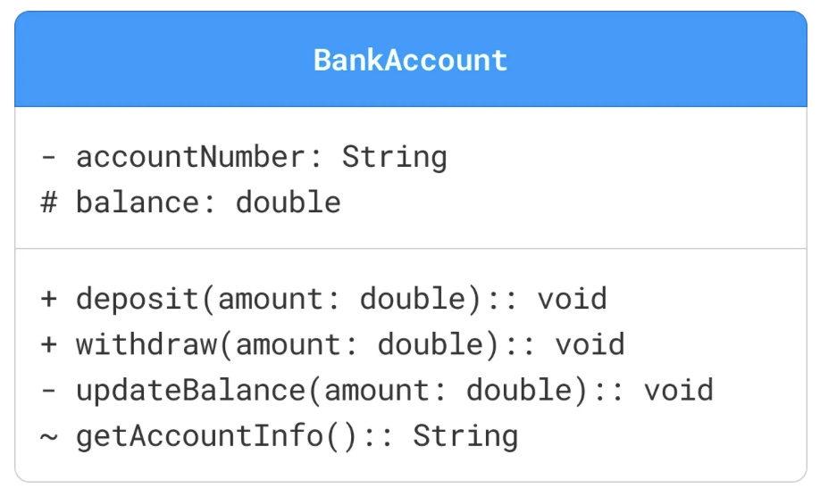

Классы представляются в виде прямоугольников, делятся на три отделения:

- Имя (верхний отсек): Уникальный идентификатор класса (`BankAccount`)
- Атрибуты (средний отсек): свойства или данные, связанные с классом (`accountNumber`, `balance`)
- Методы (нижний отсек): Действия или методы, которые могут быть выполнены объектами класса (`deposit()`, `updateBalance()`)

У каждого атрибута и метода указывается маркер видимости, который указывают на доступность этого компонента в классе.

- `+` (Public): Атрибут или метод доступны из любого класса
- `-` (Private): Атрибут или метод доступны только в пределах одного класса
- `#` (Protected): Атрибут или метод доступны в пределах одного класса и его подклассов
- `~` (Package): Атрибут или метод доступны в одном пакете

### Attributes (атрибуты)

Атрибуты в диаграмме классов UML представляют свойства или поля данных класса. Атрибуты обычно записываются в формате:

```
visibility name: type [multiplicity] = defaultValue
```

- `name`: имя атрибута
- `type`: тип данных атрибута
- `multiplicity` (Optional):  указывает, сколько экземпляров типа разрешено
- `defaultValue` (Optional): значение атрибута по-умолчанию

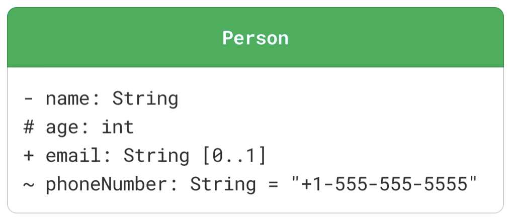

### Methods (методы)

Методы (или операции) в диаграмме классов UML представляют функции или поведение, которые может выполнять класс.

Методы обычно записываются в формате:

```
visibility name(parameterList): returnType
```

- `name`: имя метода
- `parameterList`: список параметров, разделенных запятыми, каждый из которых указан как `name: type`
- `returnType`: тип данных, возвращаемых методом

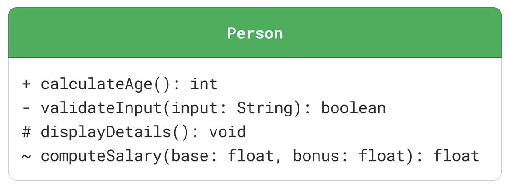

### Interfaces (интерфейсы)

Интерфейс определяет контракт для классов, которые его реализуют. Он определяет набор методов, которые должны предоставлять реализующие классы.

Интерфейсы изображаются в виде прямоугольника класса с ключевым словом `<<interface>>` над именем интерфейса. Методы в интерфейсах абстрактны по своей природе, поэтому они обычно отображаются без каких-либо подробностей реализации.

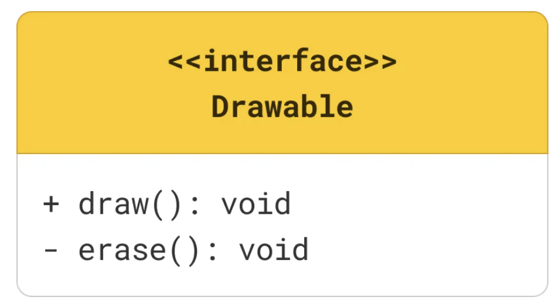

### Abstract Class (абстрактный класс)

Абстрактный класс — это класс, экземпляр которого нельзя создать (из него нельзя создавать объекты напрямую). Он служит в качестве шаблона для других классов (подклассов), которые наследуют его.

Абстрактный класс в UML представлен курсивом с именем класса и ключевым словом `<<abstract>>` над именем класса. Абстрактные методы внутри класса также обычно отображаются курсивом.

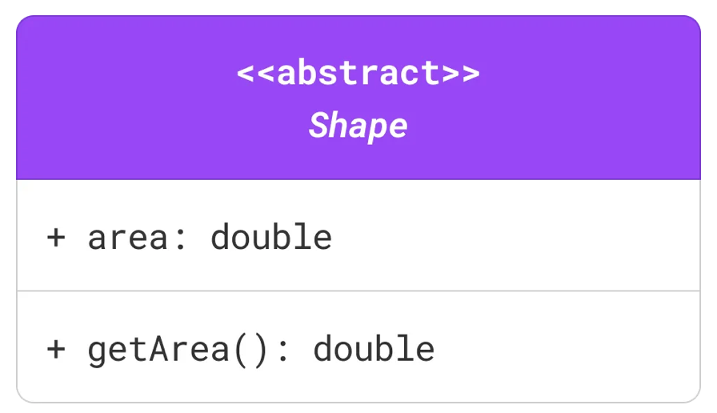

### Enumeration (перечисление)

Перечисление — это тип данных, который определяет набор именованных значений (например, цвета, дни недели). Перечисления, или enums, представлены ключевым словом `<<enumeration>>` над именем перечисления. Значения перечисления перечислены в поле класса.

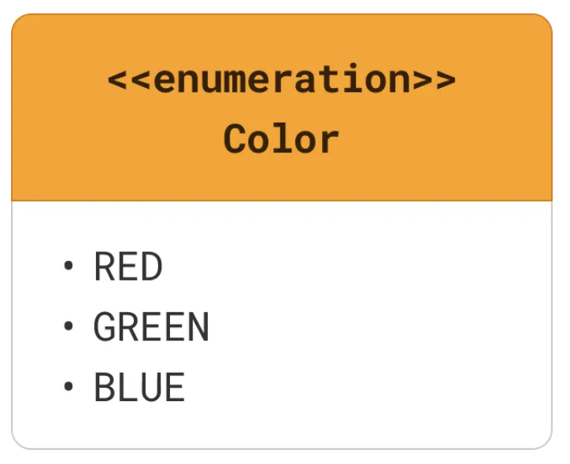

### Multiplicity (множественность)

Множественность определяет количество экземпляров одного класса, которые могут быть связаны с одним экземпляром другого класса. Она представлена ​​числом или диапазоном чисел в конце линии ассоциации.

Обычные множественности включают: `1` (ровно один), `0..1` (ноль или один), `*` (ноль или более), `1..*` (один или более).

### Связи

Существует шесть основных типов отношений между классами: association (ассоциация), aggregation (агрегация), composition (композиция), inheritance (наследование), implementation (реализация) и dependency (зависимость).

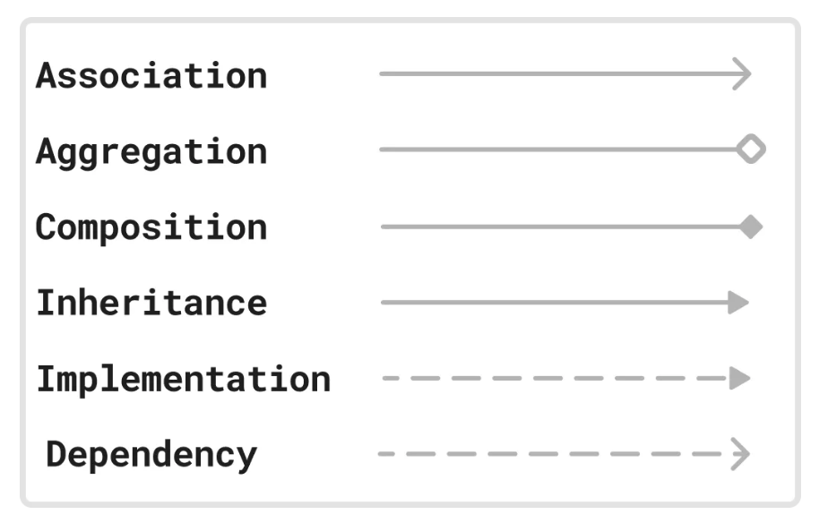

#### Association (ассоциация)

Ассоциация представляет собой отношение «использования» между двумя классами, где один класс использует или взаимодействует с другим.

Пример: класс `Student` связан с классом `Course`, поскольку студент может записаться на несколько курсов.

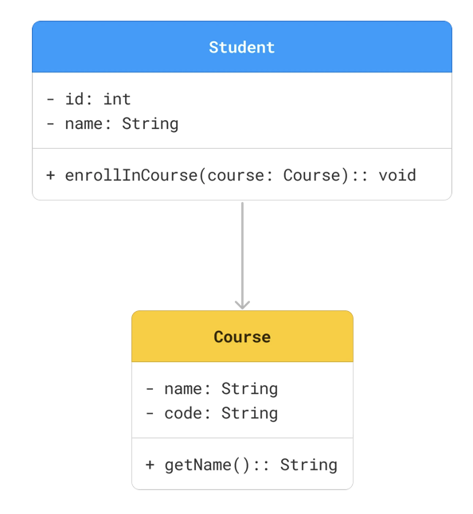

#### Aggregation (агрегация)

Агрегация представляет собой отношение «имеет», где один класс (целое) содержит другой класс (часть), но содержащийся класс может существовать независимо.

Пример: класс `Car` имеет класс `Engine`, но класс `Engine` может существовать без класса `Car`.

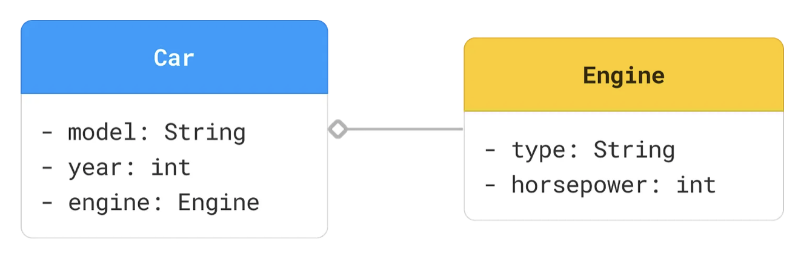

#### composition (композиция)

Композиция представляет собой сильную связь «имеет», где часть не может существовать без целого. Если целое уничтожено, части также уничтожены.

Пример: класс `House` состоит из класса `Room`, но класс `Room` не может существовать без класса `House`.

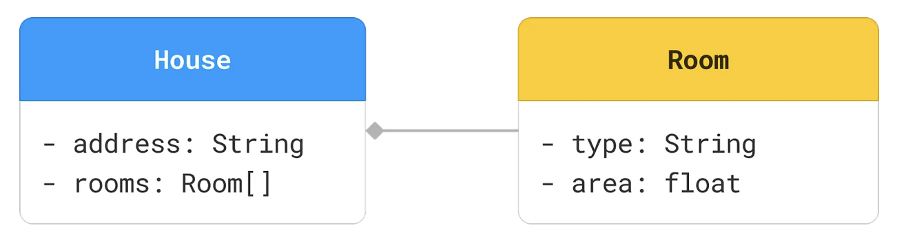

#### inheritance (наследование)

Наследование (или обобщение) представляет собой отношение «является», где один класс (подкласс) наследует атрибуты и методы другого класса (суперкласса).

Пример: классы `Dog` и `Cat` наследуют класс `Animal`, поскольку и собаки, и кошки являются животными.

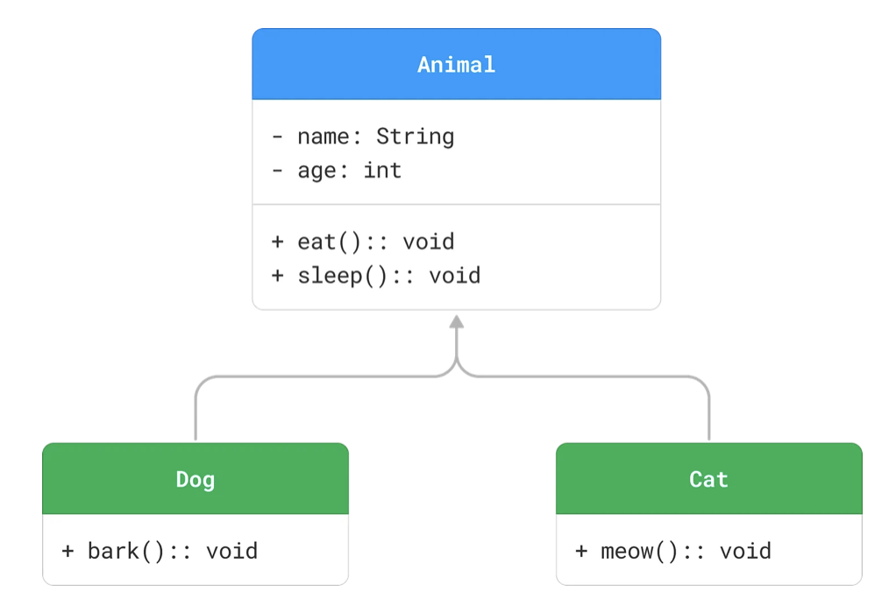

#### implementation (реализация)

Реализация или внедрение представляет собой связь между классом и интерфейсом, где класс реализует методы, объявленные в интерфейсе.

Пример: класс `Rectangle` и класс `Circle` реализуют интерфейс `Shape`, который объявляет метод `getArea()`.

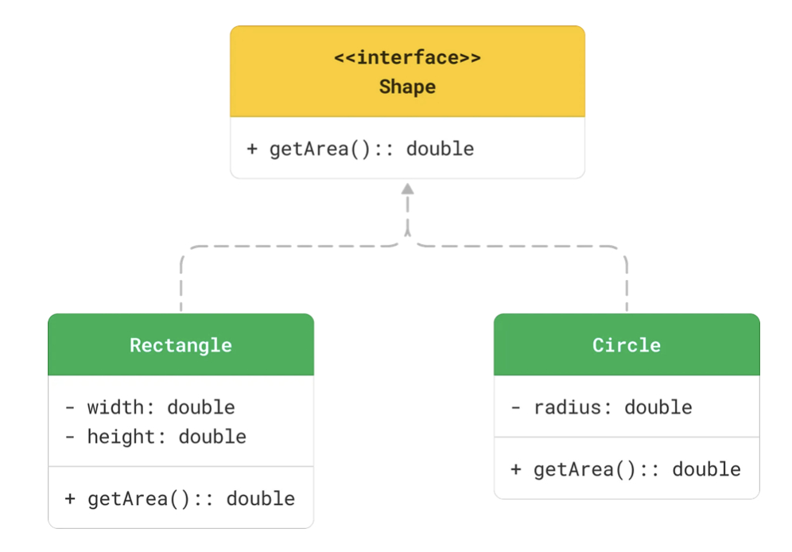

#### dependency (зависимость)

Зависимость представляет собой отношение «использования», где изменение в одном классе (поставщике) может повлиять на другой класс (клиент).

Пример: класс `Customer` использует класс `Order` для размещения заказа.

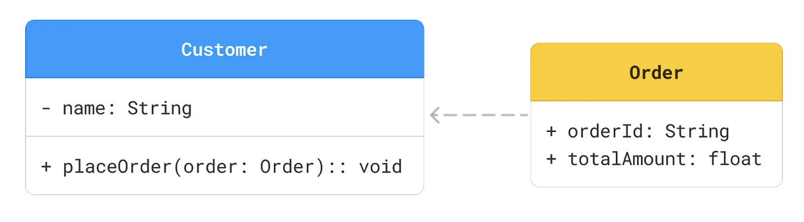

### Пример

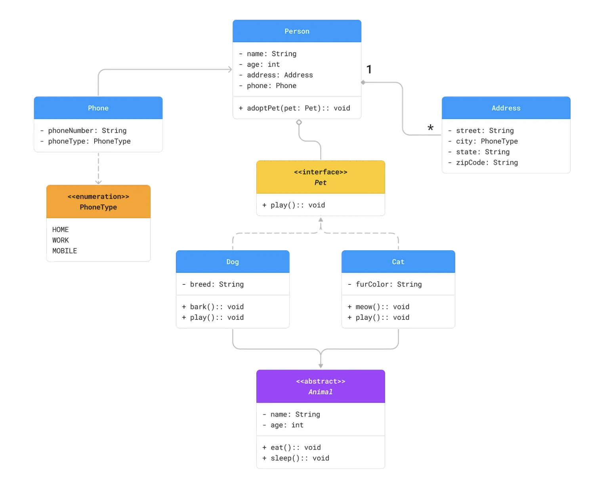

Отношения между классами следующие:

- Inheritance: `Dog` и `Cat` наследуют от `Animal`.
- Implementation: `Dog` и `Cat` реализуют интерфейс `Pet`.
- Aggregation: `Person` имеет отношение агрегации с `Pet`, что указывает на то, что у человека может быть несколько домашних животных.
- Composition: `Person` имеет отношение композиции с `Address`, что указывает на то, что адрес не может существовать без человека.
- Association: `Person` имеет отношение ассоциации с `Phone`, что указывает на то, что у человека может быть несколько номеров телефонов.
- Dependency: `Phone` зависит от перечисления `PhoneType` для атрибута `phoneType`.

