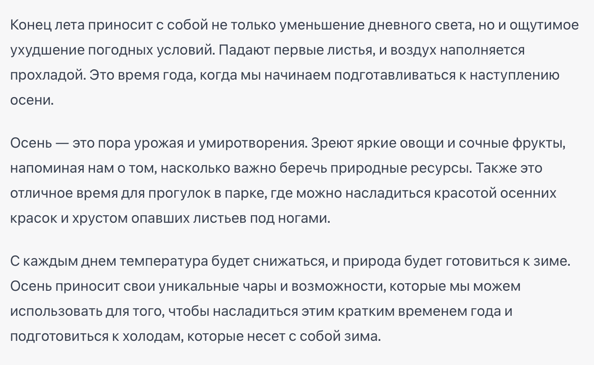

# Лабораторная работа №1

## Задание №1 - Работа с архивами

### Подготовка данных

1. Создать на рабочем столе папку с любым названием
2. Внутри папки создать текстовый файл по аналогии с созданием папки
3. В созданном текстовой файле ввести следующий текст, после чего не забыть сохранить файл:

4. Поместить в эту папку созданный текстовый файл и несколько картинок (скачать из Интернета)
5. Оценить вес и тип (расширение) каждого файла в папке (Клик правой кнопкой мыши по файлу -> свойства) и зафиксировать эту информацию у себя
6. Архивировать созданную папку (клик правой кнопкой мыши по папке -> 7-Zip -> Добавить к архиву...Формат архива выбираем "zip" и нажимаем ок)
7. Оценить вес архива и сравнить его с изначальным весом папки. Изменился ли занимаемый объем?
8. Посчитать на сколько процентов уменьшился вес исходной папки по отношению к архиву

## Задание №2 - Сжатие картинок

1. Найти и скачать картинку в Интернете в высоком качестве (пример запроса: скачать картинки в 4k png)
2. Оценить вес скаченной картинки и зафиксировать эту информацию у себя
3. Найти в интернете любой сервис по сжатию картинок (пример запроса: сжать картинку)
4. Загрузить на найденный сервис скаченную картинку
5. Скачать с сервиса сжатую картинку
6. Оценить вес сжатой картинки и зафиксировать эту информацию у себя
