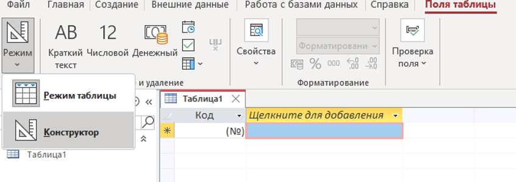
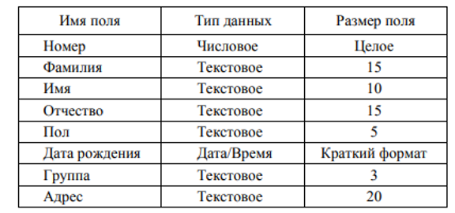
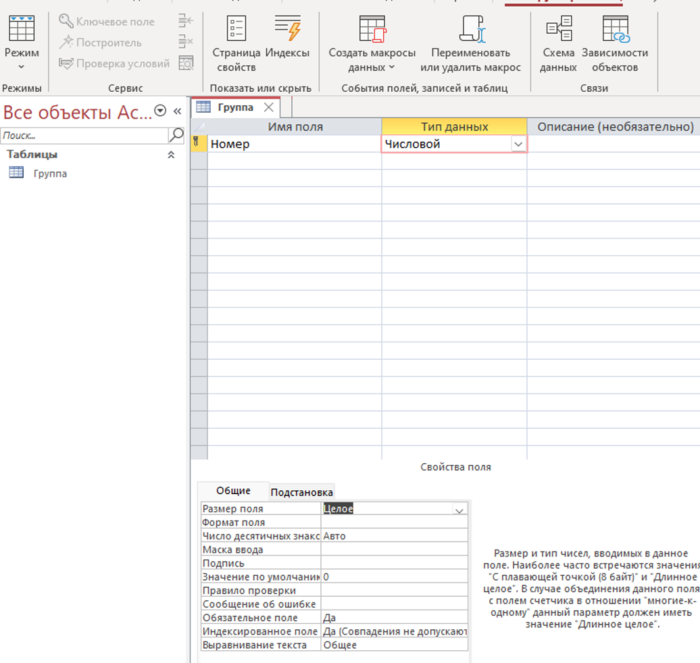
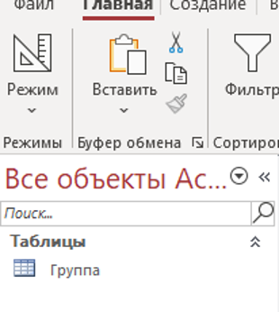
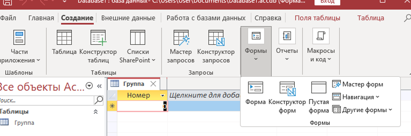
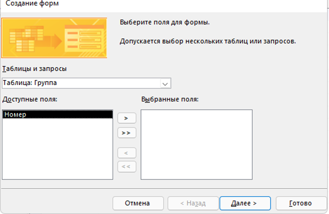
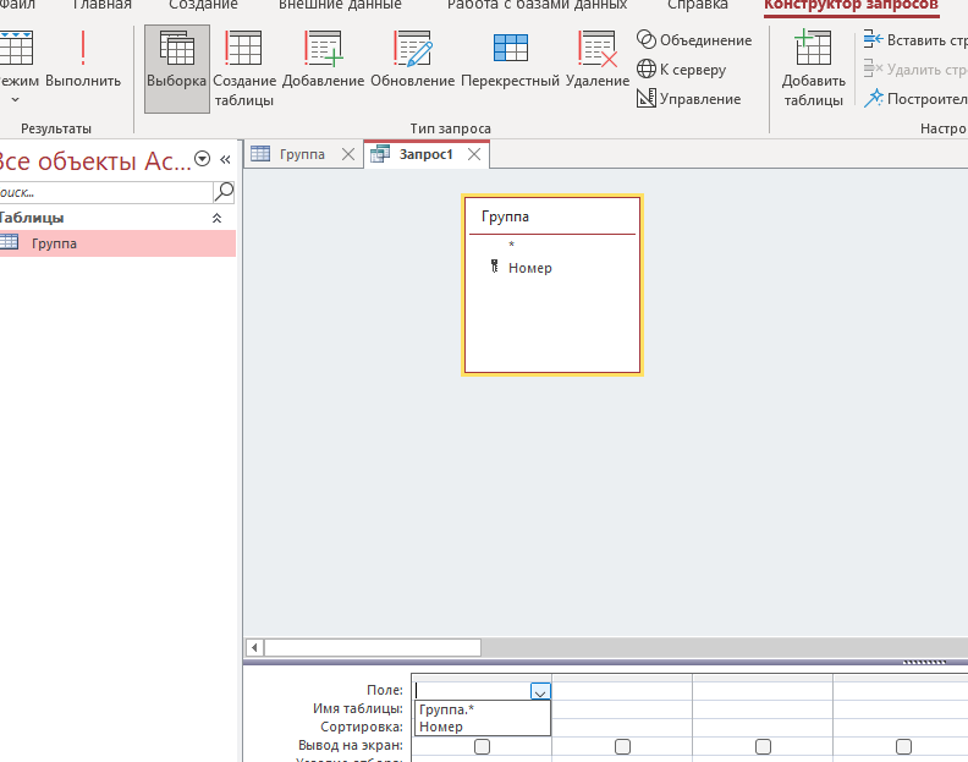
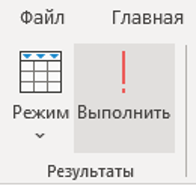

# Лабораторная работа №2

Создайте базу данных – сведения о студентах вашей группы.

# Ход выполнения работы

1. Запустите Access. При запуске появится окно, в котором надо выбрать `Пустая база данных`.

2. В диалоговом окне `Пустая базы данных` укажите имя новой базы данных (название вашей группы) в поле ввода `Имя файла` и сохраните. Нажмите на кнопку `Создать`.

3. В появившемся окне `База данных` активизируйте вкладку `Поля таблицы` и выберите режим просмотра таблицы `Конструктор`, рисунок 1.

Рисунок 1 – Выбор режима создания таблицы

4. Задайте имя таблицы `Группа`.

5. В появившемся окне создайте поля базы данных в соответствии с рисунком 2.

Рисунок 2 – Струтурка таблицы

Заполнение таблицы представлено на рисунке 3. Внимательно выбираем `Тип данных` и `Свойства поля`.

Рисунок 3 – Заполнение таблицы

6. Определите первичный ключ для таблицы. В данной таблице ключевым является поле `Номер` (по умолчанию ключ уже установлен). Чтобы сделать поле ключевым, нажмите на необходимое поле правой кнопкой мыши и выберите пункт `Ключевое поле`. При этом слева от имени ключевого поля появится изображение ключа.

7. Закрыть заполненную таблицу. В окне `База данных` во вкладке `Таблицы` появилось имя сохраненной таблицы, рисунок 4.

Рисунок 4 – Сохраненная таблица

В будущем, все новые создаваемые объекты будут отображены в этой части интерфейса.

8. Занесите в таблицу 6–7 записей. Для этого откройте ее в режиме таблицы `Режим таблицы`.

9. В окне `База данных` активизируйте вкладку `Создать`. Выберите `Мастер форм`, рисунок 5.

Рисунок 5 – Создание формы с помощью `Мастера форм`

В качестве источника данных имя таблицы `ГРУППА`. Выберите все имеющиеся поля для создаваемой формы, нажав кнопочку с двумя стрелочками, рисунок 6.

Рисунок 6 – Заполнение формы

Нажмите кнопку `Далее`.

10. Дальнейшие действия выполните самостоятельно. 

11. Добавьте в таблицу 2–3 записи в режиме формы. Для этого выберите ее в левой части интерфейсного окна двойным нажатием. Закройте диалоговое окно формы. 

12. Откройте таблицу `ГРУППА` и просмотрите добавленные записи в таблице. Закройте таблицу. 

13. Аналогичным образом создайте `Отчет` (вкладка `Создание`) с мощью `Мастера отчетов` для вывода сведений о студентах группы. В качестве источника данных используйте таблицу `ГРУППА`.  Выберите для отчета следующие поля: `Номер`, `Фамилия`, `Имя`, `Дата рождения`. При создании отчета использовать сортировку по полю `Фамилия`, вид отчета на ваше усмотрение. Закройте отчет.

14. Создайте запрос-выборку из таблицы `ГРУППА`, содержащую сведения о студентах мужского пола. В окне `База данных` активизируйте вкладку `Создание`, выберите `Конструктор запросов`.

15. Перетащите таблицу из левой части окна, на серое поле вкладки `Запрос`. Список полей этой таблицы должен появиться в нижней части вкладки, рисунок 7.

Рисунок 7 – Создание запроса

13. В данной ячейке должен появиться значок всплывающего меню. Используя его, введите в ячейку имя первого поля создаваемого запроса (`Фамилия`). 

14. Аналогичным образом заполните остальные ячейки первой строки (`Имя`, `Пол`, `Дата рождения`, `Группа`).

15. Установите сортировку по полю `Фамилия` (по возрастанию).

16. В строке `Условия отбора` внесите в поле `Пол` критерий отбора – букву М (или иную букву, которая встречается в таблице).

17. В строке `Вывод на экран` значок `галочка` означает, что в результате выполнения запроса данное поле будет выводиться на экран.

18. Выполните команду `Запрос/Выполнить`, рисунок 8.

Рисунок 8 – Команда выполнить запрос

19. Закройте запрос, сохраните его под именем `Студенты`. 

20. С помощью `Мастера форм` самостоятельно создайте форму для вывода результатов созданного запроса (форму создайте для всех имеющихся полей запроса). 

21. Покажите преподавателю созданную базу данных.
