# Лабораторная работа №3

Разработка базы данных коммерческого банка.

## Данные

Сотрудники кредитного отдела (тел. Отдела доб 334)
1. Иванов Иван Васильевич, ул. Пушкина, д. 2, кв. 15, 8-914-46-47-485,
01/01/1960, семейный, 2 детей, мужской, Управляющий, 50 000 + премия
300 евро.
2. Петрова Надежда Юрьевна, ул. Ленина, д. 8, кв. 46, 8-965-45-23-654,
15/06/1965, семейный, 2 детей, женский, Заместитель управляющего,
40 000 + премия 250 евро.
3. Сурков Роман Викторович, ул. Лесная, д. 45, кв. 9, 8-965-498-88-88,
15/07/1970, семейный, 3 детей, мужской, Заместитель управляющего,
40 000 + премия 400 евро.
4. Иванова Ольга Дмитриевна, ул. Свободы, д. 456, кВ. 145, 8-913-759-86-
42, 02/04/1975, семейный, 1 ребенок, женский, Ведущий специалист,
30 000 + премия 100 евро.
5. Василькова Елена Андреевна, ул. Ленина, д. 46, кв. 14, 8-945-789-99-91,
24/03/1979, семейный, 2 детей, женский, Ведущий специалист, 30 000 + премия 50 евро.
6. Кошкин Максим Викторович, ул. Морская, д. 15, кв. 48, 8-913-457-78-12,
15/09/1980, семейный, 1 ребенок, мужской, Ведущий специалист, 30 000 + 300 евро премия.
7. Лапкина Марина Сергеевна, ул. Пушкина, д. 45, кв. 18, 8-915-465-96-96,
20/12/1988, холост, женский, Специалист, 20 000 + 120 евро премия.
8. Цветкова Анна Викторовна, ул. Гоголя, д. 50, кв. 45, 8-945-769-12-12,
26/11/1985, семейный, 1 ребенок, ул. Морская, д. 26, кв. 22, 8-916-456-89-
78, Специалист, 20 000 + 50 евро.

Сотрудники валютного отдела (тел. Отдела доб. 335)
1. Управляющий (1 человек)
2. Заместитель управляющего (1 человек)
3. Ведущий специалист (2 человека)
4. Специалист (2 человека)

Сотрудники юридического отдела (тел. Отдела доб 336)
1. Управляющий (1 человек)
2. Заместитель управляющего (1 человек)
3. Ведущий специалист (2 человека)
4. Специалист (2 человека)

Сотрудники отдела кадров (тел. Отдела доб 337)
1. Управляющий (1 человек)
2. Заместитель управляющего (1 человек)
3. Ведущий специалист (1 человек)
4. Специалист (2 человека)

Сотрудники информационного отдела (тел. Отдела доб 338).
1. Управляющий (это вы).
2. Заместитель управляющего (1 человек)
3. Специалист (2 человека)

## Задание 1. Создание новой базы данных

Откройте программу MS Access. Создайте новую базу данных.

## Задание 2. Создание таблиц

При создании новой БД в задании 1 по умолчанию появится одна пустая таблица. Создайте еще две дополнительные таблицы. Используйте кнопку `«Таблица»` на вкладке `«Создание»`.

Сохраните таблицы под именами в соответствии с информацией, которая будет отражена в этих таблицах: `«Сотрудники»`, `«Должности»`, `«Отделы»`. Чтобы сохранить таблицу в рабочей области нажмите на вкладке соответствующей таблицы правой кнопкой мыши для вызова контекстного меню, выберите пункт `сохранить`.

Перейдите в режим конструктора таблицы и создайте необходимые поля. Чтобы перейти в режим конструктора на вкладке `«Главная»` нажмите кнопку `«Режим»`.

Для каждой таблицы определите поля, тип данных и размер в соответствие с информацией, которая будет содержаться в этих полях.

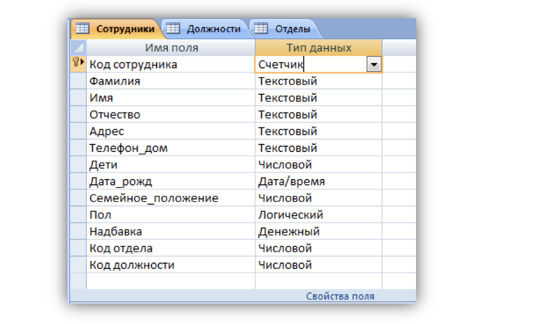

Поле `«Семейное положение»` будет `числовым` – холостой (1), семейный (2).

## Задание 3. Создание связей

Для того чтобы, создать или изменить связи между таблицами, нужно сначала закрыть все таблицы. Затем на панели инструментов `«Работа с данными»` нажмите кнопку `«Схема
данных»`.

Добавьте на схему все существующие таблицы и закройте окно добавления объектов.

В рабочей области отобразятся пока еще не связанные между собой таблицы.

Для изменения и создания связей нажмите кнопку `«Изменить связи»` на панели `«Конструктор»`.

В появившемся окне нажмите кнопку `«Новое»`. Откроется окно для создания связи. В качестве левой таблицы (сторона «один» связи «один ко многим») выберите таблицу `«Должности»` и столбец `«Код должности»`. Для правой таблицы выберите таблицу `«Сотрудники»` и столбец `«Код должности»`. Нажмите кнопку `«ОК»`.

В открывшемся окне оставьте галочку `«Обеспечение целостности данных»` и создайте связь. Связь отобразится в рабочей области.

Создайте связь между таблицами `«Сотрудники»` и `«Отделы»` аналогичным образом. В итого связи между таблицами будут выглядеть следующим образом.

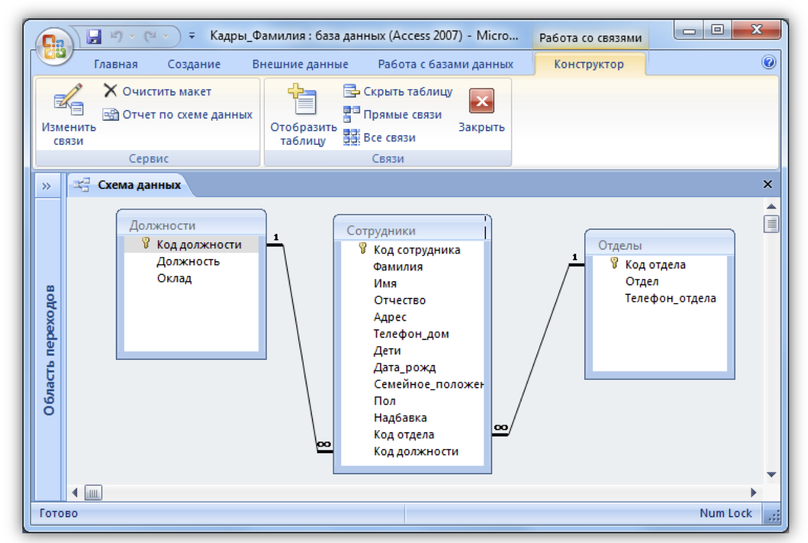

## Задание 4. Создание форм

По процессом обработки информации в ИС прежде всего понимаются следующие процедуры: ввод, просмотр, выборка некоторого подмножества данных, сортировка, группировка, изменение (исправление), расчет производных
параметров и итогов. Все эти действия можно делать с помощью объектов СУБД Формы. Для одной БД может быть разработано сколько угодно форм в зависимости от поставленных задач обработки информации. При удалении формы удаляется процедура обработки, графическое оформление, но информация из БД не исчезает, так как хранится в объектах другого типа – в таблицах.

Чтобы ввести данные для рассматриваемой БД `«Кадры»`, необходимо создать три формы: по одной для каждой таблицы. Начинать ввод следует с таблицы, находящейся на стороне `«Один»`, связи `«Один ко многим»`. Она является «главной» из нее подставляются значения первичного ключа в поле внешнего ключа «подчиненной» таблицы.

Формы можно создавать с помощью конструктора и с помощью мастера. Воспользуемся мастером создания форм. Вызвать мастер создания форм можно на вкладке `«Создание»`, кнопка `«Другие формы»` выбрав пункт `«Мастер форм»`.

Далее нужно выбрать поля для таблицы. Выберем все поля таблицы должности.

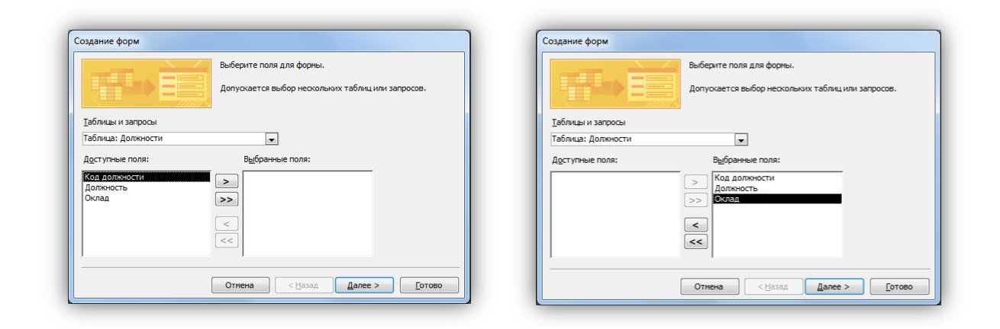

На следующем этапе `«Внешний вид формы»` выберем `«Ленточный»`.

Далее на этапе `«Требуемый стиль»` выберите стиль по своему усмотрению.

На этапе `«Задание имени формы»` назовите форму `«Штатное расписание + ваша Фамилия»`.

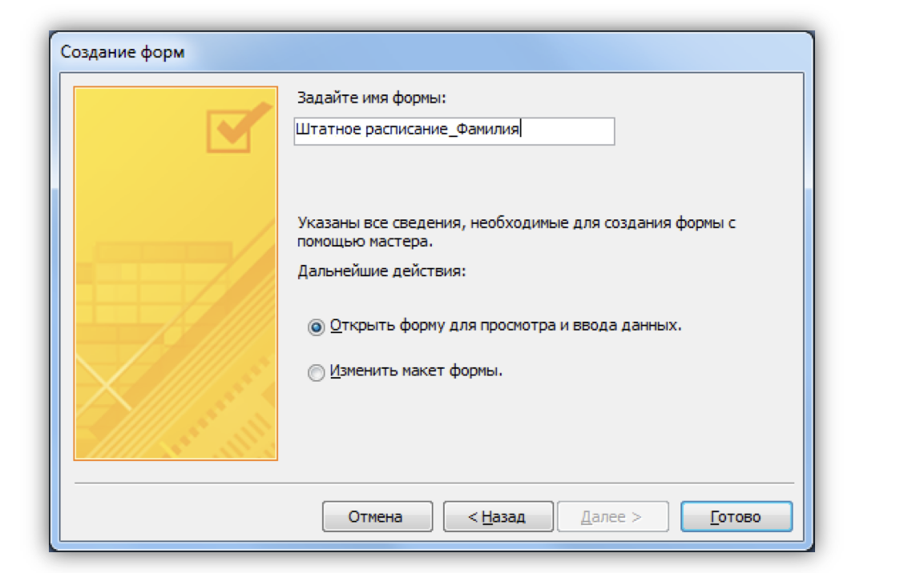

Откроется форма для ввода данных в таблицу `«Должности»`.

### Объект 1. Форма «Штатное расписание _Фамилия»

Ведите данные в соответствие с заданием отдела кадров.

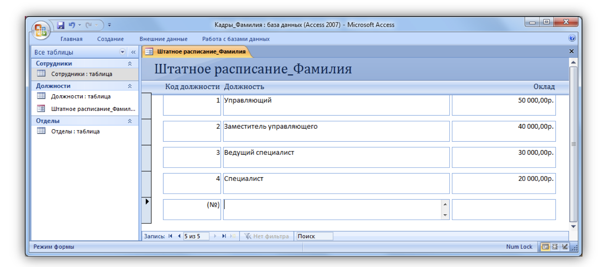

Закройте форму и откройте таблицу `«Должности»`. Убедитесь, что все данные внесены в таблицу.

### Объект 2. Таблица «Должности»

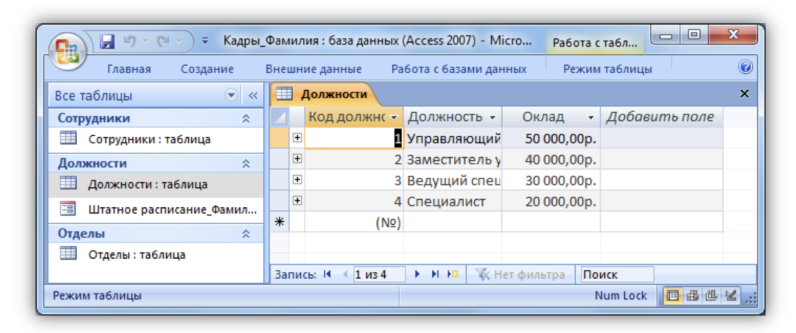

Создайте форму для заполнения таблицы `«Отделы»`. Назовите ее `«Структура организации_Фамилия»`. Заполните таблицу `«Отделы»`.

### Объект 3. Форма «Структура организации _Фамилия»

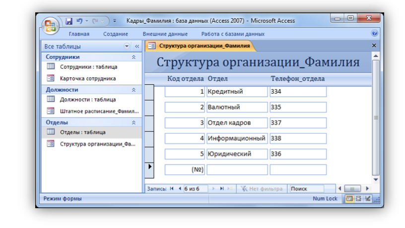

### Объект 4. Таблица «Отделы»

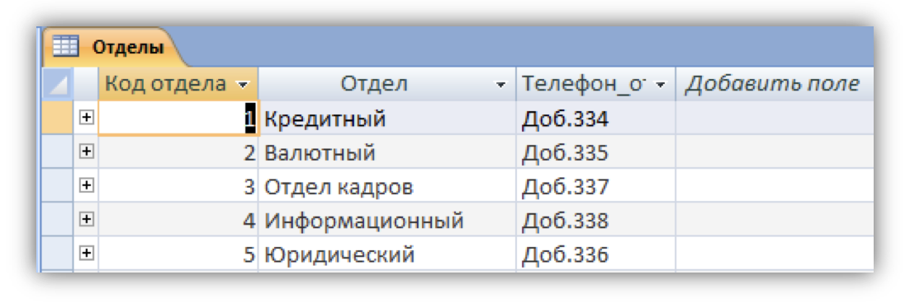

Создайте форму для заполнения таблицы `«Сотрудники»`. Назовите ее `«Карточка сотрудника»`.

В процессе создания формы выберите внешний вид формы `«В один столбец»`.

### Объект 5. Форма «Карточка сотрудника»

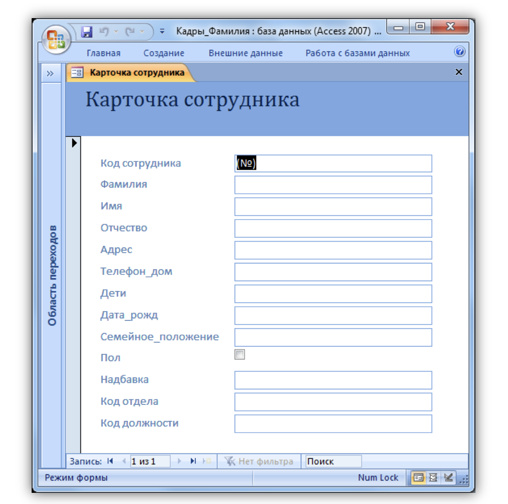

Заполните карточки в соответствие с `данными`, всего 29 человек. Недостающие `данные` придумайте самостоятельно.

### Объект 6. Таблица «Сотрудники»

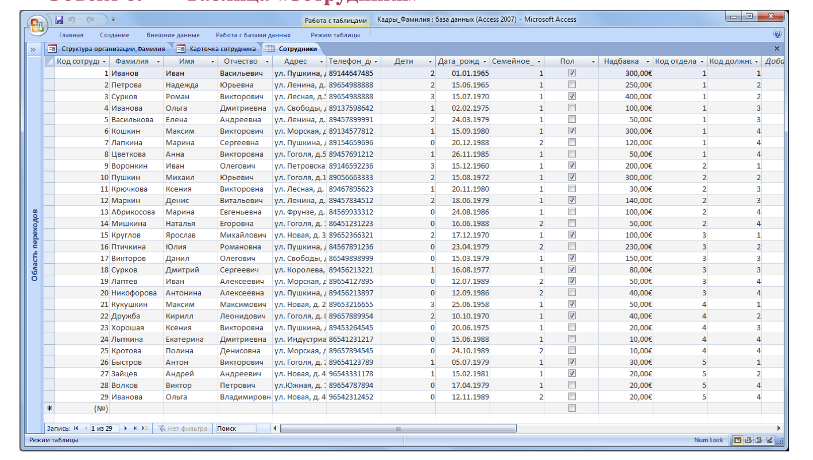

## Задание 5. Создание запросов

Запрос – это объект построения временных таблиц с отобранной информацией. Запросы используются для отбора отдельных полей одной или нескольких связанных таблиц, а также для сортировки и выбора записей по некоторым логическим условиям. Запросы представляются как временно создаваемые таблицы и поэтому могут служить источником данных для форм и отчетов. Запросы используются для создания структуры новой таблицы, исключения повторяющихся данных, создания перекрестных таблиц. Запросы также позволяют сгруппировать, обновить или удалить одновременно несколько
записей, выполнить вычисления итоговых или новых полей.

Создание запросов возможно в режиме конструктора и мастера запросов.

Создадим запрос, который содержит информацию обо всех сотрудниках (фамилии и имена), их отделах, должностях и надбавках.

Мастер запросов можно вызвать с помощью копки `«Мастер запросов»` на вкладке `«Создание»`. В появившемся окне `«Новый запрос»` выберем `«Простой запрос»`.

Далее из разных таблиц выберем необходимые данные: фамилия, имя, отдел, должность, надбавка.

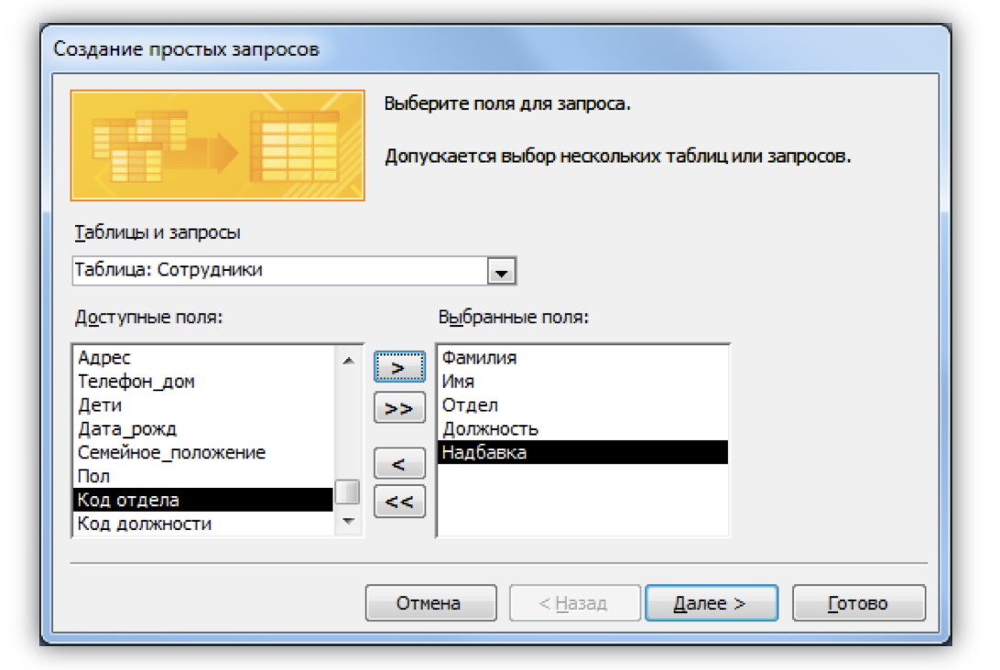

На следующем шаге выбираем тип отчета `«подробный»`, далее имя запроса `«Запрос_Все сотрудники»`.

### Объект 7. Запрос «Все сотрудники»

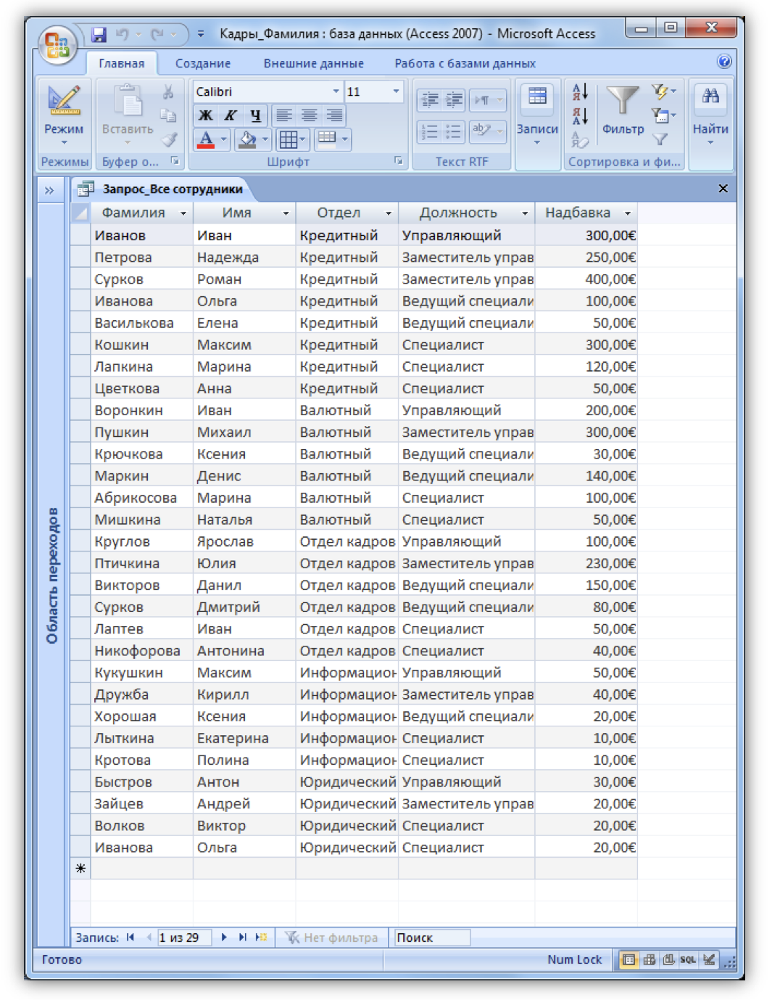

## Задание 6. Создание отчетов

Для предоставления данных и их распечатки особым образом используется объект `Отчет`. С помощью этого объекта создать и напечатать отчет, группирующий данные и вычисляющий итоги. Отчет может брать данные из готового запроса или в процессе построения подготовить такой запрос из нескольких таблиц. При этом надо помнить, что смешение полей таблиц и полей запросов при построении отчета недопустимо. Отчет может выглядеть как таблица, но чаще используется представление в виде иерархической структуры.

Создадим отчет, в котором отображается информация о сотрудниках, сгруппированная по отделам. Для вызова мастера отчетов нажмите кнопку `«Мастер отчетов»` на вкладке `«Создание»`.

На первом шаге выберите все поля запроса `«Все сотрудники»`.

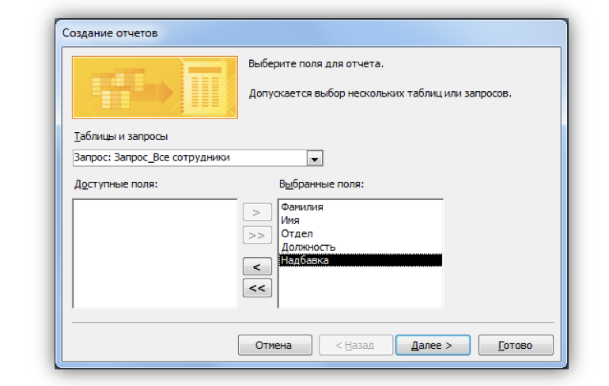

На следующем шаге выберите вид группировки – по отделам. Добавлять уровню группировки на следующем шаге не нужно. Затем задайте сортировку по убыванию надбавки.

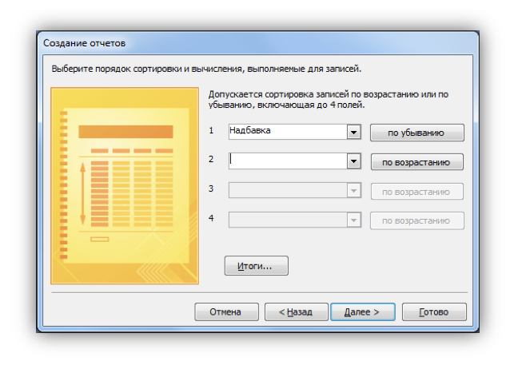

Вид макета для отчета – `Ступенчатый`. Стиль отчета – по вашему усмотрению. Название отчета – `Отчет_надбавки сотрудников`.

### Объект 8. Отчет «Надбавки сотрудников»

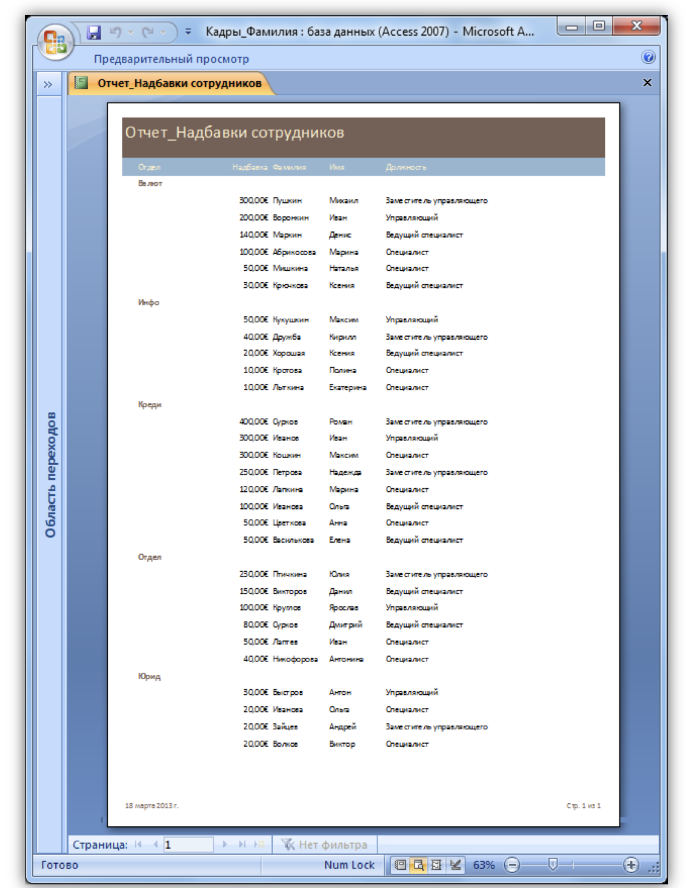
