# Лабораторная работа №1

Цель: Знакомство с основными навыками работы в электронных таблицах: ввод данных в ячейки таблицы, форматирование ячеек таблицы, ввод простых формул, создание обрамления, редактирование данных таблицы.

## Задание №1

Рассмотрим работу в электронных таблицах на примере коммерческой фирмы, которая занимается торговлей кондитерскими изделиями. В процессе работы такая фирма обрабатывает различного рода документы. Одним из основных документов является накладная на получение товаров. Этот документ будет создан в Excel в процессе выполнения заданий.

1. Запустите MS Excel
2. Начиная с ячейки A1 введите данные о порядковом номере, наименовании, количестве и цене поставляемого товара (см. рисунок).

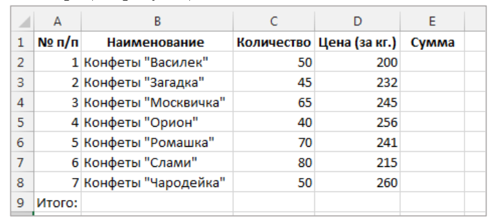

Для вода данных в ячейку необходимо выбрать нужную ячейку, набрать информацию и зафиксировать ввод нажатием клавиши `Enter` или щелчком мыши на другой ячейке. (Не обращайте
внимание на то, что данные не всегда вмещаются в ячейку. Ширину ячеек возможно потом
изменить).

Чтобы изменить ширину столбцов (строк) необходимо разместить указатель мыши на границе
названий столбцов (строк), чтобы указатель принял вид двунаправленной стрелки.

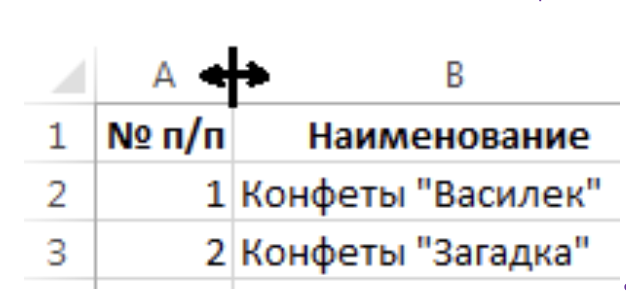

В момент, когда указатель мыши в виде двунаправленной стрелочки, следует
нажать на левую кнопку мыши и, не отпуская кнопку, передвинуть на необходимое расстояние,
либо дважды щелкнуть левой кнопкой мыши, тогда программа автоматически подберет оптимальный размер.

Чтобы ввести последовательность цифр следует:

- Ввести первую цифру, например, 1
- В соседнюю ячейку ввести вторую цифру, например, 2
- Выделить ОБЕ ячейки

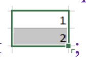

- Подвести курсор мыши к правому нижнему углу выделения (навести мышь на жирную точку в правом нижнем углу, чтобы указатель мыши превратился в тонкий черный крестик)
- Нажать кнопку мыши, когда указатель мыши в виде черного тонкого крестика, и протянуть указатель мыши вниз, до необходимого номера последовательности.

4. В последнем столбце рассчитать сумму: **Сумма = Количество * Цена**

Формулы в электронных таблицах принято строить на основе адресов ячеек, в которых находятся значения.

Чтобы ввести формулу в ячейку следует:

- В ячейке Е2 поставить знак = (равно)
- Щелкнуть мышью по ячейке С2
- Нажать знак * (умножить)
- Щелкнуть мышью по ячейке D2
- Нажать клавишу Enter

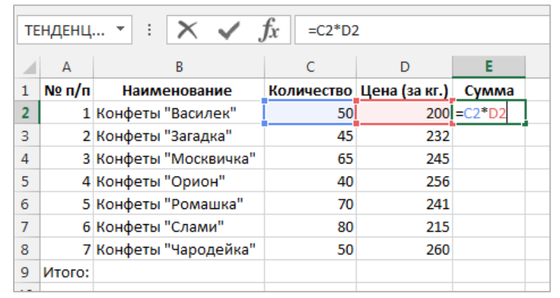

Чтобы автоматически заполнить остальные ячейки столбца следует:

- Щелкнуть мышью по ячейке Е2 (выделить ячейку, в которой введена формула)
- Навести указатель мыши на маркер заполнения (черный квадрат в нижнем правом углу ячейки, при наведении на него указатель мыши приобретает вид тонкого черного крестика)
- Нажав левую кнопку мыши, перетащить маркер вниз до ячейки Е8

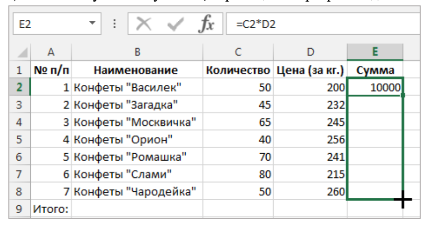

5. Рассчитать итоговую (общую) сумму в ячейке E9. Для этого:

- Выделить ячейку Е9
- Нажать кнопку Сумма (знак Сигма) (закладка Главная – группа Редактирование)
- Появиться пунктирная рамка, которая выделяет диапазон предполагаемого
суммирования:

Если программа выделила диапазон правильно, то нажать клавишу `Enter` для
фиксирования результата.

Если диапазон НЕ верный, то, не обращая внимания на выделение, выделить требуемое и также зафиксировать результат клавишей `Enter`. (При выделении можно использовать клавишу `CTRL` и/или `SHIFT`).

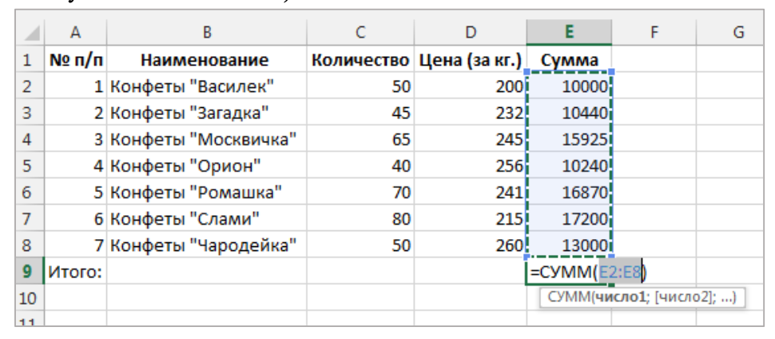

6. Выполните форматирование данных таблицы.

Измените шрифт данных в ячейках таблицы:

- Выделите диапазон ячеек А1:Е9
- Лента меню Главная – группа Шрифт: 

Шрифт - Arial
Размер -12

Измените формат данных в столбцах Цена (за кг.) и Сумма:

Выделите диапазон ячеек D2:E9
- Лента меню Главная – группа Число:
  
Числовые форматы – Денежный

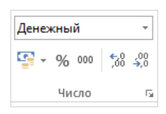

7. Увеличить или уменьшить ширину столбцов так, чтобы все данные таблицы были полностью видны и располагались оптимально (не было лишнего пространства).
8. Ячейки заголовка таблицы (ячейки А1:Е1) выровнять по центру
   
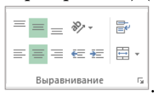

9. Выделите ячейки А2:А8 и С2:Е9 и выровнять их по горизонтали по центру, для этого:

- Выделив первый диапазон данных А2:А8, нажмите клавишу `CTRL` и, не отпуская её, выделите второй диапазон С2:Е9
- Установите выравнивание По горизонтали – по центру

10. Выделите ячейки A9:D9 и объедините их, для этого:

- Выделив ячейки A9:D9 следует воспользоваться лентой меню Главная – Выравнивание – Объединить ячейки
  
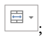

- Выровнять текст – По правому краю

11. Выполните обрамление таблицы, используя линии различной толщины:

- Выделите все ячейки таблицы А1:Е9
- Воспользуйтесь лентой меню Главная – Шрифт – Границы – Другие границы

- Выберите Тип линии Пунктир для внутренних границ, а затем Тип линии Сплошная толстая линия для внешней границы

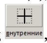

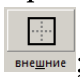

После выполнения всех операций по оформлению таблицы, она примет вид:

12. Добавить 6 строк перед таблицей, для этого:

- Выделите первые 6 строк (Следует выделять не
ячейки, а строки, для этого необходимо щелкнуть на заголовке строки 1 и протянуть курсор до шестой строки)

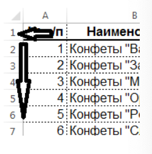

- Лента команд Главная – группа Ячейки – кнопка Вставить

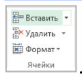

13. Введите в ячейки таблицы текст в соответствии со схемой, представленной на рисунке.

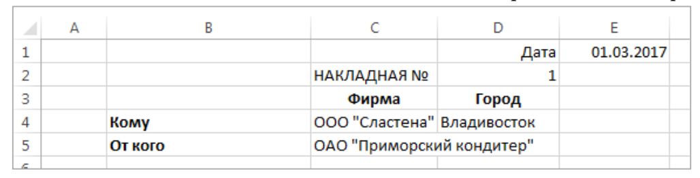

14. Выполните форматирование введённых данных.

- Выделите диапазон ячеек A1:Е5
- Лента меню Главная – группа Шрифт: Шрифт - Arial; Размер – 12.
- Выделите желтым цветом те данные шапки таблицы, которые могут изменяться. А
именно, ячейки E1, C4, C5, D2, D4, D5 (лента меню Главная – группа Шрифт – Цвет заливки – Желтый).

15. Переименуйте лист рабочей книги:

- Дважды щелкнуть мышью на имени Лист 1
- Удалить имя Лист 1 и ввести новое название Накладная.

В результате всех проделанных Вами операций документ приобретет вид:

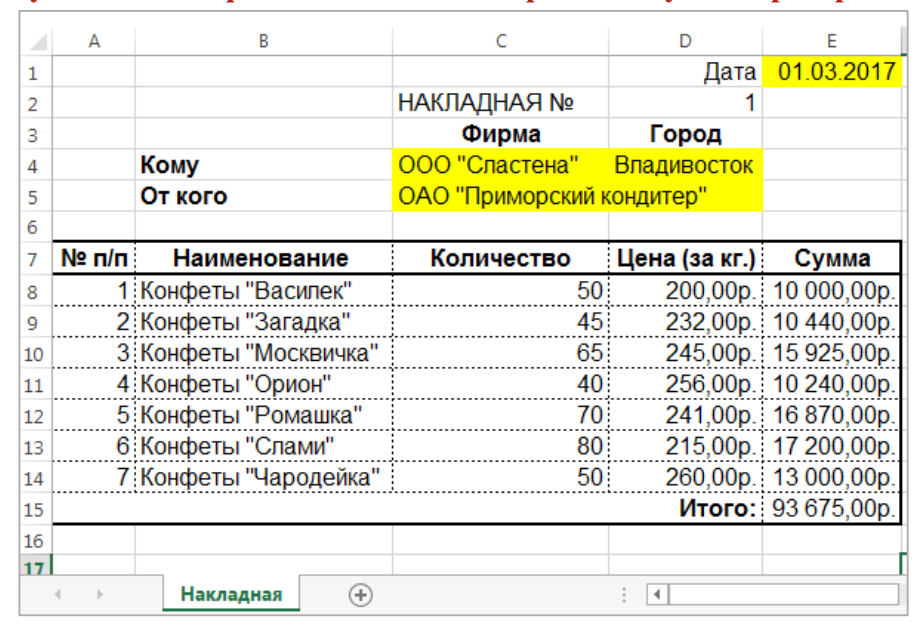

## Задание №2

Необходимо купить игрушки в детский сад «Дюймовочка». Посчитайте, сколько денег
для этого потребуется, если магазин делает скидку 7%.

1. Добавьте новый лист в рабочую книгу. Присвойте ему новое имя Игрушки.
2. На листе Игрушки в ячейке А3 введите название таблицы ИГРУШКИ, затем выделите
ячейки A3:F3 и нажмите на кнопку Объединить и поместить в центре , примените
полужирный стиль начертания, размер шрифта 14.
3. В ячейки A5:F18 введите предложенные на рисунке данные.

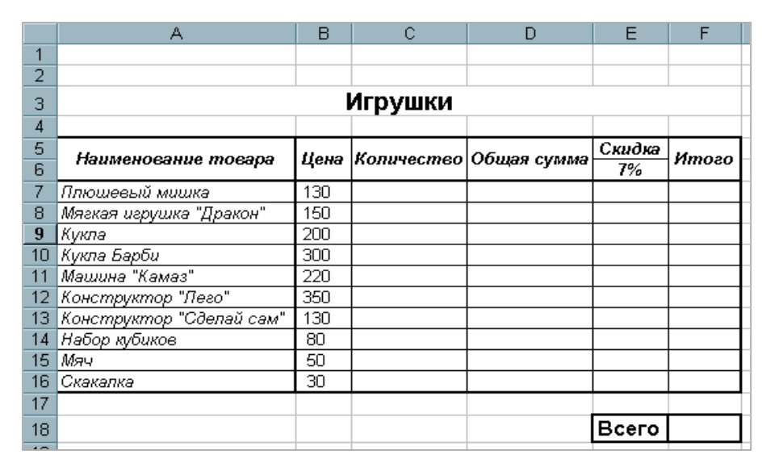

4. В столбец Количество введите любые значения от 1 до 15.
5. Отформатируйте таблицу:

- Для заголовков таблицы: стиль начертания полужирный курсив, выравнивание по центру
(и по горизонтали, и по вертикали)
- Список игрушек выделите курсивом;
- Ячейкам, где введены цены (или будут введены в дальнейшем), установите Денежный
формат.

6. В ячейке D7 введите формулу для расчета **Общей суммы = Цена * Количество**. Скопируйте
формулу для остальных товаров, протащив маркер заполнения.
7. Посчитайте 7% от Общей суммы для каждого товара, используя абсолютные и
относительные ссылки в адресах. Для этого:

- Ввести в ячейку E7 формулу =D7*E6
- Разместить курсор в формуле в адресе E6 и нажать кнопку F4
- Формула должна принять вид =D7*$E$6 и нажать `Enter`
- Скопируйте маркером заполнения формулу на оставшиеся ячейки

8. Подведите итог в столбце Итого (сколько затратите денег на каждый из товаров с учетом
скидки).
9. Посчитайте в ячейке F18, используя автосуммирование, сколько всего потратите денег.
10. Добавьте рамку для ячеек, как предложено в образце (обратите внимание на ячейки A5:F6).

## Задание №3

1. Перейдите на новый лист.
2. Переименуйте лист в Сам_задание_1.
3. На этом листе создайте и отформатируйте таблицу согласно образцу:

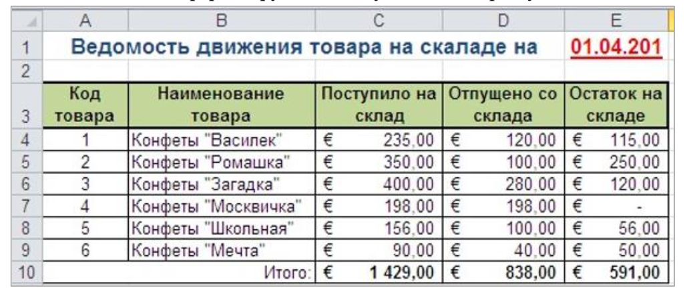

4. Столбец Остаток на складе должен быть рассчитан по формуле.
5. Строка Итого должна быть рассчитана Автосуммированием.
