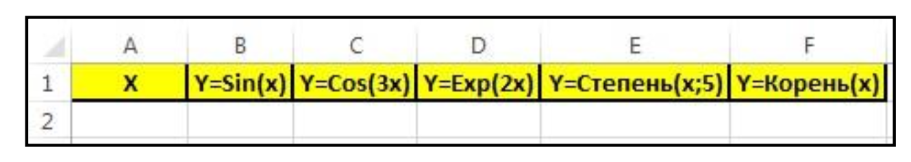
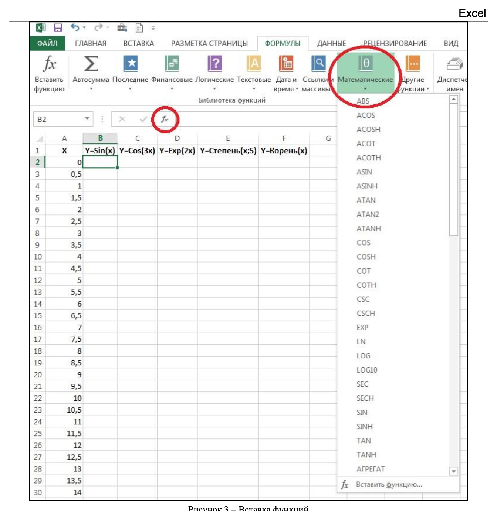
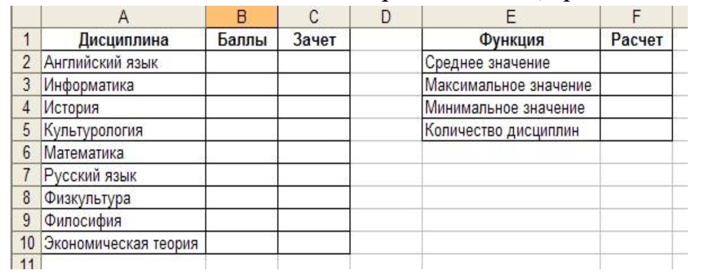
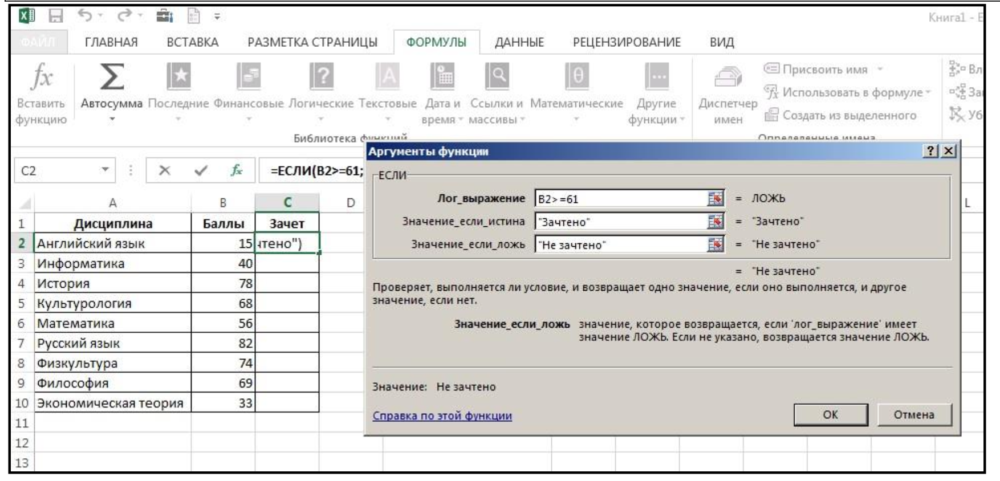
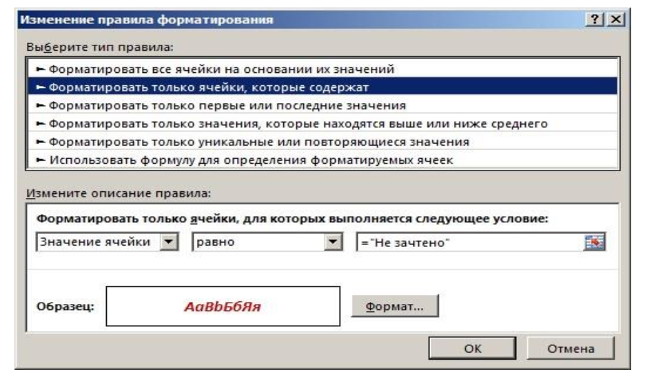
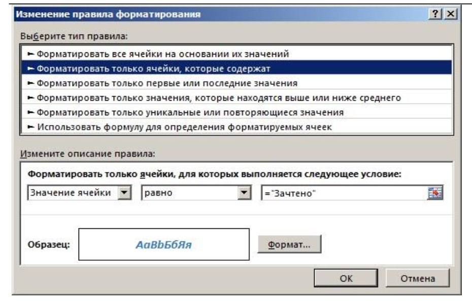
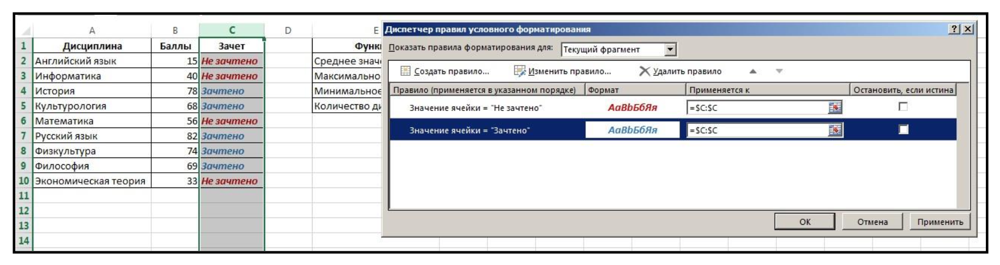
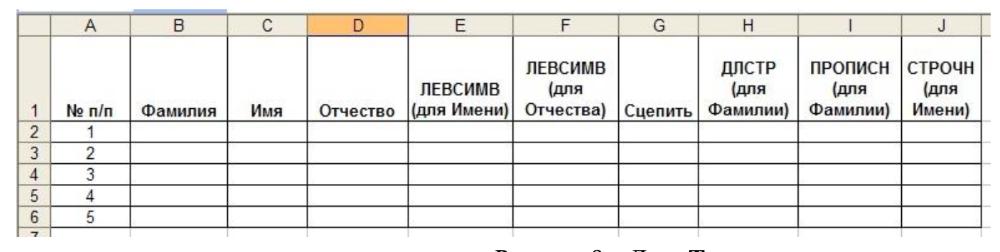

# Лабораторная работа №2

## Задание №1

1. Создайте новую рабочую книгу MS Excel. Сохраните файл под именем "Построение функций".
2. Добавьте в Ваш файл еще 2 листа.
3. Переименуйте эти листы: `Математические`, `Статистика+Логика`, `Текстовые`.
4. Перейдите на лист Математические и постройте таблицу, приведенную на рисунке.

5. В ячейке А2 поставьте цифру 0, в ячейку А3 поставьте число 0,5 и заполните столбец до ячейки А30 с помощью маркера автозаполнения. Для этого: выделите ячейки А2 и А3 и протяните вниз до ячейки А30 за жирную точку в нижнем правом
углу выделенного диапазона. Последнее число в ячейке А30 должно получится 14.
6. Рассчитайте функции, указанные в таблице для всего диапазона значений Х от 0 до 14, используя математические функции Excel. закладка ФОРМУЛЫ – Математические или пиктограмма f(x).

7. На листе `Статистические+Логические` постройте таблицы, представленные на рисунке.

8. Столбец Баллы заполните любыми значениями в диапазоне от 0 до 100.
9. В столбце Зачет необходимо проставить зачет по тем дисциплинам, количество баллов по которым превышает 61 балл, используя функцию ЕСЛИ. Для этого: закладка ФОРМУЛЫ – Логические и заполните окно Аргументы функции.

10.  К столбцу Зачет применить Условное форматирование: если по дисциплине проставлен зачет, то шрифт ячейки должен стать Синим, Полужирным курсивом; если не проставлен зачет, то Красным, Полужирным курсивом. Для этого выделите столбец Зачет. Выберите пункт ГЛАВНАЯ – Стили – Условное форматирование – Управление правилами. Откроется окно Диспетчер правил условного форматирования в котором нужно нажать Создать правило и затем выбрать Форматировать только те ячейки, которые содержат. Укажите все согласно Рисунку и нажмите ОК. Затем еще раз нажмите Создать правило, введите все согласно рисунку 7 и нажмите кнопку ОК. 

11. Произведите расчет Среднего, Максимального и Минимального балла по дисциплине,
а также рассчитайте Количество дисциплин, используя функции СРЗНАЧ, МИН, МАХ, СЧЕТ
(ФОРМУЛЫ – Другие функции – Статистические).
12. На листе Текстовые постройте таблицу, приведенную на рисунке.

13. Заполните столбцы Фамилия, Имя, Отчество произвольными данными (5 человек).
14. Вставьте в соответствующие столбцы следующие функции (ФОРМУЛЫ – Текстовые):

- ЛЕВСИМВ - для столбца Имя,
- ЛЕВСИМВ - для столбца Отчество,
- СЦЕПИТЬ (Текст1 - В2, Текст2 - “ ”, Текст3 – Е2, Текст4 - “.”, Текст5 – F2, Текст6 - “.”),
- ДЛСТР - для столбца Фамилия,
- ПРОПИСН - (для столбца Фамилия),
- СТРОЧН - (для столбца Имя).

## Задание №2

1. На листе Математические в столбце H рассчитайте функцию Y=25X*SIN(10X).
Для всех вычисленных значений задайте Условное форматирование: Если значение
отрицательное, то оно должно окрашиваться в красный цвет.
2. На листе Статистика+Логика в столбце Расчет посчитайте количество дисциплин, по
которым получены зачеты и соответственно не получены (используйте функцию СЧЁТЕСЛИ из категории Статистические). В столбце Баллы примените Условное форматирование: Если количество баллов больше 41, то фон должен стать светло-зеленым, если меньше 41 – то розовым.
3. На листе Текстовые посчитайте количество букв в Имени и Отчестве. И напишите в одну строку Заглавными буквами Фамилию и инициалы (ФАМИЛИЯ И.О.).
