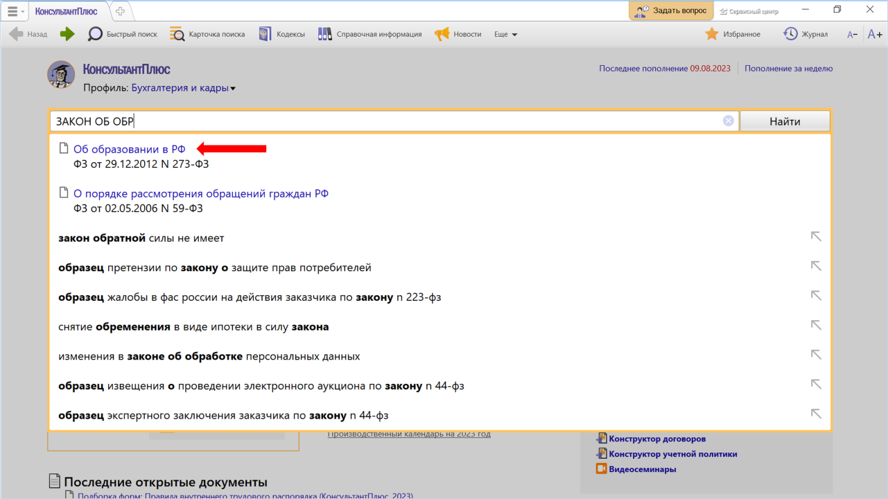
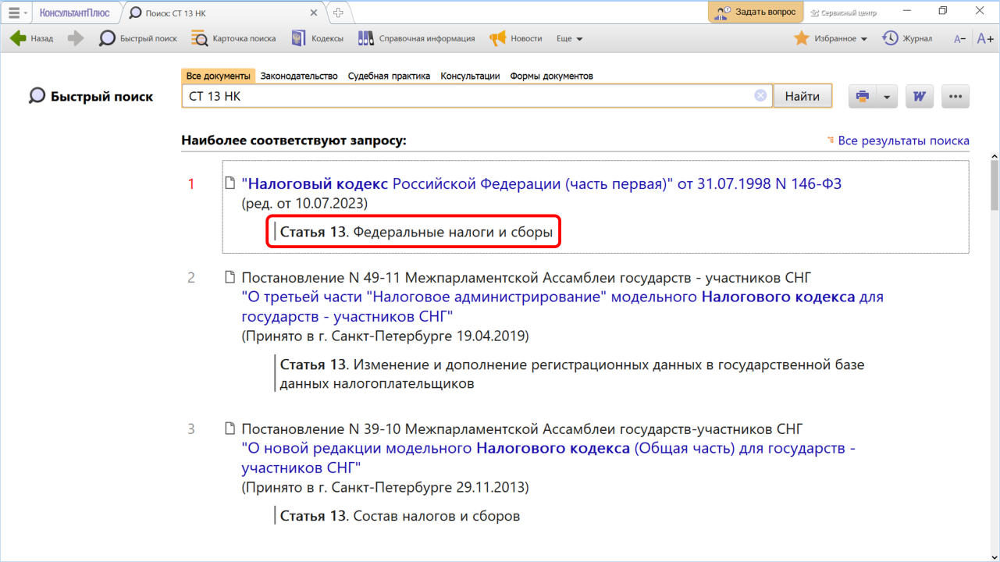
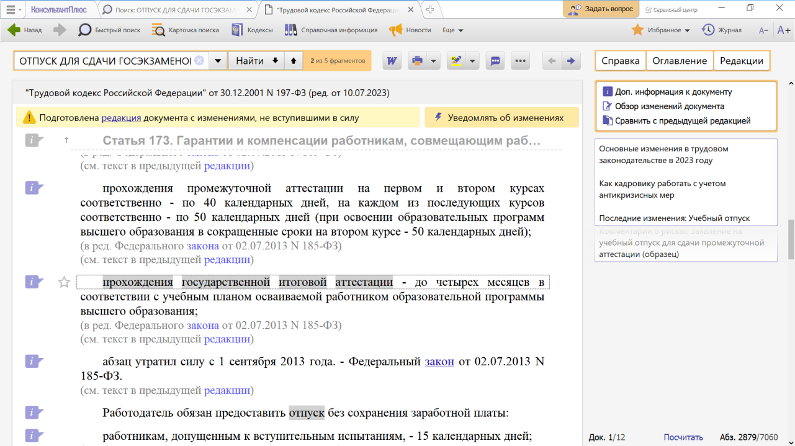

# Практическая работа с КонсультантПлюс №2

## Примеры работы с системой

### Пример поиска конкретного документа

Найдем Федеральный закон «Об образовании в Российской Федерации».

Решение:

1. В Быстром поиске начнем набирать: ЗАКОН ОБ ОБРАЗОВАНИИ.
Появится список подсказок
2. Перейдем по подсказке в закон.

### Пример поиска фрагмента документа

Найдем ст. 13 «Федеральные налоги и сборы» НК РФ.

Решение:

1. Зададим в Быстром поиске: СТ 13 НК и нажмем кнопку «Найти».
2. Документы появляются сразу, до построения всего списка. Из списка перейдем по ссылке на нужную статью кодекса. Документ сразу откроется на ст. 13 (см.рис).

### Пример поиска документов по интересующему вопросу

Выясним, какова продолжительность отпуска для сдачи госэкзаменов работникам-студентам, обучающимся по заочной форме обучения.

Решение:

1. В Быстром поиске зададим: ОТПУСК ДЛЯ СДАЧИ ГОСЭКЗАМЕНОВ и нажмем кнопку «Найти».
2. В начале списка Трудовой кодекс РФ. Откроем его.
3. ТК РФ откроется на ст. 173, в которой указано, что продолжительность отпуска для прохождения государственной итоговой аттестации ‒ до четырех месяцев в соответствии с учебным планом осваиваемой работником образовательной программы высшего образования.

## Задания

### Задание №1

Найдите закон о бухгалтерском учете. Укажите реквизиты закона.

### Задание №2

Найдите ст. 221 «Обращение в собственность общедоступных для сбора вещей» ГК РФ (часть первая). Укажите количество документов, доступных по ссылке «законом» в данной статье.

### Задание №3

Найдите ст. 12.18 «Непредоставление преимущества в движении пешеходам или иным участникам дорожного движения» Кодекса РФ об административных правонарушениях. Укажите максимальный размер штрафа за данное правонарушение.

### Задание №4

Во время авиаперелета был утерян багаж гражданки К. Выясните, имеет ли она право потребовать компенсацию за утрату багажа. Если да, то в каком размере.

### Задание №5

Работник организации учится в вузе заочно, высшее образование получает впервые. Выясните, обязан ли работодатель один раз в год оплатить ему проезд к месту учебы. Укажите свой вариант поискового запроса.

### Задание №6

Н. купил в магазине книгу и дома обнаружил, что одна из страниц в ней оказалась непропечатанной. Укажите, в течение какого периода можно предъявить претензии продавцу, если на товар не установлен
гарантийный срок.
