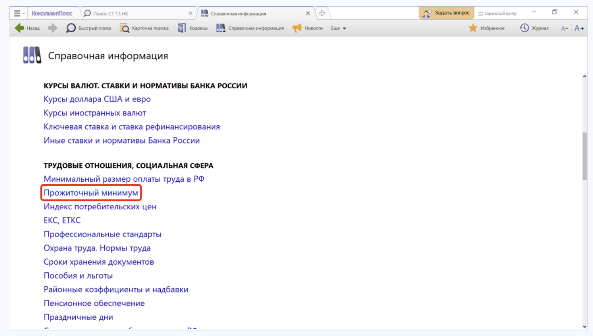
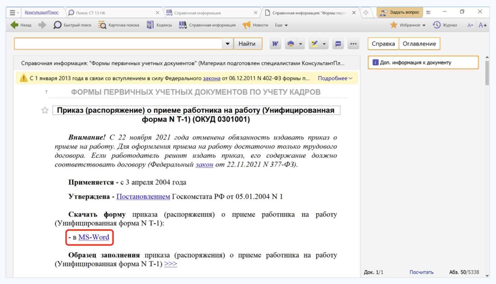

# Практическая работа с КонсультантПлюс №3

## Примеры работы с системой

### Пример поиска справочной информации

Выясним, какова в настоящее время величина прожиточного минимума на душу населения в целом по Российской Федерации.

Решение:

1. Откроем окно «Справочная информация» с помощью кнопки панели инструментов.
2. В разделе «ТРУДОВЫЕ ОТНОШЕНИЯ, СОЦИАЛЬНАЯ СФЕРА» перейдем по ссылке «Прожиточный минимум» (см. рис.).
3. Откроем справочную информацию «Величина прожиточного минимума в Российской Федерации» и найдем в таблице нужную информацию.
4. Обратим внимание, что в крайнем правом столбце таблицы указан нормативный акт, которым установлена величина прожиточного минимума.

### Пример поиска справочной информации

Найдем и заполним форму приказа о приеме работника на работу.

Решение:

1. Откроем окно «Справочная информация».
2. Искомый документ относится к первичным учетным документам, поэтому в разделе «ФОРМЫ В MS-WORD, MS-EXCEL И ГРАФИЧЕСКИХ ФОРМАТАХ» щелкнем по ссылке «Формы первичных учетных документов».
3. Откроем справочную информацию «Формы первичных учетных документов».
4. Перейдем в его оглавление и щелкнем по ссылке «Приказ (распоряжение) о приеме работника на работу (Унифицированная форма № Т-1) (ОКУД 0301001)».
5. Перейдем во фрагмент документа, где представлены материалы по заполнению приказа, образец его заполнения и ссылка для скачивания формы приказа в MS-Word.
6. Откроем данную форму в Microsoft Word, заполним ее и сохраним документ.

## Задания

### Задание №1

Укажите действующую на данный момент величину прожиточного минимума для трудоспособного населения г. Москвы.

### Задание №2

Определите актуальный на 1 сентября 2023 г. размер ключевой ставки, установленной Банком России.

### Задание №3

Выясните, какие праздничные дни, установленные на федеральном уровне, есть в декабре. Укажите номер указа Президента, которым был утвержден День экономиста.

### Задание №4

Найдите форму исходного кассового ордера (унифицированная форма N KO-1) и откройте ее в Excel. Укажите, с какой даты применяется эта форма.
