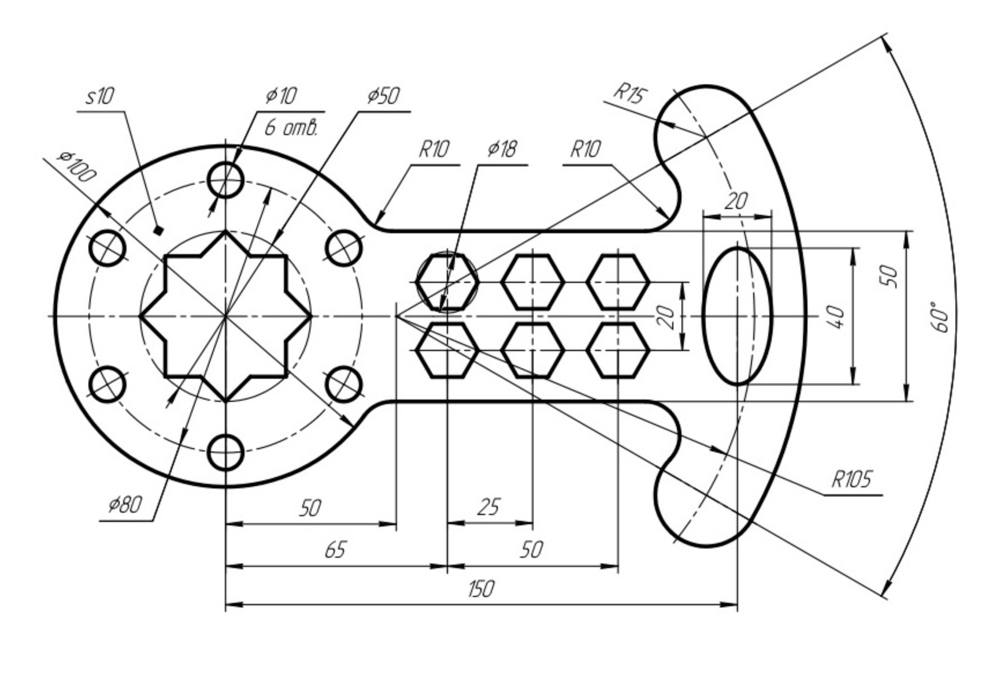
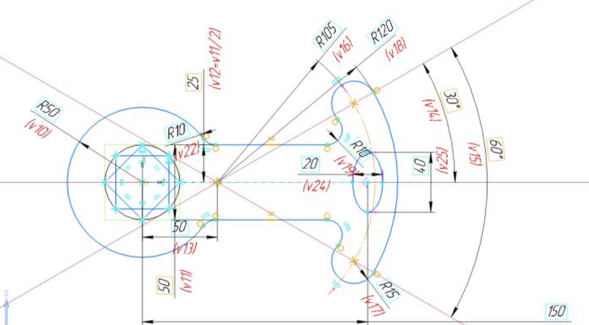
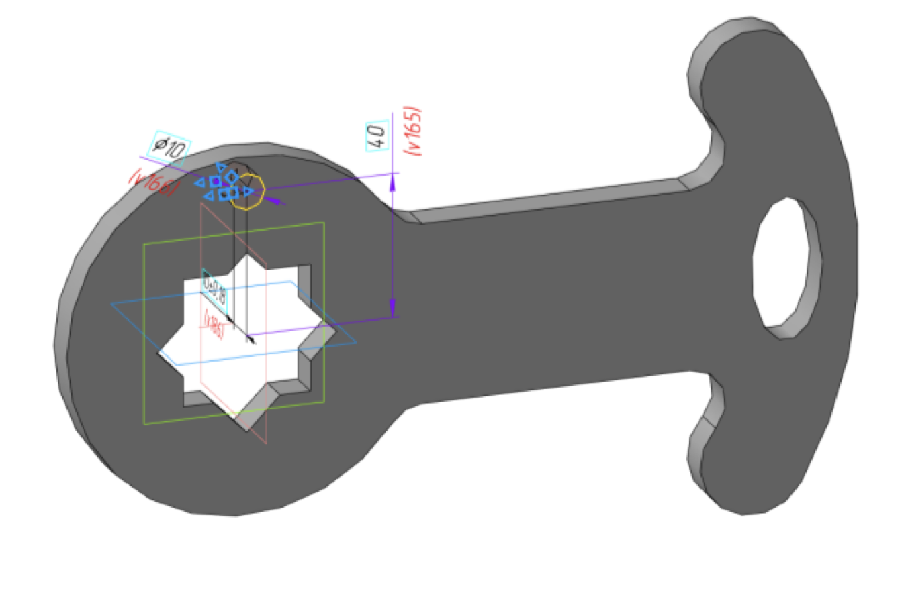
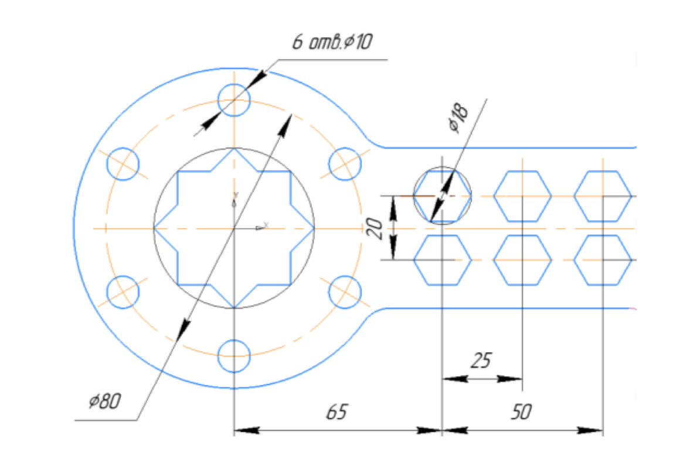
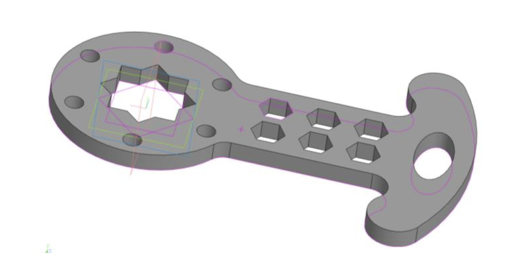

# Лабораторная работа №3

## Задачи

1. Создать замкнутый контур детали `Пластина` в режиме `Эскиз` из простейших геометрических фигур: отрезок, окружность, дуга и т. д.
2. К построенному контуру применить операцию `Выдавливание` на `10 мм`

## Ход работы

1. Создать новую деталь.
2. Создать эскиз в любой из плоскостей.
3. Построить основу детали (внешний контур, многоугольник и эллипс) согласно рисунку:

4. Создать основу детали через `Выдавливание`:

5. На одной из сторон основы создать новый эскиз.
6. Построить 6 круглых и 6 многоугольных отверстий:

7. `Вырезать выдавливанием` построенные отверстия и получить готовую деталь:

