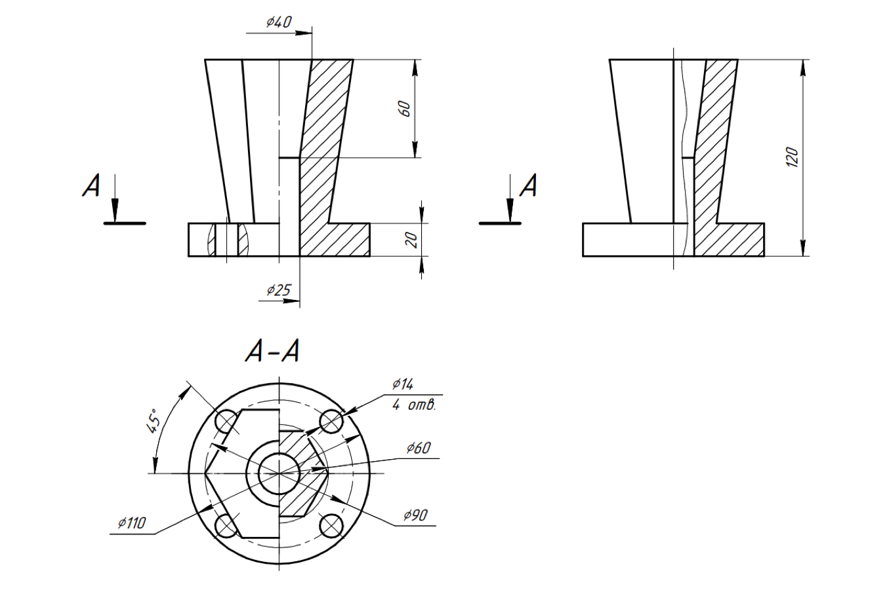
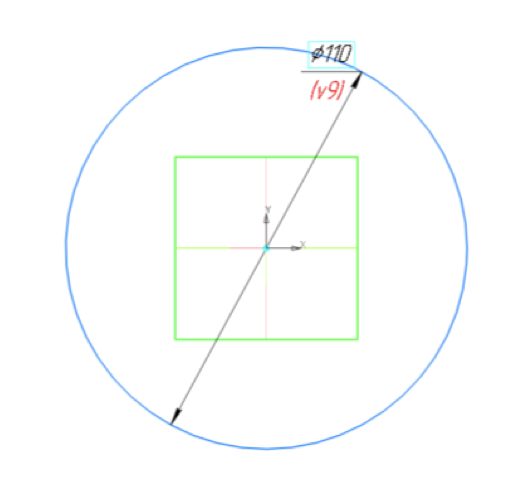
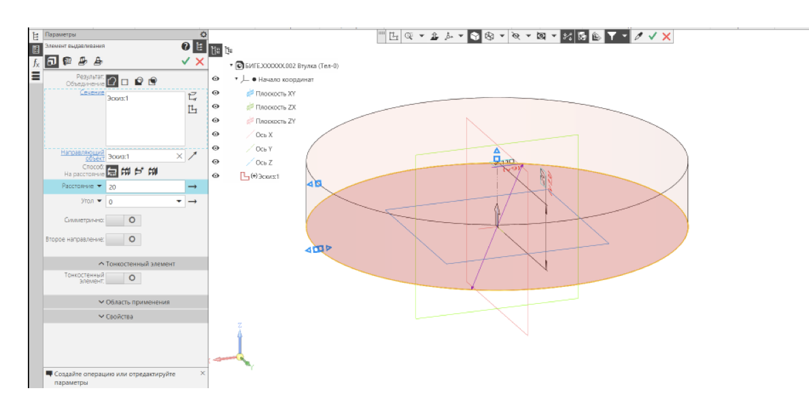
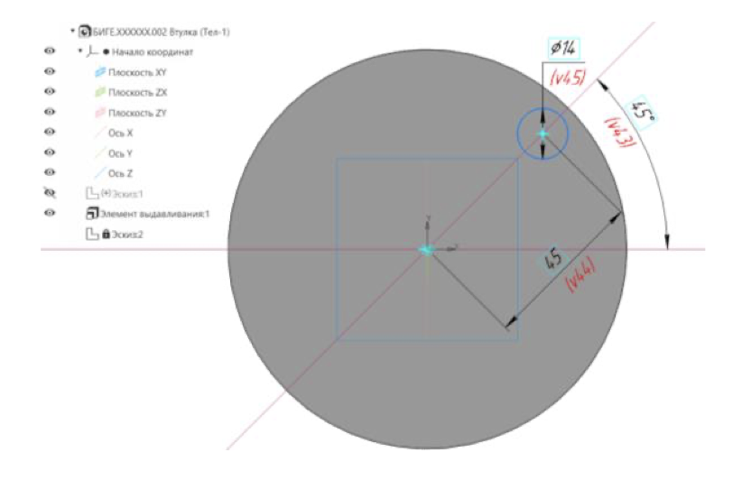
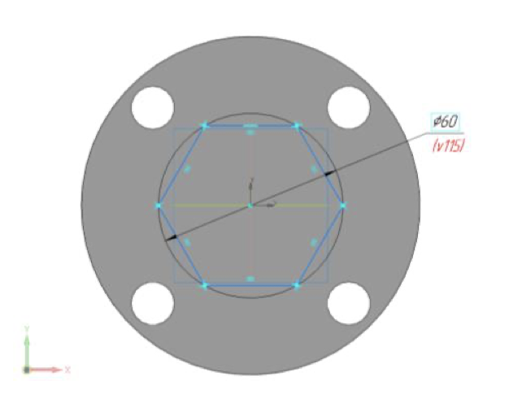
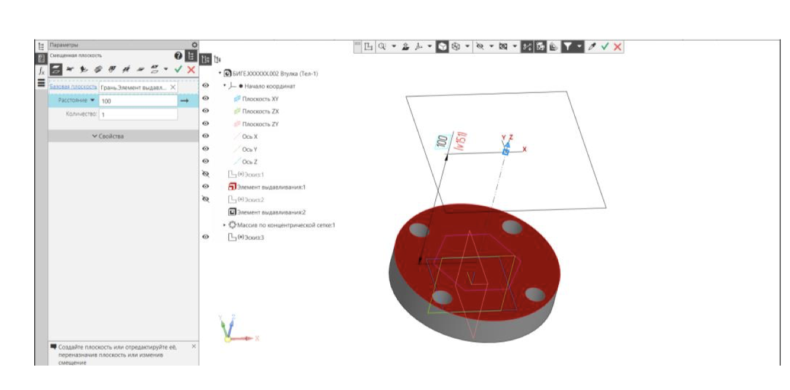
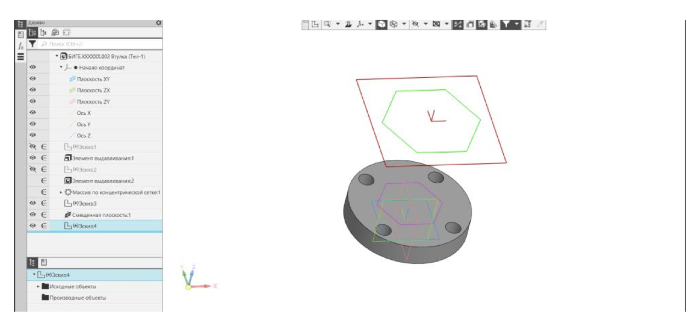
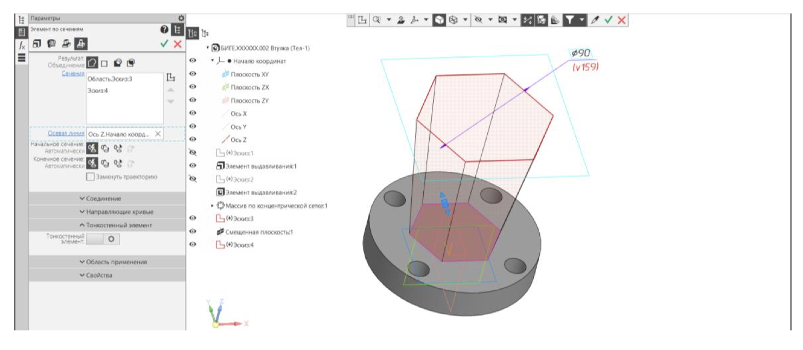
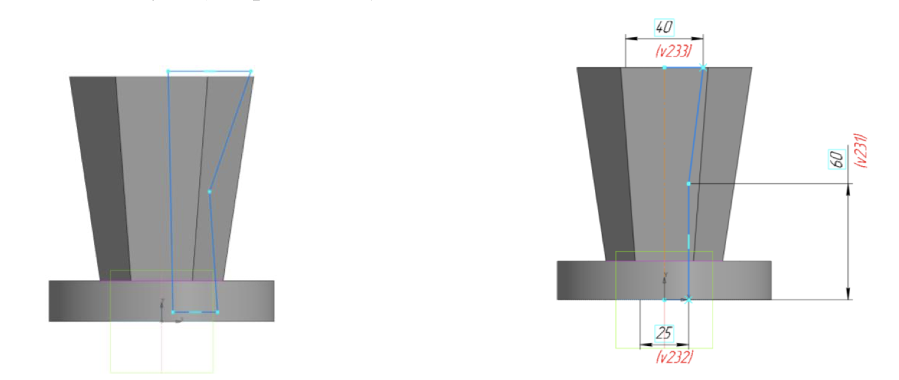
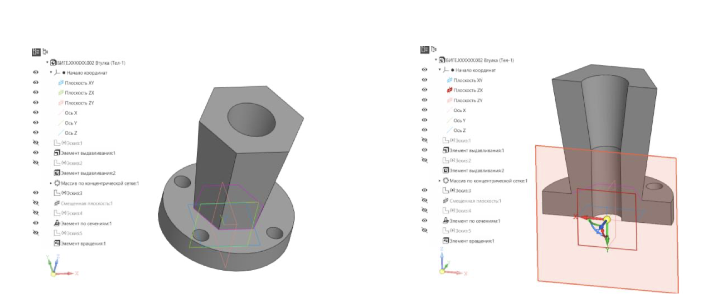

# Лабораторная работа №3

## Задачи

1. Построить модель "Втулка" согласно чертежу.

Основными элементами Втулки являются:
- цилиндрический фланец диаметра 110 мм высотой 20 мм с четырьмя сквозными гладкими отверстиями, образующими круговой массив по окружности диаметра 90 мм. Нижнее основание фланца расположено на плоскости XY;
- усеченная правильная прямая шестигранная пирамида. Нижнее основание пирамиды (правильный 6-ти угольник, вписанный в окружность диаметра 60 мм) принадлежит верхнему основанию фланца. Верхнее основание пирамиды (правильный 6-ти угольник, вписанный в окружность диаметра 90 мм) расположено на плоскости, параллельной плоскости верхнего основания фланца и отстоящей от нее на 100 мм;
- сквозное отверстие, представляющее комбинацию цилиндрической (диаметр 20 мм) и конической (диаметр нижнего основания – 25 мм, верхнего – 40 мм) поверхностей.

## Ход работы

1. Создать новую деталь.
2. Выбрать плоскость `XY` и создать эскиз.
3. Создать окружность диаметром `110 мм` в центре координат `(0, 0, 0)`.

4. С помощью элемента выдавливания создать объемный объект толщиной `20 мм`.
   

5. Создать новый эскиз на верхнем основании фланца.
6. Создать окружность диаметром `14 мм`, центр которой расположен на расстоянии `45 мм` от начала координат под углом `45°` к горизонтали.

7. Создать еще три подобных окружности с других сторон и применить вырезание.
8. Моделирование усеченной пирамиды осуществляется с помощью команды `Элемент по сечениям`. Для построения усеченной пирамиды необходимы два эскиза – верхнее и нижнее основания фигуры. Создать в центре фланца правильный шестиугольник, вписанный в окружность диаметра `60 мм`.

9. Для создания второго эскиза необходимо создать рабочую плоскость, параллельную плоскости верхнего основания фланца и отстоящую от нее на `100 мм`. Для построения плоскости выбрать команду `Смещенная плоскость` на панели `Вспомогательные объекты`. Параметры операции: 
   - базовая плоскость – Верхнее основание Элемента выдавливания 1 (фланец)
   - расстояние – 100 мм
   - количество элементов – 1

10. К смещенной плоскости применить режим `Эскиз`.
11. В качестве эскиза построить правильный шестиугольник, вписанный в окружность диаметра `90 мм`. Поскольку новая рабочая плоскость создана параллельным переносом, то система координат заимствована с основной рабочей плоскости `ХY` без изменений в расположении и направлении осей.

12. Применить элемент по сечениям. Параметры операции по сечениям: 
    - результат операции – Объединение
    - сечения – Эскиз 3 (шестиугольник, вписанный в окружность диаметра 60 мм), Эскиз 4 (шестиугольник, вписанный в окружность диаметра 90 мм)
    - осевая линия – ось Z

13. Выбрать плоскость `XZ` и создать эскиз.
14. Для построения эскиза использована команда `Отрезок`. Для
вертикального отрезка, проходящего через начало координат, изменить тип линии на `Осевую`. Это упростит нанесение размеров диаметров цилиндра и усеченного конуса.

15. Вырезать вращением и получить готовую деталь:
    - результат операции – вычитание
    - сечение – Эскиз 5 (создан на прошлом шаге)
    - ось – ось Эскиза 5
    - угол поворота – 360°

