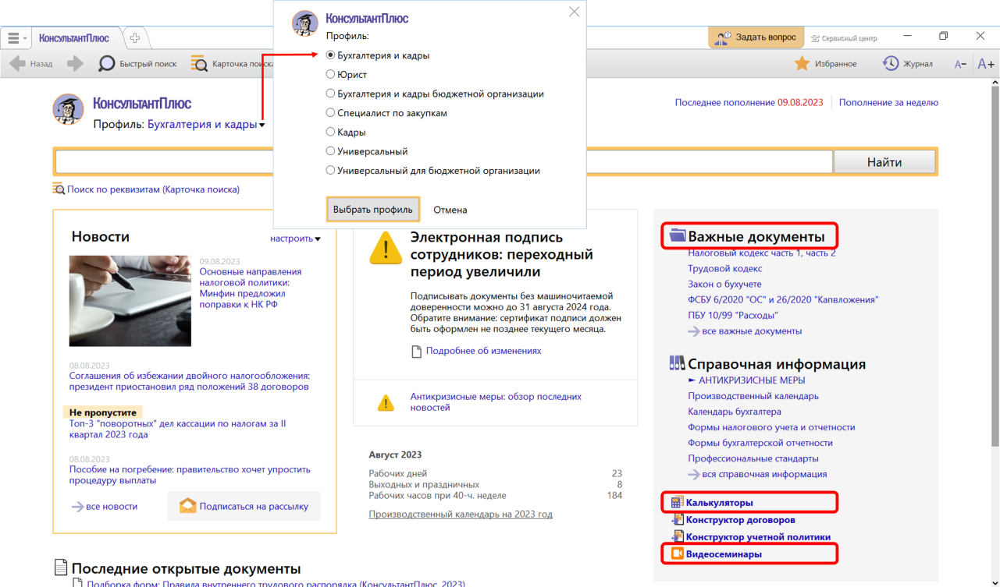
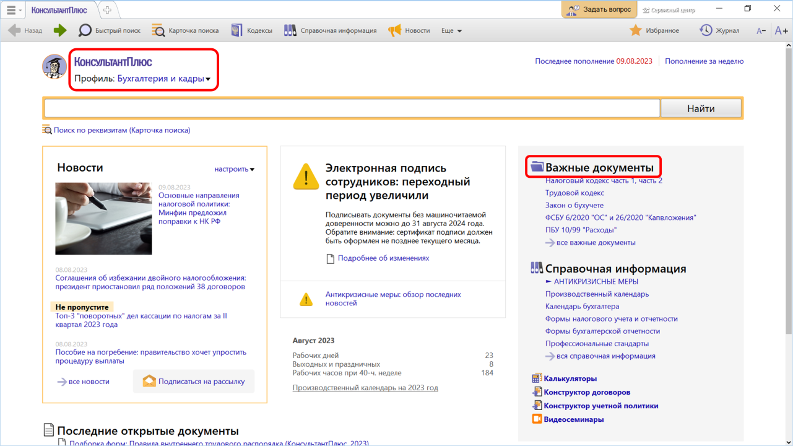
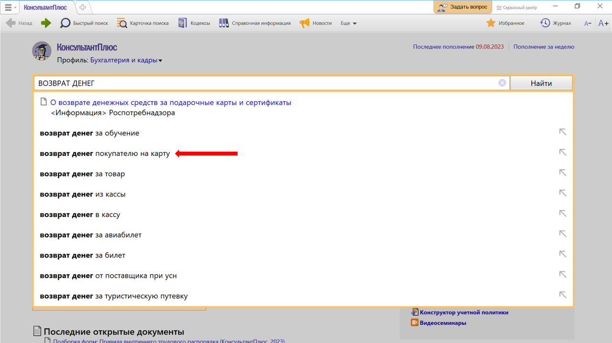
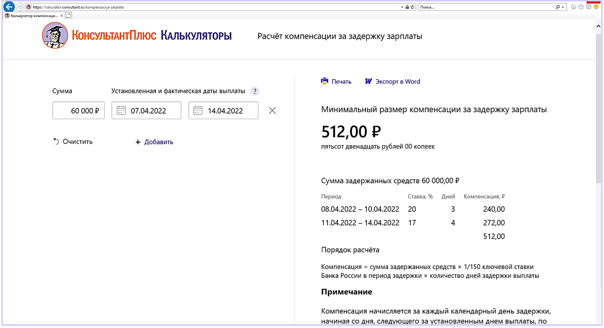
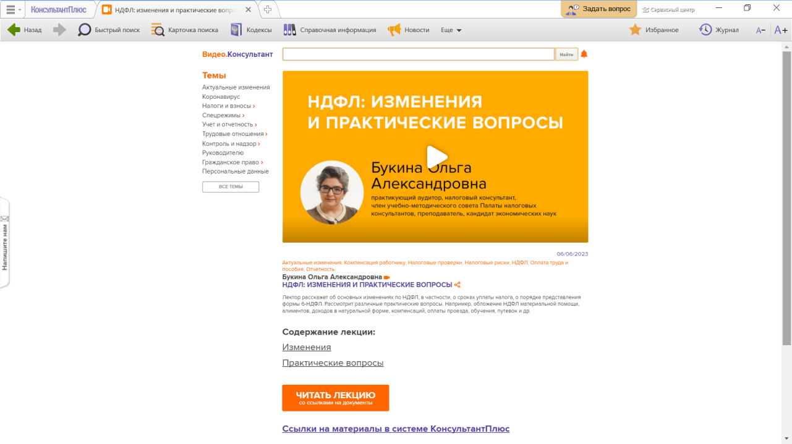

# Практическая работа с КонсультантПлюс №1

Для быстрого доступа финансового специалиста к нужной информации систему КонсультантПлюс можно настроить под его профессиональные задачи, выбрав на стартовой странице профиль «Бухгалтерия и кадры» (или «Бухгалтерия и кадры бюджетной организации» для специалиста бюджетных организаций).

## Примеры работы с системой

### Пример поиска документа в профиле «Бухгалтерия и кадры»

Выберем профиль «Бухгалтерия и кадры» и выясним, есть ли в окне «Важные документы», которое доступно по ссылке на стартовой странице, закон «О применении контрольно-кассовой техники при осуществлении расчетов в Российской Федерации».

Решение:

1. На стартовой странице в списке профилей выберем «Бухгалтерия и кадры».
2. Перейдем по ссылке «Важные документы» (см. рис.).
3. В открывшемся списке найдем нужный документ.

### Пример поиска информации в профиле «Бухгалтерия и кадры»

Покупатель решил вернуть приобретенный ранее товар. Выясним, как возвратить деньги покупателю, если он оплачивал покупку банковской картой.

Решение:

1. Начнем вводить в строке Быстрого поиска: ВОЗВРАТ ДЕНЕГ.
2. При вводе запроса появились подсказки (см. рис.). Выберем подходящий вариант: ВОЗВРАТ ДЕНЕЖНЫХ СРЕДСТВ НА КАРТУ.
3. Получим список, построенный с учетом потребностей бухгалтера: фирменные материалы КонсультантПлюс, письма государственных органов, консультации экспертов и т.д.

### Пример работы с калькуляторами

С помощью калькулятора рассчитаем компенсацию за задержку заработной платы.

Решение:

1. Со стартовой страницы профиля «Юрист» перейдем по ссылке «Калькуляторы».
2. В открывшемся окне в разделе «Трудовые отношения» выберем «Калькулятор компенсации за задержку зарплаты»
3. Укажем сумму не выплаченной в срок работнику зарплаты (например, 60 000 руб.), дату, когда должны были выплатить зарплату и дату фактической выплаты (см. рис.). Минимальный размер компенсации за задержку зарплаты составит 512,00 руб.
4. При внесении данных можно посмотреть подсказки. Полученный результат можно распечатать или скопировать в Word.

### Пример поиска видеосеминара по теме

Найдем видеосеминар Букиной О.А. «НДФЛ: изменения и практические вопросы» и выясним, освобождается ли от НДФЛ  компенсация работнику затрат на мобильную связь.

Решение:

1. Со стартовой страницы профиля «Бухгалтерия и кадры» перейдем по ссылке «Видеосеминары».
2. В окне с семинарами в поисковой строке зададим: НДФЛ. Выберем семинар Букиной О.А. «НДФЛ: изменения и практические вопросы».
3. В содержании лекции выберем пункт «Практические вопросы» (см. рис.) и узнаем ответ на наш вопрос. Текст лекции можно прочитать онлайн или скачать

## Задания

### Задание №1

Выберите профиль «Бухгалтерия и кадры» и укажите количество приказов Минфина России в окне «Важные документы», которое доступно по ссылке на стартовой странице.

### Задание №2

Выберите профиль «Бухгалтерия и кадры» и укажите, есть ли на стартовой странице в разделе «Справочная информация» ссылка на календарь бухгалтера.

### Задание №3

Найдите видеосеминар Гаранжи С.А. «Какие наказания предусмотрены за прогул: ответы в готовых решениях». Укажите номер статьи ТК РФ, которая первой упоминается в семинаре.

### Задание №4

Найдите видеосеминар Климовой М.А. «Ремонт основных средств: бухгалтерский и налоговый учет». Укажите количество пунктов оглавления лекции.
