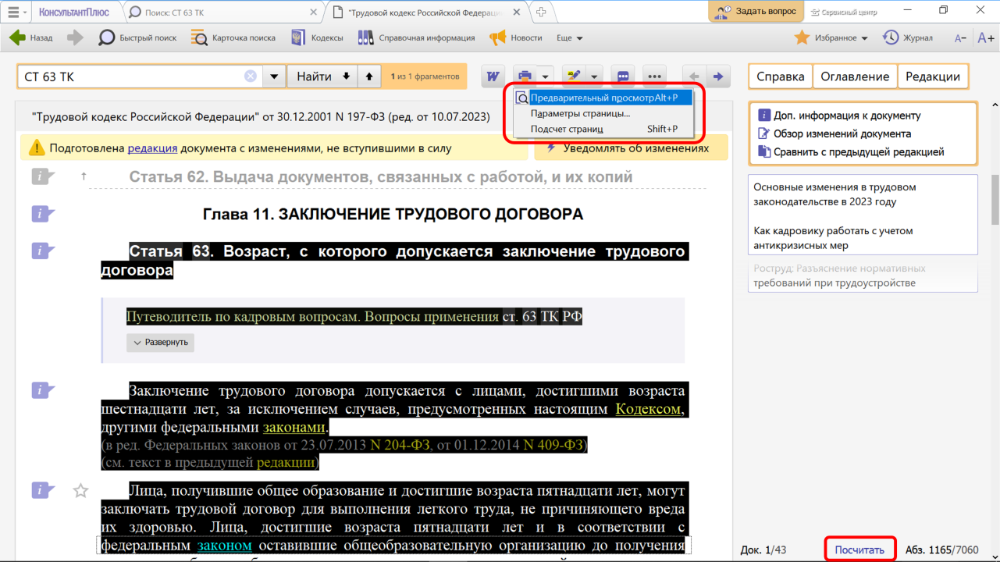
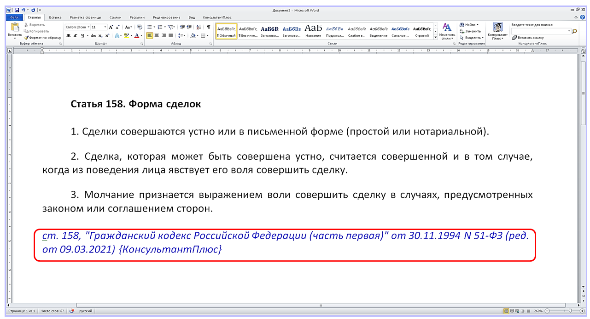
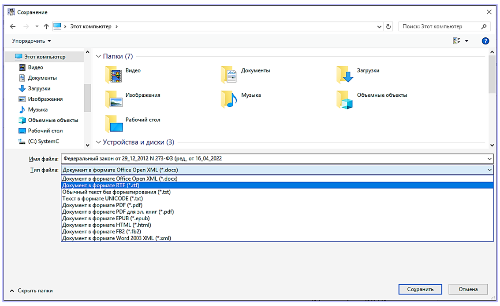
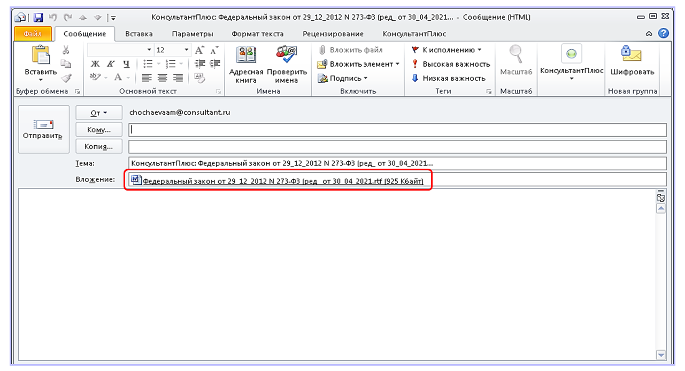

# Практическая работа с КонсультантПлюс №5

В системе КонсультантПлюс сохранить найденную информацию можно разными способами.
  
## Примеры работы с системой

### Пример печати фрагмента документа

Распечатаем ст. 63 Трудового кодекса РФ.

Решение:

1. Для поиска нужной статьи в Быстром поиске зададим: СТ 63 ТК и нажмем кнопку «Найти».
2. Выделим ст. 63 кодекса (см. рис.). Чтобы посмотреть, как будет выглядеть документ на печати, нажмем на стрелку на кнопке «Печать» и в выпадающем списке выберем «Предварительный просмотр». Для настройки параметров страницы для печати выберите «Параметры страницы». Чтобы посчитать количество страниц для печати, воспользуйтесь ссылкой «Посчитать», которая расположена внизу на правой панели (см. рис.).
3. Чтобы распечатать статью, нажмем кнопку «Печать» и в появившемся окне — кнопку «ОК».

### Пример экспорта документа в Word

Скопируем в Word ст. 158 Гражданского кодекса Российской Федерации.

Решение:

1. Для поиска нужной статьи в Быстром поиске зададим: СТ 158 ГК и нажмем кнопку «Найти».
2. Выделим ст. 158 и нажмем кнопку «Экспорт в Word». Система предложит экспортировать текст в уже открытый документ либо создать новый. Можно подключить/отключить опцию «Добавлять ссылку на источник фрагмента».
3. Выберем вариант экспорта в новый документ. Результат представлен на рис.

### Пример сохранения документа

Сохраним в файл федеральный закон «Об образовании в Российской Федерации».

Решение:

1. Для поиска закона в Быстром поиске зададим: ЗАКОН ОБ ОБРАЗОВАНИИ
2. Откроем закон об образовании в РФ.
3. Нажмем кнопку «Ещё» и выберем команду «Сохранить в файл». В окне «Сохранение» следует указать папку, имя файла и тип файла. Документы можно сохранять в различных форматах (см. рис.), которые распознаются ридерами и мобильными устройствами.

### Пример отправки документа по электронной почте

Отправим по электронной почте закон об образовании в Российской Федерации.

Решение:

1. Найдем закон об образовании (см. пример 3).
2. Откроем документ.
3. Нажмем кнопку «Ещё» и выберем команду «Отправить по почте». Если на компьютере установлена и настроена почтовая программа, то откроется ее окно и файл с текстом документа будет прикреплен к сообщению (см. рис.).

## Задания

### Задание №1

Экспортируйте в Word ст. 49 Конституции РФ вместе с информацией об источнике. Укажите дату принятия конституции.

### Задание №2

Нужно распечатать из системы КонсультантПлюс ст. 24 Федерального закона «О воинской обязанности и военной службе» без колонтитулов. Продемонстрируйте процесс печати.

### Задание №3

Нужно распечатать закон «О защите прав потребителей» из системы КонсультантПлюс. Укажите количество листов, необходимых для печати документа.

### Задание №4

Найдите Постановление Правительства РФ от 14.03.2022 N 366 и сохраните его в формате *.FB2. Укажите, в каких из перечисленных форматах нельзя сохранить этот документ: *.pdf, *.tiff, *.rtf, *.html, *.docx.

### Задание №5

Найдите Федеральный закон «О минимальном размере оплаты труда» и сохраните его в файл.

### Задание №6

Найдите ст. 44 УК РФ. Выделите с помощью маркера пункты «а», «б», «з» зеленым цветом, пункт «в» – розовым. Затем перейдите в начало кодекса и найдите пометки только зеленого цвета.
